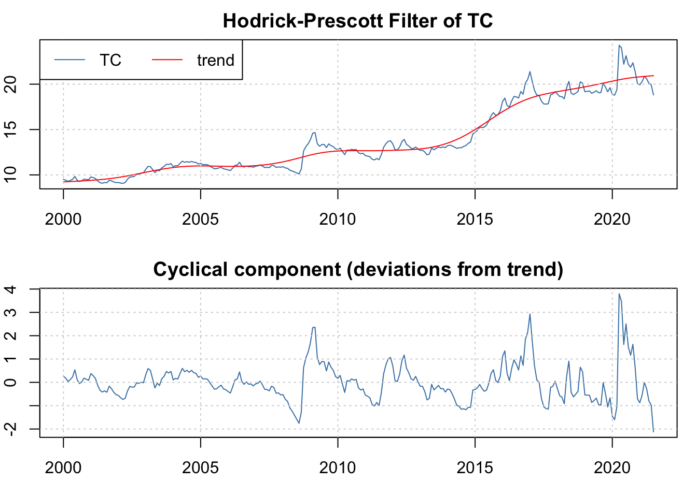

# Desestacionalización y filtrado de Series


## Motivación

Existen múltiples enfoques para la desestacionalización de series.  Algunos modelos, por ejemplo, pueden estar basados en modelos ARIMA como un conjunto de dummies. No obstante, en el caso partícular que discutiremos en este curso, estará basado en un modelo ARIMA de la serie. Este enfoque está basado en el modelo X11 de la oficina del censo de Estados Unidos (Census Bureau) el cual es conocido como el modelo X13-ARIMA-SEATS.^[La información y material respecto del modelo esta disponible en la dirección \url{https://www.census.gov/srd/www/x13as/}] El modelo X13-ARIMA-SEATS es, como su nombre lo indica, la combinación de un modelo ARIMA con componentes estacionales (por la traducción literal de la palabra: seasonal). 

Un modelo ARIMA estacional emplea la serie en diferencias y como regresores los valores rezagados de las diferencia de la serie tantas veces como procesos estacionales $s$ existan en ésta, con el objeto de remover los efectos aditivos de la estacionalidad. Sólo para entender qué significa este mecanismo, recordemos que cuando se utiliza la primera direncia de la serie respecto del periodo inmediato anterior se remueve la tendencia. Por su parte, cuando se incluye la diferencia respecto del mes $s$ se está en el caso en que se modela la serie como una media móvil en términos del rezago $s$.

El modelo ARIMA estacional incluye como componentes autoregresivos y de medias móviles a los valores rezagados de la serie en el periodo $s$ en diferencias. El ARIMA(p, d, q)(P, D, Q) estacional puede ser expresado de la siguiente manera utilizando el operador rezago $L$:
\begin{equation}
    \Theta_P(L^s) \theta_p(L) (1 - L^s)^D (1 - L)^d X_t = \Psi_Q(L^s) \psi_q(L) U_t
    (\#eq:ARIMAseas)
\end{equation}

Donde $\Theta_P(.)$, $\theta_p(.)$, $\Psi_Q(.)$ y $\psi_q(.)$ son polinomios de $L$ de orden $P$, $p$, $Q$ y $q$ respectivamente. En general, la representación es de una serie no estacionaria, aunque si $D = d = 0$ y las raíces del polinomio carácteristico (de los polinomios del lado izquierdo de la ecuación \@ref(eq:ARIMAseas) todas  son más grandes que 1 en valor absoluto, el proceso modelado será estacionario.

Si bien es cierto que existen otras formas de modelar la desestacionalización, como la modelación en diferencias con dummies para identificar ciertos patrones regulares, en los algorimtos disponibles como el X11 o X13-ARIMA-SEATS se emplea la formulación de la ecuación \@ref(eq:ARIMAseas). A continuación implementaremos la desestacionalización de una serie.

Como ejemplo utilizaremos la serie del Índice Nacional de Precios al Consumidor (INPC) en el periodo de enero de 2000 a julio de 2019. Utilizando el Scrip Clase 11, diponible en el repositorio de GitHub, podemos ver que la serie original del INPC y su ajuste estacional bajo una metodología X13-ARIMA-SEATS son como se muestra en la Figura \@ref(fig:INPCAdj).

El mismo procesamiento puede ser seguido para todas las series que busquemos analizar. En particular, en adelante, además del INPC que incluimos en la lista, utilzaremos las siguientes series, así como su versión desestacionalizada:
- Índice Nacional de Precios al Consumidor (base 2QJul2018 = 100), $INPC_t$.
- Tipo de Cambio FIX, $TC_t$
- Tasa de rendimiento promedio mensual de los Cetes 28, en por ciento anual, $CETE28_t$
- Indicador global de la actividad económica (base 2013 = 100), $IGAE_t$
- Industrial Production Index o Índice de Producción Industrial de los Estados Unidos (base 2012 = 100), $IPI_t$


```r
knitr::opts_chunk$set(echo = TRUE)

#install.packages("ggplot2")
#install.packages("dplyr")
#install.packages("readxl")
#install.packages(stats)
#install.packages("seasonal")
#install.packages("seasonalview")
#install.packages("shiny")
#install.packages("TClass")
#install.packages("remotes")
# 
library(ggplot2)
library(dplyr)
#> 
#> Attaching package: 'dplyr'
#> The following objects are masked from 'package:stats':
#> 
#>     filter, lag
#> The following objects are masked from 'package:base':
#> 
#>     intersect, setdiff, setequal, union
library(readxl)
library(stats)
library(seasonal)
library(seasonalview)
#> 
#> Attaching package: 'seasonalview'
#> The following object is masked from 'package:seasonal':
#> 
#>     view
library(shiny)

# Importamos Datos:
#Los datos importados son:

# INPC: Indice Nacional de Precios al Consumidor (2QJul2018 = 100)
# TC: Tipo de Cambio FIX 
# CETE28: Tasa de rendimiento promedio mensual de los Cetes 28, en por ciento anual*# IGAE: Indicador global de la actividad económica (2013 = 100)
# IPI: Industrial Production Index (2012 = 100)
Datos_deses <- read_excel("BD/Clase_11/Base_VAR.xlsx", sheet = "Datos", col_names = TRUE)

# Primer ejemplo:
INPC <- ts(Datos_deses$INPC, 
           start = c(2000, 1), 
           freq = 12)

# Desestacionalizacion (forma complicada):
Seas_INPC <- seas(INPC)

names(Seas_INPC)
#>  [1] "series"      "udg"         "data"        "err"        
#>  [5] "est"         "model"       "fivebestmdl" "wdir"       
#>  [9] "iofile"      "call"        "list"        "x"          
#> [13] "spc"

summary(Seas_INPC)
#> 
#> Call:
#> seas(x = INPC)
#> 
#> Coefficients:
#>                    Estimate Std. Error z value Pr(>|z|)    
#> AO2002.Jan         0.004619   0.001079   4.280 1.87e-05 ***
#> LS2017.Jan         0.011927   0.001804   6.611 3.81e-11 ***
#> AO2020.Apr        -0.006200   0.001083  -5.723 1.05e-08 ***
#> MA-Nonseasonal-01 -0.462302   0.054407  -8.497  < 2e-16 ***
#> MA-Seasonal-12     0.784240   0.040881  19.183  < 2e-16 ***
#> ---
#> Signif. codes:  
#> 0 '***' 0.001 '**' 0.01 '*' 0.05 '.' 0.1 ' ' 1
#> 
#> SEATS adj.  ARIMA: (0 1 1)(0 1 1)  Obs.: 259  Transform: log
#> AICc: -180.5, BIC: -159.8  QS (no seasonality in final):    0  
#> Box-Ljung (no autocorr.): 23.65   Shapiro (normality): 0.9831 **

#
final(Seas_INPC)
#>            Jan       Feb       Mar       Apr       May
#> 2000  44.77029  45.18403  45.40234  45.70368  46.08070
#> 2001  48.39654  48.38881  48.65881  48.95142  49.29006
#> 2002  50.71225  50.70179  50.92105  51.25509  51.60943
#> 2003  53.31609  53.48246  53.77800  53.94089  54.05056
#> 2004  55.54334  55.88971  56.03962  56.21125  56.38531
#> 2005  58.05282  58.26189  58.48581  58.79626  58.99578
#> 2006  60.31635  60.42680  60.46618  60.67856  60.78415
#> 2007  62.70196  62.89541  62.99002  63.10118  63.19887
#> 2008  65.01709  65.22681  65.64787  65.96965  66.33437
#> 2009  69.08646  69.25034  69.58933  70.03565  70.30536
#> 2010  72.15127  72.56587  73.02022  73.02491  73.06952
#> 2011  74.86517  75.13956  75.23038  75.48953  75.45523
#> 2012  77.88882  78.03832  78.03412  78.08142  78.36672
#> 2013  80.43511  80.81548  81.35072  81.71941  81.99156
#> 2014  84.04428  84.23918  84.41483  84.59701  84.87807
#> 2015  86.63243  86.77474  87.07291  87.20811  87.32823
#> 2016  88.90614  89.26620  89.34757  89.44196  89.59871
#> 2017  93.11384  93.62242  94.14690  94.66363  95.12087
#> 2018  98.28379  98.63525  98.90946  98.99765  99.41535
#> 2019 102.58552 102.53864 102.88957 103.37936 103.66756
#> 2020 105.92752 106.33873 106.24531 105.61243 106.60476
#> 2021 109.70405 110.36088 111.21655 112.03885 112.87386
#>            Jun       Jul       Aug       Sep       Oct
#> 2000  46.42157  46.69961  46.94796  47.16362  47.45045
#> 2001  49.48158  49.45252  49.73396  50.05702  50.24097
#> 2002  51.94236  52.18259  52.36916  52.53823  52.72274
#> 2003  54.18788  54.34573  54.49561  54.66727  54.81421
#> 2004  56.57944  56.79298  57.12822  57.43813  57.77350
#> 2005  59.05133  59.33307  59.38990  59.46232  59.54214
#> 2006  60.95215  61.15781  61.45478  61.90260  62.09959
#> 2007  63.39157  63.68921  63.93606  64.26552  64.43308
#> 2008  66.72845  67.12236  67.50312  67.80588  68.17087
#> 2009  70.56076  70.77126  70.94118  71.15129  71.25491
#> 2010  73.17567  73.34645  73.55578  73.80811  74.13190
#> 2011  75.57749  75.94343  76.07298  76.14170  76.50837
#> 2012  78.84734  79.29152  79.53788  79.77728  80.02172
#> 2013  82.06220  82.04215  82.28146  82.48604  82.70823
#> 2014  85.13828  85.37364  85.68228  85.95862  86.24939
#> 2015  87.57860  87.69859  87.88463  88.11900  88.37916
#> 2016  89.79442  90.00801  90.26224  90.73091  91.08230
#> 2017  95.45046  95.77245  96.24606  96.48198  96.88011
#> 2018  99.87640 100.34917 100.93781 101.31323 101.62119
#> 2019 103.79846 104.10668 104.10498 104.34324 104.68334
#> 2020 107.23615 107.84074 108.28547 108.51181 108.94882
#> 2021 113.51893 114.07876                              
#>            Nov       Dec
#> 2000  47.71179  48.17650
#> 2001  50.27430  50.29634
#> 2002  52.97261  53.15249
#> 2003  55.07420  55.25544
#> 2004  58.05206  58.10890
#> 2005  59.74558  60.03535
#> 2006  62.18779  62.46086
#> 2007  64.63223  64.80593
#> 2008  68.66243  69.03189
#> 2009  71.32529  71.50399
#> 2010  74.40086  74.64066
#> 2011  76.99023  77.48331
#> 2012  80.20706  80.25132
#> 2013  83.10867  83.43538
#> 2014  86.56489  86.83237
#> 2015  88.48548  88.68687
#> 2016  91.41636  91.67473
#> 2017  97.48690  97.88655
#> 2018 102.09704 102.62583
#> 2019 105.16079 105.56388
#> 2020 108.69159 108.93224
#> 2021

INPC_Ad <- final(Seas_INPC)

#
original(Seas_INPC)
#>            Jan       Feb       Mar       Apr       May
#> 2000  44.93083  45.32938  45.58068  45.84002  46.01138
#> 2001  48.57548  48.54333  48.85089  49.09731  49.20997
#> 2002  50.90047  50.86775  51.12795  51.40724  51.51143
#> 2003  53.52544  53.67412  54.01293  54.10514  53.93056
#> 2004  55.77432  56.10795  56.29807  56.38303  56.24160
#> 2005  58.30916  58.50343  58.76712  58.97642  58.82825
#> 2006  60.60363  60.69636  60.77251  60.86162  60.59067
#> 2007  63.01621  63.19235  63.32911  63.29129  62.98253
#> 2008  65.35056  65.54483  66.01989  66.17013  66.09864
#> 2009  69.45615  69.60949  70.00995  70.25499  70.05036
#> 2010  72.55205  72.97167  73.48973  73.25557  72.79398
#> 2011  75.29599  75.57846  75.72345  75.71744  75.15926
#> 2012  78.34305  78.50231  78.54739  78.30098  78.05382
#> 2013  80.89278  81.29094  81.88743  81.94152  81.66882
#> 2014  84.51905  84.73316  84.96529  84.80678  84.53558
#> 2015  87.11010  87.27538  87.63072  87.40384  86.96737
#> 2016  89.38638  89.77778  89.91000  89.62528  89.22562
#> 2017  93.60388  94.14478  94.72249  94.83893  94.72549
#> 2018  98.79500  99.17137  99.49216  99.15485  98.99408
#> 2019 103.10800 103.07900 103.47600 103.53100 103.23300
#> 2020 106.44700 106.88900 106.83800 105.75500 106.16200
#> 2021 110.21000 110.90700 111.82400 112.19000 112.41900
#>            Jun       Jul       Aug       Sep       Oct
#> 2000  46.28392  46.46447  46.71979  47.06107  47.38514
#> 2001  49.32636  49.19820  49.48969  49.95038  50.17614
#> 2002  51.76259  51.91118  52.10856  52.42198  52.65304
#> 2003  53.97511  54.05334  54.21549  54.53824  54.73821
#> 2004  56.33174  56.47939  56.82804  57.29792  57.69475
#> 2005  58.77178  59.00180  59.07225  59.30901  59.45458
#> 2006  60.64300  60.80929  61.11961  61.73661  62.00652
#> 2007  63.05817  63.32601  63.58400  64.07770  64.32740
#> 2008  66.37217  66.74206  67.12749  67.58494  68.04549
#> 2009  70.17935  70.37052  70.53888  70.89272  71.10719
#> 2010  72.77118  72.92919  73.13175  73.51511  73.96893
#> 2011  75.15551  75.51611  75.63555  75.82111  76.33271
#> 2012  78.41367  78.85390  79.09054  79.43912  79.84104
#> 2013  81.61924  81.59219  81.82433  82.13234  82.52299
#> 2014  84.68207  84.91496  85.21997  85.59634  86.06963
#> 2015  87.11311  87.24082  87.42488  87.75242  88.20392
#> 2016  89.32403  89.55691  89.80933  90.35774  90.90615
#> 2017  94.96364  95.32274  95.79377  96.09351  96.69827
#> 2018  99.37646  99.90910 100.49200 100.91700 101.44000
#> 2019 103.29900 103.68700 103.67000 103.94200 104.50300
#> 2020 106.74300 107.44400 107.86700 108.11400 108.77400
#> 2021 113.01800 113.68200                              
#>            Nov       Dec
#> 2000  47.79029  48.30767
#> 2001  50.36515  50.43490
#> 2002  53.07888  53.30993
#> 2003  55.19254  55.42981
#> 2004  58.18690  58.30709
#> 2005  59.88249  60.25031
#> 2006  62.33186  62.69242
#> 2007  64.78122  65.04906
#> 2008  68.81894  69.29555
#> 2009  71.47605  71.77186
#> 2010  74.56158  74.93095
#> 2011  77.15833  77.79238
#> 2012  80.38344  80.56824
#> 2013  83.29227  83.77006
#> 2014  86.76378  87.18898
#> 2015  88.68547  89.04682
#> 2016  91.61683  92.03903
#> 2017  97.69517  98.27288
#> 2018 102.30300 103.02000
#> 2019 105.34600 105.93400
#> 2020 108.85600 109.27100
#> 2021


# Forma Facil:
#runApp(view(Seas_INPC))
```

<div class="figure" style="text-align: center">

<p class="caption">(\#fig:INPCAdj)Índice Nacional de Precios al Consumidor ($INPC_t$) y su serie desestacionalizada utilizando un proceso X13-ARIMA-SEATS.</p>
</div>

## Filtro Hodrick-Prescott

Como último tema de los procesos univariados y que no necesariamente aplican a series estacionarias, a continuación desarrollaremos el procedimiento conocido como filtro de Hodrick y Prescott (1997). El trabajo de estos autores era determinar una técnica de regresión que permitiera utilizar series agregadas o macroeconómicas para separarlas en dos componentes: uno de ciclo de negocios y otro de tendencia. En su trabajo orignal Hodrick y Prescott (1997) utilizaron datos trimestrales de alguna series como el Gross Domestic Product (GNP, por sus  siglas enn Inglés), los agregados montearios M1, empleo, etc., de los Estados Unidos que fueron observados posteriormente a la Segunda Guerra Mundial. 

El marco conceptual de Hodrick y Prescott (1997) parte de suponer una serie $X_t$ que se puede descomponer en la suma de componente de crecimiento tendencial, $g_t$, y su componente de ciclio de negocios, $c_t$, de esta forma para $t = 1, 2, \ldots, T$ tenemos que:
\begin{equation}
    X_t = g_t + c_t
    (\#eq:HPEq)
\end{equation}

En la ecuación \@ref(eq:HPEq) se asume que el ajuste de la ruta seguida por $g_t$ es resultado de la suma de los cuadrados de su segunda diferencia. En esa misma ecuación sumiremos que $c_t$ son las desviaciones de $g_t$, las cuales en el largo plazo tienen una media igual a cero (0). Por esta razón, se suele decir que el filtro de Hodrick y Prescott represeta una una descomposición de la serie en su componente de crecimiento natural y de sus desviaciones transitorias que en promedio son cero, en el largo plazo.

Estas consideraciones que hemos mencionado señalan que el procesimiento de Hodrick y Prescott (1997) implican resolver el siguiente problema minimización para determinar cada uno de los componentes en que $X_t$ se puede descomponer:
\begin{equation}
    \min_{\{ g_t \}^T_{t = -1} } \left[ \sum^T_{t = 1} c^2_t + \lambda \sum^T_{t = 1} [ \Delta g_t - \Delta g_{t-1}]^2 \right]
        (\#eq:HPEq1)
\end{equation}

Donde $\Delta g_t = g_t - g_{t-1}$ y $\Delta g_{t-1} = g_{t-1} - g_{t-2}$; $c_t = X_t - g_t$, y el parámetro $\lambda$ es un número positivo que penaliza la variabilidad en el crecimiento de las series. De acuerdo con el trabajo de Hodrick y Prescott (1997) la constante $\lambda$ debe tomar valores especificos de acuerdo con la periodicidad de la series. Así, $\lambda$ será:

- 100 si la serie es de datos anuales
- 1,600 si la serie es de datos trimestrales
- 14,400 si la serie es de datos mensuales

Método tradicional de HP consiste en minimizar la serie $\{ \tau_t \}_{t=-1}^T$:

$$\sum_{t=1}^T (y_t - \tau_t)^2 + \lambda \sum_{t=1}^{T} [(\tau_{t} - \tau_{t-1}) - (\tau_{t-1} - \tau_{t-2})]^2$$

Donde $\lambda$ es una parámetro fijo (determinado ex-ante) y $\tau_t$ es un componente de tendencia de $y_t$.

Sin pérdida de generalidad, asumiremos que $\tau_{-1}$ y $\tau_{0}$ son cero (0). De esta manera, la forma matricial del filtro HP es:
$$(Y - G)'(Y - G) + \lambda G' K' K G$$

La derivada de los anteriores:
$$-2 Y + 2 G + \lambda 2 K' K G = 0$$

Despejando:
$$G_{hp} = [I_T + \lambda K' K]^{-1} Y$$

Donde $G$ es el vector de tendencia, $Y$ es el vector de la serie de datos, $\lambda$ es la constante tradicional, y $K$ es de dimensión $T \times T$ y está dada por la expresión:

$$K = 
\begin{pmatrix}
1 & 0 & 0 & 0 & \ldots & 0 \\
-2 & 1 & 0 & 0 & \ldots & 0 \\
1 & -2 & 1 & 0 & \ldots & 0 \\
0 & 1 & -2 & 1 & \ldots & 0 \\
\vdots & \vdots &  \vdots &  \vdots &  \vdots &  \vdots \\
0 & 0 & 0 & 0 & \ldots & 1 \\
\end{pmatrix}
$$

Así:

$$K' = 
\begin{pmatrix}
1 & -2 & 1 & 0 & \ldots & 0 \\
0 & 1 & -2 & 1 & \ldots & 0 \\
0 & 0 & 1 & -2 & \ldots & 0 \\
0 & 0 & 0 & 1 & \ldots & 0 \\
\vdots & \vdots &  \vdots &  \vdots &  \vdots &  \vdots \\
0 & 0 & 0 & 0 & \ldots & 1 \\
\end{pmatrix}
$$

```r
#install.packages("ggplot2")
#install.packages("dplyr")
#install.packages("readxl")
#install.packages(stats)
#install.packages("mFilter")
# 
library(ggplot2)
library(dplyr)
library(readxl)
library(stats)
library(mFilter)

# Importamos Datos desde un archivo de R:

#Los datos "cargados" son los originales y los ajustados por estacionalidad. Los cuales son:

#* INPC: Indice Nacional de Precios al Consumidor (2QJul2018 = 100)

#* TC: Tipo de Cambio FIX 

#* CETE28: Tasa de rendimiento promedio mensual de los Cetes 28, en por ciento anual

#* IGAE: Indicador global de la actividad económica (2013 = 100)

#* IPI: Industrial Production Index (2012 = 100)

load("BD/Clase_11/Datos_Ad.RData")

INPC_HP <- ts(Datos_Ad$INPC_Ad, start = c(2000, 1), freq = 12)

TC <- ts(Datos_Ad$TC_Ad, start = c(2000, 1), freq = 12)

## Filtro Hodrick-Prescott:

### INPC:
#?hpfilter

INPC_hpf <- hpfilter(INPC, freq = 14400)

names(INPC_hpf)
#>  [1] "cycle"   "trend"   "fmatrix" "title"   "xname"  
#>  [6] "call"    "type"    "lambda"  "method"  "x"

#
INPC_hpf$cycle
#>               Jan          Feb          Mar          Apr
#> 2000 -0.369995465 -0.204781721 -0.186791284 -0.160699237
#> 2001  0.491509101  0.231668069  0.312644248  0.333628596
#> 2002  0.158359973 -0.088834879 -0.042095361  0.024731472
#> 2003  0.274385097  0.220277762  0.357200149  0.248370572
#> 2004  0.133596492  0.271391596  0.266227824  0.156446397
#> 2005  0.353845486  0.358862377  0.433730438  0.454517921
#> 2006  0.371800378  0.270140468  0.150457395  0.042085487
#> 2007  0.318418692  0.272948983  0.185261500 -0.079965538
#> 2008 -0.210169454 -0.273903265 -0.059220058 -0.171510017
#> 2009  0.699236223  0.584232203  0.717372055  0.696292454
#> 2010  0.663445825  0.832260274  1.101207256  0.619570294
#> 2011  0.480043782  0.523426357  0.429572575  0.184783802
#> 2012  0.639598468  0.554912267  0.355701224 -0.135328774
#> 2013  0.243888923  0.396636329  0.748177918  0.557842172
#> 2014  0.958465086  0.934013767  0.928454894  0.533042168
#> 2015  0.713644671  0.640638229  0.756187115  0.287584986
#> 2016 -0.066111238  0.041374008 -0.116181201 -0.696785201
#> 2017  0.333265420  0.519162662  0.738165583  0.492725577
#> 2018  1.123948014  1.131474928  1.084873169  0.381819264
#> 2019  1.131318081  0.756941561  0.810348698  0.523253973
#> 2020  0.371739118  0.469219371  0.072193469 -1.358587671
#> 2021 -0.128049234  0.201907470  0.750955110  0.748376942
#>               May          Jun          Jul          Aug
#> 2000 -0.222464694 -0.182867609 -0.235003486 -0.212012132
#> 2001  0.222016360  0.115293619 -0.234850969 -0.164243748
#> 2002 -0.082549510 -0.041897157 -0.102845584 -0.114055000
#> 2003 -0.126500461 -0.281581688 -0.402428066 -0.438864993
#> 2004 -0.179191953 -0.282751358 -0.328312508 -0.172365454
#> 2005  0.118015956 -0.126799889 -0.085327242 -0.203790926
#> 2006 -0.428178375 -0.577230234 -0.614540398 -0.510201089
#> 2007 -0.619214781 -0.777264325 -0.746387263 -0.728647713
#> 2008 -0.507458213 -0.500077808 -0.397766722 -0.281037148
#> 2009  0.226851260  0.092413978  0.021568361 -0.070602259
#> 2010 -0.088013559 -0.355518277 -0.441120723 -0.481232069
#> 2011 -0.612311426 -0.855343408 -0.734553919 -0.855565336
#> 2012 -0.627470545 -0.512978505 -0.318451500 -0.327794750
#> 2013  0.041241618 -0.251742959 -0.521731636 -0.532100007
#> 2014  0.025603817 -0.063649951 -0.066189704  0.003542410
#> 2015 -0.393024017 -0.494322722 -0.617025665 -0.687194052
#> 2016 -1.398672260 -1.609015258 -1.691508944 -1.761073330
#> 2017  0.014700777 -0.113998904 -0.123567571 -0.022570414
#> 2018 -0.142947597 -0.122741741  0.049620433  0.274252050
#> 2019 -0.115684406 -0.389844570 -0.341596615 -0.698283565
#> 2020 -1.301378144 -1.072337698 -0.725535708 -0.658967082
#> 2021  0.608404074  0.838215643  1.132948535             
#>               Sep          Oct          Nov          Dec
#> 2000 -0.102590031 -0.009804947  0.164784483  0.452452299
#> 2001  0.076660243  0.083712374  0.055103689 -0.091703579
#> 2002 -0.008263469  0.016120866  0.236268433  0.262610542
#> 2003 -0.314265925 -0.312022839 -0.054984887 -0.014556554
#> 2004  0.105338549  0.310570219  0.611731956  0.541551594
#> 2005 -0.156504840 -0.201099726  0.035793536  0.211609037
#> 2006 -0.101638853 -0.042697807  0.069095994  0.213490457
#> 2007 -0.478454962 -0.475448693 -0.271395366 -0.256242421
#> 2008 -0.093089657  0.097524697  0.600960326  0.807816866
#> 2009  0.024201957 -0.018793254  0.094194169  0.135784587
#> 2010 -0.339736855 -0.127077202  0.225055362  0.354474134
#> 2011 -0.911182025 -0.641478939 -0.058417752  0.332512408
#> 2012 -0.225399361 -0.069754674  0.226409619  0.165143675
#> 2013 -0.466133438 -0.317018340  0.211325244  0.448893287
#> 2014  0.144633839  0.382463784  0.840814404  1.029674297
#> 2015 -0.618073241 -0.429539870 -0.215801653 -0.127377476
#> 2016 -1.541111965 -1.327358097 -0.957173954 -0.880849589
#> 2017 -0.093771040  0.139581509  0.765096705  0.971883324
#> 2018  0.343076789  0.512068283  1.023275341  1.390711211
#> 2019 -0.766224721 -0.545690894 -0.043899684  0.201969206
#> 2020 -0.770576342 -0.471262251 -0.751870056 -0.701212281
#> 2021

INPC_hpf$trend
#>            Jan       Feb       Mar       Apr       May
#> 2000  45.30083  45.53416  45.76747  46.00072  46.23384
#> 2001  48.08397  48.31166  48.53824  48.76368  48.98795
#> 2002  50.74211  50.95658  51.17004  51.38250  51.59398
#> 2003  53.25106  53.45384  53.65573  53.85677  54.05706
#> 2004  55.64072  55.83655  56.03184  56.22659  56.42079
#> 2005  57.95531  58.14457  58.33339  58.52190  58.71024
#> 2006  60.23183  60.42622  60.62205  60.81953  61.01885
#> 2007  62.69779  62.91940  63.14385  63.37126  63.60175
#> 2008  65.56073  65.81874  66.07911  66.34164  66.60609
#> 2009  68.75691  69.02526  69.29258  69.55870  69.82351
#> 2010  71.88860  72.13941  72.38852  72.63599  72.88199
#> 2011  74.81595  75.05503  75.29388  75.53266  75.77158
#> 2012  77.70345  77.94740  78.19169  78.43631  78.68129
#> 2013  80.64889  80.89431  81.13926  81.38368  81.62758
#> 2014  83.56059  83.79914  84.03684  84.27374  84.50998
#> 2015  86.39646  86.63474  86.87453  87.11626  87.36039
#> 2016  89.45249  89.73641  90.02618  90.32206  90.62429
#> 2017  93.27062  93.62562  93.98432  94.34621  94.71079
#> 2018  97.67105  98.03990  98.40728  98.77303  99.13703
#> 2019 101.97668 102.32206 102.66565 103.00775 103.34868
#> 2020 106.07526 106.41978 106.76581 107.11359 107.46338
#> 2021 110.33805 110.70509 111.07304 111.44162 111.81060
#>            Jun       Jul       Aug       Sep       Oct
#> 2000  46.46679  46.69947  46.93180  47.16366  47.39494
#> 2001  49.21107  49.43305  49.65393  49.87372  50.09242
#> 2002  51.80448  52.01403  52.22262  52.43025  52.63692
#> 2003  54.25669  54.45577  54.65435  54.85250  55.05023
#> 2004  56.61450  56.80770  57.00041  57.19258  57.38418
#> 2005  58.89858  59.08713  59.27605  59.46551  59.65568
#> 2006  61.22023  61.42383  61.62981  61.83825  62.04922
#> 2007  63.83543  64.07239  64.31264  64.55616  64.80285
#> 2008  66.87225  67.13983  67.40853  67.67802  67.94796
#> 2009  70.08694  70.34895  70.60949  70.86851  71.12598
#> 2010  73.12670  73.37031  73.61298  73.85485  74.09600
#> 2011  76.01085  76.25066  76.49112  76.73230  76.97419
#> 2012  78.92665  79.17235  79.41833  79.66452  79.91079
#> 2013  81.87098  82.11392  82.35643  82.59847  82.84001
#> 2014  84.74572  84.98115  85.21642  85.45171  85.68716
#> 2015  87.60743  87.85785  88.11207  88.37049  88.63346
#> 2016  90.93304  91.24842  91.57041  91.89886  92.23351
#> 2017  95.07764  95.44630  95.81634  96.18729  96.55869
#> 2018  99.49921  99.85948 100.21775 100.57392 100.92793
#> 2019 103.68884 104.02860 104.36828 104.70822 105.04869
#> 2020 107.81534 108.16954 108.52597 108.88458 109.24526
#> 2021 112.17978 112.54905                              
#>            Nov       Dec
#> 2000  47.62550  47.85522
#> 2001  50.31005  50.52660
#> 2002  52.84261  53.04732
#> 2003  55.24753  55.44437
#> 2004  57.57517  57.76554
#> 2005  59.84670  60.03870
#> 2006  62.26276  62.47893
#> 2007  65.05262  65.30530
#> 2008  68.21798  68.48774
#> 2009  71.38185  71.63607
#> 2010  74.33653  74.57648
#> 2011  77.21675  77.45987
#> 2012  80.15703  80.40310
#> 2013  83.08094  83.32116
#> 2014  85.92296  86.15931
#> 2015  88.90127  89.17420
#> 2016  92.57401  92.91988
#> 2017  96.93008  97.30100
#> 2018 101.27972 101.62929
#> 2019 105.38990 105.73203
#> 2020 109.60787 109.97221
#> 2021

INPC_hpf$lambda
#> [1] 14400

INPC_hpf$x
#>            Jan       Feb       Mar       Apr       May
#> 2000  44.93083  45.32938  45.58068  45.84002  46.01138
#> 2001  48.57548  48.54333  48.85089  49.09731  49.20997
#> 2002  50.90047  50.86775  51.12795  51.40724  51.51143
#> 2003  53.52544  53.67412  54.01293  54.10514  53.93056
#> 2004  55.77432  56.10795  56.29807  56.38303  56.24160
#> 2005  58.30916  58.50343  58.76712  58.97642  58.82825
#> 2006  60.60363  60.69636  60.77251  60.86162  60.59067
#> 2007  63.01621  63.19235  63.32911  63.29129  62.98253
#> 2008  65.35056  65.54483  66.01989  66.17013  66.09864
#> 2009  69.45615  69.60949  70.00995  70.25499  70.05036
#> 2010  72.55205  72.97167  73.48973  73.25557  72.79398
#> 2011  75.29599  75.57846  75.72345  75.71744  75.15926
#> 2012  78.34305  78.50231  78.54739  78.30098  78.05382
#> 2013  80.89278  81.29094  81.88743  81.94152  81.66882
#> 2014  84.51905  84.73316  84.96529  84.80678  84.53558
#> 2015  87.11010  87.27538  87.63072  87.40384  86.96737
#> 2016  89.38638  89.77778  89.91000  89.62528  89.22562
#> 2017  93.60388  94.14478  94.72249  94.83893  94.72549
#> 2018  98.79500  99.17137  99.49216  99.15485  98.99408
#> 2019 103.10800 103.07900 103.47600 103.53100 103.23300
#> 2020 106.44700 106.88900 106.83800 105.75500 106.16200
#> 2021 110.21000 110.90700 111.82400 112.19000 112.41900
#>            Jun       Jul       Aug       Sep       Oct
#> 2000  46.28392  46.46447  46.71979  47.06107  47.38514
#> 2001  49.32636  49.19820  49.48969  49.95038  50.17614
#> 2002  51.76259  51.91118  52.10856  52.42198  52.65304
#> 2003  53.97511  54.05334  54.21549  54.53824  54.73821
#> 2004  56.33174  56.47939  56.82804  57.29792  57.69475
#> 2005  58.77178  59.00180  59.07225  59.30901  59.45458
#> 2006  60.64300  60.80929  61.11961  61.73661  62.00652
#> 2007  63.05817  63.32601  63.58400  64.07770  64.32740
#> 2008  66.37217  66.74206  67.12749  67.58494  68.04549
#> 2009  70.17935  70.37052  70.53888  70.89272  71.10719
#> 2010  72.77118  72.92919  73.13175  73.51511  73.96893
#> 2011  75.15551  75.51611  75.63555  75.82111  76.33271
#> 2012  78.41367  78.85390  79.09054  79.43912  79.84104
#> 2013  81.61924  81.59219  81.82433  82.13234  82.52299
#> 2014  84.68207  84.91496  85.21997  85.59634  86.06963
#> 2015  87.11311  87.24082  87.42488  87.75242  88.20392
#> 2016  89.32403  89.55691  89.80933  90.35774  90.90615
#> 2017  94.96364  95.32274  95.79377  96.09351  96.69827
#> 2018  99.37646  99.90910 100.49200 100.91700 101.44000
#> 2019 103.29900 103.68700 103.67000 103.94200 104.50300
#> 2020 106.74300 107.44400 107.86700 108.11400 108.77400
#> 2021 113.01800 113.68200                              
#>            Nov       Dec
#> 2000  47.79029  48.30767
#> 2001  50.36515  50.43490
#> 2002  53.07888  53.30993
#> 2003  55.19254  55.42981
#> 2004  58.18690  58.30709
#> 2005  59.88249  60.25031
#> 2006  62.33186  62.69242
#> 2007  64.78122  65.04906
#> 2008  68.81894  69.29555
#> 2009  71.47605  71.77186
#> 2010  74.56158  74.93095
#> 2011  77.15833  77.79238
#> 2012  80.38344  80.56824
#> 2013  83.29227  83.77006
#> 2014  86.76378  87.18898
#> 2015  88.68547  89.04682
#> 2016  91.61683  92.03903
#> 2017  97.69517  98.27288
#> 2018 102.30300 103.02000
#> 2019 105.34600 105.93400
#> 2020 108.85600 109.27100
#> 2021
```

<div class="figure" style="text-align: center">

<p class="caption">(\#fig:INPCHP)Descomposición del Índice Nacional de Precios al Consumidor ($INPC_t$) en su tendencia o trayectoria de largo plazo y su ciclo de corto plazo utilizando un filtro Hodrick y Prescott (1997).</p>
</div>

En resumen, podemos decir que el filtro de Hodrick y Prescott (1997) es un algoritmo que mimiza las distancias o variaciones de la trayectoria de largo plazo. De esta forma, determina una trayectoria estable de largo plazo, por lo que las desviaciones respecto de esta trayectoria serán componentes de ciclos de negocio o cambios transitorios (tanto positivos como negativos).

A contiuación, ilustraremos el filtro de Hodrick y Prescott (1997) para dos series desestacionalizadas: $INPC_t$ y $TC_t$. Las Figura \@ref(fig:INPCHP) y Figura \@ref(fig:TCHP) muestran los resultados de la implementación del filtro.


```r
TC_hpf <- hpfilter(TC, freq = 14400)
#plot(TC_hpf)
```

<div class="figure" style="text-align: center">

<p class="caption">(\#fig:TCHP)Descomposición del Tipo de Cambio FIX ($TC_t$) en su tendencia o trayectoria de largo plazo y su ciclo de corto plazo utilizando un filtro Hodrick y Prescott (1997).</p>
</div>
