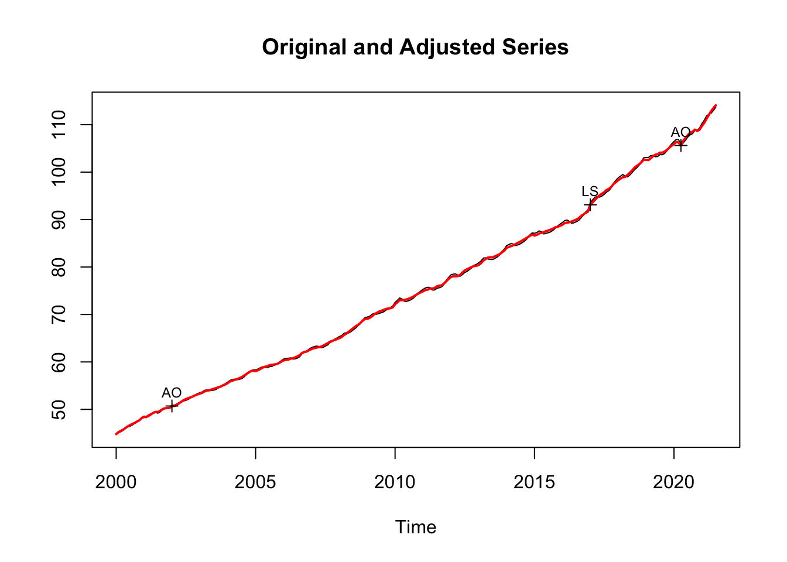
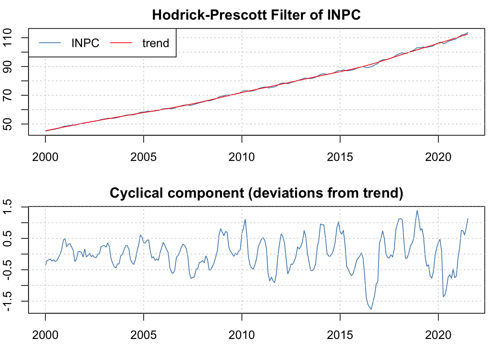

--- 
title: "Notas de Clase: Series de Tiempo"
author: "Benjamín Oliva, Omar Alfaro-Rivera y Emiliano Pérez Caullieres"
date: "2022-08-07"
site: bookdown::bookdown_site
documentclass: book
bibliography: [book.bib, packages.bib]
description: "Trabajo siempre en proceso de mejora, para cualquier comentario o aclaración, contactar al correo benjov@ciencias.unam.mx o omarxalpha@gmail.com"
biblio-style: apalike
link-citations: yes
csl: chicago-fullnote-bibliography.csl
---


# Introducción 

Estas notas son un resumen, una síntesis comparativa y, en algunos casos, una interpretación propia de los libros de texto de Cowpertwait y Metcalfe (2009), Guerrero-Guzman (2014), Enders (2015), Franses y van Dijk (2003), Kirchgassner, Wolters, y Hassler (2012), Lutkepohl (2005), Wei (2019), entre
otros. En algunos casos se incorpora información adicional para efectos de dar contexto al tema analizado (ver sección de Bibliografía para mayores detalles).

El objetivo de este documento es proporcionar un conjunto de apuntes que sirva de apoyo para la clase, por ello no deben considerarse como notas exhaustivas o como un sustituto de la clase y los laboratorios. Asimismo, es deseable que los alumnos puedan aportar sus observaciones y correcciones
a estas notas, las observaciones a estas notas son esperadas y siempre serán bienvenidas y agradecidas.

Este es un trabajo siempre en proceso de mejora, para cualquier comentario o aclaración, contactar al correo benjov@ciencias.unam.mx, omarxalpha@gmail.com o emilianoprzcls@gmail.com

En estas notas se estudian los temas que típicamente son incluidos como parte de un curso estándar de análisis de series de tiempo y agrega otros tantos, los cuales son:

   1. Modelos estacionarios univaraidos: $AR(p)$, $MA(q)$, $ARMA(p, q)$ y $ARIMA(p, d, q)$;

   2. Modelos no estacionarios univariados y Pruebas de raíz unitaria (o pruebas para determinar que una serie es estacionaria);
   
   3. Modelos multivariados, entre lo que se incluye a los Vectores Autoregresivos (VAR) y los procedimientos de Cointegración

   4. Modelación de series univariadas con errores con heterocedasticidad y autocorrelación: ARCH(r), GARCH(n), etc.;

   5. Modelos multivariados con errores con heterocedasticidad y autocorrelación: M-GARCH y M-GARCH-M;
   
   6. Casos particulares en los que las series incluidas en un modelo multivariado no son del mismo orden de integración, conocidos como modelos
ADL.
   
   7. Modelos de Datos Panel en series de tiempo, y

   8. Modelos no lineales como los de cambios de régimen.

## La naturaleza de los datos de Series de Tiempo 

El análisis de series de tiempo tiene muchas aplicaciones en diversos campos de la ciencia. Por ejemplo, en la economía continuamente se está expuesto a observaciones de los mercados financieros, indicadores de empleo, índices o indicadores del nivel de producción, índices de precios, etc. En otros campos de las ciencias sociales se emplea el análisis de series de tiempo para analizar
la evolución de la población, los nacimientos, o el número de personas con matriculas escolares. Finalmente, en las ciencias exactas se pueden encontrar casos como los de un epidemiólogo que puede estar interesado en el número de casos de influenza observados en algún periodo de tiempo dado y si a estos se les puede asociar con algún tipo de estacionalidad o si se trata del inicio de un fenómeno atípico.

La primera aproximación que se suele tener a las series de tiempo es mediante el exámen de datos puestos en una gráfica, en la cual uno de los ejes es el tiempo y el otro es el valor tomado por la variable. No obstante, en este tipo de exámenes existen dos enfoques. Por un lado, existe el efoque de la importancia del tiempo, el cual consiste en reconocer cómo lo que sucede hoy es afectado por lo que pasó ayer o, en general, en periodos pasados, o cómo lo que pasa hoy afectará los eventos futuros. Por otro lado, existe el enfoque del análisis frecuentista o de frecuencia, mediante el cual se busca reconocer la importancia que tiene para los investigadores los ciclos (estacionales, de crisis económicas, etc.)

## Ejemplos y aplicaciones de las Series de Tiempo 

Un primer ejemplo que puede ilustrar la presencia de los dos tipos de
enfoques antes mencionadas es la Figura \@ref(fig:fig1). En esta figura se muestra la evolución del Indicador Global de la Actividad Económica (IGAE) en su versión global o del total de la economía y en su versión únicamente para las actividades primarias entre enero de 2002 y mayo de 2021.


<div class="figure" style="text-align: center">

<p class="caption">(\#fig:fig1)Indicador Global de Actividad Económica (IGAE) Global y para las Actividades Primarias (2008=100), Ene.2002 - May.2021</p>
</div>

Como se puede observar, el IGAE del total de la economía muestra, principalmente, que el enfoque del tiempo es más relevante. Es decir, que existe cierta persistencia en el indicador, lo que significa que la economía crece en razón del crecimiento reportado en periodos pasados. No obstante, lo que no podemos reconocer es que los eventos futuros tienen un efecto en el desempeño de la economía hoy día. Así, no es común observar cambios abruptos
del indicador, salvo por la crisis global de 2008 y la reciente crisis causada
por la Covid-19.

<div class="figure" style="text-align: center">

<p class="caption">(\#fig:fig2)Índice de Confianza del Consumidor (ICC): General y resultado de ¿Cómo considera usted la situación economica del país hoy en día comparada con la de hace 12 meses? (puntos), Ene.2002-may.2021</p>
</div>

Por el contrario, el IGAE de las actividades primarias muestra una presencia
significativa de la importancia de la frecuencia. No pasa desapercibido que
existen muchos ciclos en la evolución del indicador. Algo que suena común
en las actividades primarias, cuya producción depende de eventos que son
ciclícos agrícolas asociados con el clima u otros factores determinantes de la
oferta de productos agrícolas. Otro factor que puede incluir en el indicador
son elementos de demanda, más que los de oferta. Por ejemplo, el consumo
de alimentos típicos de algunas temporadas del año.

Como segundo ejemplo, en la Figura \@ref(fig:fig2) se ilustra la evolución reciente del índice de Confianza del Consumidor (ICC) en dos de sus versiones: i) el Índice global y ii) el Índice de confianza de los consumidores cuando estos consideran la situación actual en la economía en relación el año anterior.

Destacamos que el ICC mide las expectativas de los consumidores en
razón de la información pasada y de la esperada, segun dichos consumidores.

<div class="figure" style="text-align: center">

<p class="caption">(\#fig:fig3)Índice de Precios y Cotizaciones de la Bolsa Mexicana de Valores (Panel Derecho) y Tipo de Cambio para Solventar Obligaciones en Moneda Extranjera, pesos por dólar (Panel izquierdo), Ene.2002-May.2021 </p>
</div>

Así, es probable que las dos series de tiempo exhiban un gran peso para los
eventos pasados, pero a la vez, un componente -probablemente menor- del
componente de frecuencia. Esto último en razón de que los consumidores
suelen considerar en sus expectativas de consumo los periódos cíclicos de la
economía: temporadas navideñaas, pagos de colegiaturas, etc. Este sengundo
ejemplo tambien ilustra que la confianza del consumidor no necesariamente
está directamente correlacionada con el desempeño de la economía.

Como tercer ejemplo se muestra la evolución de dos series. La Figura \@ref(fig:fig3) ilustra el comportamiento reciente de dos indicadores que son referencia para los inversionistas. Por un lado, se ubica el índice de Precios y Cotizaciones de la BMV (IPC), el cuál refleja el valor de las acciones de empresas que cotizan en la BMV y el volumen de acciones comercializadas, en conjunto. De esta forma, se ha interpretado que el IPC refleja el rendimiento del capital promedio invertido en las empresas que cotizan en la BMV.

Por otro lado, en la Figura \@ref(fig:fig3) se presenta la evolución del Tipo de Cambio (TDC){indicador financiero que se suele utilizar como medio de reserva de valor. Esto, en razón de que el TDC es conocido como un instrumento que en momentos de crisis toma valores contraciclicos de la economía mexicana. No obstante, ambos indicadores no son comparables. Para hacerlos comparbles
en la Figura \@ref(fig:fig4) se presentan en versión índice con una base en el primer mes de la muestra. 

<div class="figure" style="text-align: center">

<p class="caption">(\#fig:fig4)Índice del índice de Precios y Cotizaciones de la Bolsa Mexicana de Valores (Panel Derecho) e Índice del Tipo de Cambio para Solventar Obligaciones en Moneda Extranjera (ambos enero de 2002 = 100), pesos por dólar (Panel izquierdo), Ene.2002-May.2021 </p>
</div>

En la perspectiva de la Figura \@ref(fig:fig4) se puede apreciar que el TDC no es tan rentable, ya que una inversión en la BMV mediante el IPC, en el largo plazo, muestra más redimientos. Asimismo, la Figura \@ref(fig:fig4) ilustra que en ambas series se observa un dominio de la condición de tiempo y no uno de frecuencia. Es decir, tanto el IPC como el TDC no responden a condiciones como ciclos o temporadas que si son observables en actividades económicas como las
primarias. 

Finalmente, la Figura \@ref(fig:fig5) ilustra un característica que también resulta de gran interés en el analásis de series de tiempo: los datos de alta frecuencia y de comportamiento no regular. Como se puede observar, en la Figura \@ref(fig:fig5) se muestran las diferencias logarítmicas de las series de IGAE de la actividad total, el IPC y el TDC.

<div class="figure" style="text-align: center">

<p class="caption">(\#fig:fig5)Tasas de Crecimiento mensuales (diferencias logarítmicas) de Indicador Global de la Actividad Económica, Índice de Precios y Cotizaciones de la Bolsa Mexicana de Valores (Panel Derecho) y Tipo de Cambio para Solventar Obligaciones en Moneda Extranjera, Ene.2002-May.2021 </p>
</div>

Dichas diferencia se pueden interpretar como una tasa de crecimiento de las series por las siguientes razones. Consideremos una serie de tiempo dada por $y_t$, cuya versión logarítmica es $ln(y_t$). De esta forma, la diferencia logarítmica esta dada por la ecuación \@ref(eq:difflog):

\begin{equation}
   \Delta ln(y_t) = ln(y_t) - ln(y_{t-1}) = ln \left( \frac{y_t}{y_{t-1}} \right)
   (\#eq:difflog)
\end{equation}

Ahora bien, si retomamos la definición de tasa de crecimiento (TC) de una serie de tiempo $y_t$ entre el periodo $t$ y $t-1$ podemos obtener que:

\begin{equation}
    TC = \frac{y_t - y_{t-1}}{y_{t-1}} = \frac{y_t}{y_{t-1}} - 1
    (\#eq:TC)
\end{equation}

De esta forma, si tomamos el logarítmo de la expresión de la ecuación \@ref(eq:TC) obtenemos la siguiente aproximación:

\begin{equation}
    \frac{y_t}{y_{t-1}} -1  \approx ln \left( \frac{y_t}{y_{t-1}} \right) = ln(y_t) - ln(y_{t-1})
    (\#eq:TCDiffLog)
\end{equation}

La ecuación \@ref(eq:TCDiffLog) es cierta cuando los valores de $y_t$ y $y_{t-1}$ son muy parecidos, es decir, cuando las variaciones no son tan abruptas. Otra forma de interpretar la ecuación \@ref(eq:TCDiffLog) es que para tasas de crecimiento pequeñas, se puede utilizar como una buena aproximación a la diferencia logarítmica mostrada en la ecuación \@ref(eq:difflog).


En la Figura \@ref(fig:fig5) se reportan las diferencias logarítmicas del IGAE, IPC y TDC, todos, como una media de distitntos tipos de redimientos. Es decir, podemos decir que un capitalista promedio (suponiendo que solo puede invertir en la actividad económica, en la bolsa o en el dólar), puede observar que le es más redituable en función de sus preferencias.

Notése que la dinámica de las variaciones de cada una de las series es significativamente diferente. Destaca que el TDC es una de las variables que, en general, no muestra grandes cambios a lo largo del tiempo. No obstante, se han observado cambios radicales, cuando menos en el año 2008. Lo anterior, son caracteristicas que se han observado para el IPC. En cambio, el IGAE muestra un comportamiento más estable o estacionario.

<!--chapter:end:index.Rmd-->

# Elementos de Ecuaciones en Diferencia

## Ecuaciones en Diferencia para procesos deterministas

En el capítulo previo se hizó una introducción al concepto de series de tiempo. En este Capítulo se pretende desarrollar la construcción de los procesos generadores de datos de las series de tiempo. En un sentido más formal, se expondrá que las series de tiempo se pueden considerar como una secuencia de variables aleatorias.

Para tales efectos, se desarrollará una introducción al concepto de ecuaciones en diferencia. Así, las preguntas que se pretende responder son:

1. ¿Cuál es la solución de la ecuación en diferencia que se estudia?

2. ¿Cuáles son las condiciones para que un proceso estocástico, representado mediante una ecuación en diferencia, llegue a alcanzar un punto de equilibrio en el largo plazo?

El término de _ecuación en diferencia_ sirve para denominar un proceso similar o equivalente dentro de las ecuaciones diferenciales, dentro del cual se consideran a un conjunto de variables que están en función del tiempo. Así, si consideramos al tiempo como una variable continua, es decir, consideramos una variable $Z(t)$, podemos expresar las siguientes expresiones para la ecuación diferencial:

\begin{equation}
    \frac{dZ(t)}{dt}; \frac{d^2Z(t)}{dt^2}; \ldots; \frac{d^kZ(t)}{dt^k}
        (\#eq:eqDiff)
\end{equation}

Por otro lado, suponiendo el caso del tiempo en forma discreta, es decir, con $t = \ldots, -2, -1, 0, 1, 2, \ldots$, entonces el comportamiento de la serie de variables dadas por $Z_t$, la cual se puede expresar como:

\begin{equation}
    \Delta Z_t; \Delta^2 Z_t; \ldots; \Delta^k Z_t
    (\#eq:Diff1)
\end{equation}

Observemos que una forma técnicamente más correcta es escribir las expresiones anteriores como:

\begin{equation}
    \frac{\Delta Z_t}{\Delta t}; \frac{\Delta^2 Z_t}{\Delta t^2}; \ldots; \frac{\Delta^k Z_t}{\Delta t^k}
    (\#eq:Diff2)
\end{equation}

No obstante, no pasa desapercibido que $\Delta t = 1$, por lo que resultan equivalentes ambos conjuntos de expresiones \@ref(eq:Diff1) y \@ref(eq:Diff2).

### Ecuaciones en Diferencia Lineales de Primer Orden

El primer caso que se suele estudiar en relación a Ecuaciones en Diferencia es el de las Ecuaciones en Diferencia Lineales de Primer Orden. Al respecto, al igual que en el caso continúo, las variaciones de la variable $Z_t$ se pueden expresar como se ilustra en el siguiente ejemplo. Consideremos la siguiente ecuación:

\begin{equation}
    Z_t = a_0 + a_1 Z_{t-1}
    (\#eq:EDPO)
\end{equation}

Donde, $t = \ldots, -2, -1, 0, 1, 2, \ldots$, y $a_0$ y $a_1 \neq 0$ son números reales constantes. De \@ref(eq:EDPO) podememos despejar la variable $Z_{t-1}$ y obtener una forma de ecuación en diferencia:
\begin{equation}
    Z_t - a_1 Z_{t-1} = a_0
    (\#eq:EDPO2)
\end{equation}

Ahora denotemos a $L Z_t = Z_{t-1}$, es decir, mediante el operador $L$ se puede rezagar una variable dada. En general, podemos decir que el operador tiene dos propiedades, la primera es que es lineal en el sentido de que abre sumas y saca escalares como se muestra en la siguiente expresión para el caso de un (1) rezago:

\begin{equation}
    L(\alpha Z_{t} + \beta) = \alpha Z_{t-1} + \beta
    (\#eq:E1Lag)
\end{equation}

Donde $\alpha, \beta \in \mathbb{R}$ y $\alpha, \beta \neq 0$. Otro reesultado implícito en esta primera propiedad es que el operador rezago aplicado a cualquier escalar dará como resultado el escalar, puesto que este es una constante sin importa el momento $t$ en el cual se encuentre la variable $Z$.

La segunda propiedad del operador es que se puede aplicar de forma consecutiva a una misma variable. Es decir, $L ( Z_{t-1}) = L L Z_{t} = L^2 Z_{t}$, por lo que en general tendremos: $L^p Z_t = Z_{t-p}$ (con $p \in \mathbb{Z}$). Así, en el caso de p rezagos la propiedad de linealidad del operador rezago será:

\begin{equation}
    L^p (\alpha Z_{t} + \beta) = \alpha Z_{t-p} + \beta
   (\#eq:LinProp)
\end{equation}

Dicho lo anterio podemos escribir la solución general de \@ref(eq:EDPO2) como:

\begin{eqnarray}
    Z_t - a_1 L Z_t & = & a_0 \nonumber \\
    (1 - a_1 L)Z_t & = & a_0 \nonumber \\
    Z_t & = & a_0 \frac{1}{1 - a_1 L} + s a^t_1 \nonumber \\
    Z_t & = & a_0 \frac{1}{1 - a_1} + s a^t_1
    (\#eq:PROC01)
\end{eqnarray}

Donde $a_1 \neq 1$ y $t = \ldots, -2, -1, 0, 1, 2, \ldots$. Notése que la aplicación del operador rezago $L$ a la constante $a_1$ dará como resultado el valor de la misma constante, ya que ésta no depende del momento $t$ en el cuál observemos a la variable $Z_t$. En la ecuación \@ref(eq:PROC01) se adiciona un término $s a^t_1$ que permite ubicar la trayectoria inicial de la solución de la ecuación. El componente no significa un cambio respecto de la ecuación \@ref(eq:EDPO2) original, ya que si buscaramos reconstruir a ésta ecuación tendríamos:
\begin{eqnarray}
    (1 - a_1 L) s a^t_1 & = & s a^t_1 - a_1 s L a^{t}_1 \nonumber \\
    & = & s a^t_1 - a_1 s a^{t - 1}_1 \nonumber \\
    & = & s a^t_1 - s a^t_1 \nonumber \\
    & = & 0 \nonumber
\end{eqnarray}

La ecuación \@ref(eq:PROC01) se suele interpretar como la solución de largo plazo. Ahora demostraremos por qué es cierta la ecuación y discutiremos algunas condiciones que se deben observar en esta solución para que sea una solución convergente. No obstante, primero discutiremos un método indirecto e incompleto para demostrar el resultado, dicho método es conocido como el método iterativo. Plantearemos las siguientes ecuaciones partículares donde suponemos la existencia del valor inicial $Z_0$ del proceso:

\begin{equation*}
    Z_1 = a_0 + a_1 Z_0
\end{equation*}

\begin{eqnarray*}
Z_2 & = & a_0 + a_1 Z_1 \\
    & = & a_0 + a_1 (a_0 + a_1 Z_0) \\
    & = & a_0 +  a_0 a_1 + a^2_1 Z_0 \\
    & = & a_0 (1 + a_1) + a^2_1 Z_0
\end{eqnarray*}

\begin{eqnarray*}
Z_3 & = & a_0 + a_1 Z_2 \\
    & = & a_0 + a_1 (a_0 +  a_0 a_1 + a^2_1 Z_0) \\
    & = & a_0 +  a_0 a_1 + a_0 a^2_1 + a^3_1 Z_0 \\
    & = & a_0 (1 + a_1 + a^2_1) + a^3_1 Z_0
\end{eqnarray*}

De lo anterior se puede inferir que el método iterativo convergerá hacia una expresión como la siguiente en el momento $t$:

\begin{eqnarray}
Z_t & = & a_0 + a_1 Z_{t-1} \nonumber \\
    & = & a_0 (1 + a_1 + a^2_1 + \ldots + a^{t-1}_1) + a^t_1 Z_0 \nonumber \\
    & = & a_0 \sum^{t-1}_{i = 0}{a^i_1} + a^t_1 Z_0
    (\#eq:SUM)
\end{eqnarray}

Donde, es necesario que en la ecuación \@ref(eq:SUM) se cumpla que $\lvert{a_1}\lvert < 1$ para que la suma sea convergente --más adelante detallaremos esta afirmación--. A este tipo de ecuaciones se les puede denominar como lineales. Esto en razón de que ningún término de la variable $Z$ aparce elevado a ninguna potencia distinta a 1. También, son de primer orden, ya que el rezago de la variable $Z$ es sólo de un período. 

En adelante trabajaremos con ecuaciones en las que la variable $Z$ se encuentra rezagada en cualquiera de los siguientes casos:
\begin{equation}
    Z_t, Z_{t-1}, Z_{t-2}, Z_{t-3}, \ldots, Z_{t-p}, \ldots
    (\#eq:SUM0)
\end{equation}

Por lo que diremos que en adelante el curso versará sobre ecuaciones en diferencia lineales y de cualquier orden $p$. 

Retomando la ecuación \@ref(eq:SUM) y considerando la parte de la suma de los términos de $a^i_1$, de tal forma que buscaremos dar una expresión más compresible a dicho término. Definamos la siguiente expresión como:
\begin{equation}
    S_{t-1} = \sum^{t-1}_{i = 0}{a^i_1}
    (\#eq:St1)
\end{equation}

Por lo tanto, $S_t$ estaría dado por la siguiente expresión:
\begin{eqnarray}
S_{t} & = & a_1 \sum^{t-1}_{i = 0}{a^i_1} \nonumber \\
      & = & a_1 (1 + a_1 + a^2_1 + \ldots + a^{t-1}_1) \nonumber \\
      & = & a_1 + a^2_1 + a^3_1 + \ldots + a^{t}_1 \nonumber \\
      & = & a_1 S_{t-1}
      (\#eq:St)
\end{eqnarray}

Tomando los dos resultados de las ecuaciones \@ref(eq:St1) y \@ref(eq:St) anteriores, podemos expresar que si a $S_{t-1}$ le restamos $S_t$, y desarrollando ambos lados de la ecuación anterior podemos obtener:

\begin{eqnarray}
    S_{t-1} - a_1 S_{t-1} & = & S_{t-1} - S_{t} \nonumber \\
    (1 - a_1) S_{t-1} & = & (1 + a_1 + a^2_1 + \ldots + a^{t-1}_1) - (a_1 + a^2_1 + a^3_1 + \ldots + a^{t}_1) \nonumber \\
    (1 - a_1) S_{t-1} & = & 1 - a^{t}_1 \nonumber
\end{eqnarray}

Así, podemos concluir que:
\begin{equation}
    S_{t-1} = \frac{1 - a^{t}_1}{1 - a_1}
    (\#eq:SUM2)
\end{equation}

Conjuntando éste último resultado de la ecuación \@ref(eq:SUM2) con la ecuación \@ref(eq:SUM) tenemos la siguiente solución por el método de iteración:

\begin{equation}
    Z_t = a_0 \left( \frac{1 - a^{t}_1}{1 - a_1} \right) + a^t_1 Z_0
    (\#eq:SOLITER)
\end{equation}

De esta forma la ecuación \@ref(eq:SOLITER) es una solición para la ecuación \@ref(eq:SUM), que es una ecuación de un proceso de una Ecuación en Diferencia plantenado en la ecuación \@ref(eq:EDPO). Está solución aún no es general, en el sentido de que sea válida para cualquiel tipo de proceso: convergente o divergente. Dicha convergencia o divengencia estará determinada por el paramétro $a_1$. No debe pasar desapercibido que cuando $t \rightarrow \infty$ o cuando la muestra es muy grande (lo que es equivalente), podemos decir que la solución solo puede converger a la siguiente expresión cuando se considera que $|a_1| < 1$:
\begin{equation}
    Z_t = a_0 \left( \frac{1}{1 - a_1} \right)
    (\#eq:trayec)
\end{equation}

Retomemos ahora el caso general descrito en la ecuación \@ref(eq:PROC01) y determinemos una solución general en la cual $a_1 \neq 1$ y $t = \ldots, -2, -1, 0, 1, 2, \ldots$. Para ello observemos que el siguiente componente en la ecuación mencionada se puede interpretar como la suma infinita de términos descritos como:
\begin{eqnarray}
    \frac{1}{1 - a_1} & = & 1 + a_1 + a_1^2 + \ldots + a_1^t + \ldots \nonumber \\
    & = & \sum_{i = 0}^{\infty} a_1^{i}
    (\#eq:SUMINF)
\end{eqnarray}

Donde claramente es necesario que $|a_1| < 1$. Por lo tanto, sólo faltaría determinar el valor de la constante $s$ en la ecuación \@ref(eq:PROC01) de la siguiente forma, supongamos que observamos el proceso en el momento inicial, por lo que es posible determinar el valor de la constante conociendo el valor inicial del proceso como sigue:
\begin{equation}
    Z_0 = a_0 \frac{1}{1 - a_1} + s
(\#eq:Z0)
\end{equation}

De la ecuación \@ref(eq:Z0) tenemos que:
\begin{equation}
    s = Z_0 - a_0 \frac{1}{1 - a_1}
(\#eq:eqs)
\end{equation}

Así, juntando la ecuación \@ref(eq:PROC01) y ecuación \@ref(eq:eqs) tenemos la expresión:

\begin{equation}
    Z_t = a_0 \frac{1 - a^t_1}{1 - a_1} + a^t_1 Z_0
(\#eq:SOLGEN)
\end{equation}

No debe pasar desapercibido que está solución es la misma que la mostrada en la ecuación (\@ref(eq:SOLITER), por lo que en realidad ambas ecuaciones son una solución general indistintamente entre las ecuaciones \@ref(eq:SOLITER) y \@ref(eq:SOLGEN). Ambas convergen a la expresión como la ecuación \@ref(eq:trayec), con la misma condición de convergencia $|a_1| < 1$. Para ilustrar estas ecuaciones veámos algunos ejemplos al respecto. 

Consideremos que tenemos un proceso $Z_t$ que es descrito por una ecuación en diferencia lineal de primer orden dada por:

\begin{equation}
    Z_t = 2 + 0.9 Z_{t-1}
(\#eq:ex1)
\end{equation}

Siguiendo la expresión mostrada en la ecuación \@ref(eq:SOLGEN), obtenemos la expresión:
\begin{equation}
    Z_t = 2 \left( \frac{1 - 0.9^{t}}{1 - 0.9} \right) + 0.9^t Z_0
(\#eq:ex2)
\end{equation}

Donde asumiremos que el valor inicial es $Z_0 = 10$ y que la expresión debe converger al valor de 20, cuando $t$ es muy grande o tiende a infinito. De forma similar tomemos otro ejemplo, en el cual asumimos la siguiente expresión:
\begin{equation}
    Z_t = 2 - 0.5 Z_{t-1}
(\#eq:ex3)
\end{equation}

Siguiendo la expresión mostrada en la ecuación \@ref(eq:SOLGEN), obtenemos:

\begin{equation}
    Z_t = 2 \left( \frac{1 - (-0.5)^{t}}{1 + 0.5} \right) + (-0.5)^t Z_0
(\#eq:ex4)
\end{equation}

Donde asumiremos que el valor inicial es $Z_0 = 10$ y que la ecuación converge al valor de $1.3333333 \ldots$, cuando $t$ es muy grande o tiende a infinito. Ahora simulemos el comportamiento de ambos procesos y estableceremos los resultados del Cuadro \@ref(tab:table1). Notemos que el segundo proceso converge de una forma más rapida que el primero. El Cuadro \@ref(tab:table1) se ilustra en las siguientes dos Figura \@ref(fig:fig21) y Figura \@ref(fig:fig22).


### Ecuaciones en Diferencia Lineales de Segundo Orden y de orden superior

Como un segundo caso a estudiar se ubica el caso de las Ecuaciones en Diferencia Lineales de Segundo Orden y de orden superior. Primero, sea una ecuación como la siguiente, la cual es lineal y de segundo orden, ya que tiene asociado un término de $Z_t$ rezagado dos periódos:
\begin{equation}
    Z_t = a_0 + a_1 Z_{t-1} + a_2 Z_{t-2}
    (\#eq:EDSO)
\end{equation}


```r
library(knitr)
library(tidyverse)
library(kableExtra)
Tiempo = c(0:100)
Zt = rep(NA, 101)
Zt2 = rep(NA,101)
Zt[1] = 10
Zt2[1] = 10

for (i in c(2:101)){
  Zt[i] = 2+0.9*Zt[i-1]
  Zt2[i] = 2 - 0.5*Zt2[i-1]
}
lista = c(1:16, 97:101)
Tiempo1 = Tiempo[lista]
Zt1=Zt[lista]
Zt21=Zt2[lista]


tabla1 = data.frame(Tiempo1, Zt1, Zt21)
colnames(tabla1) <- c("Tiempo", "$Z_t =2+0.9Z_{t-1}$", "$Z_t = 2-0.5Z_{t-1}$")

kable(tabla1, caption = "Dos ejemplos de Procesos de Ecuaciones Lineales de Primer Orden Convergentes ", format = "pandoc")%>%
  kable_styling(font_size = 10)
```


Table: (\#tab:table1)Dos ejemplos de Procesos de Ecuaciones Lineales de Primer Orden Convergentes 

 Tiempo   $Z_t =2+0.9Z_{t-1}$   $Z_t = 2-0.5Z_{t-1}$
-------  --------------------  ---------------------
      0              10.00000              10.000000
      1              11.00000              -3.000000
      2              11.90000               3.500000
      3              12.71000               0.250000
      4              13.43900               1.875000
      5              14.09510               1.062500
      6              14.68559               1.468750
      7              15.21703               1.265625
      8              15.69533               1.367188
      9              16.12580               1.316406
     10              16.51322               1.341797
     11              16.86189               1.329102
     12              17.17570               1.335449
     13              17.45813               1.332275
     14              17.71232               1.333862
     15              17.94109               1.333069
     96              19.99960               1.333333
     97              19.99964               1.333333
     98              19.99967               1.333333
     99              19.99970               1.333333
    100              19.99973               1.333333


```r
ggplot(,aes(x = Tiempo, y=Zt))+
  geom_line(col="blue4")+
  geom_point(col= "blue4")+
  labs(y=expression(Z[t]))
```

<div class="figure" style="text-align: center">

<p class="caption">(\#fig:fig21)Evolución del proceso dado por $Z_t =2+0.9Z_{t-1}$</p>
</div>


```r

ggplot(,aes(x = Tiempo, y=Zt2))+
  geom_line(col="red4")+
  geom_point(col= "red4")+
  labs(y=expression(Z[t]))
```

<div class="figure" style="text-align: center">

<p class="caption">(\#fig:fig22)Evolución del proceso dado por $Z_t =2-0.5Z_{t-1}$</p>
</div>

Donde $t = \ldots, -2, -1, 0, 1, 2, \ldots$ y $a_1, a_2 \neq 0$. Reordenando la ecuación \@ref(eq:EDSO) podemos escribir:
\begin{eqnarray}
    Z_t - a_1 Z_{t-1} - a_2 Z_{t-2} & = & a_0 \nonumber \\
    Z_t - a_1 L Z_{t} - a_2 L^2 Z_{t} & = & a_0 \nonumber \\
    (1 - a_1 L - a_2 L^2)Z_t & = & a_0 
    (\#eq:EDSOSOL)
\end{eqnarray}

Así, la solución general propuesta para la ecuación \@ref(eq:EDSOSOL) es la siguiente, la cual es una forma analóga a una Ecuación Lineal en Diferencia de Primer Orden:
\begin{equation}
    Z_t = \frac{a_0}{1 - a_1 - a_2} + s_1 g^t_1 + s_2 g^t_2
    (\#eq:SOLGEN2)
\end{equation}

En donde $s_1$ y $s_2$ son constantes que se determinan mediante dos condiciones iniciales --por lo que para resolver este tipo de ecuaciones requerimos conocer dos condiciones iniciales--. Los valores de $g_1$ y $g_2$ están relacionados con los coeficientes $a_1$ y $a_2$, de esta forma:

\begin{equation}
  a_1  =  g_1 + g_2
  (\#eq:a1)
\end{equation}

\begin{equation}
    a_2  =  - g_1 g_2
    (\#eq:a2)
\end{equation}

Lo anterior surge del siguiente procedimiento y recordando que siempre es posible descomponer una ecuación cuadrática en expresiones como las siguientes:
\begin{eqnarray}
    (1 - a_1 L - a_2 L^2) & = & (1 - g_1 L)(1 - g_2 L) \nonumber \\
    & = & 1 - g_1 L - g_2 L + g_1 g_2 L^2 \nonumber \\
    & = & 1 - (g_1 + g_2) L + g_1 g_2 L^2
    (\#eq:eqcaracteristica)
\end{eqnarray}

Donde se observa la equivalencia mostrada en las ecuaciones \@ref(eq:a1) y \@ref(eq:a2). Así, considerando la ecuación \@ref(eq:SOLGEN2) tenemos que:
\begin{eqnarray}
    (1 - a_1 L - a_2 L^2) Z_t & = & (1 - g_1 L)(1 - g_2 L) Z_t \nonumber \\
    & = & a_0 + (1 - g_1 L)(1 - g_2 L) s_1 g^t_1 \nonumber \\
    &  & + (1 - g_1 L)(1 - g_2 L) s_2 g^t_2
    (\#eq:eqcaracteristica1)
\end{eqnarray}

Por lo tanto, buscamos que para que el proceso sea equivalente y podamos interpretar que la ecuación \@ref(eq:SOLGEN2) sea una solución general deberá pasar lo siguiente:
\begin{equation}
    (1 - g_1 L) (1 - g_2 L) s_1 g^t_1 + (1 - g_1 L) (1 - g_2 L) s_2 g^t_2 = 0
    (\#eq:eqcaracteristica2)
\end{equation}

O, escrito de otra forma:
\begin{equation}
    (1 - g_1 L) s_1 g^t_1 = (1 - g_2 L) s_2 g^t_2 = 0
    (\#eq:eqcaracteristica3)
\end{equation}

Ahora determinemos cuáles son los valores $g_1$ y $g_2$ dados los valores $a_1$ y $a_2$ que nos permitan determinar si el proceso será convergente. Para ello debemos resolver la siguiente ecuación que se deriva de la ecuación \@ref(eq:eqcaracteristica):

\begin{equation}
    1 - a_1 x - a_2 x^2 = (1 - g_1 x)(1 - g_2 x) = 0
    (\#eq:eqcaracteristica4)
\end{equation}

Donde, claramente existen dos raíces: $x_1 = g^{-1}_1$ y $x_2 = g^{-1}_2$. Así, la solución estará dada por las raíces de la ecuación característica:

\begin{eqnarray}
    1 - a_1 x - a_2 x^2 = 0 \nonumber \\
    a_2 x^2 + a_1 x - 1 = 0
    (\#eq:POL2)
\end{eqnarray}

Cuya solución es:
\begin{equation}
    x = \frac{- a_1 \pm \sqrt{a^2_1 + 4 a_2}}{2 a_2}
    (\#eq:eqcaracteristica5)
\end{equation}

Es importante distinguir tres diferentes casos en relación con las raíces que surgen como solución de la ecuación \@ref(eq:POL2), estos son:

__Caso I__. Si $a^2_1 + 4 a_2 > 0$, la ecuación \@ref(eq:POL2) proporcionará dos valores de raíces reales y distintos, eso es $x_1 = g^{-1}_1 \neq x_2 = g^{-1}_2$. Si por ahora suponemos que $|{g_1} < 1|$ y que $|{g_2} < 1|$, entonces tendremos que:
\begin{eqnarray}
    (1 - g_1 L)^{-1} (1 - g_2 L)^{-1} a_0 & =&  \left( \sum^{\infty}_{j = 0}{g^j_1 L^j} \right) \left( \sum^{\infty}_{j = 0}{g^j_2 L^j} \right) a_0 \nonumber \\
    & = & \left( \sum^{\infty}_{j = 0}{g^j_1} \right) \left( \sum^{\infty}_{j = 0}{g^j_2} \right) a_0 \nonumber \\
    & = & \frac{a_0}{(1 - g_1)(1 - g_2)} \nonumber \\
    & = & \frac{a_0}{1 - a_1 - a_2}
    (\#eq:eqcaracteristica6)
\end{eqnarray}

Esto último es el punto de equilibrio de la ecuación \@ref(eq:SOLGEN2); considerando que $|{g_1} < 1|$ y que $|{g_2} < 1|$ --notemos que los demás casos son divergentes, ya que la suma anterior nno connvergería--. De esta forma la solución de la ecuación estará dada por:
\begin{equation}
    \lim_{t \to \infty} Z_t = \frac{a_0}{1 - a_1 - a_2}
    (\#eq:Conver)
\end{equation}

__Caso II__. Si $a_1^2 + 4a_2 < 0$ en la ecuación \@ref(eq:POL2), entonces las raíces serán números complejos conjugados, es decir:

\begin{equation}
g_i^{-1}=a \pm ib
(\#eq:Conver1)
\end{equation}

\begin{eqnarray}
    g_i  =  u \pm iv 
    (\#eq:Conver2)
\end{eqnarray}

Dichas raíces las podemos escribir en coordenadas polares como:
\begin{eqnarray}
    g_1^{-1} = r e^{i \theta} = r (cos(\theta) + i sen(\theta))
    (\#eq:Conver3)
\end{eqnarray}
\begin{eqnarray}
    g_2^{-1}  =  r e^{-i \theta} = r (cos(\theta) - i sen(\theta))
    (\#eq:Conver4)
\end{eqnarray}
Donde: $r = \sqrt{u^2 + v^2}$, a esta expresión también se le conoce como modulo. Alternativamente, podemos escribir que $r = \sqrt{g_1 g_2}$. La única condición es que $r < 1$ para que el proceso descrito en la ecuación \@ref(eq:SOLGEN2) sea convergente. 

Al igual que en el __Caso I__, el punto de equilibrio de la ecuación se debería ubicar al rededor \@ref(eq:Conver), siempre que $r < 1$, por lo que el factor que determina la convergencia es el modulo, ya que si el modulo es mayor a 1, el proceso será divergente, pero si es menor a 1 convergerá a \@ref(eq:Conver). Para ilustrar, el caso contrario es divergente puesto que representa trayentorias senoidales (oscilatorias) que sólo pueden converger si a medida que pasa el tiempo, las ondas son menos amplias.

__Caso III__. Ahora revisemos el caso en el que $a_1^2 + 4a_2 = 0$, de esta forma las raíces serán identicas:
\begin{equation}
    g = g_1^{-1} = g_2^{-1} = \frac{-a_1}{2 a_2}
    (\#eq:Conver6)
\end{equation}

Así, el punto de equilibrio será dado por la solución descrita como:
\begin{eqnarray}
    (1 - g L)^2 Z_t & = & a_0 \nonumber \\
    Z_t & = & \frac{a_0}{(1 - g L)^2} + s_1 g^t + s_2 t g^t \nonumber \\
    & = & a_0 \sum_{i = 0}^{\infty} (1 + i) g^j + s_1 g^t + s_2 t g^t
    (\#eq:Conver7)
\end{eqnarray}

Donde la expresión amnterior es resultado de considerar el siguiente procedimiento. Sea:
\begin{eqnarray}
    f(g) & = & \frac{1}{(1 - g)} = \sum_{j = 0}^{\infty} g^j \nonumber
\end{eqnarray}

Por lo que si hacemos la primer derivada del la expresión anterior tenemos que:
\begin{eqnarray}
    f'(g) & = & \frac{1}{(1 - g)^2} \nonumber \\
    & = & \sum_{j = 0}^{\infty} j g^{j-1} \nonumber \\
    & = & 0 + g^0 + 2 g^1 + 3 g^2 + \ldots \nonumber \\
    & = & \sum_{j = 0}^{\infty} (1 + j) g^j \nonumber
\end{eqnarray}

Ahora veámos un ejemplo de una Ecuación Lineal en Diferencia de Segundo Orden. Supongamos la ecuación y el desarrollo siguientes:
\begin{eqnarray}
    Z_t & = & 3 + 0.9 Z_{t-1} - 0.2 Z_{t-2} \nonumber \\
    (1 - 0.9 L + 0.2 L^2) Z_t & = & 3 \nonumber
\end{eqnarray}

La solución dada por una ecuación similar a la expresión \@ref(eq:POL2), obtendríamos la solución dada por las ecuaciones equivalentes a:
\begin{eqnarray}
    1 - 0.9 x + 0.2 x^2 = 0 \nonumber \\
    - 0.2 x^2 + 0.9 x - 1 = 0 \nonumber
\end{eqnarray}

De donde las raíces del polinomio característico $x_1 = g_1^{-1}$ y $x_2 = g_2^{-1}$ se obtienen de la expresión dada por:
\begin{eqnarray}
    x & = &\frac{-0.9 \pm \sqrt{0.81 + (4)(-0.2)}}{(2)(-0.2)} \nonumber \\
    & = & \frac{0.9 \pm 0.1}{0.4} \nonumber
\end{eqnarray}

Dado que el componente $a^2_1 + 4 a_2$  es positivo, obtendremos dos raíces reales. Las raíces estarán dadas por $x_1 = 2.5$ y $x_2 = 2.0$, de lo cual podemos determinar que $g_1 = 0.4$ y $g_2 = 0.5$. De esta forma tenemos que $|g_1| < 1$ y $|g_2| < 1$, así la ecuación converge a la expresión dada por las siguientes expresiones:
\begin{eqnarray}
    Z_t & = & \frac{3}{1 - 0.9 L + 0.2 L^2} + s_1 (0.4)^t + s_2 (0.5)^t \nonumber \\
    & = & \frac{3}{1 - 0.9 + 0.2} + s_1 (0.4)^t + s_2 (0.5)^t \nonumber \\
    & = & \frac{3}{(1 - 0.4)(1 - 0.5)} + s_1 (0.4)^t + s_2 (0.5)^t \nonumber
\end{eqnarray}

Al final, la ecuación que describe la solución general será: 
\begin{equation}
    z_t = 10 + s_1 (0.4)^t + s_2 (0.5)^t
    (\#eq:Conver9)
\end{equation}

Para determinar los valores de $s_1$ y $s_2$ necesitamos obtener dos valores iniciales de la ecuación para lo cual iniciaremos como $t = 0$ y luego obtenemos el valor de $t = 1$, consideremos el valor de $Z_0 = 0$ y $Z_1 = 50$:
\begin{eqnarray*}
    Z_0 & = & 10 + s_1(0.4)^0  + s_2(0.5)^0 \\
    0 & = & 10 + s_1 + s_2 \\
    Z_1 & = & 10 + s_1(0.4)^1  + s_2(0.5)^1 \\
    50 & = & 10 + 0.4 s_1 + 0.5 s_2
\end{eqnarray*}

Por lo que la solución es: $s_1 = -450$ y $s_2 = 440$, de donde podemos expresar la ecuación como:
\begin{equation}
    Z_t = 10 - 450(0.4)^t + 440(0.5)^t
(\#eq:Ejem01)
\end{equation}

La ecuación \@ref(eq:Ejem01) anterior convergerá al valor de 10 cuando $t \rightarrow \infty$. Para ilustrar la trayectoria de esta ecuación tomemos un cuadro similar al de los ejemplos anteriores. En el Cuadro \@ref(tab:table2) y la Figura \@ref(fig:fig23) mostramos los resultados de la trayectorua para 100 periodos. 

Finalmente, discutiremos la solución para las Ecuaciones Lineales en Diferencia de Orden $p$, donde $p \geq 2$. En general una ecuación de este tipo se puede escribir como:
\begin{equation}
    Z_t = a_0 + a_1 Z_{t-1} + a_2 Z_{t-2} + \ldots + a_p Z_{t-p}
    (\#eq:EDOP)
\end{equation}

Donde $t = \ldots, -2, -1, 0, 1, 2, \ldots$ y $a_p \neq 0$. La ecuación \@ref(eq:EDOP) se puede escribir como:
\begin{eqnarray}
    Z_t - a_1 Z_{t-1} - a_2 Z_{t-2} - \ldots - a_p Z_{t-p} & = & a_0 \nonumber \\
    Z_t - a_1 L Z_t - a_2 L^2 Z_t - \ldots - a_p L^p Z_t & = & a_0 \nonumber \\
    (1 - a_1 L - a_2 L^2 - \ldots - a_p L^p) Z_t & = & a_0
    (\#eq:EDOP2)
\end{eqnarray}

```r

t = ts(c(0:100))

Zt=10-450*(0.4^t)+440*(0.5^t)

lista = c(1:16, 97:101)
t1 = t[lista]
Zt1=Zt[lista]


tabla1 = data.frame(Tiempo1, Zt1)
colnames(tabla1) <- c("Tiempo", "$Z_t =10-450(0.4)^t+440(0.5)^t$")

kable(tabla1, caption = "Un ejemplo de proceso de Ecuación de Segundo Orden convengente", format = "pandoc")%>%
  kable_styling(font_size = 10)
```


Table: (\#tab:table2)Un ejemplo de proceso de Ecuación de Segundo Orden convengente

 Tiempo   $Z_t =10-450(0.4)^t+440(0.5)^t$
-------  --------------------------------
      0                           0.00000
      1                          50.00000
      2                          48.00000
      3                          36.20000
      4                          25.98000
      5                          19.14200
      6                          15.03180
      7                          12.70022
      8                          11.42384
      9                          10.74141
     10                          10.38250
     11                          10.19597
     12                          10.09987
     13                          10.05069
     14                          10.02565
     15                          10.01294
     96                          10.00000
     97                          10.00000
     98                          10.00000
     99                          10.00000
    100                          10.00000


```r

ggplot(,aes(x = t, y=Zt))+
  geom_line(col="green4")+
  geom_point(col= "green4")+
  labs(y=expression(Z[t]))
```

<div class="figure" style="text-align: center">

<p class="caption">(\#fig:fig23)Evolución del proceso dado por $Z_t =3+0.9Z_{t-1}-0.2Z_{t-2}$</p>
</div>
Por el Teorema Fundamental del Álgebra es posible escribir a la ecuación \@ref(eq:EDOP2) como:
\begin{eqnarray}
    (1 - g_1 L)(1 - g_1 L) \ldots (1 - g_p L) Z_t & = & a_0
    (\#eq:EDOP3)
\end{eqnarray}

Utilizando la ecuación \@ref(eq:EDOP2) y la ecuación \@ref(eq:EDOP3) tenemos que la solución general de una ecuación como la descrita en \@ref(eq:EDOP) se puede escribir como:
\begin{equation}
    Z_t  =  \frac{a_0}{1 - a_1 - a_2 - \ldots - a_p} + s_1 g^t_1 + s_2 g^t_2 + \ldots + s_p g^t_p \\
    (\#eq:EDOPGEN)
\end{equation}    
\begin{eqnarray}
    Z_t & = & \frac{a_0}{(1 - g_1)(1 - g_1) \ldots (1 - g_p)} + s_1 g^t_1 + s_2 g^t_2 + \ldots + s_p g^t_p 
    (\#eq:EDOPGEN2)
\end{eqnarray}

Donde $s_1$, $s_2$, ..., $s_p$ son cosntantes que se determinan utilizando $p$ valores partículares de $Z_t$, y la solución general descrita en las ecuaciones \@ref(eq:EDOPGEN) y \@ref(eq:EDOPGEN2) implica encontrar $p$ raíces: $x_1 = g^{-1}_1$, $x_2 = g^{-1}_2$, ..., $x_p = g^{-1}_p$ de los siguientes polinomios equivalentes:

\begin{eqnarray}
    (1 - g_1)(1 - g_1) \ldots (1 - g_p) = 0
    (\#eq:POLGEN1)
\end{eqnarray}
\begin{eqnarray}
    1 - a_1 x - a_2 x^2 - \ldots - a_p x^p = 0
    (\#eq:POLGEN2)
\end{eqnarray}
\begin{eqnarray}
    a_p x^p + \ldots + a_2 x^2 + a_1 x - 1 = 0
    (\#eq:POLGEN3)
\end{eqnarray}

Antes de plantear la solución general, analicemos una solución patícular cuando un conjunto de las $p$ raíces, digamos un total de $m$, son iguales, es decir, cuando sucede que $g_1 = g_2 = \ldots = g_m = g$ (con $1 < m \leq p$). En este caso la solución general en la ecuación \@ref(eq:EDOPGEN2) se escribe como:
\begin{eqnarray}
    Z_t & = & \frac{a_0}{(1 - g)^m(1 - g_{m+1}) \ldots (1 - g_p)} \nonumber \\ 
    & & + s_1 g^t + s_2 t g^t + \ldots + s_m t^{m-1} g^t + s_{m+1} g^t_{m+1} + \ldots + s_{p} g^t_{p}
    (\#eq:EDOPGEN3)
\end{eqnarray}

Definamos:
\begin{equation}
    f(g) = \frac{1}{1 - g} = \sum_{j = 0}^{\infty} g^j
    (\#eq:EDOPGEN4)
\end{equation}

Si retomamos el método descrito parráfos arriba tenemos las siguientes expresiones. Cuando $m = 2$:
\begin{equation}
    f'(g) = \frac{1}{(1 - g)^2} = \sum_{j = 0}^{\infty} j g^{j-1} = \sum_{j = 0}^{\infty} (1 + j) g^j \nonumber
\end{equation}

En el otro extremo, cuando $m = p$:
\begin{equation}
    f^{(p-1)}(g) = \frac{p-1}{(1 - g)^p} = \sum_{j = 0}^{\infty} \frac{(p-1+j)(p-2+j) \ldots (2+j)(1+j)}{(p-1)!} g^j
    (\#eq:EDOPGEN5)
\end{equation}

Así, en el extremo cuando $m = p$ la solución general podría estar dada por:
\begin{eqnarray}
    Z_t & = & a_0 \sum_{j = 0}^{\infty} \frac{(p-1+j)(p-2+j) \ldots (2+j)(1+j)}{(p-1)!} g^j \nonumber 
    & & + g^t \sum_{i = 0}^p s_i t^{i-1}
    (\#eq:EDOPGEN6)
\end{eqnarray}

Donde $|{g} < 1|$, $t = \ldots, -2, -1, 0, 1, 2, \ldots$. Para finalizar esta sección, plantearemos la expresión de polinomio característico que nos permitirá hacer el análisis de convergencia de los procesos. Partamos de que la ecuación \@ref(eq:POLGEN3) se puede escribir como:
\begin{equation}
    (x^{-1})^p - a_1 (x^{-1})^{p-1} - a_2 (x^{-1})^{p-1} - \ldots - a_p = 0
    (\#eq:POLGEN55)
\end{equation}

La ecuación \@ref(eq:POLGEN55) permite interpretar las raíces del polinomio característico de forma directa ya que $x^{-1}_1 = g_1$, $x^{-1}_2 = g_2$, ..., $x^{-1}_p = g_p$. Así, siempre que $p \geq 1$ en la ecuación \@ref(eq:EDOP), diremos que el proceso descrito en esa ecuación dará como resultado un proceso convergente si se cumplen las dos condiciones \@ref(eq:COND1) y \@ref(eq:COND2):
\begin{equation}
    |a_p| < 1  
    (\#eq:COND1)
\end{equation}
\begin{equation}
    a_1 + a_2 + \ldots + a_p < 1
    (\#eq:COND2)
\end{equation}

Alternativamente, cuando las raíces son reales lo anterior es equivalente a la expresión \@ref(eq:COND3):

\begin{eqnarray}
    |g_i| < 1
    (\#eq:COND3)
\end{eqnarray}

Para $\forall i = 1, 2, \ldots, p$. Cuando la raíces son imaginarias, las dos condiciones \@ref(eq:COND1) y \@ref(eq:COND2) son equivalentes a la expresión \@ref(eq:COND4):


\begin{eqnarray}
    \sqrt{g_i g_j} = \sqrt{u^2 + v^2} < 1 
    (\#eq:COND4)
\end{eqnarray}

Para $\forall i \neq j$ y $i, j = 1, 2, \ldots, p$. Cuando $g_1 = g_2 = \ldots = g_p = g$, la condición de la ecuación \@ref(eq:COND3) se resume a que $|g| < 1$. En resumen, las condiciones descritas en las ecuaciones \@ref(eq:COND3) y \@ref(eq:COND4) se puden ilustrar con un circulo unitario como el de la Figura \@ref(fig:fig24) en que sí las raíces se ubican dentro de éste, podemos decir que el proceso es convergente en el largo plazo.


```r
x = seq(-1,1,0.001)
y = sqrt(1-x^2)
par(new = T) 
plot(x,y, type = "line", ylim = c(-1,1), col="red4")
par(new = T) 
plot(x,-y, type = "line", ylim = c(-1,1), ylab = "", col="red4")
abline(v = 0)
abline(h=0)
```

<div class="figure" style="text-align: center">

<p class="caption">(\#fig:fig24)Circulo unitario en el que se cumple que $|g_i|<1$ y $(g_i g_j)^{1/2} = (u^2 + v^2)^{1/2} < 1$</p>
</div>

## Operador de rezago L

Denotemos, como se ha mencionado con anterioridad, con $L$ al operador de rezago, el cual nos permitirá construir una relación entre diferencias y medias móviles como se verá más adelante en los procesos univariados $AR(p)$, $MA(q)$ y, en general, $ARIMA(p, d, q)$. Sean $X$, $Y$ o $Z$ variables con las que denotaremos a una serie de tiempo (note que hasta el momento no hemos definido qué es una serie de tiempo, no obstante no es necesario definirla para hacer uso del operador). 

En esta sección resumiremos algunas propiedades usadas en el capítulo y en capítulos más adelante. Así, si a dicha serie le aplicamos el operador rezago antes definido, el resultado deberá ser que cada uno de los valores de la serie es retardado o regresado un período. Es decir:

\begin{equation}
    L Z_t = Z_{t-1}
    (\#eq:Lag1)
\end{equation}

De esta forma, si aplicamos el operador rezago $L$ a la nueva serie de tiempo dada por $Z_{t-1}$ podemos obtener $Z_{t-2}$, haciendo uso de la ecuación \@ref(eq:Lag1) podemos obtener:
\begin{equation}
    L Z_{t-1} = L(L Z_t) = L^2 Z_t = Z_{t-2}
    (\#eq:Lag2)
\end{equation}

Mediante una generalización podemos obtener:
\begin{equation}
    L^k Z_t = Z_{t-k}
    (\#eq:Lag3)
\end{equation}

Para $k = \ldots, -2, -1, 0, 1, 2, \ldots$. Así, para $k = 0$ obtenemos la identidad dado que $L^0 Z_t = Z_t$, de tal forma que siempre asumiremos que $L^0 = 1$. En otro caso, cuando $k > 0$ a la serie de tiempo a la cual se le aplique el operador rezago $L$ se le deberá aplicar un rezago de $k$ periodos a cada uno de los elementos de la serie. Por el contrario, cuando $k < 0$ el operador rezago significa que se deberá adelantar $|k|$ veces a cada elemento de la serie. Por ejemplo, $L^{-3} Z_t = Z_{t+3}$.

Las reglas descritas en lo subsecuente se mantienen indistintamene cuando aplican para el caso de rezagar como para cuando se adelanta una serie. Como primera propiedad tomemos a la siguiente propiedad:
\begin{equation}
    L^{m} Z_{t-n} = L^{m} (L^{n} Z_{t}) = L^{m + n} Z_{t} = Z_{t-(n + m)} 
    (\#eq:Lag4)
\end{equation}

De lo anterior podemos inferir el siguiente resultado:
\begin{equation}
    \Delta Z_{t} = Z_{t} - Z_{t-1} = (1 - L) Z_{t} 
    (\#eq:Lag5)
\end{equation}

En el caso de la diferencia de órden cuatro o cuarta diferencia se puede expresar como:
\begin{equation}
    \Delta_{4} Z_{t} = Z_{t} - Z_{t-4} = (1 - L^4) Z_{t}
(\#eq:Diff4)
\end{equation}

Al respecto, vale la pena aclarar que en ocaciones se hará uso de una notación alternativa dada por: $\Delta^k$ o $\Delta_k$, donde $k = 1, 2, 3, \ldots$, indistintamente, ya que en ambos casos se referirá a una diferencia de orden $k$. Esta notación resulta de gran utilidad cuando se quiere comparar periodos equivalentes como, por ejemplo, el mismo trimestre pero de un año anterior. De forma similar, para el caso de logarítmos podemos escribir a la ecuación \@ref(eq:Diff4) como:
\begin{equation}
    \Delta^{4} ln(Z_{t}) = \Delta_{4} ln(Z_{t}) = ln(Z_{t}) - ln(Z_{t-4}) = (1 - L^4) ln(Z_{t}) 
    (\#eq:Diff5)
\end{equation}

Para el caso de una serie de tiempo que se le ha transformado mediante medias móviles, digamos de $4$ periodos, podemos escribirla como:
\begin{equation}
    Zs_{t} = \frac{1}{4}(Z_{t} + Z_{t-1} + Z_{t-2} + Z_{t-3}) = \frac{1}{4}(1 + L + L^2 + L^3)Z_{t}
    (\#eq:Diff6)
\end{equation}

Una generalización del anterior caso puede ser escrito como un polinomio de orden $p$ con el operador rezago $L$ dado como:
\begin{eqnarray}
    \alpha(L) Z_{t} & = & (1 - \alpha_1 L - \alpha_2 L^2 - \ldots - \alpha_p L^p) Z_{t} \nonumber \\
    & = & Z_{t} - \alpha_1 Z_{t-1} - \alpha_2 Z_{t-2} - \ldots - \alpha_p Z_{t-p}
(\#eq:Ecp1)
\end{eqnarray}

Donde $\alpha_i$ puede ser remplazada por cualquier constante $a_i$, con $i = 1, 2, 3, \ldots$, para escribir ecuaciones como las anteriores. Adicionalmente, podemos decir que la ecuación \@ref(eq:Ecp1) es una generalización del caso de medias móviles, el cual admite una poderación distinta para cada uno de los elementos rezagados. 

Existe la posibilidad de operar más de un polinomio a la vez. Para múltiples polinomios (digamos, los polinomios $\alpha(L)$ y $\beta(L)$) podemos escribir el siguiente resultado:
\begin{equation}
    \alpha(L) \beta(L) = \beta(L) \alpha(L)
    (\#eq:Diff7)
\end{equation}

Tales polinomios del operador rezago también son llamados _filtros lineales_. A manera de ejemplo tomemos el siguiente caso de diferencias para una serie de $Z_t$:
\begin{equation}
    \Delta Z_{t} = (1 - L) Z_{t} = Z_{t} - Z_{t-1} 
    (\#eq:Diff8)
\end{equation}

y un proceso de medias móviles para la misma serie de $Z_t$:
\begin{equation}
    Zs_{t} = \frac{1}{4}(1 + L^1 + L^2 + L^3) Z_{t} = \frac{1}{4}(Z_{t} + Z_{t-1} + Z_{t-2} + Z_{t-3}) 
    (\#eq:Diff9)
\end{equation}

De tal forma que el producto de ambos procesos se puede escribir como:
\begin{equation}
(1 - L) \times \frac{1}{4}(1 + L^1 + L^2 + L^3) Z_{t} = \frac{1}{4}(1 - L^4) Z_{t}
(\#eq:Diff10)
\end{equation}

Es decir, que el producto de dos polinomios, uno de diferencias y otro más de medias móviles, resulta en uno de diferencias pero de mayor grado, en este caso de grado 4.

<!--chapter:end:01-Elementos_Eq_Diff.Rmd-->

# Modelos de Series de Tiempo Estacionarias

## Definición de ergodicidad y estacionariedad

A partir de esta sección introduciremos mayor formalidad matemática al análisis, por ello cambiaremos de notación y ocuparemos a $X_t$ en lugar de $Z_t$. Con $X_t$ denotaremos a una serie de tiempo, ya que con $Z_t$ denotareemos a una variable, sin que ella fuera necesariamente una serie de tiempo. Asimismo, iniciaremos por establecer una serie de definiciones. De esta forma, definiremos a una serie de tiempo como un vector de variables aleatorias de dimensión $T$, dado como:

\begin{equation}
    X_1, X_2, X_3, \ldots ,X_T
    (\#eq:Serie0)
\end{equation}

Cada una de las $X_t$ ($t = 1, 2, \ldots, T$) consideradas como una variable aleatoria. Así, también podemos denotar a la serie de tiempo como:
\begin{equation}
    \{ X_t \}^T_{t = 1}
    (\#eq:Serie)
\end{equation}

Es decir, definiremos a una serie de tiempo como una realización de un proceso estocástico --o un Proceso Generador de Datos (PGD). Consideremos una muestra de los múlples posibles resultados de muestras de tamaño $T$, la colección dada por:
\begin{equation}
    \{X^{(1)}_1, X^{(1)}_2, \ldots, X^{(1)}_T\}
    (\#eq:Serie1)
\end{equation}

es una de las tantas posibles resultantes del proceso estocástico o PGD. Eventualmente podríamos estar dispuestos a observar este proceso indefinidamente, de forma tal que estemos interesados en observar a la secuencia dada por $\{ X^{(1)}_t \}^{\infty}_{t = 1}$, lo cual no dejaría se ser sólo una de las tantas realizaciones o secuencias del proceso estocástico original. 

Tan solo para poner un ejemplo, podríamos observar las siguientes realizaciones del mismo PGD:
\begin{eqnarray*}
    & \{X^{(2)}_1, X^{(2)}_2, \ldots, X^{(2)}_T\} & \\
    & \{X^{(3)}_1, X^{(3)}_2, \ldots, X^{(3)}_T\} & \\
    & \{X^{(4)}_1, X^{(4)}_2, \ldots, X^{(4)}_T\} & \\
    & \vdots & \\
    & \{X^{(j)}_1, X^{(j)}_2, \ldots, X^{(j)}_T\} & 
\end{eqnarray*}

Donde $j \in \mathbb{Z}$. En lo subsecuente, diremos que una serie de tiempo es una realización del proceso estocástico subyacente. Considerando, en consecuencia, al proceso estocástico con todas sus posibilidades de realización.

Para hacer más sencilla la notación no distinguiremos entre el proceso en sí mismo y una de sus realizaciones, es decir, siempre escribiremos a una serie de tiempo como la secuencia mostrada en la ecuación \@ref(eq:Serie), o más precisamente como la siguiente realización:
\begin{equation}
    \{ X_1, X_2, \ldots, X_T \}
    (\#eq:Serie2)
\end{equation}

O simplemente:
\begin{equation}
    X_1, X_2, \ldots, X_T
    (\#eq:Serie3)
\end{equation}

El proceso estocástico de dimensión $T$ puede ser completamente descrito por su función de distribución multivaraida de dimensión $T$. No obstante, esto no resulta ser práctico cuando se opere más adelante en el curso. Por ello, en el curso, y en general casi todos los textos lo hacen, sólo nos enfocaremos en sus primer y segundo momentos, es decir, en sus medias o valores esperados:
\begin{equation*}
    \mathbb{E}[X_t]
\end{equation*}

Para $t = 1, 2, \ldots, T$; o:
\begin{equation*}
\left[
    \begin{array}{c}
    \mathbb{E}[X_1] \\
    \mathbb{E}[X_2] \\
    \vdots \\
    \mathbb{E}[X_T]
    \end{array}
\right]
\end{equation*}

o,
\begin{equation*}
\left[
    \begin{array}{c}
    \mathbb{E}[X_1], \mathbb{E}[X_2], \ldots, \mathbb{E}[X_T]
    \end{array}
\right]
\end{equation*}

De sus variazas:
\begin{equation*}
    Var[X_t] = \mathbb{E}[(X_t - \mathbb{E}[X_t])^2]
\end{equation*}

Para $t = 1, 2, \ldots, T$, y de sus $T(T-1)/2$ covarianzas:
\begin{equation*}
    Cov[X_t,X_s] = \mathbb{E}[(X_t - \mathbb{E}[X_t])(X_s - \mathbb{E}[X_s])]
\end{equation*}

Para $t < s$. Por lo tanto, en la forma matricial podemos escribir lo siguiente: 
\begin{equation*}
\left[
    \begin{array}{c c c c}
    Var[X_1] & Cov[X_1,X_2] & \cdots & Cov[X_1,X_T] \\
    Cov[X_2,X_1] & Var[X_2] & \cdots & Cov[X_2,X_T] \\
    \vdots & \vdots & \ddots & \vdots \\
    Cov[X_T,X_1] & Cov[X_T,X_2] & \cdots & Var[X_T] \\
    \end{array}
\right]
\end{equation*}

\begin{equation}
= \left[
    \begin{array}{c c c c}
    \sigma_1^2 & \rho_{12} & \cdots & \rho_{1T} \\
    \rho_{21} & \sigma_2^2 & \cdots & \rho_{2T} \\
    \vdots & \vdots & \ddots & \vdots \\
    \rho_{T1} & \rho_{T2} & \cdots & \sigma_T^2 \\
    \end{array}
\right]
    (\#eq:MATCOV)
\end{equation}

Donde es claro que en la matriz de la ecuación \@ref(eq:MATCOV) existen $T(T-1)/2$ covarianzas distintas, ya que se cumple que $Cov[X_t,X_s] = Cov[X_s,X_t]$, para $t \neq s$.

A menudo, esas covarianzas son denominadas como autocovarianzas puesto que ellas son covarianzas entre variables aleatorias pertenecientes al mismo proceso estocástico pero en un momento $t$ diferente. Si el proceso estocástico tiene una distribución normal multivariada, su función de distribución estará totalmente descrita por sus momentos de primer y segundo orden.

Ahora introduciremos el concepto de ergodicidad, el cual indica que los momentos muestrales, los cuales son calculados en la base de una serie de tiempo con un número finito de observaciones, en la medida que $T \rightarrow \infty$ sus correspondientes momentos muestrales, tienden a los verdaderos valores poblacionales, los cuales definiremos como $\mu$, para la media, y $\sigma^2_X$ para la varianza.

Este concepto sólo es cierto si asumimos que, por ejemplo, el valor esperado y la varianza son como se dice a continuación para todo $t = 1, 2, \ldots, T$:

\begin{eqnarray}
    \mathbb{E}[X_t] = \mu_t = \mu \\
    \label{MEDIA}
    (\#eq:ESPERANZA)
\end{eqnarray} 
\begin{eqnarray}
    Var[X_t] = \sigma^2_X
    (\#eq:VARIANZA)
\end{eqnarray} 

Mas formalmente, se dice que el PGD o el proceso estocástico es ergódico en la media si:

\begin{equation}
    \displaystyle\lim_{T \to \infty}{\mathbb{E} \left[ \left( \frac{1}{T} \sum^{T}_{t = 1} (X_t - \mu) \right) ^2 \right]} = 0
    (\#eq:LIM1)
\end{equation}

y ergódico en la varianza si:
\begin{equation}
    \displaystyle\lim_{T \to \infty}{\mathbb{E} \left[ \left( \frac{1}{T} \sum^{T}_{t = 1} (X_t - \mu) ^2 - \sigma^2_X \right) ^2 \right]} = 0
    (\#eq:LIM2)
\end{equation}

Estas condiciones se les conoce como _propiedades de consistencia_ para las variables aleatorias. Sin embargo, éstas no pueden ser probadas. Por ello se les denomina como un supuesto que pueden cumplir algunas de las series. Más importante aún: __un proceso estocástico que tiende a estar en equilibrio estadístico en un orden ergódico, es estacionario__. 

Podemos distinguir dos tipos de estacionariedad. Si asumimos que la función común de distribución del proceso estocástico no cambia a lo largo del tiempo, se dice que el proceso es _estrictamente estacionario_. Como este concepto es dificil de aplicar en la práctica, solo consideraremos a la _estacionariedad débil_ o estacionariedad en sus momentos. 

Definiremos a la estacionariedad por sus momentos del correspondiente proceso estocástico dado por $\{X_t\}$:

  1. _Estacionariedad en media_: Un proceso estocástico es estacionario en media si $E[X_t] = \mu_t = \mu$ es constante para todo $t$.

  2. _Estacionariedad en varianza_: Un proceso estocástico es estacionario en varianza si $Var[X_t] = \mathbb{E}[(X_t - \mu_t)^2] = \sigma^2_X = \gamma(0)$ es constante y finita para todo $t$.

  3. _Estacionariedad en covarianza_: Un proceso estocástico es estacionario en covarianza si $Cov[X_t,X_s] = \mathbb{E}[(X_t - \mu_t)(X_s - \mu_s)] = \gamma(|s-t|)$ es sólo una función del tiempo y de la distancia entre las dos variables aleatorias. Por lo que no depende del tiempo denotado por $t$ (no depende de la información contemporánea).

  4. _Estacionariedad débil_: Como la estacionariedad en varianza resulta de forma inmediata de la estacionariedad en covarianza cuando se asume que $s = t$, un proceso estocástico es débilmente estacionario cuando es estacionario en media y covarianza.

Puesto que resulta poco factible asumir una estacionariedad diferente a la débil, es adelante siempre que digamos que un proceso es estacionario se referirá al caso débil y sólo diremos que el proceso es estacionario, sin el apelativo de débil. 

Ahora veamos un ejemplo de lo anterior. Supongamos una serie de tiempo denotada por: $\{U_t\}^T_{t = 0}$. Decimos que el proceso estocástico $\{U_t\}$ es un _proceso estocástico puramente aleatorio_ o es un _proceso estocástico de ruido blanco o caminata aleatoria_, si éste tiene las siguientes propiedades: 

1. $\mathbb{E}[U_t] = 0$, $\forall t$
2. $Var[U_t] = \mathbb{E}[(U_t - \mu_t)^2] = \mathbb{E}[(U_t - \mu)^2] = \mathbb{E}[(U_t)^2] = \sigma^2$, $\forall t$
3. $Cov[U_t,U_s] = \mathbb{E}[(U_t - \mu_t)(U_s - \mu_s)] = \mathbb{E}[(U_t - \mu)(U_s - \mu)] = \mathbb{E}[U_t U_s] = 0$, $\forall t \neq s$.


En otras palabras, un proceso $U_t$ es un ruido blanco si su valor promedio es cero (0), tiene una varianza finita y constante, y además no le importa la historia pasada, así su valor presente no se ve influenciado por sus valores pasados no importando respecto de que periodo se tome referencia.

En apariencia, por sus propiedades, este proceso es débilmente estacionario --o simplemente, estacionario--. Todas las variables aleatorias tienen una media de cero, una varianza $\sigma^2$ y no existe correlación entre ellas. 

Ahora supongamos que definimos un nuevo proceso estocástico $\{X_t\}$ como:
\begin{equation}
    X_t = \left\{ \begin{array}{l} U_0  \mbox{ para } t = 0 \\ X_{t-1} + U_t \mbox{ para } t = 1, 2, 3, \ldots \end{array}\right.
    (\#eq:em1)
\end{equation}

Donde $\{ U_t \}$ es un proceso puramente aleatorio. Este proceso estocástico, o caminata aleatoria sin tendencia (ajuste - drift), puede ser reescrito como:
\begin{equation}
    X_t = \sum^t_{j = 0} U_j
    (\#eq:em2)
\end{equation}

Tratemos de dar más claridad al ejemplo, para ello asumamos que generamos a $\{U_t\}$ por medio del lanzamiento de una moneda. Donde obtenemos una cara con una probabilidad de $0.5$, en cuyo caso decimos que la variable aleatoria $U_t$ tomará el valor de $+1$, y una cruz con una probabilidad de $0.5$, en cuyo caso decimos que la variable aleatoria $U_t$ toma el valor de $-1$.

Este planteamiento cumple con las propiedas enunciadas ya que:

1. $\mathbb{E}[U_t] = 0.5 \times -1 + 0.5 \times 1 = 0$, $\forall t$
2. $Var[U_t] = \mathbb{E}[(U_t - 0)^2] = \frac{1}{2}((-1)^2) + \frac{1}{2}((1)^2) = 1$, $\forall t$
3. $Cov[U_t,U_s] = \mathbb{E}[(U_t - 0)(U_s - 0)] = \mathbb{E}[U_t \cdot U_s] = 0$, $\forall t \neq s$.


Retomando a nuestro proceso $X_t$, diremos que el caso de $X_0 = 0$, para $t = 0$. Si verificamos cúales son sus primeros y segundos momentos de $\{X_t\}$ tenemos:

\begin{equation}
    \mathbb{E}[X_t] = \mathbb{E}\left[ \sum^t_{j=1} U_j \right] = \sum^t_{j=1} \mathbb{E}[U_j] = 0
    (\#eq:em3)
\end{equation}

En cuanto a la varianza:
\begin{eqnarray}
    Var[X_t] & = & Var \left[ \sum^t_{j=1} U_j \right] \nonumber \\
    & = & \sum^t_{j=1} Var[U_j] + 2 * \sum_{j \neq k} Cov[U_j,U_k] \nonumber \\
    & = & \sum^t_{j=1} 1 \nonumber \\
    & = & t
    (\#eq:em4)
\end{eqnarray}

Lo anterior, dado que hemos supuesto que en la caminata aleatoria todas la variables aleatorias son independientes, es decir, $Cov[U_t,U_s] = E[U_t \cdot U_s] = 0$. Por su parte, la covarianza del proceso estocástico se puede ver como:
\begin{eqnarray*}
    Cov[X_t,X_s] & = & \mathbb{E} \left[ \left( \sum^t_{j=1} U_j - 0 \right) \left( \sum^s_{i=1} U_i - 0 \right) \right] \\
    & = & \mathbb{E}[(U_1 + U_2 + \ldots + U_t)(U_1 + U_2 + \ldots + U_s)] \\
    & = & \sum^t_{j=1} \sum^s_{i=1} \mathbb{E}[U_j U_i] \\
    & = & \mathbb{E}[U^2_1] + \mathbb{E}[U^2_2] + \ldots + \mathbb{E}[U^2_k] \\
    & = & \sigma^2 + \sigma^2 + \ldots + \sigma^2 \\
    & = & 1 + 1 + 1 + 1 \\
    & = & min(t,s)
\end{eqnarray*}


```r

set.seed(1234)
# Utilizaremos una función guardada en un archivo a parte
# Llamamos a la función:
source("Caminata.R")

# Definimos argumentos de la función
Opciones <- c(-1, 1)
#
Soporte <- 10000

# Vamos a réplicar el proceso con estos parámetros
Rango <- 200
#
Caminos <- 10

#

for(i in 1:Caminos){
  TT <- data.matrix(data.frame(Caminata(Opciones, Soporte)[1]))
  #
  G_t <- data.matrix(data.frame(Caminata(Opciones, Soporte)[2]))
  #
  plot(TT, G_t, col = "blue", type = "l", ylab = "Ganancias", xlab = "Tiempo", ylim = c(-Rango,Rango))
  #
  par(new = TRUE)
  #
  i <- i +1
}
#
par(new = FALSE)
```

<div class="figure" style="text-align: center">

<p class="caption">(\#fig:fig31)Ejemplo de 10 trayectorias de la caminata aleatoria, cuando sólo es posible cambios de +1 y -1$</p>
</div>

Así, el proceso estocástico dado por la caminata alaeatoria sin un término de ajuste es estacionario en media, pero no en varianza o en covarianza, y consecuentemente, en general no estacionario, condición que contraria al caso del proceso simple descrito en $U_t$.

Es facil ver que muchas de las posibilidades de realización de este proceso estocástico (series de tiempo) pueden tomar cualquiera de las rutas consideradas en el Figura \@ref(fig:fig31).


## Función de autocorrelación

Para ampliar la discusión, es posible calcular la fuerza o intensidad de la dependencia de las variables aleatorias dentro de un proceso estocástico, ello mediante el uso de las autocovarianzas. Cuando las covarianzas son normalizadas respecto de la varianza, el resultado es un término que es independiente de las unidad de medida aplicada, y se conoce como la _función de autocorrelación_.

Para procesos estacionarios, dicha función de autocorrelación esta dada por:
\begin{equation}
    \rho(\tau) = \frac{\mathbb{E}[(X_t - \mu)(X_{t+\tau} - \mu)]}{\mathbb{E}[(X_t - \mu)^2]} = \frac{\gamma(\tau)}{\gamma(0)}
    (\#eq:em5)
\end{equation}

Donde $\tau = \ldots, -2, -1, 0, 1, 2, \ldots$. Dicha función tiene las siguientes propiedades:

1. $\rho(0) = 1$. Es fácil demostrar que la función $\rho(0)$ es:
	
\begin{equation}
    \rho(0) = \frac{\mathbb{E}[(X_t - \mu)(X_{t + 0} - \mu)]}{\mathbb{E}[(X_t - \mu)^2]} = \frac{\mathbb{E}[(X_t - \mu)^2]}{\mathbb{E}[(X_t - \mu)^2]} = 1
\end{equation}

2. $\rho(\tau) = \rho(-\tau)$. Partiendo de la definción de $\rho(\tau)$ podemos ver que la distancia que existe entre $t$ y $t + \tau$ es $\tau$, de esta forma la autocorrelación de la variable $X$ entre los periodos antes señalados debería ser la misma para el caso en que $\rho(-\tau)$. Partamos de la ecuación para ver más claramente:

\begin{equation}
    \rho(\tau) = \frac{\mathbb{E}[(X_t - \mu)(X_{t + \tau} - \mu)]}{\mathbb{E}[(X_t - \mu)^2]} = \frac{\mathbb{E}[(X_t - \mu)(X_{t - \tau} - \mu)]}{\mathbb{E}[(X_t - \mu)^2]} = \rho(-\tau)
\end{equation}

3. $\lvert\rho(\tau)\lvert \leq 1$, para todo $\tau$.


Derivado de las propiedades 1 y 2 antes descritas se puede concluir que sólo es necesario conocer la función de autocorrelación para el caso de $\tau = 1, 2, 3, \ldots$, ya que de estos casos podemos derivar los valores de la función de autocorrelación complementarios de $\tau = \ldots, -3, -2, -1$.

Partiendo de los supuestos de ergodicidad en relación a la media, varianza y covarianzas de un proceso estacionario, podemos estimar dichos paramétros con las siguientes formulaciones o propuestas de estimadores puntuales:
\begin{equation}
    \hat{\mu} = \frac{1}{T} \sum^T_{t=1} X_t
    (\#eq:em6)
\end{equation}

\begin{equation}
    \hat{\gamma}(0) = \frac{1}{T} \sum^T_{t=1} (X_t - \hat{\mu})^2 = \hat{\sigma}^2
    (\#eq:em7)
\end{equation}


\begin{equation}
    \hat{\gamma}(\tau) = \frac{1}{T} \sum^{T - \tau}_{t=1} (X_t - \hat{\mu})(X_{t+\tau} - \hat{\mu}) \mbox{, para } \tau = 1, 2, \ldots, T-1
    (\#eq:em8)
\end{equation}

No hacemos la demostración en estas notas --sería deseable que el alumno revisará la afimación-- pero estos últimos son estimadores consistentes de $\mu$, $\gamma(0)$ y $\gamma(\tau)$. Por su parte, un estimador consistente de la función de autocorrelación estará dado por:
\begin{equation}
\hat{\rho}(\tau) = \frac{\sum^{T - \tau}_{t=1} (X_t - \hat{\mu})(X_{t+\tau} - \hat{\mu})}{\sum^T_{t=1} (X_t - \hat{\mu})^2} = \frac{\hat{\gamma}(\tau)}{\hat{\gamma}(0)}
(\#eq:eqautocorr)
\end{equation}

El estimador de la ecuación \@ref(eq:eqautocorr) es asintóticamente insesgado. Por ejemplo, para el caso de un proceso de ruido blanco o caminata aleatoria, su varianza puede ser aproximada por el valor dado $1/T$. Ésta tiene, asintóticamente, una distribución normal. Dado esto, el intervalo de confianza al $95\%$ será el dado por $\pm 2/\sqrt{T}$, en el cual se encuentra la mayoría de los coeficientes de autocorrelación estimados.

Ahora discutamos algunos ejemplos o aplicaciones. Cuando se realiza la evaluación de la estimación de un modelo de series de tiempo es importante saber si los residuales del modelo realmente tienen propiedades de un proceso puramente aleatorio, en partícular, si ellos no están correlacionados entre sí. Así, la hipotésis a probar será:
\begin{equation}
    H_0 : \rho(\tau) = 0 \mbox{, para todo } \tau = 1, 2, \ldots, m \mbox{ y } m < T
    (\#eq:eqautocorr1)
\end{equation}

Esta expresión se puede interpretar como una prueba respecto de si la correlación entre la información de periodos atrás es cero con la información contemporánea. Para hacer una pruena global de la hipotésis de sí un número $m$ de coeficientes de autocovarianzas son cero Box y Pierce (1970) desarrollarón la siguiente estadística:
\begin{equation}
    Q^* = T \sum_{j = 1}^{m} \hat{\rho} (j)^2
    (\#eq:eqautocorr2)
\end{equation}

Bajo la hipotésis nula esta estadística se distribulle asintóticamente como una chi cuadrado ($\chi^2$) con $m-k$ grados de libertad y con $k$ que representa al número de paramétros estimados.

Haciendo una aplicación estricta de la distribución de esta estadística, sabemos que esta se mantiene asintóticamente. Greta, Ljung y Box (1978) propusieron la siguiente modificación de la estadística para muestras pequeñas:
\begin{equation}
    Q = T(T + 2) \sum_{j = 1}^{m} \frac{\hat{\rho} (j)^2}{T - j}
    (\#eq:eqautocorr3)
\end{equation}

La cual también se distribulle asintóticamente como $\chi^2$ con $m-k$ grados de libertad.

También es intuitivamente claro que la hipótesis nula de no autocorrelación de residuales debería ser rechazada si alguno de los valores $\hat{\rho} (j)$ es muy grande, es decir, si $Q$ o $Q^*$ es muy grande. O más precisamente, si estas estadísticas son más grandes que los correspondientes valores críticos de la distribución $\chi^2$ con $m-k$ grados de libertad a algún grado dado de signficancia.

Una alternativa para esta prueba es una del tipo Multiplicadores de Lagrange (o LM) desarrollada por Breusch (1978) y Godfrey (1978). La cual, al igual que las estadísticas $Q$ y $Q^*$, la hipotesis nula está dada por:

> $H_0$: Los residuales no están autocorrelacionados.

> $H_a$: Los residuales muestran alguna acutocorrelación de forma autoregresiva o de medias móviles.


La prueba consiste en realizar una regresión auxiliar en la cual los residuales se estiman en función de las variables explicativas del modelo original y en los residuales mismos pero rezagados hasta el término $m$ (regresión auxiliar). La prueba resulta en una estadìstica con una distribución $\chi^2$ con $m$ grados de libertad la cual está dada por la expresión:

\begin{equation}
    LM = T \times R^2
    (\#eq:eqautocorr4)
\end{equation}

Donde $R^2$ es el resultante de la regresión auxiliar y $T$ es el número de observaciones totales. 

En comparación con una prueba Durbin - Watson que es comúnmente usada en la econometría tradicional, para probar autocorrelación de los residuales, las estadísticas $Q$, $Q^*$ y $LM$ tienen las siguientes ventajas:

1. Permiten corroborar la existencia de autocorrelación para cualquier orden, y no solo para un primer orden (es decir, para cualquier valor de $\tau = 1, 2, 3, \ldots$);
2. Los resultados se mantienen aún y cuando exista una probable variable endógena en forma rezagada, y
3. No depende del orden o la forma en que se acomoden las observaciones, algo que es muy probalble que ocurra en la econometría tradicional.


El hecho de los residuales no estén autocorrelacionados no implica que estos sean independientes y normalmente distribuidos. La ausencia de autocorrelación no implica una independencia estocástica si las variables son normalmente distribuidas.

A menudo se asume que estos residuales están distribuidos normalmente, ya que la mayoría de las pruebas estadísticas tienen este supuesto detrás. No obstante, ello también depende de los otros momentos de la distribución, específicamente del tercer y cuarto momento. Los cuales expresan como:

\begin{equation*}
    \mathbb{E}[(X_t - \mathbb{E}[X_t])^i] \mbox{, } i = 3, 4
\end{equation*}

El tercer momento es necesario para determinar el sesgo, el cual esta dado como:

\begin{equation}
    \hat{S} = \frac{1}{T} \frac{\sum_{t = 1}^{T} (X_t - \hat{\mu})^3}{\sqrt{\hat{\gamma}(0)^3}}
    (\#eq:eqautocorr6)
\end{equation}

Para distribuciones simetricas (como en el caso de la distribución normal) el valor teórico para el sesgo es cero. 

La curtosis, la cual esta dada en función del cuarto momento, se puede expresar como:
\begin{equation}
    \hat{K} = \frac{1}{T} \frac{\sum_{t = 1}^{T} (X_t - \hat{\mu})^4}{\hat{\gamma}(0)^2}
    (\#eq:eqautocorr7)
\end{equation}

Para el caso de una distribución normal, esta estadística toma el valor de 3. Valores más grandes que 3 indican que la distribución tienen colas anchas. En tales casos se ubican a los datos financieros.

Usando el valor de las estadísticas para medir el sesgo y la curtosis, $S$ y $K$, respectivamente, Jarque y Bera (1980) propusieron una prueba de normalidad, la cual puede ser aplicada a series de tiempo en niveles o en diferencias indistintamente. Dicha prueba se expresa como:
\begin{equation}
    JB = \frac{T}{6} \left(\hat{S} + \frac{1}{4} (\hat{K} - 3)^2 \right) 
    (\#eq:eqautocorr8)
\end{equation}

La cual tiene una distribución $\chi^2$ con $2$ grados de libertad y donde $T$ es el tamaño de la muestra. La hipótesis de que las observaciones están distribuidas de forma normal se rechaza si los valores de la estadística de prueba es más grande que los correspondientes valores criticos en tablas.

Veamos un ejemplo para ilustrar el uso de la función de autocorrelación. Tomemos como variable al número de pasajeros transportados por el sistema de transporte del metro de la CDMX.^[Los datos y algoritmo está disponible en el repositorio de GitHub y corresponde a la Clase 3.] Los datos empleados fueron tomados del INEGI y son una serie de tiempo en el periodo que va de enero de 2000 a junio de 2019, es decir, 234 observaciones. Como se puede apreciar en la Figura \@ref(fig:fig32), el número de pasajeros por mes ha oscilado significativamente a lo largo de tiempo. Incluso podemos observar un cambio estructural de la serie entre 2011 y 2012. Asimismo, podemos ubicar una caida atípica que ocurrió en septiembre de 2017.


```r
library(ggplot2)
library(dplyr)
library(readxl)

Datos<- read_excel("BD/Clase_03/Base_Transporte.xlsx", sheet = "Datos", col_names = TRUE)

Pax_Metro <- ts(Datos$Pax_Metro, 
                start = 2000, 
                freq = 12)
Dat_Aereo <- ts(Datos[c("Pax_Nal", "Pax_Int", "Vue_Nal", "Vue_Int")], 
                start = 2000, 
                freq = 12)
```


```r
ggplot(data = Datos, aes(x = Periodo, y = Pax_Metro)) + 
  geom_line(size = 0.5, color = "darkblue") +
  #geom_point(size = 1.0, color = "darkblue") + 
  #theme_bw() + 
  xlab("Tiempo") + 
  ylab("Millones de pasajeros") + 
  theme(plot.title = element_text(size = 11, face = "bold", hjust = 0)) + 
  theme(plot.subtitle = element_text(size = 10, hjust = 0)) + 
  theme(plot.caption = element_text(size = 10, hjust = 0)) +
  theme(plot.margin = unit(c(1,1,1,1), "cm")) +
  labs(
    title = "Pasajeros Transportados en el Metro de la CDMX",
    subtitle = "(Ene-2000 a Jul-2021)",
    caption = "Fuente: Elaboración propia con información del INEGI, \nhttps://www.inegi.org.mx/app/indicadores/?tm=0&t=1090"
  )+theme_bw()
```

<div class="figure" style="text-align: center">

<p class="caption">(\#fig:fig32)Evolución del número de pasajeros en el Metro de la CDMX, enero 2000 a junio de 2019</p>
</div>


A esta serie de tiempo le calculamos los pincipales estadísticos hasta ahora estudiados y obtenemos el Cuadro \@ref(tab:foo). En dicho cuadro se destaca que se muestra la función de autocirrelación para los tres primeros rezagos. Para mayor detalle, en la Figura \@ref(fig:fig33) se muestra la función de autocorrelación, en donde las bandas descritas por las líneas azules son el intervalo de confianza desntro de las cuales no se puede rechazar la hipotésis nula de que $H_0: \hat{\rho}(p) = 0$, para todo $\tau = 1, 2, \ldots, T-1$.

Table: (\#tab:foo) Estadísticas descriptivas del número de pasajeros en el Metro de la CDMX, enero de 2000 a junio de 2019

|Estadística|Valor|
|:---:|:---:|
| $\hat{\mu} = \frac{1}{T} \sum^T_{t=1} X_t$ | 124.3000 |
| $\hat{\gamma}(0) = \frac{1}{T} \sum^T_{t=1} (X_t - \hat{\mu})^2$ | 103.6400 |
| $\hat{\gamma}(1) = \frac{1}{T} \sum^{T - 1}_{t=1} (X_t - \hat{\mu})(X_{t+1} - \hat{\mu})$ | 63.1100 |
| $\hat{\gamma}(2) = \frac{1}{T} \sum^{T - 2}_{t=1} (X_t - \hat{\mu})(X_{t+2} - \hat{\mu})$ | 72.9100 |
| $\hat{\gamma}(3) = \frac{1}{T} \sum^{T - 3}_{t=1} (X_t - \hat{\mu})(X_{t+3} - \hat{\mu})$ | 63.6900 |
| $\hat{\rho}(1) = \frac{\sum^{T - 1}_{t=1} (X_t - \hat{\mu})(X_{t+1} - \hat{\mu})}{\sum^T_{t=1} (X_t - \hat{\mu})^2} = \frac{\hat{\gamma}(1)}{\hat{\gamma}(0)}$ | 0.6089 |
| $\hat{\rho}(2) = \frac{\sum^{T - 2}_{t=1} (X_t - \hat{\mu})(X_{t+2} - \hat{\mu})}{\sum^T_{t=1} (X_t - \hat{\mu})^2} = \frac{\hat{\gamma}(2)}{\hat{\gamma}(0)}$ | 0.7035 |
| $\hat{\rho}(3) = \frac{\sum^{T - 3}_{t=1} (X_t - \hat{\mu})(X_{t+3} - \hat{\mu})}{\sum^T_{t=1} (X_t - \hat{\mu})^2} = \frac{\hat{\gamma}(3)}{\hat{\gamma}(0)}$ | 0.6145 |
| $Q^* = T \sum_{j = 1}^{1} \hat{\rho} (j)^2$ | 86.7577 |
| $Q^* = T \sum_{j = 1}^{2} \hat{\rho} (j)^2$ | 290.9279 |


```r
acf(Pax_Metro, 
    lag.max = 150, 
    xlab = 'Resagos k en meses', 
    main="Funcion de Autocorrelación del número de pasajeros del metro")
```

<div class="figure" style="text-align: center">

<p class="caption">(\#fig:fig33)Función de Autocorrelación: 150 rezagos del número de pasajeros en el Metro de la CCDMX, enero 2000 a junio de 2019</p>
</div>

<!--chapter:end:02-Modelos_STE.Rmd-->

# Procesos estacionarios univariados

En este capítulo analizaremos el método o metodología de análisis de series de tiempo propuesto por Box y Jenkins (1970). Los modelos propuestos dentro de está metodología o conjunto de métodos se han vuelto indispensables para efectos de realizar pronósticos de corto plazo.

En este sentido, se analizarán los métodos más importantes en series de tiempo: Autoregresivos (AR) y de Medias Móviles (MA). Asimismo, se realizará un análisis de los procesos que resultan de la combinación de ambos, conocida como ARMA, los cuales son más comúnmente usados para realizar pronósticos.

## Procesos Autoregresivos (AR)

Los procesos autoregresivos tienen su origen en el trabajo de Cochrane y Orcutt de 1949, mediante el cual analizaron los residuales de una regresión clásica como un proceso autoregresivo. Puede consultarse el apéndice para la discusión del modelo de regresión clásica.

### AR(1)

Como primer caso analizaremos al proceso autoregresivo de primer orden, $AR(1)$, el cual podemos definir como una Ecuación Lineal en Diferencia Estocástica de Primer Orden. Diremos que una Ecuación Lineal en Diferencia de Primer Orden es estocástica si en su representación analítica considera un componente estocástico como en la ecuación \@ref(eq:EDOEst) descrita a continuación:
\begin{equation}
    X_t = a_0 + a_1 X_{t-1} + U_t
    (\#eq:EDOEst)
\end{equation}

Donde $a_0$ es un término constante, $U_t$ es un proceso estacionario, con media cero (0), una varianza finita y constante ($\sigma^2$) y una covarianza que depende de la distancia entre $t$ y cualquier $t-s$ ($\gamma_s$)--que no depende de los valores pasados o futuros de la variable--, $X_0$ es el valor inicial de $X_t$. No obstante, en general vamos a asumir que la covarianza será cero (0), por lo que tendremos un proceso puramente aleatorio. Considerando la ecuación \@ref(eq:EDOEst) y un proceso de sustitución sucesivo podemos establecer lo siguiente, empezando con $X_1$:
\begin{eqnarray*}
    X_{1} & = & a_0 + a_1 X_{0} + U_{1}
\end{eqnarray*}

Para $X_2$:
\begin{eqnarray*}
X_{2} & = & a_0 + a_1 X_{1} + U_{2} \\
    & = & a_0 + a_1 (a_0 + a_1 X_{0} + U_{1}) + U_{2} \\
    & = & a_0 + a_1 a_0 + a_1^2 X_{0} + a_1 U_{1} + U_{2}
\end{eqnarray*}

Para $X_3$:
\begin{eqnarray*}
X_{3} & = & a_0 + \alpha X_{2} + U_{3} \\
    & = & a_0 + a_1 (a_0 + a_1 a_0 + a_1^2 X_{0} + a_1 U_{1} + U_{2}) + U_{3} \\
    & = & a_0 + a_1 a_0 + a_1^2 a_0 + a_1^3 X_{0} + a_1^2 U_{1} + a_1 U_{2} + U_{3}
\end{eqnarray*}

Así, para cualquier $X_t$, $t = 1, 2, 3, \ldots$, obtendríamos:
\begin{eqnarray}
X_{t} & = & a_0 + a_1 X_{t - 1} + U_{t} \nonumber \\
    & = & a_0 + a_1 (a_0 + a_1 a_0 + a_1^2 a_0 + \ldots + a_1^{t-2} a_0 + a_1^{t-1} X_{0} \nonumber \\
    &   & + a_1^{t-2} U_{1} + \ldots + a_1 U_{t - 2} + U_{t - 1}) + U_{t} \nonumber \\
    & = & a_0 + a_1 a_0 + a_1^2 a_0 + a_1^3 a_0 + \ldots + a_1^{t-1} a_0 + a_1^{t} X_{0} \nonumber \\
    &   & + a_1^{t-1} U_{1} + \ldots a_1^2 U_{t - 2} + a_1 U_{t - 1} + U_{t} \nonumber \\
    & = & (1 + a_1 + a_1^2 + a_1^3 + \ldots + a_1^{t-1}) a_0 + a_1^{t} X_{0} \nonumber \\
    &   & + a_1^{t-1} U_{1} + \ldots + a_1^2 U_{t - 2} + a_1 U_{t - 1} + U_{t}  \nonumber\\
    & = & \frac{1 - a_1^t}{1 - a_1} a_0 + a_1^{t} X_{0} + \sum^{t-1}_{j = 0} a_1^{j} U_{t - j} 
    (\#eq:EDOSSol)
\end{eqnarray}

De esta forma en la ecuación \@ref(eq:EDOSSol) observamos un proceso que es explicado por dos partes: una que depende del tiempo y otra que depende de un proceso estocástico. Asimismo, debe notarse que la condición de convergencia es idéntica que en el caso de ecuaciones en diferencia estudiadas al inicio del curso: $\lvert a_1 \lvert < 1$, por lo que cuando $t \to \infty$, la expresión \@ref(eq:EDOSSol) será la siguiente:
\begin{equation}
    X_t = \frac{1}{1 - a_1} a_0 + \sum^{\infty}_{j = 0} a_1^{j} U_{t - j}
    (\#eq:EDOSLP)
\end{equation}

Así, desaparece la parte dependiente del tiempo y únicamente prevalece la parte que es dependiente del proceso estocástico. Esta es la solución de largo plazo del proceso $AR(1)$, la cual depende del proceso estocástico. Notemos, además, que esta solución implica que la variable o la serie de tiempo $X_t$ es tambien un proceso estocástico que hereda las propiedades de $U_t$. Así, $X_t$ es también un proceso estocástico estacionario, como demostraremos más adelante.

Observemos que la ecuación \@ref(eq:EDOSLP) se puede reescribir si consideramos la formulación que en la literatura se denomina como la descomposición de Wold, en la cual se define que es posible asumir que $\psi_j = a_1^j$ y se considera el caso en el cual $\lvert a_1 \lvert< 1$, de esta forma tendremos que por ejemplo cuando:
\begin{equation*}
    \sum^{\infty}_{j = 0} \psi^2_j = \sum^{\infty}_{j = 0} a_1^{2j} = \frac{1}{1 - a_1^2} 
\end{equation*}

Alternativamente y de forma similar a las ecuaciones en diferencia estudiadas previamente podemos escribir el proceso $AR(1)$ mediante el uso del operador rezago como:
\begin{eqnarray}
    X_t & = & a_0 + a_1 L X_t + U_t \nonumber \\
    X_t - a_1 L X_t & = & a_0 + U_t \nonumber \\
    (1 - a_1 L) X_t & = & a_0 + U_t \nonumber \\
    X_t & = & \frac{a_0}{1 - a_1 L} + \frac{1}{1 - a_1 L} U_t
    (\#eq:AR1)
\end{eqnarray}

En esta última ecuación retomamos el siguiente término para reescribirlo como:
\begin{equation}
    \frac{1}{1 - a_1 L} = 1 + a_1 L + a_1^2 L^2 + a_1^3 L^3 + \ldots
    (\#eq:AR2)
\end{equation}

Tomando este resultado para sustituirlo en ecuación \@ref(eq:AR1), obtenemos la siguiente expresión:
\begin{eqnarray}
X_t & = & (1 + a_1 L + a_1^2 L^2 + a_1^3 L^3 + \ldots) a_0 + (1 + a_1 L + a_1^2 L^2 + a_1^3 L^3 + \ldots) U_t \nonumber \\
    & = & (1 + a_1 + a_1^2 + a_1^3 + \ldots) a_0 + U_t + a_1 U_{t-1} + a_1^2 U_{t-2} + a_1^3 U_{t-3} + \ldots \nonumber \\
    & = & \frac{a_0}{1 - a_1} + \sum^{\infty}_{j = 0} a_1^j U_{t-j}
    (\#eq:AR1Sol)
\end{eqnarray}

Donde la condición de convergencia y estabilidad del proceso descrito en esta ecuación es que $\lvert a_1 \lvert < 1$. Por lo que hemos demostrado que mediante el uso del operador de rezago es posible llegar al mismo resultado que obtuvimos mediante el procedimiento de sustituciones iterativas.

La ecuación \@ref(eq:AR1Sol) se puede interpretar como sigue. La solución o trayectoria de equilibrio de un AR(1) se divide en dos partes. La primera es una constante que depende de los valores de $a_0$ y $a_1$. La segunda parte es la suma ponderada de las desviaciones o errores observados y acumulados en el tiempo hasta el momento $t$.

Ahora obtendremos los momentos que describen a la serie de tiempo cuando se trata de un porceso $AR(1)$. Para ello debemos obtener la media, la varianza y las covarianzas de $X_t$. Para los siguientes resultados debemos recordar y tener en mente que si $U_t$ es un proceso puramente aleatorio, entonces: 

1. $\mathbb{E}[U_t] = 0$ para todo $t$
2. $Var[U_t] = \sigma^2$ para todo $t$
3. $Cov[U_t, U_s] = 0$ para todo $t \neq s$


Dicho lo anterior y partiendo de la ecuación \@ref(eq:AR1Sol), el primer momento o valor esperado de la serie de tiempo será el siguiente:
\begin{eqnarray}
\mathbb{E}[X_t] & = & \mathbb{E} \left[ \frac{a_0}{1 - a_1} + \sum^{\infty}_{j = 0} a_1^j U_{t-j} \right] \nonumber \\
    & = & \frac{a_0}{1 - a_1} + \sum^{\infty}_{j = 0} a_1^j \mathbb{E}[U_{t-j}] \nonumber \\
    & = & \frac{a_0}{1 - a_1} = \mu
    (\#eq:AR1m1)
\end{eqnarray}

Respecto de la varianza podemos escribir la siguiente expresión a partir de la ecuación \@ref(eq:AR1Sol):
\begin{eqnarray}
Var[X_t] & = & \mathbb{E}[(X_t - \mu)^2] \nonumber \\
    & = & \mathbb{E} \left[ \left( \frac{a_0}{1 - a_1} + \sum^{\infty}_{j = 0} a_1^j U_{t-j} - \frac{a_0}{1 - a_1} \right)^2 \right] \nonumber \\
    & = & \mathbb{E}[(U_{t} + a_1 U_{t-1} + a_1^2 U_{t-2} + a_1^3 U_{t-3} + \ldots)^2] \nonumber \\
    & = & \mathbb{E}[U^2_{t} + a_1^2 U^2_{t-1} + a_1^4 U^2_{t-2} + a_1^6 U^2_{t-3} + \ldots \nonumber \\
    &   & + 2 a_1 U_t U_{t-1} + 2 a_1^2 U_t U_{t-2} + \ldots] \nonumber \\
    & = & \mathbb{E}[U^2_{t}] + a_1^2 \mathbb{E}[U^2_{t-1}] + a_1^4 \mathbb{E}[U^2_{t-2}] + a_1^6 \mathbb{E}[U^2_{t-3}] + \ldots \nonumber \\
    & = & \sigma^2 + a_1^2 \sigma^2 + a_1^4 \sigma^2 + a_1^6 \sigma^2 + \ldots \nonumber \\
    & = & \sigma^2 (1 + a_1^2 + a_1^4 + a_1^6 + \ldots) \nonumber \\
    & = & \sigma^2 \frac{1}{1 - a_1^2} = \gamma(0)
    (\#eq:AR1Var)
\end{eqnarray}

Previo a analizar la covarianza de la serie recordemos que para el proceso puramente aleatorio $U_t$ su varianza y covarianza puede verse como $\mathbb{E}[U_t, U_s] = \sigma^2$, para $t = s$, y $\mathbb{E}[U_t, U_s] = 0$, para cualquier otro caso, respectivamente.

Dicho lo anterior, partiendo de la ecuación \@ref(eq:AR1Sol) la covarianza de la serie estará dada por:
\begin{eqnarray}
Cov(X_t, X_{t-\tau}) & = & \mathbb{E}[(X_t - \mu)(X_{t-\tau} - \mu)] \nonumber \\
    & = & \mathbb{E} \left[ \left( \frac{a_0}{1 - a_1} + \sum^{\infty}_{j = 0} a_1^j U_{t-j} - \frac{a_0}{1 - a_1} \right) \right. \nonumber \\
    &   & \left. \times \left( \frac{a_0}{1 - a_1} + \sum^{\infty}_{j = 0} a_1^j U_{t-\tau-j} - \frac{a_0}{1 - a_1} \right) \right] \nonumber \\
    & = & a_1^{\tau} \mathbb{E}[U^2_{t-\tau} + a_1 U^2_{t-\tau-1} + a_1^2 U^2_{t-\tau-2} + a_1^3 U^2_{t-\tau-3} + \ldots] \nonumber \\
    & = & a_1^{\tau} \sigma^2 \frac{1}{1 - a_1^2} = \gamma(\tau)
    (\#eq:AR1Cov)
\end{eqnarray}

Notése que con estos resultados en las ecuaciones \@ref(eq:AR1Var) y \@ref(eq:AR1Cov) podemos construir la función de autocorrelación teórica como sigue:
\begin{eqnarray}
\rho(\tau) & = & \frac{\gamma(\tau)}{\gamma(0)} \nonumber \\
    & = & a_1^\tau
    (\#eq:emi1)
\end{eqnarray}

Donde $\tau = 1, 2, 3, \ldots$ y $\lvert a_1 \lvert < 1$. Este último resultado significa que cuando el proceso autoregresivo es de orden 1 (es decir, AR(1)) la función de autocorrelación teóricamente es igual al parámetro $a_1$ elevado al número de rezagos considerados. No obstante, note que esto no significa que la autocorrelación observada sea como lo expresa en planteamiento anterior. Por el contrario, una observación sencilla mostraría que la autocorrelación observada sería ligeramente distinta a la autocorrelación teórica.

Ahora veámos algunos ejemplos. En el primer ejemplo simularemos una serie y mostraremos el analísis de un proceso construído considerando un proceso puramente aleatorio como componente $U_t$.^[El procedimiento e implementación del ejercicio está en el archivo R denominado Clase 4 del repositorio de GitHub.] Por su parte, en un segundo ejemplo aplicaremos el análisis a una serie de tiempo de una variable económica observada.^[El procedimiento e implementación del ejercicio está en el archivo R denominado Clase 5 del repositorio de GitHub.]

Para el primer ejemplo consideremos un proceso dado por la forma de un $AR(1)$ como en la ecuación \@ref(eq:AR1) cuya solución esta dada por la ecuación \@ref(eq:AR1Sol). En especifico, supongamos que el término o componente estocástico $U_t$ es una serie generada a partir de numeros aleatorios de una función normal con media $0$ y desviación estándar $4$. Los detalles del proceso simulado se muestra en las siguientes gráficas. 

La Figura \@ref(fig:GAR1Real) ilustra el comportamiento que se debería observar en una serie considerando el procedimiento iterativo de construcción. Por su parte, la Figura \@ref(fig:GAR1Teo) ilustra el proceso o trayectoria de la solución de la serie de tiempo. Finalmente, las Figuras \@ref(fig:GAR1FACr) y \@ref(fig:GAR1FACr) muestran el correlograma calculado considerando una función de autocorrelación aplicada al porceso real y una función de autocorrelación aplicada al proceso teórico, respectivamente.


Recordemos que una trayectoria de equilibrio o solución de un $AR(1)$ es como se muestra en la ecuación \@ref(eq:AR1Sol). Así, nuestra serie simulada cumple con la característica de que los errores son más relevantes cuando la serie es corta. Por el contrario, los errores son menos relevantes, cuando la serie es muy larga. La Figura \@ref(fig:GAR1Com) ilustra esta observación de la trayectoria de equilibrio.

Para el segundo ejemplo consideremos una aplicación a una serie de tiempo en especifico: Pasajeros transportados mensualmente en el Sistema de Transporte Colectivo Metro (pasajeros medidos en millones).^[Fuente: INEGI, \url{https://www.inegi.org.mx/app/indicadores/?tm=0&t=1090}.]


```r
library(ggplot2)
library(dplyr)
library(readxl)
library(latex2exp)

# Parametros:
a0 <- 5; a1 <- 0.9; X_0 <- (a0/(1 - a1)); T <- 1000

# Definimos un data frame para almacenar el proceso, agregamos una columna para el tiempo
X_t <- data.frame(Tiempo = c(0:T))

#  Parte estocastica de la serie de tiempo:
set.seed(12345)

# Agregamos un término estocástico al data frame
X_t$U_t <- rnorm(T+1, mean = 0, sd = 4)

# Agregamos columnas con NA's para un proceso teorico y uno real
X_t$X_t <- NA
X_t$XR_t <- NA

# La serie teórica inicia en un valor inicial X_0
X_t$X_t[1] <- X_0

# La serie real inicia en un valor inicial X_0
X_t$XR_t[1] <- X_0

# Agregamos una columna para la función de Autocorrelación teórica:
X_t$rho <-NA

for (i in 2:(T + 1)) {
  # Real:
  X_t$XR_t[i] = a0 + a1*X_t$XR_t[i-1] + X_t$U_t[i-1]
  
  # Teórico:
  X_t$X_t[i] = X_t$X_t[i-1] + (a1^(i-1))*X_t$U_t[i-1]
  
  # Autocorrelación:
  X_t$rho[i-1] = a1^(i-1)
}
```

<div class="figure" style="text-align: center">

<p class="caption">(\#fig:GAR1Real)AR(1) considerando $X_t=5+0.9X_{t-1}+U_t$ ; $X_0=50$ y que $U_t$~$N(0, 4)$ y que $U_t \sim \mathcal{N}(0, 4)$</p>
</div>


```r

ggplot(data = X_t, aes(x = Tiempo, y = X_t)) + 
  geom_line(size = 0.5, color = "darkblue") +
  theme_bw() + 
  xlab("Tiempo") + 
  ylab(TeX("$X_t$")) + 
  theme(plot.title = element_text(size = 11, face = "bold", hjust = 0)) + 
  theme(plot.subtitle = element_text(size = 10, hjust = 0)) + 
  theme(plot.caption = element_text(size = 10, hjust = 0)) +
  theme(plot.margin = unit(c(1,1,1,1), "cm")) +
  labs(
    title = "Comportamiento del Proceso Teórico",
    subtitle = "Con un error con Distribución Normal (media = 0, desviación estándar = 4)",
    caption = "Fuente: Elaboración propia."
  )
```

<div class="figure" style="text-align: center">

<p class="caption">(\#fig:GAR1Teo)$X_t = \frac{5}{1 - 0.9} + \sum_{j = 0}^{t-1} 0.9^j U_{t-j}$, y que $U_t \sim \mathcal{N}(0, 4)$}</p>
</div>


```r

acf(X_t$XR_t, lag.max = 30, col = "blue", 
    ylab = "Autocorrelacion",
    xlab="Rezagos", 
    main="Funcion de Autocorrelacion Real")
```

<div class="figure" style="text-align: center">

<p class="caption">(\#fig:GAR1FACr)Función de autocorrelación de un AR(1): $\rho(\tau)=\frac{\gamma(	au)}{\gamma(0)}$</p>
</div>


```r

barplot(X_t$rho[1:30], names.arg = c(1:30), col = "blue", border="blue", density = c(10,20), 
        ylab = "Autocorrelacion", 
        xlab="Rezagos", 
        main="Funcion de Autocorrelacion Teórica")
```

<div class="figure" style="text-align: center">

<p class="caption">(\#fig:GAR1FACt)Función de autocorrelación de un AR(1): $\rho(\tau)= a_1^\tau$</p>
</div>


```r

ggplot(data = X_t, aes(x = Tiempo)) +
  geom_line(aes(y = XR_t), size = 0.5, color = "darkred") +
  geom_line(aes(y = X_t), size = 0.5, color = "darkblue") +
  theme_bw() + 
  xlab("Tiempo") + 
  ylab(TeX("$X_t$")) + 
  theme(plot.title = element_text(size = 11, face = "bold", hjust = 0)) + 
  theme(plot.subtitle = element_text(size = 10, hjust = 0)) + 
  theme(plot.caption = element_text(size = 10, hjust = 0)) +
  theme(plot.margin = unit(c(1,1,1,1), "cm")) +
  labs(
    title = "Comportamiento de los Procesos Real y Teórico",
    subtitle = "Con un error con Distribución Normal (media = 0, desviación estándar = 4)",
    caption = "Fuente: Elaboración propia."
  )
```

<div class="figure" style="text-align: center">

<p class="caption">(\#fig:GAR1Com)AR(1) considerando en conjunto $X_t = 5 + 0.9 X_{t-1} + U_t$; $X_0 = 50$ y $X_t = \frac{5}{1 - 0.9} + \sum_{j = 0}^{t-1} 0.9^j U_{t-j}$, y que $U_t \sim \mathcal{N}(0, 4)$</p>
</div>

A la serie se le aplicará una metodología de estimación dada por el método de Máxima Verosimilitud (ML, por sus siglás en inglés). Antes de realizar el proceso de estimación consideremos una transformación de diferencias logaritmicas, con el objeto de obtener una serie de tiempo expresada en tasas de crecimiento y con un comportamiento parecido a un proceso estacionario.^[Las tasas de crecimiento no son porcentuales, para hacerlas porcentuales faltaría multiplicar por 100 a la serie.] 

Así, para cada una de las series que analicemos en diferencias logaritmicas las expresaremos bajo la siguiente transformación: \begin{equation*}
    DLX_t = log(X_t) - log(X_{t-k})
\end{equation*}

Donde $k = 1, 2, 3, \ldots$ y $log(.)$ es la función logaritmo natural. Esta expresión se pude interpretar como una tasa de crecimiento puesto que asumimos variaciones pequeñas para las cuales se cumple que: $log(X_t) - log(X_{t-k}) \approx \frac{X_t - X_{t-k}}{X_t}$.

Primero, al realizar el análisis de una serie de tiempo deberemos decidir si éste se realizará para la serie en niveles o en diferencias. Por convención, decimos que la series esta en niveles si ésta se analiza sin heacerle ninguna transformación o si se analiza aplicando logarimos. Cuando la serie se analiza en diferencias significa que la diferencia se hace sin aplicar logaritmos o aplicando logaritmos. Sin embargo, lo común es hacer un análisis en logaritmos.

Para decidir cómo analizar la serie de pasajeros en el metro de la CDMX en la Figura \@ref(fig:GPaxMetro) se muestra la gráfica de la serie en niveles (sin transformación logaritmica y con transformación logarítmica) y en diferencias logarítmicas mensuales (es decir, con $k = 1$).

A continuación, estimaremos una $AR(1)$ para la serie en niveles bajo la transformación logaritmica ($PaxLMetro_t$) y en diferencias logarítmitcas ($PaxDLMetro_t$). Para el primer caso obtenemos el siguiente resultado:

\begin{eqnarray}
PaxLMetro_t  =  4.8190 & + & 0.5916 PaxLMetro_{t-1} \\
    (0.0105) & + & (0.0526) \\
\end{eqnarray}
\begin{eqnarray}
\hat{\sigma}^2 & = & 0.004335  y  AIC  =  -602.73
\end{eqnarray}

Para el segundo caso obtenemos el siguiente resultado:

\begin{eqnarray}
PaxDLMetro_t  =  0.0007 & - & 0.6194 PaxDLMetro_{t-1} \\
    (0.0023) & + & (0.0511) \\
\end{eqnarray}
\begin{eqnarray}
\hat{\sigma}^2 & = & 0.003344 & y & AIC & = & -660.53
\end{eqnarray}

En ambos casos observamos que el parámetro asociado al componente AR es significativo y cumple con la restricción de ser en valor absoluto menor a 1, por lo que la solución asociada al procesp será convergente. También en ambos casos se reporta la estadística o Criterio de Información de Akaike (AIC, por sus siglas en inglés), misma que más adelante discutiremos su importancia y aplicación.

### AR(2)

Una vez analizado el caso de $AR(1)$ analizaremos el caso del $AR(2)$. La ecuación generalizada del proceso autoregresivo de orden 2 (denotado como $AR(2)$) puede ser escrito como:
\begin{equation}
    X_t = a_0 + a_1 X_{t-1} + a_2 X_{t-2} + U_t
    (\#eq:AR2Eq)
\end{equation}


```r
library(stats)
library(readxl)
Datos <- read_excel("BD/Base_Transporte.xlsx", sheet = "Datos", col_names = TRUE)

# Conversion a series de tiempo:

#Una serie - caso univariado:

# En Niveles
Dat_Aereo <- ts(Datos[c("Pax_Nal", "Pax_Int", "Vue_Nal", "Vue_Int")], 
                start = c(2000, 1), 
                end = c(2021, 7), 
                freq = 12)

Pax_Metro <- ts(Datos$Pax_Metro, start = c(2000, 1), 
                end = c(2021, 7), 
                freq = 12)

# En Logaritmos:
Dat_LAereo <- ts(log(Datos[c("Pax_Nal", "Pax_Int", "Vue_Nal", "Vue_Int")]), 
                start = c(2000, 1), 
                end = c(2021, 7), 
                freq = 12)

Pax_LMetro <- ts(log(Datos$Pax_Metro), start = c(2000, 1), 
                end = c(2021, 7), 
                freq = 12)

# Diferencias mensuales:

Pax_DLMetro <- ts( log(Datos$Pax_Metro) - lag(log(Datos$Pax_Metro), k = 1),
                 start = c(2000, 1), freq = 12)

#Graficas
plot(Pax_Metro, xlab = "Tiempo", 
     main = "Pasajeros transportados (Millones) en el SCM",
     col = "darkgreen")

plot(Pax_LMetro, xlab = "Tiempo", 
     main = "LN Pasajeros transportados (Millones) en el SCM",
     col = "darkblue")

plot(Pax_DLMetro, xlab = "Tiempo", 
     main = "Diff LN Pasajeros transportados (Millones) en el SCM", 
     col = "darkred")
```


```r

par(mfrow = c(3,1))

plot(Pax_Metro, xlab = "Tiempo", 
     main = "Pasajeros transportados (Millones) en el SCM",
     col = "darkgreen")

plot(Pax_LMetro, xlab = "Tiempo", 
     main = "LN Pasajeros transportados (Millones) en el SCM",
     col = "darkblue")

plot(Pax_DLMetro, xlab = "Tiempo", 
     main = "Diff LN Pasajeros transportados (Millones) en el SCM", 
     col = "darkred")
```

<div class="figure" style="text-align: center">

<p class="caption">(\#fig:GPaxMetro)Pasajeros transportados (Millones) en el metro de la CDM en niveles y en diferencias logaritmicas.</p>
</div>

```r

par(mfrow=c(1,1))
```
Donde $U_t$ denota un proceso puramente aleatorio con media cero ($0$), varianza constante ($\sigma^2$) y autocovarianza cero ($Cov(U_t, U_s) = 0$, con $t \neq s$), y un parametro $a_2 \neq 0$. Así, utilizando el operador rezago podemos reescribir la ecuación \@ref(eq:AR2Eq) como:
\begin{eqnarray*}
    X_t - a_1 X_{t-1} - a_2 X_{t-2} & = & a_0 + U_t \\
    (1 - a_1 L^1 - a_2 L^2) X_t & = & a_0 + U_t
\end{eqnarray*}

Donde, vamos a denotar a $\alpha (L) = (1 - a_1 L^1 - a_2 L^2)$, y lo llamaremos como un polinomio que depende del operador rezago y que es distinto de cero. De esta forma podemos reescribir a la ecuación \@ref(eq:AR2Eq)  como:
\begin{equation}
    \alpha(L) X_t = a_0 + U_t
    (\#eq:AR2Eq1)
\end{equation}

Ahora, supongamos que existe el inverso multiplicativo del polinomio $\alpha(L)$, el cual será denotado como: $\alpha^{-1}(L)$ y cumple con que:
\begin{equation}
    \alpha^{-1}(L) \alpha(L) = 1   
      (\#eq:AR2Eq2)
\end{equation}

Así, podemos escribir la solución a la ecuación \@ref(eq:AR2Eq) como:
\begin{equation}
    X_t = \alpha^{-1}(L) \delta + \alpha^{-1}(L) U_t
\end{equation}

Si utilizamos el hecho que $\alpha^{-1}(L)$ se puede descomponer a través del procedimiento de Wold en un polinomio de forma similar el caso de $AR(1)$, tenemos que:
\begin{equation}
    \alpha^{-1}(L) = \psi_0 + \psi_1 L + \psi_2 L^2 + \ldots
      (\#eq:AR2Eq3)
\end{equation}

Por lo tanto, el inverso multiplicativo $\alpha^{-1}(L)$ se puede ver como:
\begin{equation}
    1 = (1 - a_1 L^1 - a_2 L^2) (\psi_0 + \psi_1 L + \psi_2 L^2 + \ldots)
      (\#eq:InvAlpha)
\end{equation}

Desarrollando la ecuación \@ref(eq:InvAlpha) tenemos la sigueinte expresión:

\begin{eqnarray}
    1 & = & \psi_0 & + & \psi_1 L & + & \psi_2 L^2 & + & \psi_3 L^3 & + & \ldots \\
     &  &  & - & a_1 \psi_0 L & - & a_1 \psi_1 L^2 & - & a_1 \psi_2 L^3 & - & \ldots \\
    & &  &  &  & - & a_2 \psi_0 L^2  & - & a_2 \psi_1 L^3 & - & \ldots
\end{eqnarray}

Ahora, podemos agrupar todos los términos en función del exponente asociado al operador rezago $L$. La siguiente es una solución partícular y es una de las múltiples que podrían existir que cumpla con la ecuación \@ref(eq:InvAlpha). Sin embargo, para efectos del análisis sólo necesitamos una de esas soluciones. Utilizaremos las siguientes condiciones que deben cumplirse en una de las posibles soluciones:

\begin{eqnarray}
    L^0 : &   & \Rightarrow & \psi_0 = 1 \\
    L : & \psi_1 - a_1 \psi_0 = 0 & \Rightarrow & \psi_1 = a_1$ \\
    L^2 : & \psi_2 - a_1 \psi_1 - a_2 \psi_0 = 0 & \Rightarrow & \psi_2 = a^2_1 + a_2 \\
    L^3 : & \psi_3 - a_1 \psi_2 - a_2 \psi_1 = 0 & \Rightarrow & \psi_3 = a^3_1 + 2 a_1 a_2$ \\
    \vdots & \vdots & \vdots & \vdots
\end{eqnarray}

De esta forma podemos observar que en el límite siempre obtendremos una ecuación del tipo $\psi_j - a_1 \psi_{j-1} - a_2 \psi_{j-2} = 0$ asociada a cada uno de los casos en que exista un $L^j$, donde $j \neq 0, 1$, y la cual siempre podremos resolver conociendo que las condiciones iniciales son: $\psi_0 = 1$ y $\psi_1 = a_1$.

Así, de las relaciones antes mencionadas y considerando que $\alpha^{-1} (L)$ aplicada a una constante como $a_0$, tendrá como resultado otra constante. De esta forma podemos escribir que la solución del proceso AR(2) en la ecuación \@ref(eq:AR2Eq) será dada por una expresión como sigue:
\begin{equation}
    X_t = \frac{\delta}{1 - a_1 - a_2} + \sum^{\infty}_{j = 0} \psi_{t - j} U_{t - j}
    (\#eq:AR2EqSol)
\end{equation}

Donde todos los parametros $\psi_i$ está determinado por los parámtros $a_0$, $a_1$ y $a_2$. En particular, $\psi_0 = 1$ y $\psi_1 = a_1$ como describimos anteriormente. Al igual que en el caso del $AR(1)$, en la ecuación \@ref(eq:AR2EqSol) las condiciones de estabilidad estarán dadas por las soluciones del siguiente polinomio característico:^[Note que raíces son equivalentes al inversio de las del polinomio dado por $\lambda^2 a_2 - \lambda a_1 - 1 = 0$.]
\begin{equation}
    \lambda^2 - \lambda a_1 - a_2 = 0
    (\#eq:AR2EqSol1)
\end{equation}

Así, la condición de estabilidad de la trayectoria es que $\lvert\lambda_i\lvert < 1$, para $i = 1, 2$. Es decir, es necesario que cada una de las raíces sea, en valor absoluto, siempre menor que la unidad. Estas son las condiciones de estabilidad para el proceso $AR(2)$. 

Finalmente, al igual que en un $AR(1)$, a continuación determinamos los momentos de una serie que sigue un proceso $AR(2)$. Iniciamos con la determinación de la media de la serie:
\begin{equation}
    \mathbb{E}[X_t] = \mu = \frac{a_0}{1 - a_1 - a_2}
    (\#eq:AR2EqSol2)
\end{equation}

Lo anterior es cierto puesto que $\mathbb{E}[U_{t - i}] = 0$, para todo $i = 0, 1, 2, \ldots$. Para determinar la varianza utilizaremos las siguientes relaciones basadas en el uso del valor esperado, varianza y covarianza de la serie. Adicionalmente, para simplificar el trabajo asumamos que $a_0 = 0$, lo cual implica que $\mu = 0$. Dicho lo anterior, partamos de:
\begin{eqnarray}
    \mathbb{E}[X_t X_{t - \tau}] & = & \mathbb{E}[(a_1 X_{t-1} + a_2 X_{t-2} + U_t) X_{t - \tau}]\\
    & = & a_1 \mathbb{E}[X_{t - 1} X_{t - \tau}] + a_2 \mathbb{E}[X_{t - 2} X_{t - \tau}] + \mathbb{E}[U_{t} X_{t - \tau}]
    (\#eq:AR2EqSol3)
\end{eqnarray}

Donde $\tau = 0, 1, 2, 3, \ldots$ y que $\mathbb{E}[U_{t} X_{t - \tau}] = 0$ para todo $\tau \neq 0$.^[Es fácil demostrar está afirmación, sólo requiere de desarrollar la expresión y utilizar el hecho de que $U_t$ es un proceso pueramente aleatorio, por lo que la covarianza es cero (0).] Dicho esto, podemos derivar el valor del valor esperado para diferentes valores de $\tau$:


\begin{eqnarray}
    \tau = 0: & \gamma(0) & = & \alpha_1 \gamma(1) + \alpha_2 \gamma(2) + \sigma^2 \\
    \tau = 1: & \gamma(1) & = & \alpha_1 \gamma(0) + \alpha_2 \gamma(1) \\
    \tau = 2: & \gamma(2) & = & \alpha_1 \gamma(1) + \alpha_2 \gamma(0) \\
    \vdots & \vdots & \vdots & \vdots
\end{eqnarray}

Donde debe ser claro que $\mathbb{E}[(X_{t} - \mu)(X_{t - \tau} - \mu)] = \mathbb{E}[X_{t} X_{t - \tau}] = \gamma(\tau)$. Así, en general cuando $\tau \neq 0$:
\begin{equation}
    \gamma(\tau) = a_1 \gamma(\tau - 1) + a_2 \gamma(\tau - 2)
\end{equation}

Realizando la sustitución recursiva y solucionando el sistema respectivo obtenemos que las varianza y covarianzas estaran determinadas por:
\begin{equation}
    Var[X_t] = \gamma(0) = \frac{1 - a_2}{(1 + a_2)[(1 - a_2)^2 - a^2_1]} \sigma^2
    (\#eq:AR2EqSol5)
\end{equation}

\begin{equation}
    \gamma(1) = \frac{a_1}{(1 + a_2)[(1 - a_2)^2 - a^2_1]} \sigma^2
    (\#eq:AR2EqSol6)
\end{equation}

\begin{equation}
    \gamma(2) = \frac{a^2_1 + a_2 - a^2_2}{(1 + a_2)[(1 - a_2)^2 - a^2_1]} \sigma^2
    (\#eq:AR2EqSol7)
\end{equation}

Recordemos que las funciones de autocorrelación se obtienen de la división de cada unas de las funciones de covarianza ($\gamma(\tau)$) por la varianza ($\gamma(0)$). Así, podemos construir la siguiente expresión:
\begin{equation}
    \rho(\tau) - a_1 \rho(\tau - 1) - a_2 \rho(\tau - 2) = 0
    (\#eq:AR2EqSol8)
\end{equation}

Ahora veámos un ejemplo. Utilizaremos la serie de Pasajeros en vuelos nacionales (en vuelos de salidas) para estimar un $AR(2)$ mediante el método de máxima verosimilitud (ML, por sus siglas en inglés). Antes de realizar el proceso de estimación consideremos una transformación de la serie en logaritmos y una más en diferencias logarítmicas; lo anterior con el objeto de obtener un conjunto de series de tiempo suavizada y expresada en tasas de crecimiento, con un comportamiento parecido a un proceso estacionario.

Así, para cada una de las series que analicemos en diferencias logarítmicas las expresaremos bajo la siguiente transformación: 
\begin{equation*}
    DLX_t = log(X_t) - log(X_{t-k})
\end{equation*}

Donde $k = 1, 2, 3, \ldots$ y $log(.)$ es la función logaritmo natural. Por convención, decimos que la serie está en niveles si ésta se analiza sin heacerle ninguna transformación o se analiza en logarimos. Cuando la serie se analiza en diferencias significa que la diferencia se hace sin aplicar logaritmos. Y cuando la serie analizada está en diferenncias logarítmicas también diremos que esta en diferencias. Sin embargo, lo común es hacer un análisis en logaritmos y en difereencias logarítmicas.

Primero, para decidir si se realizará un AR(2) para la serie en niveles o en diferencias analizaremos su gráfica. La serie en niveles, en niveles bajo una transformación logarítmica y en diferencias logarítmicas mensuales de los pasajeros en vuelos nacionales se muestra en la Figura \@ref(fig:GPaxNal).


A continuación, estimaremos un $AR(2)$ para la serie en niveles bajo una transformación logarítmica ($LPaxNal_t$) y en diferencias logarítmitcas ($DLPax_Nal_t$). Para el primer caso obtenemos el siguiente resultado:

\begin{eqnarray}
    LPaxNal_t & = & 14.6267 & + & 0.7637  & LPaxNal_{t-1} \\ 
    &  & (0.1816) &  & (0.0637) & \\
    &  &  & + & 0.2025 & LPaxNal_{t-2} \\
    &  &  &  & (0.0646) &
\end{eqnarray}
\begin{eqnarray}
\hat{\sigma}^2 & = & 0.01138 & y & AIC & = & -372.64 
\end{eqnarray}


Para el segundo caso obtenemos el siguiente resultado:
\begin{eqnarray}
    DLPaxNal_t & = & 0.0050 & - & 0.3205  & DLPaxNal_{t-1} \\ 
    &  & (0.0036) &  & (0.0592) & \\
    &  &  & - & 0.4242 & DLPaxNal_{t-2} \\
    &  &  &  & (0.0591) &
\end{eqnarray}
\begin{eqnarray}
\hat{\sigma}^2 & = & 0.009378 & y & AIC & = & -418.3 
\end{eqnarray}


```r

Datos1 <- read_excel("BD/Clase_06/Base_Transporte.xlsx", sheet = "Datos", col_names = TRUE)
Pax_Nal1 <- ts(Datos1$Pax_Nal, 
              start = c(2000, 1),
              end = c(2021, 7), 
              freq = 12)

# Logaritmos:
LPax_Nal1 <- ts(log(Datos1$Pax_Nal), 
               start = c(2000, 1), 
               end = c(2021, 7), 
               freq = 12)

# Diferencias mensuales:
DLPax_Nal1 <- ts(log(Datos1$Pax_Nal) - lag(log(Datos1$Pax_Nal), k = 1),
                start = c(2000, 1), freq = 12)
```


```r

par(mfrow=c(3,1))

plot(Pax_Nal1, xlab = "Tiempo", ylab = "Pasajeros",
     main = "Pasajeros en vuelos nacionales de salida",
     col = "darkgreen")

plot(LPax_Nal1, xlab = "Tiempo", ylab = "LN Pasajeros",
     main = "LN Pasajeros en vuelos nacionales de salida",
     col = "darkblue")

plot(DLPax_Nal1, xlab = "Tiempo", ylab = "DLN Pasajeros",
     main = "Diff LN Pasajeros en vuelos nacionales de salida", 
     col = "darkred")
```

<div class="figure" style="text-align: center">

<p class="caption">(\#fig:GPaxNal)Pasajeros transportados (Millones) en el metro de la CDM en niveles y en diferencias logaritmicas.</p>
</div>

```r

par(mfrow=c(1,1))

#
AR_LPax_Nal <- arima(LPax_Nal1, order = c(2, 0, 0), method = "ML")

AR_LPax_Nal
#> 
#> Call:
#> arima(x = LPax_Nal1, order = c(2, 0, 0), method = "ML")
#> 
#> Coefficients:
#>          ar1      ar2  intercept
#>       1.0290  -0.1521    14.6263
#> s.e.  0.0613   0.0618     0.0857
#> 
#> sigma^2 estimated as 0.03009:  log likelihood = 85.37,  aic = -162.74

#plot(AR_LPax_Nal$residuals, xlab = "Tiempo", ylab = "",main = "Residuales del AR (2) para LN de pasajeros en vuelos nacionales de salida",col = "darkgreen")

# AR(2) en DIFERENCIAS:

AR_DLPax_Nal <- arima(DLPax_Nal1, order = c(2, 0, 0), method = "ML")

AR_DLPax_Nal
#> 
#> Call:
#> arima(x = DLPax_Nal1, order = c(2, 0, 0), method = "ML")
#> 
#> Coefficients:
#>          ar1      ar2  intercept
#>       0.1132  -0.2794     0.0043
#> s.e.  0.0598   0.0596     0.0092
#> 
#> sigma^2 estimated as 0.02963:  log likelihood = 87.79,  aic = -167.57

#plot(AR_DLPax_Nal$residuals, xlab = "Tiempo", ylab = "",main = "Residuales del AR (2) para DLN \nde pasajeros en vuelos nacionales de salida",col = "darkred")
```


```r

source("BD/Clase_06/arroots.R")

source("BD/Clase_06/plot.armaroots.R")

```


```r

par(mfrow=c(1,2))

plot.armaroots(arroots(AR_LPax_Nal), 
               main="Inverse AR roots of \nAR(2): LN Pax Nal")

plot.armaroots(arroots(AR_DLPax_Nal), 
               main="Inverse AR roots of \nAR(2): Diff LN Pax Nal")
```

<div class="figure" style="text-align: center">

<p class="caption">(\#fig:GRootsAR2)Inverso de las Raíces del polinomio característico.</p>
</div>

```r

par(mfrow=c(1,1))
```
Para ambos casos entre parentésis indicamos los errores estándar y reportamos el estadístico de Akaike, AIC. Finalmente, podemos determinar si las soluciones serán convergentes, para ello en la Figura \@ref(fig:GRootsAR2) mostramos las raíces asociadas a cada uno de los polinomios. De la inspección visual podemos concluir que ambas propuesta de AR(2) representan una solución convergente y estable.


### AR(p)

Veremos ahora una generalización de los procesos autoregresivos (AR). Esta generalización es conocida como un proceso $AR(p)$ y que puede ser descrito por la siguiente ecuación en diferencia estocástica:
\begin{equation}
    X_t = a_0 + a_1 X_{t-1} + a_2 X_{t-2} + a_3 X_{t-3} + \ldots + a_p X_{t-p} + U_t
    (\#eq:ARpEq)
\end{equation}

Donde $a_p \neq 0$, y $U_t$ es un proceso puramente aleatorio con media cero (0), varianza constante ($\sigma^2$) y covarianza cero (0). Usando el operador rezago, $L^k$, para $k = 0, 1, 2, \ldots, p$, obtenemos la siguiente expresión de la ecuación \@ref(eq:ARpEq):
\begin{equation}
    (1 - a_1 L - a_2 L^2 - a_3 L^3 - \ldots - a_p L^p) X_t = a_0 + U_t
    (\#eq:ARpEq1)
\end{equation}

Definamos el polinomio $\alpha(L)$ como:
\begin{equation}
    \alpha(L) = 1 - a_1 L - a_2 L^2 - a_3 L^3 - \ldots - a_p L^p
    (\#eq:PolA)
\end{equation}

De forma similar que en los procesos $AR(1)$ y $AR(2)$, las condiciones de estabilidad del proceso $AR(p)$ estarán dadas por la solución de la ecuación característica:
\begin{equation}
    \lambda^p - a_1 \lambda^{p-1} - a_2 \lambda^{p-2} - a_3 \lambda^{p-3} - \ldots - a_p = 0
        (\#eq:PolA1)
\end{equation}

Así, solo si el polinomio anterior tiene raíces cuyo valor absoluto sea menor a uno ($\lvert\lambda_i\lvert < 1$) y si $1 - a_1 L  - a_2 L^2 - a_3 L^3  - \ldots - a_p L^p < 1$ podremos decir que el proceso es convergente y estable. Lo anterior significa que la ecuación \@ref(eq:PolA) puede expresarse en términos de la descomposición de Wold o como la suma infinita de términos como:
\begin{equation}
    \frac{1}{1 - a_1 L  - a_2 L^2 - a_3 L^3  - \ldots - a_p L^p} = \psi_0 + \psi_1 L + \psi_2 L^2 + \psi_3 L^3 + \ldots
(\#eq:PolA2)
\end{equation}

Donde, por construcción de $\alpha(L) \alpha^{-1}(L) = 1$ implica que $\psi_0 = 1$. De forma similar a los proceso AR(1) y AR(2), es posible determinar el valor de los coefieentes $\psi_j$ en términos de los coefientes $a_i$. Así, la solución del proceso $AR(p)$ estará dada por:
\begin{equation}
    X_t = \frac{a_0}{1 - a_1  - a_2 - a_3  - \ldots - a_p} + \sum^{\infty}_{j = 0} \psi_j U_{t-j}
    (\#eq:ARpEqSol)
\end{equation}

Considerando la solución de la ecuación \@ref(eq:ARpEq) expresada en la ecuación \@ref(eq:ARpEqSol) podemos determinar los momentos del proceso y que estarán dados por una media como:
\begin{equation}
    \mathbb{E}[X_t] = \mu = \frac{a_o}{1 - a_1  - a_2 - a_3  - \ldots - a_p}
        (\#eq:ARpEqSol1)
\end{equation}

Lo anterior, considerado que $\mathbb{E}[U_t] = 0$, para todo $t$. Para determinar la varianza del proceso, sin pérdida de generalidad, podemos definir una ecuación: $\gamma(\tau) = \mathbb{E}[X_{t - \tau} X_t]$, la cual (omitiendo la constante, ya que la correlación de una constante con cuaquier variable aleatoria que depende del tiempo es cero (0)) puede ser escrita como:
\begin{equation}
    \gamma(\tau) = \mathbb{E}[(X_{t - \tau}) \cdot (a_1 X_{t-1} + a_2 X_{t-2} + a_3 X_{t-3} + \ldots + + a_p X_{t-p} + U_t)]
        (\#eq:ARpEqSol2)
\end{equation}

Donde $\tau = 0, 1, 2, \ldots, p$ y $a_0 = 0$, lo que implica que $\mu = 0$. De lo anterior obtenemos el siguiente conjunto de ecuaciones mediante sustituciones de los valores de $\tau$:
\begin{eqnarray}
    \gamma(0) & = & a_1 \gamma(1) + a_2 \gamma(2) + \ldots + a_p \gamma(p) + \sigma^2 \nonumber \\
    \gamma(1) & = & a_1 \gamma(0) + a_2 \gamma(1) + \ldots + a_p \gamma(p-1) \nonumber \\
    \vdots \nonumber \\
    \gamma(p) & = & a_1 \gamma(p-1) + a_2 \gamma(p-2) + \ldots + a_p \gamma(0) \nonumber
\end{eqnarray}

De esta forma, es fácil observar que la ecuación general para $p > 0$ estará dada por:
\begin{equation}
    \gamma(p) - a_1 \gamma(\tau - 1) - a_2 \gamma(\tau - 2) - \ldots - a_p \gamma(\tau - p) = 0
    (\#eq:Gammap)
\end{equation}

Dividiendo la ecuación \@ref(eq:Gammap) por $\gamma(0)$, se obtiene la siguiente ecuación: 
\begin{equation}
    \rho(p) - a_1 \rho(\tau - 1) + a_2 \rho(\tau - 2) + \ldots + a_p \rho(\tau - p) = 0
        (\#eq:Gammap1)
\end{equation}

Así, podemos escribir el siguiente sistema de ecuaciones:
\begin{eqnarray}
    \rho(1) & = & a_1 + a_2 \rho(1) + a_3 \rho(2) + \ldots + a_p \rho(p-1) \nonumber \\
    \rho(2) & = & a_1 \rho(1) + a_2 + a_3 \rho(1) + \ldots + a_p \rho(p-2) \nonumber \\
    & \vdots & \nonumber \\
    \rho(p) & = & a_1 \rho(p-1) + a_2 \rho(p-2) + \ldots + a_p \nonumber
\end{eqnarray}

Lo anterior se puede expresar como un conjunto de vectores y matrices de la siguiente forma:
\begin{equation}
    \left[ 
    \begin{array}{c}
        \rho(1) \\
        \rho(2) \\
        \vdots \\
        \rho(p)
    \end{array} 
    \right]
    = 
    \left[ 
    \begin{array}{c c c c}
        1 & \rho(1) & \ldots & \rho(p - 1) \\
        \rho(1) & 1 & \ldots & \rho(p - 2) \\
        \rho(2) & \rho(1) & \ldots & \rho(p - 3) \\
        \vdots & \vdots & \ldots & \vdots \\
        \rho(p - 1) & \rho(p - 2) & \ldots & 1 \\
    \end{array} 
    \right]
    \left[ 
    \begin{array}{c}
        a_1 \\
        a_2 \\
        a_3 \\
        \vdots \\
        a_p \\
    \end{array} 
    \right]
(\#eq:Gammap2)
\end{equation}

De lo anterior podemos escribir la siguiente ecuación que es una forma alternativa para expresar los valores de los coefientes $a_i$ de la la solución del proceso $AR(p)$:
\begin{equation}
    \mathbf{\rho} = \mathbf{R} \mathbf{a}
  (\#eq:Gammap3)
\end{equation}

Es decir, podemos obtener la siguiente expresión:
\begin{equation}
    \mathbf{a} = \mathbf{R}^{-1} \mathbf{\rho}
    (\#eq:Gammap4)
\end{equation}

Ahora veámos un ejemplo. Utilizaremos la serie de Pasajeros en vuelos internacionales de salida para estimar un $AR(p)$ mediante el método de máxima verosimilitud (ML). Antes de realizar el proceso de estimación consideremos una transformación de la serie en logaritmos y una más en diferencias logaritmicas; lo anterior con el objeto de obtener un conjunto de series de tiempo suavizada y expresada en tasas de crecimiento, con un comportamiento parecido a un proceso estacionario.

Primero, para decidir si se realizará un $AR(p)$ para la serie en niveles o en diferencias análizaremos su gráfica. La serie de e Pasajeros en vuelos internacionales de salidas se muestra en la Figura \@ref(fig:GPaxInt). En está se muestra la gráfica de la serie en niveles (sin transformación logaritmica y con transformación logaritmica) y en diferencias logaritmicas mensuales (es decir, con diferencia respecto del mes inmediato anterior).

De la gráfica en la Figura \@ref(fig:GPaxInt) observamos que quizá le mejor forma de estimar un AR(p) es mediante la serie en diferencias, ya que ésta es la que parece ser una serie estacionaria. A continuación, estimaremos una AR(4) para la serie en diferencias logarimitcas ($DLPaxInt_t$):

\begin{eqnarray}
    DLPaxInt_t & = & 0.0050 & - & 0.2701  & DLPaxInt_{t-1} \\ 
    &  & (0.0052) &  & (0.0655) & \\
    &  &  & - & 0.4326 & DLPaxNal_{t-2} \\
    &  &  &  & (0.0664) & \\
    &  &  & - & 0.1956 & DLPaxNal_{t-3} \\
    &  &  &  & (0.0664) & \\
    &  &  & - & 0.0316 & DLPaxNal_{t-4} \\
    &  &  &  & (0.0653) & 
\end{eqnarray}
\begin{eqnarray}
 \hat{\sigma}^2 & = & 0.02371 & y & AIC & = & -198.16
\end{eqnarray}


Entre parentésis indicamos los errores estándar y reportamos el estadístico de Akaike, AIC. Finalmente, podemos determinar si las soluciones serán convergentes, para ello en la Figura \@ref(fig:GRootsARp) mostramos las raíces asociadas a cada uno de los polinomios. De la inspección visual podemos concluir que el AR(4) representan una solución convergente y estable.


```r

Datos2 <- read_excel("BD/Clase_07/Base_Transporte.xlsx", sheet = "Datos", col_names = TRUE)
source("BD/Clase_07/arroots.R")
source("BD/Clase_07/plot.armaroots.R")

# Conversion a series de tiempo:
Pax_Int2 <- ts(Datos2$Pax_Int, 
              start = c(2000, 1), 
              freq = 12)

# Logaritmos:
LPax_Int2 <- ts(log(Datos2$Pax_Int), 
               start = c(2000, 1), 
               freq = 12)

# Diferencias mensuales:
DLPax_Int2 <- ts(log(Datos2$Pax_Int) - lag(log(Datos2$Pax_Int), k = 1),
                start = c(2000, 1), 
                freq = 12)
```


```r

par(mfrow=c(3,1))

plot(Pax_Int2, xlab = "Tiempo", ylab = "Pasajeros",
     main = "Pasajeros en vuelos internacionales de salida",
     col = "darkgreen")

plot(LPax_Int2, xlab = "Tiempo", ylab = "LN Pasajeros",
     main = "LN Pasajeros en vuelos internacionales de salida",
     col = "darkblue")

plot(DLPax_Int2, xlab = "Tiempo", ylab = "DLN Pasajeros",
     main = "Diff LN Pasajeros en vuelos internacionales de salia", 
     col = "darkred")
```

<div class="figure" style="text-align: center">

<p class="caption">(\#fig:GPaxInt)Pasajeros en vuelos internacionales de salida en niveles y en diferencias logaritmicas.</p>
</div>

```r

par(mfrow=c(1,1))
```

```r
# AR(p) en NIVELES:

AR_LPax_Int2 <- arima(LPax_Int2, order = c(4, 0, 0), method = "ML")

AR_LPax_Int2
#> 
#> Call:
#> arima(x = LPax_Int2, order = c(4, 0, 0), method = "ML")
#> 
#> Coefficients:
#>          ar1      ar2     ar3     ar4  intercept
#>       0.9861  -0.2941  0.0726  0.0825    13.9419
#> s.e.  0.0618   0.0870  0.0869  0.0619     0.1031
#> 
#> sigma^2 estimated as 0.06747:  log likelihood = -19.04,  aic = 50.07

#plot(AR_LPax_Int$residuals)

#plot.armaroots(arroots(AR_LPax_Int), 
               #main="Inverse AR roots of \nAR(p): LN PAx Int")

# AR(p) en DIFERENCIAS:

AR_DLPax_Int2 <- arima(DLPax_Int2, order = c(4, 0, 0), method = "ML")

AR_DLPax_Int2
#> 
#> Call:
#> arima(x = DLPax_Int2, order = c(4, 0, 0), method = "ML")
#> 
#> Coefficients:
#>          ar1      ar2      ar3      ar4  intercept
#>       0.0441  -0.2426  -0.1457  -0.0483      0.004
#> s.e.  0.0622   0.0615   0.0614   0.0620      0.012
#> 
#> sigma^2 estimated as 0.07134:  log likelihood = -25.59,  aic = 63.17

#plot(AR_DLPax_Int$residuals, xlab = "Tiempo", ylab = "DLN Pasajeros",
     #main = "Residuales de un AR(4) para pasajeros en vuelos internacionales de salida",
     #col = "darkblue")
```


```r
plot.armaroots(arroots(AR_DLPax_Int2),main="Inverse AR roots of \nAR(p): Diff LN PAx Int")
```

<div class="figure" style="text-align: center">

<p class="caption">(\#fig:GRootsARp)Inverso de las Raíces del polinomio característico.</p>
</div>
## Procesos de Medias Móviles (MA)

### MA(1)

Una vez planteado el proceso generalizado de $AR(p)$, iniciamos el planteamiento de los proceso de medias móviles, denotados como $MA(q)$. Iniciemos con el planteamiento del proceso $MA(1)$, que se puede escribir como una ecuación como la siguiente:
\begin{equation}
    X_t = \mu + U_t - b_1 U_{t-1}
    (\#eq:MA1Eq)
\end{equation}

O como:
\begin{equation}
    X_t - \mu = (1 - b_1 L) U_{t}
    (\#eq:MA1Eq1)
\end{equation}

Donde $U_t$ es un proceso puramente aleatorio, es decir, con $\mathbb{E}[U_t] = 0$, $Var[U_t] = \sigma^2$, y $Cov[U_t, U_s] = 0$. Así, un proceso $MA(1)$ puede verse como un proceso AR con una descomposición de Wold en la que $\psi_0 = 1$, $\psi_1 = - b_1$ y $\psi_j = 0$ para todo $j > 1$.

Al igual que los procesos autoregresivos, determinaremos los momentos de un proceso $MA(1)$. En el caso de la media observamos que será:
\begin{eqnarray}
    \mathbb{E}[X_t] & = & \mu + \mathbb{E}[U_t] - b_1 \mathbb{E}[U_{t - 1}] \nonumber \\
    & = & \mu
    (\#eq:MA1Eq2)
\end{eqnarray}

Por su parte la varianza estará dada por:
\begin{eqnarray}
    Var[X_t] & = & \mathbb{E}[(X_t - \mu)^2] \nonumber \\
    & = & \mathbb{E}[(U_t - b_1 U_{t-1})^2] \nonumber \\
    & = & \mathbb{E}[U_t^2 - 2 b_1 U_t U_{t-1} + b_1^2 U_{t - 1}^2] \nonumber \\
    & = &\mathbb{E}[U_t^2] - 2 b_1 \mathbb{E}[U_t U_{t-1}] + b_1^2 \mathbb{E}[U_{t - 1}^2]] \nonumber \\
    & = & \sigma^2 + b_1^2 \sigma^2 \nonumber \\
    & = & (1 + b_1^2) \sigma^2 = \gamma(0)
    (\#eq:MA1Eq3)
\end{eqnarray}

De esta forma, la varianza del proceso es constante en cualquier periodo $t$. Para determinar la covarianza utilizaremos la siguiente ecuación:
\begin{eqnarray}
    \mathbb{E}[(x_t - \mu)(x_{t + \tau} - \mu)] & = & \mathbb{E}[(U_t - b_1 U_{t-1})(U_{t + \tau} - b_1 U_{t + \tau - 1})] \nonumber \\
    & = & \mathbb{E}[U_t U_{t + \tau} - b_1 U_t U_{t + \tau - 1} - b_1 U_{t - 1} U_{t + \tau} \nonumber \\
    &   & + b_1^2 U_{t - 1} U_{t + \tau - 1}] \nonumber \\
    & = & \mathbb{E}[U_t U_{t + \tau}] - b_1 \mathbb{E}[U_t U_{t + \tau - 1}] \nonumber \\
    &   & - b_1 \mathbb{E}[U_{t - 1} U_{t + \tau}] + b_1^2 \mathbb{E}[U_{t - 1} U_{t + \tau - 1}]
    (\#eq:MA1Cov)
\end{eqnarray}

Si hacemos sustituciones de diferentes valores de $\tau$ en la ecuación \@ref(eq:MA1Cov) notaremos que la covarianza será distinta de cero únicamente para el caso de $\tau = 1, -1$. En ambos casos tendremos como resultado:
\begin{eqnarray}
    \mathbb{E}[(x_t - \mu)(x_{t + 1} - \mu)] & = & \mathbb{E}[(x_t - \mu)(x_{t - 1} - \mu)] \nonumber \\
    & = & - b_1 \mathbb{E}[U_t U_{t}] \nonumber \\
    & = & - b_1 \mathbb{E}[U_{t - 1} U_{t - 1}] \nonumber \\ 
    & = & - b_1^2 \sigma^2 = \gamma(1)
        (\#eq:MA1Cov1)
\end{eqnarray}

De esta forma tendremos que las funciones de autocorrelación estarán dadas por los siguientes casos:
\begin{eqnarray}
    \rho(0) & = & 1 \nonumber \\
    \rho(1) & = & \frac{- b_1}{1 + b_1^2} \nonumber \\
    \rho(\tau) & = & 0 \text{ para todo } \tau > 1 \nonumber 
\end{eqnarray}

Ahora regresando a la ecuación \@ref(eq:MA1Eq),e su solución la podemos expresar como:
\begin{eqnarray}
    U_ t & = & - \frac{\mu}{1 - b_1} + \frac{1}{1 - b_1 L} X_t \nonumber \\
    & = & - \frac{\mu}{1 - b_1} + X_t + b_1 X_{t-1} + b_1^2 X_{t-2} + \ldots \nonumber
\end{eqnarray}

Donde la condición para que se cumpla esta ecuación es que $\lvert b_1 \lvert< 1$. La manera de interpretar esta condición es como una condición de estabilidad de la solución y cómo una condición de invertibilidad. Notemos que un $MA(1)$ (y en general un $MA(q)$) es equivalente a un $AR(\infty)$, es decir, cuando se invierte un MA se genera un AR con infinitos rezagos.

En esta sección no desarrollaremos un ejemplo, primero explicaremos en qué consiste una modelación del tipo $MA(q)$ y después platearemos un ejemplo en concreto.

### MA(q)

En general, el proceso de medias móviles de orden $q$, $MA(q)$, puede ser escrito como:
\begin{equation}
    X_t = \mu + U_t - b_1 U_{t-1} - b_2 U_{t-2} - \ldots - b_q U_{t-q}
    (\#eq:MAqEQ)
\end{equation}

Podemos reescribir la ecuación \@ref(eq:MAqEQ) utilizando el operador rezago, así tendrémos el proceso de $MA(q)$ como:
\begin{eqnarray}
    X_t - \mu & = & (1 - b_1 L - b_2 L^2 - \ldots - b_q L^q) U_{t} \nonumber \\
    X_t - \mu & = & \beta(L) U_t
    (\#eq:MAqRed)
\end{eqnarray}

Donde $U_t$ es un proceso puramente aleatorio con $\mathbb{E}[U_t] = 0$, $Var[U_t] = \mathbb{E}[U_t^2] = 0$ y $Cov[U_t, U_s] = \mathbb{E}[U_t, U_s] = 0$, y $\beta(L) = 1 - b_1 L - b_2 L^2 - \ldots - b_q L^q$ es un polinomio del operador rezago $L$. la ecuación \@ref(eq:MAqRed) puede ser interpretada como un proceso $AR(q)$ sobre la serie $U_t$.

Ahora determinemos los momentos de un proceso $MA(q)$:
\begin{eqnarray}
    \mathbb{E}[X_t] & = & \mathbb{E}[\mu + U_t - b_1 U_{t-1} - b_2 U_{t-2} - \ldots - b_q U_{t-q}] \nonumber \\
    & = & \mu + \mathbb{E}[U_t] - b_1 \mathbb{E}[U_{t-1}] - b_2 \mathbb{E}[U_{t-2}] - \ldots - b_q \mathbb{E}[U_{t-q}] \nonumber \\
    & = & \mu
    (\#eq:MAqRed1)
\end{eqnarray}

En el caso de la varianza tenemos que se puede expresar como:
\begin{eqnarray}
    Var[X_t] & = & \mathbb{E}[(X_t - \mu)^2] \nonumber \\
    & = & \mathbb{E}[(U_t - b_1 U_{t-1} - b_2 U_{t-2} - \ldots - b_q U_{t-q})^2] \nonumber \\
    & = & \mathbb{E}[U_t^2 + b_1^2 U_{t-1}^2 + b_2^2 U_{t-2}^2 + \ldots + b_q^2 U_{t-q}^2 \nonumber \\
    &   & - 2 b_1 U_t U_{t - 1} - \ldots - 2 b_{q - 1} b_q U_{t - q + 1} U_{t - q}] \nonumber \\
    & = & \mathbb{E}[U_t^2] + b_1^2 \mathbb{E}[U_{t-1}^2] + b_2^2 \mathbb{E}[U_{t-2}^2] + \ldots + b_q^2 \mathbb{E}[U_{t-q}^2] \nonumber \\
    &   & - 2 b_1 \mathbb{E}[U_t U_{t - 1}] - \ldots - 2 b_{q - 1} b_q \mathbb{E}[U_{t - q + 1} U_{t - q}] \nonumber \\
    & = & \sigma^2 + b^2_1 \sigma^2 + b^2_2 \sigma^2 + \ldots + b^2_q \sigma^2 \nonumber \\
    & = & (1 + b^2_1 + b^2_2 + \ldots + b^2_q) \sigma^2
    (\#eq:MAqRed2)
\end{eqnarray}

En el caso de las covarianzas podemos utilizar una idea similar al caso del $AR(p)$, construir una expresión general para cualquier rezago $\tau$:
\begin{eqnarray}
    Cov[X_t, X_{t + \tau}] & = & \mathbb{E}[(X_t - \mu)(X_{t + \tau} - \mu)] \nonumber \\
    & = & \mathbb{E}[(U_t - b_1 U_{t-1} - b_2 U_{t-2} - \ldots - b_q U_{t-q}) \nonumber \\
    &   & (U_{t + \tau} - b_1 U_{t + \tau -1} - b_2 U_{t + \tau -2} - \ldots - b_q U_{t + \tau - q})] \nonumber
\end{eqnarray}

La expresión anterior se puede desarrollar para múltiples casos de $\tau = 1, 2, \ldots, q$. De esta forma tenemos el siguiente sistema:
\begin{eqnarray}
    \tau = 1 & : & \gamma(1) = (- b_1 + b_1 b_2 + \ldots + b_{q-1} b_q) \sigma^2 \nonumber \\
    \tau = 2 & : & \gamma(2) = (- b_2 + b_1 b_3 + \ldots + b_{q-2} b_q) \sigma^2 \nonumber \\
    & \vdots & \nonumber \\
    \tau = q & : & \gamma(q) = b_q \sigma^2 \nonumber
\end{eqnarray}

Donde $\gamma(\tau) = 0$ para todo $\tau > q$. Es decir, todas las autocovarianzas y autocorrelaciones con ordenes superiores a $q$ son cero (0). De esta forma, esta caracterítica teórica permite identificar el orden de $MA(q)$ visualizando la función de autocorrelación y verificando a partir de cual valor de rezago la autocorrelación es no significaiva.

Regresando al problema original que es el de determinar una solución para la eucación \@ref(eq:MAq_EQ), tenemos que dicha solución estará dada por un $AR(\infty)$ en términos de $U_t$:
\begin{eqnarray}
    U_t & = & - \frac{\mu}{1 - b_1 - b_2 - \ldots - b_q} + \beta(L)^{-1} X_t \nonumber \\
    &   & - \frac{\mu}{1 - b_1 - b_2 - \ldots - b_q} + \sum_{j = 0}^{\infty} c_j X_{t-j} 
    (\#eq:MAqEqSol)
\end{eqnarray}

Donde se cumple que: $1 = (1 - b_1 L^1 - b_2 L^2 - \ldots - b_q L^q)(1 - c_1 L - c_2 L^2 - \ldots)$ y los coeficientes $c_j$ se pueden determinar por un método de coeficientes indeterminados y en términos de los valores $b_i$. De igual forma que en el caso de la ecuación \@ref(eq:ARpEq), en la ecuación \@ref(eq:MAqEqSol) se deben cumplir condiciones de estabilidad asociadas con las raíces del polinomio carácterististico dado por:
\begin{equation}
    1 - b_1 x - b_2 x^2 - \ldots b_q x^q = 0
    (\#eq:MAqEqSol2)
\end{equation}

El cual debe cumplir que $\lvert x_i \lvert < 1$  y que $1 - b_1 - b_2 - \ldots b_q < 1$.

Ahora veamos un ejemplo del proceso $MA(q)$, para lo cual retomaremos la serie de Pasajeros transportados en el metro de la CDMX ($PaxMetro$). Estimaremos el $MA(q)$ mediante el método de máxima verosimilitud (ML). Antes de realizar el proceso de estimación consideremos una transformación de la serie en logaritmos y una más en diferencias logaritmicas; lo anterior con el objeto de obtener un conjunto de series de tiempo suavizada y expresada en tasas de crecimiento, con un comportamiento parecido a un proceso estacionario.

La serie de Pasajeros transportados en el metro de la CDMX se muestra en la Figura \@ref(fig:GPaxMetro) se muestra la gráfica de la serie en niveles (sin transformación logarítmica y con transformación logarítmica) y en diferencias logarítmicas mensuales (es decir, con una diferencia respecto del mes inmediato anterior). Utilizaremos la serie en diferencias, ya que es la que parece ser estacionaria. Esta serie tiene la peculiaridad de que tiene un salto a la baja y uno al alza entre septiembre de 2017 y octubre de 2017. Para controlar ese efecto, en nuestro modelo $MA(q)$ incluiremos dos variables dummies para dichos meses.

A continuación, estimaremos una $MA(4)$ para la serie en diferencias:

\begin{eqnarray} 
    DLPaxMetro_t & = & 0.0000 & - & 0.7804  & U_{t-1} \\ 
    &  & (0.0000) &  & (0.0661) & \\
    &  &  & + & 0.3591 & U_{t-2} \\
    &  &  &  & (0.0826) & \\
    &  &  & - & 0.2775 & U_{t-3} \\
    &  &  &  & (0.0908) & \\
    &  &  & - & 0.1120 & U_{t-4} \\
    &  &  &  & (0.0769) & \\
    &  &  & - & 0.3789 & DSep2017 \\
    &  &  &  & (0.0436) & \\
    &  &  & + & 0.3695 & DOct2017 \\
    &  &  &  & (0.0434) & 
\end{eqnarray}
\begin{eqnarray} 
    \hat{\sigma}^2 & = & 0.002176 & y & AIC & = & -749.94 
\end{eqnarray}


Entre parentésis indicamos los errores estándar y al final reportamos el estadístico de Akaike, AIC. Finalmente, podemos determinar si la solución serán convergente, para ello en la Figura \@ref(fig:GRootsMAq) mostramos las raíces asociadas a cada uno de los polinomios. De la inspección visual podemos concluir que ambas propuesta de AR(2) representan una solución convergente y estable.

## Procesos ARMA(p, q) y ARIMA(p, d, q)

Hemos establecido algunas relaciones las de los porcesos AR y los procesos MA, es decir, cómo un $MA(q)$ de la serie $X_t$ puede ser reexpresada como un $AR(\infty)$ de la serie $U_t$, y viceversa un $AR(p)$ de la serie $X_t$ puede ser reeexpresada como un $MA(\infty)$.


```r
Datos3 <- read_excel("BD/Clase_09/Base_Transporte_ARIMA.xlsx", sheet = "Datos", col_names = TRUE)

source("BD/Clase_09/maroots.R")
source("BD/Clase_09/arroots.R")
source("BD/Clase_09/plot.armaroots.R")

# Conversion a series de tiempo:
ax_Nal3 <- ts(Datos3$Pax_Nal, 
              start = c(2000, 1), 
              freq = 12)

LPax_Nal3 <- ts(log(Datos3$Pax_Nal), 
               start = c(2000, 1), 
               freq = 12)

DLPax_Nal3 <- ts(log(Datos3$Pax_Nal) - lag(log(Datos3$Pax_Nal), k = 1),
                start = c(2000, 1), 
                freq = 12)

D_Feb2020	<- ts(Datos3$D_Feb2020,
                start = c(2000, 1), 
                freq = 12)


D_Mar2020	<- ts(Datos3$D_Mar2020, 
                start = c(2000, 1), 
                freq = 12)

D_Abr2020	<- ts(Datos3$D_Abr2020, 
                start = c(2000, 1), 
                freq = 12)

D_May2020	<- ts(Datos3$D_May2020, 
                start = c(2000, 1), 
                freq = 12)

D_Jun2020	<- ts(Datos3$D_Jun2020, 
                start = c(2000, 1), 
                freq = 12)

D_Jul2020 <- ts(Datos3$D_Jul2020, 
                start = c(2000, 1), 
                freq = 12)

D_Ene2021 <- ts(Datos3$D_Ene2021, 
                start = c(2000, 1), 
                freq = 12)

D_Mar2021 <- ts(Datos3$D_Mar2021, 
                start = c(2000, 1), 
                freq = 12)

D_Ene <- ts(Datos3$D_Ene, 
            start = c(2000, 1), 
            freq = 12)

D_Feb <- ts(Datos3$D_Feb, 
            start = c(2000, 1), 
            freq = 12)

D_Jul <- ts(Datos3$D_Jul, 
            start = c(2000, 1), 
            freq = 12)

D_Dic <- ts(Datos3$D_Dic, 
            start = c(2000, 1), 
            freq = 12)
```


```r

knitr::include_graphics("imagenes/G_Roots_MAq.png")
```

<div class="figure" style="text-align: center">

<p class="caption">(\#fig:GRootsMAq)Inverso de las Raíces del polinomio característico.</p>
</div>
En este sentido, para cerrar esta sección veámos el caso de la especificación que conjunta ambos modelos en un modelo general conocido como $ARMA(p, q)$ o $ARIMA(p, d, q)$. La diferencia entre el primero y el segundo es las veces que su tuvo que diferenciar la serie analizada, registro que se lleva en el índice $d$ de los paramétros dentro del concepto $ARIMA(p, d, q)$. No obstante, en general nos referiremos al modelo como $ARMA(p, q)$ y dependerá del analista si modela la serie en niveles (por ejemplo, en logaritmos) o en diferencias logarítmicas (o diferencias sin logaritmos).

### ARMA(1, 1)

Dicho lo anterior vamos a empezar con el análisis de un $ARMA(1, 1)$. Un proceso $ARMA(1, 1)$ puede verse como:
\begin{equation}
    X_t = \delta + a_1 X_{t - 1} + U_t - b_1 U_{t - 1}
    (\#eq:ARMA11Eq)
\end{equation}

Aplicando el operado rezago podemos rescribir la ecuación \@ref(eq:ARMA11Eq) como:
\begin{equation}
    (1 - a_1 L) X_t = \delta + (1 - b_1 L) U_t
     (\#eq:ARMA11Eq1)
\end{equation}

Donde $U_t$ es un proceso pueramente aleatorio como en los casos de $AR(p)$ y $MA(q)$, y $X_t$ puede ser una serie en niveles o en diferencias (ambas, en términos logarítmicos). 

Así, el modelo $ARIMA (p, q)$ también tiene una representación de Wold que estará dada por las siguientes expresiones:
\begin{equation}
    X_t = \frac{\delta}{1 - a_1} + \frac{1 - b_1 L}{1 - a_1 L} U_t
    (\#eq:ARMA11Prev)
\end{equation}

Donde $a_1 \neq b_1$, puesto que en caso contrario $X_t$ sería un proceso puramente aleatorio con una media $\mu = \frac{\delta}{1 - a_1}$. Así, podemos reescribir la descomposición de Wold a partir del componente de la ecuación \@ref(eq:ARMA11Prev)
\begin{equation}
    \frac{1 - b_1 L}{1 - a_1 L} = \psi_0 + \psi_1 L + \psi_2 L^2 + \psi_3 L^3 + \ldots 
    (\#eq:ARMA11EQWold)
\end{equation}

Está ecuación es equivalente a la expresión:
\begin{eqnarray}
    (1 - b_1 L) & = & (1 - a_1 L)(\psi_0 + \psi_1 L + \psi_2 L^2 + \psi_3 L^3 + \ldots) \nonumber \\
    & = & \psi_0 + \psi_1 L + \psi_2 L^2 + \psi_3 L^3 + \ldots \nonumber \\
    &   & - a_1 \psi_0 L - a_1 \psi_1 L^2 - a_2 \psi_2 L^3 - a_1 \psi_3 L^4 - \ldots \nonumber
\end{eqnarray}

De esta forma podemos establecer el siguiente sistema de coeficientes indeterminados:
\begin{eqnarray}
    L^0 : &   & \Rightarrow  &  \psi_0 = 1  \\
     L^1 :  &  \psi_1 - a_1 \psi_0 = - b_1  &  \Rightarrow  &  \psi_1 = a_1 - b_1  \\
     L^2 :  &  \psi_2 - a_1 \psi_1 = 0  &  \Rightarrow  &  \psi_2 = a_1(a_1 - b_1)  \\
     L^3 :  &  \psi_3 - a_1 \psi_2 = 0  &  \Rightarrow  &  \psi_3 = a^2_1(a_1 - b_1)  \\
     \vdots  &  \vdots  &  \vdots  &  \vdots  \\
     L^j :  &  \psi_j - a_1 \psi_{j - 1} = 0  &  \Rightarrow  &  \psi_j = a^{j - 1}_1(a_1 - b_1) 
\end{eqnarray}


Así, la solución a la ecuación \@ref(eq:ARMA11Eq) estará dada por la siguiente generalización:
\begin{equation}
    X_t = \frac{\delta}{1 - a_1} + U_t + (a_1 - b_1) U_{t - 1} + a_1(a_1 - b_1) U_{t - 2} + a_1^2(a_1 - b_1) U_{t - 3} + \ldots
(\#eq:ARMA11Sol)
\end{equation}

En la ecuación \@ref(eq:ARMA11Sol) las condiciones de estabilidad y de invertibilidad del sistema (de un MA a un AR, y viceversa) estarán dadas por: $\lvert a_1 \lvert < 1$ y $\lvert b_1 \lvert< 1$. Adicionalmente, la ecuación \@ref(eq:ARMA11Sol) expresa cómo una serie que tiene un comportamiento $ARMA(1, 1)$ es equivalente a una serie modelada bajo un $MA(\infty)$.

Al igual que en los demás modelos, ahora determinaremos los momentos del proceso $ARMA(1, 1)$. La media estará dada por:
\begin{eqnarray}
    \mathbb{E}[X_t] & = & \mathbb{E}[\delta + a_1 X_{t-1} + U_t - b_1 U_{t-1}] \nonumber \\
    & = & \delta + a_1 \mathbb{E}[X_{t-1}] \nonumber \\
    & = & \frac{\delta}{1 - a_1} \nonumber \\
    & = & \mu
    (\#eq:ARMA11Sol1)
\end{eqnarray}

Donde hemos utilizado que $\mathbb{E}[X_t] = \mathbb{E}[X_{t-1}] = \mu$. Es decir, la media de un $ARMA(1, 1)$ es idéntica a la de un $AR(1)$.

Para determinar la varianza tomaremos una estrategía similar a los casos de $AR(p)$ y $MA(q)$. Por lo que para todo $\tau \geq 0$, y suponiendo por simplicidad que $\delta = 0$ (lo que implica que $\mu = 0$) tendremos:
\begin{eqnarray}
    \mathbb{E}[X_{t-\tau} X_t] & = & \mathbb{E}[(X_{t-\tau}) \cdot (a_1 X_{t-1} + U_t - b_1 U_{t-1})] \nonumber \\
    & = & a_1 \mathbb{E}[X_{t-\tau} X_{t-1}] + \mathbb{E}[X_{t-\tau} U_t] - b_1 \mathbb{E}[X_{t-\tau} U_{t-1}]
    (\#eq:ARMA11Cov)
\end{eqnarray}

De la ecuación \@ref(eq:ARMA11Cov) podemos determinar una expresión para el caso de $\tau = 0$:
\begin{eqnarray}
    \mathbb{E}[X_{t} X_t] & = & \gamma(0) \nonumber \\
    & = & a_1 \gamma(1) + \mathbb{E}[U_t X_t] - b_1 \mathbb{E}[X_t U_{t-1}] \nonumber \\
    & = & a_1 \gamma(1) + \sigma^2 + b_1 \mathbb{E}[U_{t-1} (a_1 X_{t-1} + U_t - b_1 U_{t-1})] \nonumber \\
    & = & a_1 \gamma(1) + \sigma^2 - b_1 a_1 \sigma^2 + b_1 \sigma^2 \nonumber \\
    & = & a_1 \gamma(1) + (1 - b_1 (a_1 - b_1)) \sigma^2
        (\#eq:ARMA11Cov1)
\end{eqnarray}

Para el caso en que $\tau = 1$:
\begin{eqnarray}
    \mathbb{E}[X_{t-1} X_t] & = & \gamma(1) \nonumber \\
    & = & a_1 \gamma(0) + \mathbb{E}[X_{t-1} U_t] - b_1 \mathbb{E}[X_{t-1} U_{t-1}] \nonumber \\
    & = & a_1 \gamma(0) - b_1 \sigma^2
        (\#eq:ARMA11Cov2)
\end{eqnarray}

Estas últimas expresiones podemos resolverlas como sistema para determinar los siguientes valores:
\begin{eqnarray}
    \gamma(0) & = & \frac{1 + b_1^2 - 2 a_1 b_1}{1 - a_1^2} \sigma^2 
    (\#eq:ARMA11Cov3)
\end{eqnarray}

\begin{eqnarray}
    \gamma(1) & = & \frac{(a_1 - b_1)(1 - a_1 b_1)}{1 - a_1^2} \sigma^2
    (\#eq:ARMA11Cov4)
\end{eqnarray}

En general para cualquier valor $\tau \geq 2$ tenemos que la autocovarianza y la función de autocorrelación serán:
\begin{eqnarray}
    \gamma(\tau) = a_1 \gamma(\tau - 1) \\
    (\#eq:ARMA11Cov5)
    \end{eqnarray}
    
\begin{eqnarray}    
    \rho(\tau) = a_1 \rho(\tau - 1)
    (\#eq:ARMA11Cov6)
\end{eqnarray}

Por ejemplo, para el caso de $\tau = 1$ tendríamos:
\begin{equation}
    \rho(1) = \frac{(a_1 - b_1)(1 - a_1 b_1)}{1 + b_1^2 - 2 a_1 b_1}
    (\#eq:ARMA11Cov7)
\end{equation}

De esta forma, la función de autocorrelación oscilará en razón de los valores que tome $a_1$ y $b_1$.

### ARMA(p, q)

La especificación general de un $ARMA(p, q)$ (donde $p, q \in \mathbb{N}$) puede ser descrita por la siguiente ecuación:
\begin{eqnarray}
    X_t & = & \delta + a_1 X_{t - 1} + a_2 X_{t - 2} + \ldots + a_p X_{t - p} \nonumber \\
    &   & + U_t - b_1 U_{t - 1} - b_2  U_{t - 2} - \ldots - b_q  U_{t - q}
    (\#eq:ARMApqEq)
\end{eqnarray}

Donde $U_t$ es un proceso puramente aleatorio, y $X_t$ puede ser modelada en niveles o en diferencias (ya sea en logaritmos o sin transformación logarítmica). 

Mediante el uso del operador rezago se puede escribir la ecuación \@ref(eq:ARMApqEq) como:
\begin{equation}
    (1 - a_1 L - a_2 L^2 - \ldots - a_p L^p) X_t = \delta + (1 - b_1 L - b_2 L^2 - \ldots - b_q L^q) U_t 
    (\#eq:ARMApqEQLag)
\end{equation}

En la ecuación \@ref(eq:ARMApqEQLag) definamos dos polinomios: $\alpha(L) = (1 - a_1 L - a_2 L^2 - \ldots - a_p L^p)$ y $\beta(L) = (1 - b_1 L - b_2 L^2 - \ldots - b_q L^q)$. Así, podemos reescribir la ecuación \@ref(eq:ARMApqEQLag) como:
\begin{equation}
    \alpha(L) X_t = \delta + \beta(L) U_t 
    (\#eq:ARMApqEQLag1)
\end{equation}

Asumiendo que existe el polinomio inverso tal que: $\alpha(L)^{-1}\alpha(L) = 1$.La solución entonces puede ser escrita como:
\begin{eqnarray}
    X_t & = & \alpha(L)^{-1} \delta + \alpha(L)^{-1} \beta(L) U_t \nonumber \\
    & = & \frac{\delta}{1 - a_1 - a_2 - \ldots - a_p} + \frac{\beta(L)}{\alpha(L)} U_t \nonumber \\
    & = & \frac{\delta}{1 - a_1 - a_2 - \ldots - a_p} + U_t + \psi_1 L U_t + \psi_2 L^2 U_t + \ldots
    (\#eq:ARMApqWold)
\end{eqnarray}

Donde la ecuación \@ref(eq:ARMApqWold) nos permite interpretar que un ARMA(p, q) se puede reexpresar e interpreetar como un $MA(\infty)$ y donde las condiciones para la estabilidad de la solución y la invertibilidad es que las ráices de los polinomios característicos $\alpha(L)$ y $\beta(L)$ son en valor absoluto menores a 1.

Adicionalmente, la fracción en la ecuación \@ref(eq:ARMApqWold) se puede descomponer como en la forma de Wold:
\begin{equation}
    \frac{\beta(L)}{\alpha(L)} = 1 + \psi_1 L + \psi_2 L^2 + \ldots
    (\#eq:ARMApqWold1)
\end{equation}

Bajo los supuestos de estacionariedad del componente $U_t$, los valores de la media y varianza de un proceso $ARMA(p, q)$ serán como describimos ahora. Para el caso de la media podemos partir de la ecuación \@ref(eq:ARMApqWold) para generar:
\begin{eqnarray}
    \mathbb{E}[X_t] & = & \mathbb{E}\left[ \frac{\delta}{1 - a_1 - a_2 - \ldots - a_p} + U_t + \psi_1 U_{t-1} + \psi_2 U_{t-2} + \ldots \right] \nonumber \\
    & = & \frac{\delta}{1 - a_1 - a_2 - \ldots - a_p} \nonumber \\
    & = & \mu
    (\#eq:ARMApqWold2)
\end{eqnarray}

Esta expresión indica que en general un proceso $ARMA(p, q)$ converge a una media idéntica a la de un porceso $AR(p)$. Para determinar la varianza utilizaremos la misma estratégia que hemos utilizado para otros modelos $AR(p)$ y $MA(q)$.

Sin pérdida de generalidad podemos asumir que $\delta = 0$, lo que implica que $\mu = 0$, de lo que podemos establecer una expresión de autocovarianzas para cualquier valor $\tau = 0, 1, 2, \ldots$:
\begin{eqnarray}
    \gamma(\tau) & = & \mathbb{E}[X_{t-\tau} X_t] \nonumber \\
    & = & \mathbb{E}[X_{t-\tau} (\delta + a_1 X_{t - 1} + a_2 X_{t - 2} + \ldots + a_p X_{t - p} \nonumber \\
    &   & + U_t - b_1 U_{t - 1} - b_2  U_{t - 2} - \ldots - b_q  U_{t - q})] \nonumber \\
    & = & a_1 \gamma(\tau - 1) + a_2 \gamma(\tau - 2) + \ldots + a_p \gamma(\tau - p) \nonumber \\
    &   & + \mathbb{E}[X_{t-\tau} U_{t}] - b_1  \mathbb{E}[X_{t-\tau} U_{t-1}] - \ldots  - b_q  \mathbb{E}[X_{t-\tau} U_{t-q}] 
    (\#eq:ARMApqWold3)
\end{eqnarray}

Ahora veámos un ejemplo. Utilizaremos la serie de Pasajeros en vuelos nacionales de salida para estimar un $ARMA(p, q)$ mediante el método de máxima verosimilitud (ML). Antes de realizar el proceso de estimación consideremos una transformación de la serie en diferencias logaritmicas, ya que según la gráfica en la Figura \@ref(fig:GPaxNal) esa es la que puede ser estacionaria.

A continuación, estimaremos una $ARMA(1, 1)$ para la serie en diferencias logarimitcas ($DLPaxNal_t$). También incorporaremos al análisis variables exogénas tales como dummies de estacionalidad. En particular, utilizaremos los meses de enero, febrero, julio y diciembre. No debe pasar desapercibido que un análisis de estacionalidad más formal debeería considerar todos los meses para separar del término de error la parte que puedee ser explicada por los ciclos estacionales.

Así obtenemos el siguiente resultado:

\begin{eqnarray}
     DLPaxNal_t  &  =  &  -0.0025  &  +  &  0.6018   &  DLPaxNal_{t-1}  \\ 
    &  &  (0.0045)  &  &  (0.0964)  & \\
    &  &  &  -  &  0.9064  &  U_{t-1}  \\
    &  &  &  &  (0.0397)  & \\
    &  &  &  -  &  0.0867  &  DEne_t  \\
    &  &  &  &  (0.0230)  & \\
    &  &  &  -  &  0.0409  &  DFeb_t  \\
    &  &  &  &  (0.0263)  & \\
    &  &  &  +  &  0.1529  &  DJul_t  \\
    &  &  &  &  (0.0245)  & \\
    &  &  &  +  &  0.0628  &  DDic_t  \\
    &  &  &  &  (0.0223)  &
\end{eqnarray}


\begin{eqnarray}
    \hat{\sigma}^2 & = & 0.007096 & y & AIC & = & -475.12 
\end{eqnarray}


Donde entre parentésis indicamos los errores estándar. Adicionalmente, reportamos el estadístico de Akaike (AIC). Finalmente, podemos determinar si las soluciones serán convergentes, para ello en la Figura \@ref(fig:GRootsARMA11) mostramos las raíces asociadas a cada uno de los polinomios. De la inspección visual podemos concluir que tenemos una solución convergente y estable. Por su parte la Figura \@ref(fig:GResidualsARMA11) muestra los residuales de la estimación del $ARMA(1, 1)$. 


```r
Datos4 <- read_excel("BD/Clase_10.5/Base_Transporte_ARIMA.xlsx", sheet = "Datos", col_names = TRUE)

# Funciones que extrae y grafica las raices del polinomio caracteristico
source("BD/Clase_09/arroots.R")
source("BD/Clase_09/maroots.R")
source("BD/Clase_09/plot.armaroots.R")

# Conversion a series de tiempo:
Pax_Nal4 <- ts(Datos4$Pax_Nal, 
              start = c(2000, 1), 
              freq = 12)

LPax_Nal4 <- ts(log(Datos4$Pax_Nal), 
               start = c(2000, 1), 
               freq = 12)

DLPax_Nal4 <- ts(log(Datos4$Pax_Nal) - lag(log(Datos4$Pax_Nal), k = 1),
                start = c(2000, 1), 
                freq = 12)

DLPax_Nal_S4 <- diff(DLPax_Nal4, 12)

D_Feb20204	<- ts(Datos4$D_Feb2020,
                start = c(2000, 1), 
                freq = 12)

D_Mar20204	<- ts(Datos4$D_Mar2020, 
                start = c(2000, 1), 
                freq = 12)

D_Abr20204	<- ts(Datos4$D_Abr2020, 
                start = c(2000, 1), 
                freq = 12)

D_May20204	<- ts(Datos4$D_May2020, 
                start = c(2000, 1), 
                freq = 12)

D_Jun20204	<- ts(Datos4$D_Jun2020, 
                start = c(2000, 1), 
                freq = 12)

D_Jul20204 <- ts(Datos4$D_Jul2020, 
                start = c(2000, 1), 
                freq = 12)

D_Ene20214 <- ts(Datos4$D_Ene2021, 
                start = c(2000, 1), 
                freq = 12)

D_Mar20214 <- ts(Datos4$D_Mar2021, 
                start = c(2000, 1), 
                freq = 12)

D_Ene4 <- ts(Datos4$D_Ene, 
            start = c(2000, 1), 
            freq = 12)

D_Feb4 <- ts(Datos4$D_Feb, 
            start = c(2000, 1), 
            freq = 12)

D_Jul4 <- ts(Datos4$D_Jul, 
            start = c(2000, 1), 
            freq = 12)

D_Dic4 <- ts(Datos4$D_Dic, 
            start = c(2000, 1), 
            freq = 12)

# Funciones que determinan el rezago optimo (que minimiza el criterio de Akaike)
source("BD/Clase_10.5/Lag_Opt_ARIMA_Exog.R")
source("BD/Clase_10.5/Lag_Opt_SARIMA_Exog.R")

# Estimacion de ARIMA(1, 1, 1)
ARMA_DLPax_Nal <- arima(DLPax_Nal4, order = c(1, 0, 1),
                        xreg = cbind(D_Ene4, D_Feb4, D_Jul4, D_Dic4),
                        method = "ML")

ARMA_DLPax_Nal
#> 
#> Call:
#> arima(x = DLPax_Nal4, order = c(1, 0, 1), xreg = cbind(D_Ene4, D_Feb4, D_Jul4, 
#>     D_Dic4), method = "ML")
#> 
#> Coefficients:
#>           ar1     ma1  intercept   D_Ene4   D_Feb4  D_Jul4
#>       -0.5620  0.8029     0.0013  -0.0938  -0.1195  0.1855
#> s.e.   0.1095  0.0725     0.0138   0.0383   0.0391  0.0343
#>       D_Dic4
#>       0.0643
#> s.e.  0.0374
#> 
#> sigma^2 estimated as 0.02558:  log likelihood = 106.7,  aic = -197.41
```


```r

par(mfrow=c(1,2))

plot.armaroots(arroots(ARMA_DLPax_Nal), 
               main="Inverse AR roots of \nAR(p): LN PAx Nal")

plot.armaroots(maroots(ARMA_DLPax_Nal), 
               main="Inverse MA roots of \nMA(q): LN PAx Nal")
```

<div class="figure" style="text-align: center">

<p class="caption">(\#fig:GRootsARMA11)Inverso de las Raíces del polinomio característico de un ARMA(1,1)</p>
</div>

```r

par(mfrow=c(1,1))
```


En lo que resta de este capítulo, utilizaremos la serie en diferencias logarítmicas de los pasajeros en vuelos nacionales de salida, $DLPaxNal_t$, para discutir los ejemplos que ilustran cada uno de los puntos teóricos que a continuación exponemos.

## Función de Autocorrelación Parcial

Ahora introduciremos el concepto de Función de Autocorrelación Parcial (PACF, por sus siglas en inglés). Primero, dadas las condiciones de estabilidad y de convergencia, si suponemos que un proceso AR, MA, ARMA o ARIMA tienen toda la información de los rezagos de la serie en conjunto y toda la información de los promedio móviles del término de error, resulta importante construir una métrica para distinguir el efecto de $X_{t - \tau}$ o el efecto de $U_{t - \tau}$ (para cualquier $\tau$) sobre $X_t$ de forma individual.


```r

plot(ARMA_DLPax_Nal$residuals,
     main = "Residuales de un ARIMA LN Pasajeros en vuelos nacionales de salida",
     col = "darkblue",
     ylab = "Residuals ARMA(1, 1)")
```

<div class="figure" style="text-align: center">

<p class="caption">(\#fig:GResidualsARMA11)Inverso de las Raíces del polinomio característico de un ARMA(1,1)</p>
</div>

La idea es construir una métrica de la correlación que existe entre las diferentes varibles aleatorias, si para tal efecto se ha controlado el efecto del resto de la información. Así, podemos definir la ecuación que puede responder a este planteamiento como:
\begin{equation}
    X_t = \phi_{k1} X_{t-1} + \phi_{k2} X_{t-2} + \ldots + \phi_{kk} X_{t-k} + U_t
    (\#eq:PACFEq)
\end{equation}

Donde $\phi_{ki}$ es el coeficiente de la variable dada con el rezago $i$ si el proceso tiene un órden $k$. Así, los coeficientes $\phi_{kk}$ son los coeficientes de la autocorrelación parcial (considerando un proceso AR(k)). Observemos que la autocorrelaicón parcial mide la correlación entre $X_t$ y $X_{t-k}$ que se mantiene cuando el efecto de las variables $X_{t-1}$, $X_{t-2}$, $\ldots$ y $X_{t-k-1}$ en $X_{t}$ y $X_{t-k}$ ha sido eliminado.

Dada la expresión considerada en la ecuación \@ref(eq:PACFEq), podemos resolver el problema de establecer el valor de cada $\phi_{ki}$ mediante la solución del sistema que se representa en lo siguiente:

Table: (\#tab:foo1) Relación entre la Función de autocorrelación y la Función de autocorrelación parcial de una serie $X_t$.

|Modelo si:|Función de autocorrelación|Función de autocorrelación parcial|
|:---:|:---:|:---:|
| $MA(q)$ | Rompimientos en la función | No hay rompimientos |
| $AR(q)$ | No hay rompimientos | Rompimientos en la función |

\begin{equation}
    \left[ 
    \begin{array}{c}
        \rho(1) \\
        \rho(2) \\
        \vdots \\
        \rho(k)
    \end{array} 
    \right]
    = 
    \left[ 
    \begin{array}{c c c c}
        1 & \rho(1) & \ldots & \rho(k - 1)\\
        \rho(1) & 1 & \ldots & \rho(k - 2)\\
        \rho(2) & \rho(1) & \ldots & \rho(k - 3)\\
        \vdots & \vdots & \ldots & \vdots\\
        \rho(k - 1) & \rho(k - 2) & \ldots & 1\\
    \end{array} 
    \right]
    \left[ 
    \begin{array}{c}
        \phi_{k1} \\
        \phi_{k2} \\
        \phi_{k3} \\
        \vdots \\
        \phi_{kk} \\
    \end{array} 
    \right]
    (\#eq:PACFEq1)    
\end{equation}

Del cual se puede derivar una solución, resoviendo por el método de cramer, o cualquier otro método que consideremos y que permita calcular la solución de sistemas de ecuaciones.

Posterior al análisis analítico platearemos un enfoque para interpretar las funciones de autocorrelación y autocorrelación parcial. Este enfoque pretende aportar al principio de parcimonia, en el cual podemos identificar el número de parámetros que posiblemente puede describir mejor a la serie en un modelo ARMA(p, q).

En el Cuadro \@ref(tab:foo1) se muestra un resumen de las caranterísticas que debemos observar para determinar el número de parámetros de cada uno de los componentes AR y MA. Lo anterior por observación de las funciones de autocorrelación y autocorrelación parcial. Este enfoque no es el más formal, más adelante implemtaremos uno más formal y que puede ser más claro de cómo determinar el númeto de parámetros.


Continuando con el ejemplo en la Figura \@ref(fig:GACFPACF) mostramos tanto la Función de Autocorrelación como la Función de Autocorrelación Parcial. En esta identificamos que ambas gráficas muestran que el modelo que explica a la variable $DLPaxNal_t$ tiene tanto componentes AR como MA. Sin embargo, dado lo errático del comportamiento de ambas funciones, resulta complicado determinar cuál sería un buen número de parametros $p$ y $q$ a considerar en el $ARMA(p,q)$. Por esta razón a continuación platearemos algunas pruebas más formales para determinar dichos parámetros.


```r

par(mfrow=c(1,2))

acf(DLPax_Nal4[2:234], lag.max = 24,
    xlab = "Rezagos",
    main = "Diff LN Pasajeros Nacionales")

pacf(DLPax_Nal4[2:234], lag.max = 24, 
     xlab = 'Rezagos',
     main = "Diff LN Pasajeros Nacionales")
```

<div class="figure" style="text-align: center">

<p class="caption">(\#fig:GACFPACF)Función de Autocorrelación y la Función de Autocorrelación Parcial de una serie $DLPaxNal_t$.</p>
</div>

```r

par(mfrow=c(1,1))
```

## Selección de las constantes p, q, d en un AR(p), un MA(q), un ARMA(p, q) o un ARIMA(p, d, q)

Respecto de cómo estimar un proceso ARMA(p, q) --en general utilizaremos este modelo para discutir, pero lo planteado en esta sección es igualmente aplicable en cualquier otro caso como aquellos modelos que incluyen variables exogénas-- existen diversas formas de estimar los paramétros $a_i$ y $b_i$: i) por máxima verosimilitd y ii) por mínimos cuadrados órdinarios. El primer caso requiere que conozcamos la distribución del proceso aleatorio $U_t$. El segundo, por el contrario, no requiere el mismo supuesto. No obstante, para el curso utilizaremos el método de máxima verosimilitud.

Otra duda que debe quedar hasta el momento es ¿cómo determinar el orden $p$ y $q$ del proceso ARMA(p, q)? La manera más convencional y formal que existe para tal efecto es utilizar los criterios de información. Así, el orden se elije de acuerdo a aquel críterio de información que resulta ser el mínimo. En el caso de $d$ se selecciona revisando la gráfica que parezca más estacionaria--más adelante mostraremos un proceso más formal para su selección.

Los criterios de información más comunes son los siguientes:

1. FPE (Final Prediction Error):
\begin{equation}
    FPE = \frac{T+m}{T-m}\frac{1}{T}\sum_{t=1}^{T} \left( \hat{U}_t^{(p)} \right) ^2
    (\#eq:ls1)
\end{equation}

2. Akaike:
\begin{equation}
    AIC = ln \left[ \frac{1}{T} \sum_{t=1}^{T} \left( \hat{U}_t^{(p)} \right) ^2 \right] + m \frac{2}{T}
        (\#eq:ls2)
\end{equation}

3. Schwarz:
\begin{equation}
    SC = ln \left[ \frac{1}{T} \sum_{t=1}^{T} \left( \hat{U}_t^{(p)} \right) ^2 \right] + m \frac{ln(T)}{T}
      (\#eq:ls3)
\end{equation}

4. Hannan - Quinn:
\begin{equation}
    HQ = ln \left[ \frac{1}{T} \sum_{t=1}^{T} \left( \hat{U}_t^{(p)} \right) ^2 \right] + m \frac{2 ln(ln(T))}{T}
      (\#eq:ls4)
\end{equation}

Donde $\hat{U}_t^{(p)}$ son los residuales estimados mediante un proceso ARIMA y $m$ es el número de parametros estimados: $m = p + q + 0 + 1$ (ya que asumimos que $d = 0$). Una propiedad que no se debe perder de vista es que los criterios de información cumplen la siguiente relación:
\begin{equation}
    orden(SC) \leq orden(HQ) \leq orden(AIC)
    (\#eq:ls5)
\end{equation}

Por esta razón, durante el curso solo utilizaremos el criterio se Akaike para determinar el orden óptimo del proceso ARMA, ya que ello garantiza el orden más grande posible.

Ahora veamos un ejemplo de estimación del número de rezagos optimo de un $ARMA(p, q)$. Retomemos la serie en diferencias logarítmicas de los pasajeros en vuelos nacionales de salidas, pero ahora incluiremos la variables exógenas de dummies estacionales: enero, febrero, julio y diciembre.

Como mencionamos, las gráficas de las funciones de autocorrelación permiten observar el valor de la correlación existente entre la variable en el momento $t$ con cada uno de los rezagos. Incluso la Función de Autocorrelación Parcial puede ayudar a determinar el número máximo de rezagos que se debe incluir en el proceso $AR(p)$. No obstante, una métrica más formal es el uso de los criterios de información. En nuestro caso, dado lo discutido, sólo utilizareemos el criterio de Akaike.

Table: (\#tab:SelecARMApq) Criterio de Akike para diferentes modelos $ARMA(p, q)$ de la serie $DLPaxNal_t$.

| Modelo | AR(p) | MA(p) | Akaike (AIC) | Óptimo |
|:---:|:---:|:---:|:---:|:---:|
| 1 | 1 | 1 | -475.1190 |  |
| 2 | 1 | 2 | -473.4397 |  |
| 3 | 1 | 3 | -483.1239 |  |
| 4 | 1 | 4 | -482.4932 |  |
| 5 | 1 | 5 | -506.9880 |  |
| 6 | 1 | 6 | -533.9411 |  |
| 7 | 2 | 1 | -473.4758 |  |
| $\vdots$ | $\vdots$ | $\vdots$ | $\vdots$ | $\vdots$ |
| 24 | 4 | 6 | -752.8996 | * |
| $\vdots$ | $\vdots$ | $\vdots$ | $\vdots$ | $\vdots$ |
| 36 | 6 | 6 | -752.2632 |  |


Al respecto, en el Cuadro \@ref(tab:SelecARMApq) reportamos el criterio de Akaike que resultan de aplicar dicho criterio a los residuales resultantes de cada combinación de procesos $ARMA(p, q)$. La forma de escoger será aquel modelo que reporta el criterio de Akaike menor. En la cuarta columna de la tabla se señala el valor del criterio de información que resulta ser el mínimo de todos los posibles.


El Cuadro \@ref(tab:SelecARMApq) reporta los resultados para 36 diferentes modelos, todos incluyen variables exogenas. Como resultado del análisis concluimos que el modelo más adecuado es el 24, el cual considera un $ARMA(4, 6)$, con variables dummies para controlar la estacionalidad de los meses de enero, febrero, julio y diciembre. En el Cuadro \@ref(tab:ResultARMApq) mostramos los resutados del modelo.

No obstante, una inspección de los residuales del modelo nos permite sospechar que requiere de incluir un par de dummies más. Ambas, asociadas con la caída del transporte aéreo en 2009, principalmente asociado con la crisis mundial de ese año. La Figura \@ref(fig:GResidualsARMA46) muestra los residuales mencionados.


```r
# Funciones que determinan el rezago optimo (que minimiza el criterio de Akaike)
#Esta es una prueba mas formar respecto de la meta inspeccion grafica
source("BD/Clase_09/Lag_Opt_ARIMA_Exog.R")

# Estimacion del proceso ARIMA(p, 1, q):
#CON variables exogenas:
Lag_Opt_ARIMA_Exog(p_max = 6, q_max = 6, 
                   X_t = DLPax_Nal4, 
                   Ex = 1,
                   Z_t = cbind(D_Ene4, D_Feb4, D_Jul4, D_Dic4) )
#> Warning in log(s2): NaNs produced
#> Warning in arima(X_t, order = c(i, 0, (j - grupo)), xreg
#> = Z_t, method = "ML"): possible convergence problem: optim
#> gave code = 1

#> Warning in arima(X_t, order = c(i, 0, (j - grupo)), xreg
#> = Z_t, method = "ML"): possible convergence problem: optim
#> gave code = 1
#> Warning in log(s2): NaNs produced

#> Warning in log(s2): NaNs produced
#> Warning in arima(X_t, order = c(i, 0, (j - grupo)), xreg
#> = Z_t, method = "ML"): possible convergence problem: optim
#> gave code = 1

#> Warning in arima(X_t, order = c(i, 0, (j - grupo)), xreg
#> = Z_t, method = "ML"): possible convergence problem: optim
#> gave code = 1
#>       Rezago p Rezago q       AIC Optimo
#>  [1,]        1        1 -197.4050      0
#>  [2,]        1        2 -225.1386      0
#>  [3,]        1        3 -223.5953      0
#>  [4,]        1        4 -220.5549      0
#>  [5,]        1        5 -218.6917      0
#>  [6,]        1        6 -231.4310      0
#>  [7,]        2        1 -220.2086      0
#>  [8,]        2        2 -224.4070      0
#>  [9,]        2        3 -224.5471      0
#> [10,]        2        4 -223.3335      0
#> [11,]        2        5 -225.1568      0
#> [12,]        2        6 -229.4401      0
#> [13,]        3        1 -222.6373      0
#> [14,]        3        2 -224.7367      0
#> [15,]        3        3 -220.9403      0
#> [16,]        3        4 -276.7301      1
#> [17,]        3        5 -275.5672      0
#> [18,]        3        6 -227.4626      0
#> [19,]        4        1 -221.3591      0
#> [20,]        4        2 -222.9806      0
#> [21,]        4        3 -243.7884      0
#> [22,]        4        4 -243.9174      0
#> [23,]        4        5 -244.1439      0
#> [24,]        4        6 -271.5143      0
#> [25,]        5        1 -220.0956      0
#> [26,]        5        2 -221.8154      0
#> [27,]        5        3 -272.1756      0
#> [28,]        5        4 -245.4954      0
#> [29,]        5        5 -243.5682      0
#> [30,]        5        6 -269.1516      0
#> [31,]        6        1 -227.5711      0
#> [32,]        6        2 -226.2520      0
#> [33,]        6        3 -273.6243      0
#> [34,]        6        4 -270.1272      0
#> [35,]        6        5 -270.0199      0
#> [36,]        6        6 -269.4984      0

#SIN variables exogenas:
Lag_Opt_ARIMA_Exog(p_max = 6, q_max = 6, 
                   X_t = DLPax_Nal4, 
                   Ex = 0,
                   Z_t = cbind(D_Ene4, D_Feb4, D_Jul4, D_Dic4))
#> Warning in arima(X_t, order = c(i, 0, (j - grupo)), method =
#> "ML"): possible convergence problem: optim gave code = 1
#> Warning in arima(X_t, order = c(i, 0, (j - grupo)), method =
#> "ML"): possible convergence problem: optim gave code = 1

#> Warning in arima(X_t, order = c(i, 0, (j - grupo)), method =
#> "ML"): possible convergence problem: optim gave code = 1

#> Warning in arima(X_t, order = c(i, 0, (j - grupo)), method =
#> "ML"): possible convergence problem: optim gave code = 1

#> Warning in arima(X_t, order = c(i, 0, (j - grupo)), method =
#> "ML"): possible convergence problem: optim gave code = 1

#> Warning in arima(X_t, order = c(i, 0, (j - grupo)), method =
#> "ML"): possible convergence problem: optim gave code = 1

#> Warning in arima(X_t, order = c(i, 0, (j - grupo)), method =
#> "ML"): possible convergence problem: optim gave code = 1
#>       Rezago p Rezago q       AIC Optimo
#>  [1,]        1        1 -158.4886      0
#>  [2,]        1        2 -188.4346      0
#>  [3,]        1        3 -187.4277      0
#>  [4,]        1        4 -187.7574      0
#>  [5,]        1        5 -186.0283      0
#>  [6,]        1        6 -197.3958      0
#>  [7,]        2        1 -184.0936      0
#>  [8,]        2        2 -189.0901      0
#>  [9,]        2        3 -188.0542      0
#> [10,]        2        4 -186.0658      0
#> [11,]        2        5 -190.3917      0
#> [12,]        2        6 -195.4309      0
#> [13,]        3        1 -188.0653      0
#> [14,]        3        2 -187.8864      0
#> [15,]        3        3 -205.6144      0
#> [16,]        3        4 -241.7423      0
#> [17,]        3        5 -241.5593      0
#> [18,]        3        6 -247.4453      0
#> [19,]        4        1 -164.8898      0
#> [20,]        4        2 -186.7417      0
#> [21,]        4        3 -214.8872      0
#> [22,]        4        4 -211.3784      0
#> [23,]        4        5 -208.6211      0
#> [24,]        4        6 -216.6316      0
#> [25,]        5        1 -184.9023      0
#> [26,]        5        2 -186.8473      0
#> [27,]        5        3 -245.1477      0
#> [28,]        5        4 -213.9622      0
#> [29,]        5        5 -212.4953      0
#> [30,]        5        6 -241.4802      0
#> [31,]        6        1 -200.6707      0
#> [32,]        6        2 -198.6868      0
#> [33,]        6        3 -248.2317      0
#> [34,]        6        4 -246.1741      0
#> [35,]        6        5 -264.2011      0
#> [36,]        6        6 -270.5896      1

#Estimacion:
ARMA_Ex_DLPax_Nal <- arima(DLPax_Nal4, order = c(3, 0, 4),
                           xreg = cbind(D_Ene4, D_Feb4, D_Jul4, D_Dic4),
                           method = "ML")

ARMA_Ex_DLPax_Nal
#> 
#> Call:
#> arima(x = DLPax_Nal4, order = c(3, 0, 4), xreg = cbind(D_Ene4, D_Feb4, D_Jul4, 
#>     D_Dic4), method = "ML")
#> 
#> Coefficients:
#>           ar1     ar2     ar3     ma1      ma2      ma3
#>       -1.0454  0.1932  0.6873  1.3011  -0.2973  -1.4188
#> s.e.   0.0504  0.0872  0.0504  0.0563   0.0499   0.0476
#>           ma4  intercept   D_Ene4   D_Feb4  D_Jul4  D_Dic4
#>       -0.5849    -0.0142  -0.1312  -0.0061  0.2910  0.0612
#> s.e.   0.0564     0.0099   0.0412   0.0434  0.0514  0.0431
#> 
#> sigma^2 estimated as 0.01722:  log likelihood = 151.37,  aic = -276.73
```


```r

plot(ARMA_Ex_DLPax_Nal$residuals, 
     ylab = "",
     main = "Residuales ARMA Diff LN Pasajeros Nacionales",
     col = "darkblue")
```

<div class="figure" style="text-align: center">

<p class="caption">(\#fig:GResidualsARMA46)Residuales del ARMA(4, 6) de una serie $DLPaxNal_t$.</p>
</div>


Una vez incluidas dos dummies más para mayo y junio de 2009, analizamos un total de 36 modelos ARMA y determinamos que el orden que minimizza el criterio de Akaike es un $ARMA(4, 6)$. El Cuadro \@ref(tab:ResultARMApq) muestra los resultados para este nuevo modelo. No lo motramos en esta sección, pero ambos modelos reportados tienen raices de sus respectivos polinomios característicos menores a 1 en valor absoluto. En la Figura \@ref(fig:GResidualsARMA46D} mostramos los residuales ahora ajustados por las dummies de mayo y junio de 2009.

## Pronósticos

Para pronósticar el valor de la serie es necesario determinar cuál es el valor esperado de la serie en un momento $t + \tau$ condicional en que ésta se comporta como un $AR(p)$, un $MA(q)$ o un $ARMA(p, q)$ y a que los valores antes de $t$ están dados. Por lo que el pronóstico de la serie estará dado por una expresión:

\begin{eqnarray}
    \mathbb{E}_t[X_{t+\tau}] = \delta + a_1 \mathbb{E}_t[X_{t+\tau-1}] + a_2 \mathbb{E}_t[X_{t+\tau-2}] + \ldots + + a_p \mathbb{E}_t[X_{t+\tau-p}]
    (\#eq:ARMApqFor)
\end{eqnarray}

```r
# Nueva Estimacion del proceso ARIMA(p, 1, q):
#CON variables exogenas rezagos optimos:
Lag_Opt_ARIMA_Exog(p_max = 6, q_max = 6, 
                   X_t = DLPax_Nal4, 
                   Ex = 1,
                   Z_t = cbind(D_Ene4, D_Feb4, D_Jul4, D_Dic4, D_Mar20204, D_Abr20204, D_Jun20204, D_Jul20204, D_Mar20214))
#> Warning in log(s2): NaNs produced

#> Warning in log(s2): NaNs produced
#> Warning in arima(X_t, order = c(i, 0, (j - grupo)), xreg
#> = Z_t, method = "ML"): possible convergence problem: optim
#> gave code = 1

#> Warning in arima(X_t, order = c(i, 0, (j - grupo)), xreg
#> = Z_t, method = "ML"): possible convergence problem: optim
#> gave code = 1
#> Warning in log(s2): NaNs produced
#> Warning in arima(X_t, order = c(i, 0, (j - grupo)), xreg
#> = Z_t, method = "ML"): possible convergence problem: optim
#> gave code = 1

#> Warning in arima(X_t, order = c(i, 0, (j - grupo)), xreg
#> = Z_t, method = "ML"): possible convergence problem: optim
#> gave code = 1

#> Warning in arima(X_t, order = c(i, 0, (j - grupo)), xreg
#> = Z_t, method = "ML"): possible convergence problem: optim
#> gave code = 1
#> Warning in log(s2): NaNs produced

#> Warning in log(s2): NaNs produced

#> Warning in log(s2): NaNs produced

#> Warning in log(s2): NaNs produced
#> Warning in arima(X_t, order = c(i, 0, (j - grupo)), xreg
#> = Z_t, method = "ML"): possible convergence problem: optim
#> gave code = 1

#> Warning in arima(X_t, order = c(i, 0, (j - grupo)), xreg
#> = Z_t, method = "ML"): possible convergence problem: optim
#> gave code = 1

#> Warning in arima(X_t, order = c(i, 0, (j - grupo)), xreg
#> = Z_t, method = "ML"): possible convergence problem: optim
#> gave code = 1
#>       Rezago p Rezago q       AIC Optimo
#>  [1,]        1        1 -515.9705      0
#>  [2,]        1        2 -515.2759      0
#>  [3,]        1        3 -526.1788      0
#>  [4,]        1        4 -544.6840      0
#>  [5,]        1        5 -549.7059      0
#>  [6,]        1        6 -566.3787      0
#>  [7,]        2        1 -515.6097      0
#>  [8,]        2        2 -523.5230      0
#>  [9,]        2        3 -528.3379      0
#> [10,]        2        4 -562.7803      0
#> [11,]        2        5 -629.1112      0
#> [12,]        2        6 -639.3428      0
#> [13,]        3        1 -493.0232      0
#> [14,]        3        2 -521.5237      0
#> [15,]        3        3 -540.6415      0
#> [16,]        3        4 -627.6871      0
#> [17,]        3        5 -638.1619      0
#> [18,]        3        6 -642.3540      0
#> [19,]        4        1 -491.1436      0
#> [20,]        4        2 -616.1311      0
#> [21,]        4        3 -541.0899      0
#> [22,]        4        4 -751.3579      0
#> [23,]        4        5 -749.8460      0
#> [24,]        4        6 -750.2787      0
#> [25,]        5        1 -580.2799      0
#> [26,]        5        2 -572.7953      0
#> [27,]        5        3 -678.9301      0
#> [28,]        5        4 -747.5442      0
#> [29,]        5        5 -689.7247      0
#> [30,]        5        6 -678.0239      0
#> [31,]        6        1 -661.8683      0
#> [32,]        6        2 -663.5500      0
#> [33,]        6        3 -661.5526      0
#> [34,]        6        4 -680.3478      0
#> [35,]        6        5 -696.3317      0
#> [36,]        6        6 -764.4944      1


ARMA_Ex_DLPax_Nal_2 <- arima(DLPax_Nal4, order = c(6, 0, 6),
                             xreg = cbind(D_Ene4, D_Feb4, D_Jul4, D_Dic4, D_Mar20204, D_Abr20204, D_Jun20204, D_Jul20204, D_Mar20214),
                             method = "ML")
#> Warning in arima(DLPax_Nal4, order = c(6, 0, 6), xreg =
#> cbind(D_Ene4, D_Feb4, : possible convergence problem: optim
#> gave code = 1

# Estimacion:
ARMA_Ex_DLPax_Nal_2
#> 
#> Call:
#> arima(x = DLPax_Nal4, order = c(6, 0, 6), xreg = cbind(D_Ene4, D_Feb4, D_Jul4, 
#>     D_Dic4, D_Mar20204, D_Abr20204, D_Jun20204, D_Jul20204, D_Mar20214), method = "ML")
#> 
#> Coefficients:
#>          ar1     ar2     ar3     ar4     ar5      ar6
#>       0.0033  0.0010  0.0056  0.0016  0.0079  -0.9948
#> s.e.  0.0062  0.0062  0.0085  0.0063  0.0062   0.0037
#>           ma1      ma2      ma3     ma4      ma5     ma6
#>       -0.0527  -0.0989  -0.1029  0.0245  -0.0505  0.9383
#> s.e.   0.0499   0.0305   0.0483  0.0344   0.0493  0.0377
#>       intercept   D_Ene4   D_Feb4  D_Jul4  D_Dic4
#>          0.0169  -0.0635  -0.1604  0.0946  0.0056
#> s.e.     0.0040   0.0934   0.0172  0.0927  0.0175
#>       D_Mar20204  D_Abr20204  D_Jun20204  D_Jul20204
#>          -0.4333     -1.9604      0.9050      0.5063
#> s.e.      0.0497      0.0489      0.0519      0.0516
#>       D_Mar20214
#>           0.2198
#> s.e.      0.0504
#> 
#> sigma^2 estimated as 0.002315:  log likelihood = 405.25,  aic = -764.49
```


```r

plot(ARMA_Ex_DLPax_Nal_2$residuals, 
     ylab = "",
     main = "Residuales ARMA Diff LN Pasajeros Nacionales",
     col = "darkblue")
```

<div class="figure" style="text-align: center">

<p class="caption">(\#fig:GResidualsARMA46D)Residuales del ARMA(4, 6) de una serie $DLPaxNal_t$.</p>
</div>

Lo anterior para todo $\tau = 0, 1, 2, \ldots$ y considerando que los componentes MA(q) en la eucación \@ref(eq:ARMApqFor) son cero dado que para todo valor $t + \tau$ es cierto que $\mathbb{E}_t[U_{t+\tau}]$.

Table: (\#tab:ResultARMApq) Criterio de Akike para diferentes modelos ARMA(p, q) de la serie $DLPaxNal_t$. _Nota: El método de estimación fue máxima verosimilitud._

| | Modelo 1 | | Modelo 2 | |
|:---:|:---:|:---:|:---:|:---:|
| Variable | Coeficiente | Error Est. | Coeficiente | Error Est. |
| Constante | 0.0134 | 0.0033 | 0.0145 | 0.0029 |
| $DLPaxNal_{t-1}$ | 0.0004 | 0.0011 | 0.0014 | 0.0016 |
| $DLPaxNal_{t-2}$ | 0.9997 | 0.0019 | 0.9988 | 0.0024| 
| $DLPaxNal_{t-3}$ | 0.0001 | 0.0012 | 0.0002 | 0.0014 |
| $DLPaxNal_{t-4}$ | -0.9997 | 0.0004 | -0.9993 | 0.0009 |
| $\hat{U}_{t-1}$ | -0.2877 | 0.0670 | -0.1472 | 0.0633 |
| $\hat{U}_{t-2}$ | -1.2028 | 0.0608 | -1.3323 | 0.0625 |
| $\hat{U}_{t-3}$ | 0.2302 | 0.0765 | 0.1201 | 0.0756 |
| $\hat{U}_{t-4}$ | 1.2085 | 0.0645 | 1.3142 | 0.0642 |
| $\hat{U}_{t-5}$ | -0.2634 | 0.0708 | -0.1034 | 0.0717 |
| $\hat{U}_{t-6}$ | -0.2171 | 0.0606 | -0.3864 | 0.0657 |
| $DEne_{t}$ | -0.2904 | 0.0172 | -0.2865 | 0.0156 |
| $DFeb_{t}$ | -0.1312 | 0.0170 | -0.1273 | 0.0140 |
| $DJul_{t}$ | 0.3303 | 0.0173 | 0.3164 | 0.0156 |
| $Dic_{t}$ | -0.0118 | 0.0169 | -0.0138 | 0.0137 |
| $DMay2009_{t}$ |   |   | -0.3378 | 0.0360 |
| $DJun2009_{t}$ |   |   | 0.2371 | 0.0359 |
|$\hat{\sigma}^2$ | 0.001841 |   | 0.001283 |  |
|AIC | -752.9 |   | -835.73 |  |


Continuando con el ejemplo, en la Figura \@ref(fig:PaxNalf) mostramos el resultado del pronóstico de la serie a partir del modelo ARMA(4, 6) que hemos discutido anteriormente.


```r
# Forecast:
Predict_Datos <- read_excel("BD/Clase_10/Predict_Base_Transporte_ARIMA.xlsx", sheet = "Datos", col_names = TRUE)

# Conversion a series de tiempo:
D_Mar2020_fP	<- ts(Predict_Datos$D_Mar2020, 
                start = c(2021, 8), 
                freq = 12)

D_Abr2020_fP	<- ts(Predict_Datos$D_Abr2020, 
                start = c(2021, 8), 
                freq = 12)

D_Jun2020_fP	<- ts(Predict_Datos$D_Jun2020, 
                start = c(2021, 8), 
                freq = 12)

D_Jul2020_fP <- ts(Predict_Datos$D_Jul2020, 
                start = c(2021, 8), 
                freq = 12)

D_Mar2021_fP <- ts(Predict_Datos$D_Mar2021, 
                start = c(2021, 8), 
                freq = 12)

D_Ene_fP <- ts(Predict_Datos$D_Ene, 
            start = c(2021, 8), 
            freq = 12)

D_Feb_fP <- ts(Predict_Datos$D_Feb, 
            start = c(2021, 8), 
            freq = 12)

D_Jul_fP <- ts(Predict_Datos$D_Jul, 
            start = c(2021, 8), 
            freq = 12)

D_Dic_fP <- ts(Predict_Datos$D_Dic, 
            start = c(2021, 8), 
            freq = 12)

# Prediccion 2 años de la serie en diferencias:
# Usando la estimacion del proceso ARIMA(p, 1, q):
predict(ARMA_Ex_DLPax_Nal_2, n.ahead = 24, 
        newxreg = cbind(D_Ene_fP, D_Feb_fP, D_Jul_fP, D_Dic_fP, 
                        D_Mar2020_fP, D_Abr2020_fP, D_Jun2020_fP, D_Jul2020_fP, D_Mar2021_fP))
#> $pred
#>               Jan          Feb          Mar          Apr
#> 2021                                                    
#> 2022 -0.113805772 -0.162345095  0.143209830 -0.013117736
#> 2023 -0.112840693 -0.164880914  0.142135423 -0.013327904
#>               May          Jun          Jul          Aug
#> 2021                                         0.034506463
#> 2022  0.056486178  0.001136661  0.178229215  0.037070040
#> 2023  0.055930178  0.001792611  0.177247937             
#>               Sep          Oct          Nov          Dec
#> 2021 -0.109937459  0.046817343 -0.022944168  0.038579201
#> 2022 -0.108866052  0.047031034 -0.022405053  0.037915211
#> 2023                                                    
#> 
#> $se
#>             Jan        Feb        Mar        Apr        May
#> 2021                                                       
#> 2022 0.04899045 0.04910882 0.04916415 0.04935297 0.04957147
#> 2023 0.05023197 0.05035300 0.05040132 0.05057457 0.05078330
#>             Jun        Jul        Aug        Sep        Oct
#> 2021                       0.04846132 0.04852048 0.04871765
#> 2022 0.04957786 0.04961940 0.04973912 0.04979084 0.04997169
#> 2023 0.05078908 0.05082888                                 
#>             Nov        Dec
#> 2021 0.04894129 0.04894801
#> 2022 0.05018523 0.05019131
#> 2023

DLPax_Nal_f <- predict(ARMA_Ex_DLPax_Nal_2, n.ahead = 24, 
                      newxreg = cbind(D_Ene_fP, D_Feb_fP, D_Jul_fP, D_Dic_fP, 
                                      D_Mar2020_fP, D_Abr2020_fP, D_Jun2020_fP, D_Jul2020_fP, D_Mar2021_fP))

names(DLPax_Nal_f)
#> [1] "pred" "se"

# Prediccion de la serie original:
Pronostico_Arima <- read_excel("BD/Clase_10/Pronostico_Arima.xlsx", sheet = "Datos", col_names = TRUE)

Pronostico_Arima$Pax_Nal_f <- Pronostico_Arima$Pax_Nal

for(i in 1:24){
  Pronostico_Arima$Pax_Nal_f[259 + i] <- 
    Pronostico_Arima$Pax_Nal_f[259 + i - 1]*(1 + DLPax_Nal_f$pred[i])
}

View(Pronostico_Arima)
```


```r

ggplot(data = Pronostico_Arima, aes(x = Periodo)) +
  geom_line(aes(y = Pax_Nal_f, color = "Pax_Nal_f")) +
  geom_line(aes(y = Pax_Nal, color = "Pax_Nal")) +
  scale_color_brewer(type = "qual", palette = 2) +
  theme_bw() + 
  theme(legend.position = "bottom") +
  theme(legend.title = element_blank()) +
  guides(col = guide_legend(nrow = 1, byrow = TRUE)) + 
  xlab("Tiempo") + 
  ylab("Pasajeros") + 
  theme(plot.title = element_text(size = 11, face = "bold", hjust = 0)) + 
  theme(plot.subtitle = element_text(size = 10, hjust = 0)) + 
  theme(plot.caption = element_text(size = 10, hjust = 0)) +
  theme(plot.margin = unit(c(1,1,1,1), "cm")) +
  labs(
    title = "Pasajeros en vuelos nacionales (Salidas)",
    subtitle = "(Ene-2000 a Jun-2019)",
    caption = "Fuente: Elaboración propia"
  )
#> Warning: Removed 24 row(s) containing missing values
#> (geom_path).
```

<div class="figure" style="text-align: center">

<p class="caption">(\#fig:PaxNalf)Pronóstico de la serie $PaxNAl_t$ a partir de una ARMA(4,6) en diferencias logaritmicas.</p>
</div>

<!--chapter:end:03-PE_Univariados.Rmd-->

# Desestacionalización y filtrado de Series


## Motivación

Existen múltiples enfoques para la desestacionalización de series.  Algunos modelos, por ejemplo, pueden estar basados en modelos ARIMA como un conjunto de dummies. No obstante, en el caso partícular que discutiremos en este curso, estará basado en un modelo ARIMA de la serie. Este enfoque está basado en el modelo X11 de la oficina del censo de Estados Unidos (Census Bureau) el cual es conocido como el modelo X13-ARIMA-SEATS.^[La información y material respecto del modelo esta disponible en la dirección \url{https://www.census.gov/srd/www/x13as/}] El modelo X13-ARIMA-SEATS es, como su nombre lo indica, la combinación de un modelo ARIMA con componentes estacionales (por la traducción literal de la palabra: seasonal). 

Un modelo ARIMA estacional emplea la serie en diferencias y como regresores los valores rezagados de las diferencia de la serie tantas veces como procesos estacionales $s$ existan en ésta, con el objeto de remover los efectos aditivos de la estacionalidad. Sólo para entender qué significa este mecanismo, recordemos que cuando se utiliza la primera direncia de la serie respecto del periodo inmediato anterior se remueve la tendencia. Por su parte, cuando se incluye la diferencia respecto del mes $s$ se está en el caso en que se modela la serie como una media móvil en términos del rezago $s$.

El modelo ARIMA estacional incluye como componentes autoregresivos y de medias móviles a los valores rezagados de la serie en el periodo $s$ en diferencias. El ARIMA(p, d, q)(P, D, Q) estacional puede ser expresado de la siguiente manera utilizando el operador rezago $L$:
\begin{equation}
    \Theta_P(L^s) \theta_p(L) (1 - L^s)^D (1 - L)^d X_t = \Psi_Q(L^s) \psi_q(L) U_t
    (\#eq:ARIMAseas)
\end{equation}

Donde $\Theta_P(.)$, $\theta_p(.)$, $\Psi_Q(.)$ y $\psi_q(.)$ son polinomios de $L$ de orden $P$, $p$, $Q$ y $q$ respectivamente. En general, la representación es de una serie no estacionaria, aunque si $D = d = 0$ y las raíces del polinomio carácteristico (de los polinomios del lado izquierdo de la ecuación \@ref(eq:ARIMAseas) todas  son más grandes que 1 en valor absoluto, el proceso modelado será estacionario.

Si bien es cierto que existen otras formas de modelar la desestacionalización, como la modelación en diferencias con dummies para identificar ciertos patrones regulares, en los algorimtos disponibles como el X11 o X13-ARIMA-SEATS se emplea la formulación de la ecuación \@ref(eq:ARIMAseas). A continuación implementaremos la desestacionalización de una serie.

Como ejemplo utilizaremos la serie del Índice Nacional de Precios al Consumidor (INPC) en el periodo de enero de 2000 a julio de 2019. Utilizando el Scrip Clase 11, diponible en el repositorio de GitHub, podemos ver que la serie original del INPC y su ajuste estacional bajo una metodología X13-ARIMA-SEATS son como se muestra en la Figura \@ref(fig:INPCAdj).

El mismo procesamiento puede ser seguido para todas las series que busquemos analizar. En particular, en adelante, además del INPC que incluimos en la lista, utilzaremos las siguientes series, así como su versión desestacionalizada:
- Índice Nacional de Precios al Consumidor (base 2QJul2018 = 100), $INPC_t$.
- Tipo de Cambio FIX, $TC_t$
- Tasa de rendimiento promedio mensual de los Cetes 28, en por ciento anual, $CETE28_t$
- Indicador global de la actividad económica (base 2013 = 100), $IGAE_t$
- Industrial Production Index o Índice de Producción Industrial de los Estados Unidos (base 2012 = 100), $IPI_t$


```r
knitr::opts_chunk$set(echo = TRUE)

#install.packages("ggplot2")
#install.packages("dplyr")
#install.packages("readxl")
#install.packages(stats)
#install.packages("seasonal")
#install.packages("seasonalview")
#install.packages("shiny")
#install.packages("TClass")
#install.packages("remotes")
# 
library(ggplot2)
library(dplyr)
#> 
#> Attaching package: 'dplyr'
#> The following objects are masked from 'package:stats':
#> 
#>     filter, lag
#> The following objects are masked from 'package:base':
#> 
#>     intersect, setdiff, setequal, union
library(readxl)
library(stats)
library(seasonal)
library(seasonalview)
#> 
#> Attaching package: 'seasonalview'
#> The following object is masked from 'package:seasonal':
#> 
#>     view
library(shiny)

# Importamos Datos:
#Los datos importados son:

# INPC: Indice Nacional de Precios al Consumidor (2QJul2018 = 100)
# TC: Tipo de Cambio FIX 
# CETE28: Tasa de rendimiento promedio mensual de los Cetes 28, en por ciento anual*# IGAE: Indicador global de la actividad económica (2013 = 100)
# IPI: Industrial Production Index (2012 = 100)
Datos_deses <- read_excel("BD/Clase_11/Base_VAR.xlsx", sheet = "Datos", col_names = TRUE)

# Primer ejemplo:
INPC <- ts(Datos_deses$INPC, 
           start = c(2000, 1), 
           freq = 12)

# Desestacionalizacion (forma complicada):
Seas_INPC <- seas(INPC)

names(Seas_INPC)
#>  [1] "series"      "udg"         "data"        "err"        
#>  [5] "est"         "model"       "fivebestmdl" "wdir"       
#>  [9] "iofile"      "call"        "list"        "x"          
#> [13] "spc"

summary(Seas_INPC)
#> 
#> Call:
#> seas(x = INPC)
#> 
#> Coefficients:
#>                    Estimate Std. Error z value Pr(>|z|)    
#> AO2002.Jan         0.004619   0.001079   4.280 1.87e-05 ***
#> LS2017.Jan         0.011927   0.001804   6.611 3.81e-11 ***
#> AO2020.Apr        -0.006200   0.001083  -5.723 1.05e-08 ***
#> MA-Nonseasonal-01 -0.462302   0.054407  -8.497  < 2e-16 ***
#> MA-Seasonal-12     0.784240   0.040881  19.183  < 2e-16 ***
#> ---
#> Signif. codes:  
#> 0 '***' 0.001 '**' 0.01 '*' 0.05 '.' 0.1 ' ' 1
#> 
#> SEATS adj.  ARIMA: (0 1 1)(0 1 1)  Obs.: 259  Transform: log
#> AICc: -180.5, BIC: -159.8  QS (no seasonality in final):    0  
#> Box-Ljung (no autocorr.): 23.65   Shapiro (normality): 0.9831 **

#
final(Seas_INPC)
#>            Jan       Feb       Mar       Apr       May
#> 2000  44.77029  45.18403  45.40234  45.70368  46.08070
#> 2001  48.39654  48.38881  48.65881  48.95142  49.29006
#> 2002  50.71225  50.70179  50.92105  51.25509  51.60943
#> 2003  53.31609  53.48246  53.77800  53.94089  54.05056
#> 2004  55.54334  55.88971  56.03962  56.21125  56.38531
#> 2005  58.05282  58.26189  58.48581  58.79626  58.99578
#> 2006  60.31635  60.42680  60.46618  60.67856  60.78415
#> 2007  62.70196  62.89541  62.99002  63.10118  63.19887
#> 2008  65.01709  65.22681  65.64787  65.96965  66.33437
#> 2009  69.08646  69.25034  69.58933  70.03565  70.30536
#> 2010  72.15127  72.56587  73.02022  73.02491  73.06952
#> 2011  74.86517  75.13956  75.23038  75.48953  75.45523
#> 2012  77.88882  78.03832  78.03412  78.08142  78.36672
#> 2013  80.43511  80.81548  81.35072  81.71941  81.99156
#> 2014  84.04428  84.23918  84.41483  84.59701  84.87807
#> 2015  86.63243  86.77474  87.07291  87.20811  87.32823
#> 2016  88.90614  89.26620  89.34757  89.44196  89.59871
#> 2017  93.11384  93.62242  94.14690  94.66363  95.12087
#> 2018  98.28379  98.63525  98.90946  98.99765  99.41535
#> 2019 102.58552 102.53864 102.88957 103.37936 103.66756
#> 2020 105.92752 106.33873 106.24531 105.61243 106.60476
#> 2021 109.70405 110.36088 111.21655 112.03885 112.87386
#>            Jun       Jul       Aug       Sep       Oct
#> 2000  46.42157  46.69961  46.94796  47.16362  47.45045
#> 2001  49.48158  49.45252  49.73396  50.05702  50.24097
#> 2002  51.94236  52.18259  52.36916  52.53823  52.72274
#> 2003  54.18788  54.34573  54.49561  54.66727  54.81421
#> 2004  56.57944  56.79298  57.12822  57.43813  57.77350
#> 2005  59.05133  59.33307  59.38990  59.46232  59.54214
#> 2006  60.95215  61.15781  61.45478  61.90260  62.09959
#> 2007  63.39157  63.68921  63.93606  64.26552  64.43308
#> 2008  66.72845  67.12236  67.50312  67.80588  68.17087
#> 2009  70.56076  70.77126  70.94118  71.15129  71.25491
#> 2010  73.17567  73.34645  73.55578  73.80811  74.13190
#> 2011  75.57749  75.94343  76.07298  76.14170  76.50837
#> 2012  78.84734  79.29152  79.53788  79.77728  80.02172
#> 2013  82.06220  82.04215  82.28146  82.48604  82.70823
#> 2014  85.13828  85.37364  85.68228  85.95862  86.24939
#> 2015  87.57860  87.69859  87.88463  88.11900  88.37916
#> 2016  89.79442  90.00801  90.26224  90.73091  91.08230
#> 2017  95.45046  95.77245  96.24606  96.48198  96.88011
#> 2018  99.87640 100.34917 100.93781 101.31323 101.62119
#> 2019 103.79846 104.10668 104.10498 104.34324 104.68334
#> 2020 107.23615 107.84074 108.28547 108.51181 108.94882
#> 2021 113.51893 114.07876                              
#>            Nov       Dec
#> 2000  47.71179  48.17650
#> 2001  50.27430  50.29634
#> 2002  52.97261  53.15249
#> 2003  55.07420  55.25544
#> 2004  58.05206  58.10890
#> 2005  59.74558  60.03535
#> 2006  62.18779  62.46086
#> 2007  64.63223  64.80593
#> 2008  68.66243  69.03189
#> 2009  71.32529  71.50399
#> 2010  74.40086  74.64066
#> 2011  76.99023  77.48331
#> 2012  80.20706  80.25132
#> 2013  83.10867  83.43538
#> 2014  86.56489  86.83237
#> 2015  88.48548  88.68687
#> 2016  91.41636  91.67473
#> 2017  97.48690  97.88655
#> 2018 102.09704 102.62583
#> 2019 105.16079 105.56388
#> 2020 108.69159 108.93224
#> 2021

INPC_Ad <- final(Seas_INPC)

#
original(Seas_INPC)
#>            Jan       Feb       Mar       Apr       May
#> 2000  44.93083  45.32938  45.58068  45.84002  46.01138
#> 2001  48.57548  48.54333  48.85089  49.09731  49.20997
#> 2002  50.90047  50.86775  51.12795  51.40724  51.51143
#> 2003  53.52544  53.67412  54.01293  54.10514  53.93056
#> 2004  55.77432  56.10795  56.29807  56.38303  56.24160
#> 2005  58.30916  58.50343  58.76712  58.97642  58.82825
#> 2006  60.60363  60.69636  60.77251  60.86162  60.59067
#> 2007  63.01621  63.19235  63.32911  63.29129  62.98253
#> 2008  65.35056  65.54483  66.01989  66.17013  66.09864
#> 2009  69.45615  69.60949  70.00995  70.25499  70.05036
#> 2010  72.55205  72.97167  73.48973  73.25557  72.79398
#> 2011  75.29599  75.57846  75.72345  75.71744  75.15926
#> 2012  78.34305  78.50231  78.54739  78.30098  78.05382
#> 2013  80.89278  81.29094  81.88743  81.94152  81.66882
#> 2014  84.51905  84.73316  84.96529  84.80678  84.53558
#> 2015  87.11010  87.27538  87.63072  87.40384  86.96737
#> 2016  89.38638  89.77778  89.91000  89.62528  89.22562
#> 2017  93.60388  94.14478  94.72249  94.83893  94.72549
#> 2018  98.79500  99.17137  99.49216  99.15485  98.99408
#> 2019 103.10800 103.07900 103.47600 103.53100 103.23300
#> 2020 106.44700 106.88900 106.83800 105.75500 106.16200
#> 2021 110.21000 110.90700 111.82400 112.19000 112.41900
#>            Jun       Jul       Aug       Sep       Oct
#> 2000  46.28392  46.46447  46.71979  47.06107  47.38514
#> 2001  49.32636  49.19820  49.48969  49.95038  50.17614
#> 2002  51.76259  51.91118  52.10856  52.42198  52.65304
#> 2003  53.97511  54.05334  54.21549  54.53824  54.73821
#> 2004  56.33174  56.47939  56.82804  57.29792  57.69475
#> 2005  58.77178  59.00180  59.07225  59.30901  59.45458
#> 2006  60.64300  60.80929  61.11961  61.73661  62.00652
#> 2007  63.05817  63.32601  63.58400  64.07770  64.32740
#> 2008  66.37217  66.74206  67.12749  67.58494  68.04549
#> 2009  70.17935  70.37052  70.53888  70.89272  71.10719
#> 2010  72.77118  72.92919  73.13175  73.51511  73.96893
#> 2011  75.15551  75.51611  75.63555  75.82111  76.33271
#> 2012  78.41367  78.85390  79.09054  79.43912  79.84104
#> 2013  81.61924  81.59219  81.82433  82.13234  82.52299
#> 2014  84.68207  84.91496  85.21997  85.59634  86.06963
#> 2015  87.11311  87.24082  87.42488  87.75242  88.20392
#> 2016  89.32403  89.55691  89.80933  90.35774  90.90615
#> 2017  94.96364  95.32274  95.79377  96.09351  96.69827
#> 2018  99.37646  99.90910 100.49200 100.91700 101.44000
#> 2019 103.29900 103.68700 103.67000 103.94200 104.50300
#> 2020 106.74300 107.44400 107.86700 108.11400 108.77400
#> 2021 113.01800 113.68200                              
#>            Nov       Dec
#> 2000  47.79029  48.30767
#> 2001  50.36515  50.43490
#> 2002  53.07888  53.30993
#> 2003  55.19254  55.42981
#> 2004  58.18690  58.30709
#> 2005  59.88249  60.25031
#> 2006  62.33186  62.69242
#> 2007  64.78122  65.04906
#> 2008  68.81894  69.29555
#> 2009  71.47605  71.77186
#> 2010  74.56158  74.93095
#> 2011  77.15833  77.79238
#> 2012  80.38344  80.56824
#> 2013  83.29227  83.77006
#> 2014  86.76378  87.18898
#> 2015  88.68547  89.04682
#> 2016  91.61683  92.03903
#> 2017  97.69517  98.27288
#> 2018 102.30300 103.02000
#> 2019 105.34600 105.93400
#> 2020 108.85600 109.27100
#> 2021


# Forma Facil:
#runApp(view(Seas_INPC))
```

<div class="figure" style="text-align: center">

<p class="caption">(\#fig:INPCAdj)Índice Nacional de Precios al Consumidor ($INPC_t$) y su serie desestacionalizada utilizando un proceso X13-ARIMA-SEATS.</p>
</div>

## Filtro Hodrick-Prescott

Como último tema de los procesos univariados y que no necesariamente aplican a series estacionarias, a continuación desarrollaremos el procedimiento conocido como filtro de Hodrick y Prescott (1997). El trabajo de estos autores era determinar una técnica de regresión que permitiera utilizar series agregadas o macroeconómicas para separarlas en dos componentes: uno de ciclo de negocios y otro de tendencia. En su trabajo orignal Hodrick y Prescott (1997) utilizaron datos trimestrales de alguna series como el Gross Domestic Product (GNP, por sus  siglas enn Inglés), los agregados montearios M1, empleo, etc., de los Estados Unidos que fueron observados posteriormente a la Segunda Guerra Mundial. 

El marco conceptual de Hodrick y Prescott (1997) parte de suponer una serie $X_t$ que se puede descomponer en la suma de componente de crecimiento tendencial, $g_t$, y su componente de ciclio de negocios, $c_t$, de esta forma para $t = 1, 2, \ldots, T$ tenemos que:
\begin{equation}
    X_t = g_t + c_t
    (\#eq:HPEq)
\end{equation}

En la ecuación \@ref(eq:HPEq) se asume que el ajuste de la ruta seguida por $g_t$ es resultado de la suma de los cuadrados de su segunda diferencia. En esa misma ecuación sumiremos que $c_t$ son las desviaciones de $g_t$, las cuales en el largo plazo tienen una media igual a cero (0). Por esta razón, se suele decir que el filtro de Hodrick y Prescott represeta una una descomposición de la serie en su componente de crecimiento natural y de sus desviaciones transitorias que en promedio son cero, en el largo plazo.

Estas consideraciones que hemos mencionado señalan que el procesimiento de Hodrick y Prescott (1997) implican resolver el siguiente problema minimización para determinar cada uno de los componentes en que $X_t$ se puede descomponer:
\begin{equation}
    \min_{\{ g_t \}^T_{t = -1} } \left[ \sum^T_{t = 1} c^2_t + \lambda \sum^T_{t = 1} [ \Delta g_t - \Delta g_{t-1}]^2 \right]
        (\#eq:HPEq1)
\end{equation}

Donde $\Delta g_t = g_t - g_{t-1}$ y $\Delta g_{t-1} = g_{t-1} - g_{t-2}$; $c_t = X_t - g_t$, y el parámetro $\lambda$ es un número positivo que penaliza la variabilidad en el crecimiento de las series. De acuerdo con el trabajo de Hodrick y Prescott (1997) la constante $\lambda$ debe tomar valores especificos de acuerdo con la periodicidad de la series. Así, $\lambda$ será:

- 100 si la serie es de datos anuales
- 1,600 si la serie es de datos trimestrales
- 14,400 si la serie es de datos mensuales

Método tradicional de HP consiste en minimizar la serie $\{ \tau_t \}_{t=-1}^T$:

$$\sum_{t=1}^T (y_t - \tau_t)^2 + \lambda \sum_{t=1}^{T} [(\tau_{t} - \tau_{t-1}) - (\tau_{t-1} - \tau_{t-2})]^2$$

Donde $\lambda$ es una parámetro fijo (determinado ex-ante) y $\tau_t$ es un componente de tendencia de $y_t$.

Sin pérdida de generalidad, asumiremos que $\tau_{-1}$ y $\tau_{0}$ son cero (0). De esta manera, la forma matricial del filtro HP es:
$$(Y - G)'(Y - G) + \lambda G' K' K G$$

La derivada de los anteriores:
$$-2 Y + 2 G + \lambda 2 K' K G = 0$$

Despejando:
$$G_{hp} = [I_T + \lambda K' K]^{-1} Y$$

Donde $G$ es el vector de tendencia, $Y$ es el vector de la serie de datos, $\lambda$ es la constante tradicional, y $K$ es de dimensión $T \times T$ y está dada por la expresión:

$$K = 
\begin{pmatrix}
1 & 0 & 0 & 0 & \ldots & 0 \\
-2 & 1 & 0 & 0 & \ldots & 0 \\
1 & -2 & 1 & 0 & \ldots & 0 \\
0 & 1 & -2 & 1 & \ldots & 0 \\
\vdots & \vdots &  \vdots &  \vdots &  \vdots &  \vdots \\
0 & 0 & 0 & 0 & \ldots & 1 \\
\end{pmatrix}
$$

Así:

$$K' = 
\begin{pmatrix}
1 & -2 & 1 & 0 & \ldots & 0 \\
0 & 1 & -2 & 1 & \ldots & 0 \\
0 & 0 & 1 & -2 & \ldots & 0 \\
0 & 0 & 0 & 1 & \ldots & 0 \\
\vdots & \vdots &  \vdots &  \vdots &  \vdots &  \vdots \\
0 & 0 & 0 & 0 & \ldots & 1 \\
\end{pmatrix}
$$

```r
#install.packages("ggplot2")
#install.packages("dplyr")
#install.packages("readxl")
#install.packages(stats)
#install.packages("mFilter")
# 
library(ggplot2)
library(dplyr)
library(readxl)
library(stats)
library(mFilter)

# Importamos Datos desde un archivo de R:

#Los datos "cargados" son los originales y los ajustados por estacionalidad. Los cuales son:

#* INPC: Indice Nacional de Precios al Consumidor (2QJul2018 = 100)

#* TC: Tipo de Cambio FIX 

#* CETE28: Tasa de rendimiento promedio mensual de los Cetes 28, en por ciento anual

#* IGAE: Indicador global de la actividad económica (2013 = 100)

#* IPI: Industrial Production Index (2012 = 100)

load("BD/Clase_11/Datos_Ad.RData")

INPC_HP <- ts(Datos_Ad$INPC_Ad, start = c(2000, 1), freq = 12)

TC <- ts(Datos_Ad$TC_Ad, start = c(2000, 1), freq = 12)

## Filtro Hodrick-Prescott:

### INPC:
#?hpfilter

INPC_hpf <- hpfilter(INPC, freq = 14400)

names(INPC_hpf)
#>  [1] "cycle"   "trend"   "fmatrix" "title"   "xname"  
#>  [6] "call"    "type"    "lambda"  "method"  "x"

#
INPC_hpf$cycle
#>               Jan          Feb          Mar          Apr
#> 2000 -0.369995465 -0.204781721 -0.186791284 -0.160699237
#> 2001  0.491509101  0.231668069  0.312644248  0.333628596
#> 2002  0.158359973 -0.088834879 -0.042095361  0.024731472
#> 2003  0.274385097  0.220277762  0.357200149  0.248370572
#> 2004  0.133596492  0.271391596  0.266227824  0.156446397
#> 2005  0.353845486  0.358862377  0.433730438  0.454517921
#> 2006  0.371800378  0.270140468  0.150457395  0.042085487
#> 2007  0.318418692  0.272948983  0.185261500 -0.079965538
#> 2008 -0.210169454 -0.273903265 -0.059220058 -0.171510017
#> 2009  0.699236223  0.584232203  0.717372055  0.696292454
#> 2010  0.663445825  0.832260274  1.101207256  0.619570294
#> 2011  0.480043782  0.523426357  0.429572575  0.184783802
#> 2012  0.639598468  0.554912267  0.355701224 -0.135328774
#> 2013  0.243888923  0.396636329  0.748177918  0.557842172
#> 2014  0.958465086  0.934013767  0.928454894  0.533042168
#> 2015  0.713644671  0.640638229  0.756187115  0.287584986
#> 2016 -0.066111238  0.041374008 -0.116181201 -0.696785201
#> 2017  0.333265420  0.519162662  0.738165583  0.492725577
#> 2018  1.123948014  1.131474928  1.084873169  0.381819264
#> 2019  1.131318081  0.756941561  0.810348698  0.523253973
#> 2020  0.371739118  0.469219371  0.072193469 -1.358587671
#> 2021 -0.128049234  0.201907470  0.750955110  0.748376942
#>               May          Jun          Jul          Aug
#> 2000 -0.222464694 -0.182867609 -0.235003486 -0.212012132
#> 2001  0.222016360  0.115293619 -0.234850969 -0.164243748
#> 2002 -0.082549510 -0.041897157 -0.102845584 -0.114055000
#> 2003 -0.126500461 -0.281581688 -0.402428066 -0.438864993
#> 2004 -0.179191953 -0.282751358 -0.328312508 -0.172365454
#> 2005  0.118015956 -0.126799889 -0.085327242 -0.203790926
#> 2006 -0.428178375 -0.577230234 -0.614540398 -0.510201089
#> 2007 -0.619214781 -0.777264325 -0.746387263 -0.728647713
#> 2008 -0.507458213 -0.500077808 -0.397766722 -0.281037148
#> 2009  0.226851260  0.092413978  0.021568361 -0.070602259
#> 2010 -0.088013559 -0.355518277 -0.441120723 -0.481232069
#> 2011 -0.612311426 -0.855343408 -0.734553919 -0.855565336
#> 2012 -0.627470545 -0.512978505 -0.318451500 -0.327794750
#> 2013  0.041241618 -0.251742959 -0.521731636 -0.532100007
#> 2014  0.025603817 -0.063649951 -0.066189704  0.003542410
#> 2015 -0.393024017 -0.494322722 -0.617025665 -0.687194052
#> 2016 -1.398672260 -1.609015258 -1.691508944 -1.761073330
#> 2017  0.014700777 -0.113998904 -0.123567571 -0.022570414
#> 2018 -0.142947597 -0.122741741  0.049620433  0.274252050
#> 2019 -0.115684406 -0.389844570 -0.341596615 -0.698283565
#> 2020 -1.301378144 -1.072337698 -0.725535708 -0.658967082
#> 2021  0.608404074  0.838215643  1.132948535             
#>               Sep          Oct          Nov          Dec
#> 2000 -0.102590031 -0.009804947  0.164784483  0.452452299
#> 2001  0.076660243  0.083712374  0.055103689 -0.091703579
#> 2002 -0.008263469  0.016120866  0.236268433  0.262610542
#> 2003 -0.314265925 -0.312022839 -0.054984887 -0.014556554
#> 2004  0.105338549  0.310570219  0.611731956  0.541551594
#> 2005 -0.156504840 -0.201099726  0.035793536  0.211609037
#> 2006 -0.101638853 -0.042697807  0.069095994  0.213490457
#> 2007 -0.478454962 -0.475448693 -0.271395366 -0.256242421
#> 2008 -0.093089657  0.097524697  0.600960326  0.807816866
#> 2009  0.024201957 -0.018793254  0.094194169  0.135784587
#> 2010 -0.339736855 -0.127077202  0.225055362  0.354474134
#> 2011 -0.911182025 -0.641478939 -0.058417752  0.332512408
#> 2012 -0.225399361 -0.069754674  0.226409619  0.165143675
#> 2013 -0.466133438 -0.317018340  0.211325244  0.448893287
#> 2014  0.144633839  0.382463784  0.840814404  1.029674297
#> 2015 -0.618073241 -0.429539870 -0.215801653 -0.127377476
#> 2016 -1.541111965 -1.327358097 -0.957173954 -0.880849589
#> 2017 -0.093771040  0.139581509  0.765096705  0.971883324
#> 2018  0.343076789  0.512068283  1.023275341  1.390711211
#> 2019 -0.766224721 -0.545690894 -0.043899684  0.201969206
#> 2020 -0.770576342 -0.471262251 -0.751870056 -0.701212281
#> 2021

INPC_hpf$trend
#>            Jan       Feb       Mar       Apr       May
#> 2000  45.30083  45.53416  45.76747  46.00072  46.23384
#> 2001  48.08397  48.31166  48.53824  48.76368  48.98795
#> 2002  50.74211  50.95658  51.17004  51.38250  51.59398
#> 2003  53.25106  53.45384  53.65573  53.85677  54.05706
#> 2004  55.64072  55.83655  56.03184  56.22659  56.42079
#> 2005  57.95531  58.14457  58.33339  58.52190  58.71024
#> 2006  60.23183  60.42622  60.62205  60.81953  61.01885
#> 2007  62.69779  62.91940  63.14385  63.37126  63.60175
#> 2008  65.56073  65.81874  66.07911  66.34164  66.60609
#> 2009  68.75691  69.02526  69.29258  69.55870  69.82351
#> 2010  71.88860  72.13941  72.38852  72.63599  72.88199
#> 2011  74.81595  75.05503  75.29388  75.53266  75.77158
#> 2012  77.70345  77.94740  78.19169  78.43631  78.68129
#> 2013  80.64889  80.89431  81.13926  81.38368  81.62758
#> 2014  83.56059  83.79914  84.03684  84.27374  84.50998
#> 2015  86.39646  86.63474  86.87453  87.11626  87.36039
#> 2016  89.45249  89.73641  90.02618  90.32206  90.62429
#> 2017  93.27062  93.62562  93.98432  94.34621  94.71079
#> 2018  97.67105  98.03990  98.40728  98.77303  99.13703
#> 2019 101.97668 102.32206 102.66565 103.00775 103.34868
#> 2020 106.07526 106.41978 106.76581 107.11359 107.46338
#> 2021 110.33805 110.70509 111.07304 111.44162 111.81060
#>            Jun       Jul       Aug       Sep       Oct
#> 2000  46.46679  46.69947  46.93180  47.16366  47.39494
#> 2001  49.21107  49.43305  49.65393  49.87372  50.09242
#> 2002  51.80448  52.01403  52.22262  52.43025  52.63692
#> 2003  54.25669  54.45577  54.65435  54.85250  55.05023
#> 2004  56.61450  56.80770  57.00041  57.19258  57.38418
#> 2005  58.89858  59.08713  59.27605  59.46551  59.65568
#> 2006  61.22023  61.42383  61.62981  61.83825  62.04922
#> 2007  63.83543  64.07239  64.31264  64.55616  64.80285
#> 2008  66.87225  67.13983  67.40853  67.67802  67.94796
#> 2009  70.08694  70.34895  70.60949  70.86851  71.12598
#> 2010  73.12670  73.37031  73.61298  73.85485  74.09600
#> 2011  76.01085  76.25066  76.49112  76.73230  76.97419
#> 2012  78.92665  79.17235  79.41833  79.66452  79.91079
#> 2013  81.87098  82.11392  82.35643  82.59847  82.84001
#> 2014  84.74572  84.98115  85.21642  85.45171  85.68716
#> 2015  87.60743  87.85785  88.11207  88.37049  88.63346
#> 2016  90.93304  91.24842  91.57041  91.89886  92.23351
#> 2017  95.07764  95.44630  95.81634  96.18729  96.55869
#> 2018  99.49921  99.85948 100.21775 100.57392 100.92793
#> 2019 103.68884 104.02860 104.36828 104.70822 105.04869
#> 2020 107.81534 108.16954 108.52597 108.88458 109.24526
#> 2021 112.17978 112.54905                              
#>            Nov       Dec
#> 2000  47.62550  47.85522
#> 2001  50.31005  50.52660
#> 2002  52.84261  53.04732
#> 2003  55.24753  55.44437
#> 2004  57.57517  57.76554
#> 2005  59.84670  60.03870
#> 2006  62.26276  62.47893
#> 2007  65.05262  65.30530
#> 2008  68.21798  68.48774
#> 2009  71.38185  71.63607
#> 2010  74.33653  74.57648
#> 2011  77.21675  77.45987
#> 2012  80.15703  80.40310
#> 2013  83.08094  83.32116
#> 2014  85.92296  86.15931
#> 2015  88.90127  89.17420
#> 2016  92.57401  92.91988
#> 2017  96.93008  97.30100
#> 2018 101.27972 101.62929
#> 2019 105.38990 105.73203
#> 2020 109.60787 109.97221
#> 2021

INPC_hpf$lambda
#> [1] 14400

INPC_hpf$x
#>            Jan       Feb       Mar       Apr       May
#> 2000  44.93083  45.32938  45.58068  45.84002  46.01138
#> 2001  48.57548  48.54333  48.85089  49.09731  49.20997
#> 2002  50.90047  50.86775  51.12795  51.40724  51.51143
#> 2003  53.52544  53.67412  54.01293  54.10514  53.93056
#> 2004  55.77432  56.10795  56.29807  56.38303  56.24160
#> 2005  58.30916  58.50343  58.76712  58.97642  58.82825
#> 2006  60.60363  60.69636  60.77251  60.86162  60.59067
#> 2007  63.01621  63.19235  63.32911  63.29129  62.98253
#> 2008  65.35056  65.54483  66.01989  66.17013  66.09864
#> 2009  69.45615  69.60949  70.00995  70.25499  70.05036
#> 2010  72.55205  72.97167  73.48973  73.25557  72.79398
#> 2011  75.29599  75.57846  75.72345  75.71744  75.15926
#> 2012  78.34305  78.50231  78.54739  78.30098  78.05382
#> 2013  80.89278  81.29094  81.88743  81.94152  81.66882
#> 2014  84.51905  84.73316  84.96529  84.80678  84.53558
#> 2015  87.11010  87.27538  87.63072  87.40384  86.96737
#> 2016  89.38638  89.77778  89.91000  89.62528  89.22562
#> 2017  93.60388  94.14478  94.72249  94.83893  94.72549
#> 2018  98.79500  99.17137  99.49216  99.15485  98.99408
#> 2019 103.10800 103.07900 103.47600 103.53100 103.23300
#> 2020 106.44700 106.88900 106.83800 105.75500 106.16200
#> 2021 110.21000 110.90700 111.82400 112.19000 112.41900
#>            Jun       Jul       Aug       Sep       Oct
#> 2000  46.28392  46.46447  46.71979  47.06107  47.38514
#> 2001  49.32636  49.19820  49.48969  49.95038  50.17614
#> 2002  51.76259  51.91118  52.10856  52.42198  52.65304
#> 2003  53.97511  54.05334  54.21549  54.53824  54.73821
#> 2004  56.33174  56.47939  56.82804  57.29792  57.69475
#> 2005  58.77178  59.00180  59.07225  59.30901  59.45458
#> 2006  60.64300  60.80929  61.11961  61.73661  62.00652
#> 2007  63.05817  63.32601  63.58400  64.07770  64.32740
#> 2008  66.37217  66.74206  67.12749  67.58494  68.04549
#> 2009  70.17935  70.37052  70.53888  70.89272  71.10719
#> 2010  72.77118  72.92919  73.13175  73.51511  73.96893
#> 2011  75.15551  75.51611  75.63555  75.82111  76.33271
#> 2012  78.41367  78.85390  79.09054  79.43912  79.84104
#> 2013  81.61924  81.59219  81.82433  82.13234  82.52299
#> 2014  84.68207  84.91496  85.21997  85.59634  86.06963
#> 2015  87.11311  87.24082  87.42488  87.75242  88.20392
#> 2016  89.32403  89.55691  89.80933  90.35774  90.90615
#> 2017  94.96364  95.32274  95.79377  96.09351  96.69827
#> 2018  99.37646  99.90910 100.49200 100.91700 101.44000
#> 2019 103.29900 103.68700 103.67000 103.94200 104.50300
#> 2020 106.74300 107.44400 107.86700 108.11400 108.77400
#> 2021 113.01800 113.68200                              
#>            Nov       Dec
#> 2000  47.79029  48.30767
#> 2001  50.36515  50.43490
#> 2002  53.07888  53.30993
#> 2003  55.19254  55.42981
#> 2004  58.18690  58.30709
#> 2005  59.88249  60.25031
#> 2006  62.33186  62.69242
#> 2007  64.78122  65.04906
#> 2008  68.81894  69.29555
#> 2009  71.47605  71.77186
#> 2010  74.56158  74.93095
#> 2011  77.15833  77.79238
#> 2012  80.38344  80.56824
#> 2013  83.29227  83.77006
#> 2014  86.76378  87.18898
#> 2015  88.68547  89.04682
#> 2016  91.61683  92.03903
#> 2017  97.69517  98.27288
#> 2018 102.30300 103.02000
#> 2019 105.34600 105.93400
#> 2020 108.85600 109.27100
#> 2021
```

<div class="figure" style="text-align: center">

<p class="caption">(\#fig:INPCHP)Descomposición del Índice Nacional de Precios al Consumidor ($INPC_t$) en su tendencia o trayectoria de largo plazo y su ciclo de corto plazo utilizando un filtro Hodrick y Prescott (1997).</p>
</div>

En resumen, podemos decir que el filtro de Hodrick y Prescott (1997) es un algoritmo que mimiza las distancias o variaciones de la trayectoria de largo plazo. De esta forma, determina una trayectoria estable de largo plazo, por lo que las desviaciones respecto de esta trayectoria serán componentes de ciclos de negocio o cambios transitorios (tanto positivos como negativos).

A contiuación, ilustraremos el filtro de Hodrick y Prescott (1997) para dos series desestacionalizadas: $INPC_t$ y $TC_t$. Las Figura \@ref(fig:INPCHP) y Figura \@ref(fig:TCHP) muestran los resultados de la implementación del filtro.


```r
TC_hpf <- hpfilter(TC, freq = 14400)
#plot(TC_hpf)
```

<div class="figure" style="text-align: center">

<p class="caption">(\#fig:TCHP)Descomposición del Tipo de Cambio FIX ($TC_t$) en su tendencia o trayectoria de largo plazo y su ciclo de corto plazo utilizando un filtro Hodrick y Prescott (1997).</p>
</div>

<!--chapter:end:04-Desestacionalizacion_Filtros.Rmd-->

# Procesos Basados en Vectores Autoregresivos
PBVA

En este capítulo romperemos el supuesto de que el análisis es univariado, ya que introduciremos la posibilidad de que los procesos generadores de datos compartan información entre dos o más series. Como primer aproximación desarrollaremos el concepto de Causalidad de Granger. Mediante esta metodología discutiremos cuando dos series se causan estadísticamente. Posteriormente, introduciremos una técnica más sofisticada conocida como la metodología de Vectores Autoregresivos (VAR), la cual es una generalización de los procesos AR que analizamos al principio del curso.

## Causalidad de Granger

Hasta ahora hemos supuesto que una serie puede ser explicada únicamente con la información contenida en ella misma. No obstante, en adelante trataremos de analizar el caso en el que buscamos determinar relaciones entre variables y cómo el comportamiento de una serie influye en las demás. Algunas relaciones más importantes son las llamadas causalidad. En este caso analizaremos el procedimiento de Granger (1969), conocido como causalidad de Granger. En adelante asumiremos que las series involucradas son debílmente estacionarias.

Sean $X$ y $Y$ dos series debílmente estacionarias. Definamos a $I_t$ un conjunto de toda la información disponible hasta el momento $t$. Asimismo, digamos que $\overline{X}_t$ y $\overline{Y}_t$ son los conjuntos de toda la información disponible (actual y pasada) de $X$ y $Y$, respectivamente. Es decir:

\begin{eqnarray}
    \overline{X}_t & := & \{ X_t, X_{t-1}, X_{t-2}, \ldots \}
    (\#eq:PBVA)
\end{eqnarray}

\begin{eqnarray}
    \overline{Y}_t & := & \{ Y_t, Y_{t-1}, Y_{t-2}, \ldots \} \\
        (\#eq:PBVA1)
\end{eqnarray}

\begin{eqnarray}
    I_t & := & \overline{X}_t + \overline{Y}_t
        (\#eq:PBVA2)
\end{eqnarray}

Adicionalmnete, definamos $\sigma^2(.)$ como la varianza del término de error estimado de una regresión dada. Dicho lo anterior, decimos que:


1. Existe Causalidad de Granger o $X$ causa a $Y$ si y solo si, una regresión lineal da como resultado que: 

\begin{equation}
\sigma^2 (Y_{t+1} | I_t) < \sigma^2 (Y_{t+1} | I_t - X_t)        (\#eq:PBVA3)
\end{equation}

Es decir, que la variabilidad del término de error de una regresión lineal de $Y$ sobre el conjunto de toda la información aplicada a un pronóstico de $Y_{t+1}$ es MENOR que la variabilidad del término de error de una regresión lineal de $Y$ sobre el conjunto de la información de $Y$ aplicada a un pronóstico de $Y_{t+1}$.
    
2.  Existe Causalidad de Granger Instantanéa $X$ causa de forma instantanéa a $Y$ si y solo si, una regresión lineal da como resultado:
    \begin{equation}
        \sigma^2 (Y_{t+1} | \{ I_t, X_{t+1} \}) < \sigma^2 (Y_{t+1} | I_t)
            (\#eq:PBVA4)
    \end{equation}
    

La definción anterior aplica de igual forma si se reemplaza a $X$ por $Y$ y a $Y$ por $X$, respectivamente. De acuerdo a la definición anterior, existen 5 diferentes posibilidades de relaciones causales entre las dos series:

1. $X$ y $Y$ son independientes: $(X, Y)$;
2. Existe solo causalidad instantanéa: $(X - Y)$;
3. $X$ causa a $Y$: $(X \longrightarrow Y)$;
4. $Y$ causa a $X$: $(X \longleftarrow Y)$, y
5. Ambas series se causan: $(X \longleftrightarrow Y)$.


Por lo anterior, representaremos mediante una $AR(p)$ con variables exógenas lo siguiente:
\begin{equation}
    A(L) 
    \begin{bmatrix}
    Y_t \\ X_t
    \end{bmatrix}
    =
    \begin{bmatrix}
    a_{11}(L) & a_{12}(L) \\ a_{21}(L) & a_{22}(L)
    \end{bmatrix}
    \begin{bmatrix}
    Y_t \\ X_t
    \end{bmatrix}
    =
    \begin{bmatrix}
    V_t \\ U_t
    \end{bmatrix}
    (\#eq:GrangerEq)
\end{equation}

O en su versión $MA(q)$  con variables exógenas:

\begin{equation}
    \begin{bmatrix}
    Y_t \\ X_t
    \end{bmatrix}
    =
    B(L)
    \begin{bmatrix}
    V_t \\ U_t
    \end{bmatrix}
    =
    \begin{bmatrix}
    b_{11}(L) & b_{12}(L) \\ b_{21}(L) & b_{22}(L)
    \end{bmatrix}
    \begin{bmatrix}
    V_t \\ U_t
    \end{bmatrix}
        (\#eq:GrangerEq2)
\end{equation}

Para determinar el test de causalidad utilizaremos una especificación similar a la de la ecuación \@ref(eq:GrangerEq). Para probar si $X$ causa a $Y$ consideraremos la siguiente regresión:
\begin{equation}
    Y_t = \alpha_0 + \sum^{k_1}_{k = 1} a^k_{11} Y_{t-k} + \sum^{k_2}_{k = k_0} a^k_{12} X_{t-k} + U_{1,t}
            (\#eq:GrangerEq3)
\end{equation}

Donde $k_0 = 1$ y, en general, se asume que $k_1 = k_2$. Asimismo, el valor de estas constantes se puede determinar con el cirterio de Akaike (o cualquier otro criterio de información). No obstante, algunos autores sugieren que una buena práctica es considerar valores de $k_1$ y $k_2$ 4, 8, 12 y 16.

Dicho lo anterior, el test de causalidad de Granger se establece con una prueba F (similar a la definiada en el Apéndice de estas notas), en la cual se prueba la siguiente hipótesis nula:
\begin{equation}
    H_0: a^1_{12} = a^2_{12} = \ldots = a^{k2}_{12} = 0
            (\#eq:GrangerEq4)
\end{equation}

Ahora veámos un ejemplo. Consideremos como variables analizadas al Índice Nacional de Precios al Consumidor ($INPC_t$), al Tipo de Cambio ($TDC_t$) y al rendimiento anual de los Cetes a 28 días ($CETE28_t$), todas desestacionalizadas para el periodo de enero de 2000 a julio de 2019. Dado que la metodología de Granger supone que las series son estacionarias, utilizaremos las diferencias logaritmicas de cada una de las tres series (es decir, utilizaremos una transformación del tipo $ln(X_t) - ln(X_{t-1})$). La Figura \@ref(fig:DLGranger) muestra las series en su transformación de diferencias logarítmicas.

```r
#DEPENDENCIAS
library(ggplot2)
library(dplyr)
library(readxl)
library(stats)
library(zoo)
library(lmtest)

# Importamos Datos desde un archivo de R:

#Los datos "cargados" son los originales y los ajustados por estacionalidad. Los cuales son:

#* INPC: Indice Nacional de Precios al Consumidor (2QJul2018 = 100)

#* TC: Tipo de Cambio FIX 

#* CETE28: Tasa de rendimiento promedio mensual de los Cetes 28, en por ciento anual

#* IGAE: Indicador global de la actividad económica (2013 = 100)

#* IPI: Industrial Production Index (2012 = 100)

load("BD/Clase_13/Datos_Ad.RData")

## Conversion a series de tiempo:

INPC_G <- ts(Datos_Ad$INPC_Ad, 
           start = c(2000, 1), 
           freq = 12)

DLINPC_G <- ts(log(Datos_Ad$INPC_Ad) - lag(log(Datos_Ad$INPC_Ad), k = 1), 
             start = c(2000, 1), 
             freq = 12)

TC_G <- ts(Datos_Ad$TC_Ad, 
         start = c(2000, 1), 
         freq = 12)

DLTC_G <- ts(log(Datos_Ad$TC_Ad) - lag(log(Datos_Ad$TC_Ad), k = 1), 
           start = c(2000, 1), 
           freq = 12)

CETE28_G <- ts(Datos_Ad$CETE28_Ad, 
             start = c(2000, 1), 
             freq = 12)

DLCETE28_G <- ts(log(Datos_Ad$CETE28_Ad) - lag(log(Datos_Ad$CETE28_Ad), k = 1), 
               start = c(2000, 1), 
               freq = 12)
DLIGAE_G <- ts(log(Datos_Ad$IGAE_Ad) - lag(log(Datos_Ad$IGAE_Ad), k = 1), 
             start = c(2000, 1), 
             freq = 12)

DLIPI_G <- ts(log(Datos_Ad$IPI_Ad) - lag(log(Datos_Ad$IPI_Ad), k = 1), 
            start = c(2000, 1), 
            freq = 12)
## Graficas:
```

<div class="figure" style="text-align: center">

<p class="caption">(\#fig:DLGranger)Series en diferencias logarítmicas dadas por las siguientes expresiones: $DLINPC_t = ln(DLINPC_t) - ln(DLINPC_{t-1})$, $DLTC_t = ln(TC_t) - ln(TC_{t-1})$ y $DLCETE28_t = ln(CETE28_t) - ln(CETE28_{t-1})$.</p>
</div>


Por simplicidad, en el Cuadro \@ref(tab:Granger01) se muestra el resultado de aplicar el test de Granger a diferentes especificaciones, con rezagos 4, 8, 12 y 16, sólo para la serie de Tipo de Cambio en diferencias logarítmicas. En cada una de las pruebas se compara el modelo considerado como regresor a la variable que es candidata de causar, respecto del modelo si considerar a dicha variable.

Table: (\#tab:Granger01) Prueba de si $DLINPC_t$ Granger causa a $DLTC_t$. _Notas: *** significancia al 0.001\%, ** significancia al 0.01\% y* significancia 0.05\%_

|Rezagos | Estadiística F | Probabilidad ($>$F) | Significancia |
|:---:|:---:|:---:|:---:|
|4 | 3.2621 | 0.01265 | * |
|8 | 1.9079 | 0.06030 |  |
|12 | 2.2577 | 0.01067 | * |
|16 | 1.6735 | 0.05495 | * |

De acuerdo con el Cuadro \@ref(tab:Granger01), podemos concluir que existe información estadísticamente significativa para concluir que la inflación causa a la tasa de depreciación cambiaria, ambas medidas como las diferencias logaritmicas. El resto de los resultados para las otras combinaciones de causalidad se encuentran en el Scrip llamado Clase 13 ubicado en el repositorio de GitHub.

## Definición y representación del Sistema o Modelo VAR(p)

En esta sección ampliaremos la discusión planteada en el apartado anterior. En el sentido de que en la sección pasada nuestra discusión se limito al análisis de causalidad entre dos variables a la vez, que si bien es posible extenderlo a más variables es un procedimiento limitado a casos particulares por las siguientes razones.

El procediento de causalidad de Granger supone que es posible identificar un sistema de ecuaciones que debe conformarse una vez que se ha identificado el sentido de la causalidad. Así, el proceso anterior necesita del conocimiento previo de las relaciones que existen entre las varibles. 

Adicionalmente, no resuleve el problema más general qué esta relacionado con cómo identificar la causalidad cuando se tienen múltiples variables con múltiples sentidos de causalidad. En esta sección analizaremos una mejor aproximación al probelma de cómo identificar la causalidad múltiple. Por lo tanto, como mécanismo para solucionar el problema planteado, analizaremos el caso de un Sistema o Modelo de Vectores Autoregresivos conocido como VAR.

El primer supuesto del que partiremos es que existe algún grado de endogenidad entre las variables considerdas en el análisis. Adicionalmente, el segundo supuesto que estableceremos es que requerimos que las variables que tengamos consideradas sean estacionarias.

Por lo anterior diremos que un VAR es un procedimiento que sigue fundado en el supuesto de que las variables consideredas son estacionarias, sin que hasta el momento hallamos podido establecer un mécanismo de detección de dicha estacionariedad. Así, hasta este momento del curso hemos pasado de modelo univariados a modelo múltivariados, pero no hemos podido dejar de asumir que las series son estacionarias.

Ahora bien, iniciaremos con el establecimiento de la representación del proceso. Digamos que tenemos un proceso estocástico $\mathbf{X}$ estacionario de dimensión $k$. De esta forma la expresión reducida del modelo o el proceso $VAR(p)$ estará dado por:

\begin{equation}
    \mathbf{X}_t = \mathbf{\delta} + A_1 \mathbf{X}_{t-1} + A_2 \mathbf{X}_{t-2} + \ldots + A_p \mathbf{X}_{t-p} + \mathbf{U}_{t}
    (\#eq:VARp)
\end{equation}

Donde cada uno de las $A_i$, $i = 1, 2, \ldots, p$, son matrices cuadradas de dimensión $k$ y $\mathbf{U}_t$ representa un vector de dimensión $k \times 1$ con los residuales en el momento del tiempo $t$ que son un proceso pueramente aleatorio. También se incorpora un vector de términos constantes denominado como $\mathbf{\delta}$, el cual es de dimensión $k \times 1$.

Así, la ecuación \@ref(eq:VARp) supone la siguiente estructura de vectores:
\begin{equation*}
    \mathbf{X}_t = 
    \begin{bmatrix}
    X_{1t} \\ X_{2t} \\ \vdots \\ X_{kt}
    \end{bmatrix}
\end{equation*}

Para cualquier $i = 1, 2, \ldots, p$:
\begin{equation*}
    \mathbf{X}_{t-i} = 
    \begin{bmatrix}
    X_{1t-i} \\ X_{2t-i} \\ \vdots \\ X_{kt-i}
    \end{bmatrix}
\end{equation*}

\begin{equation*}
    \mathbf{\delta} = 
    \begin{bmatrix}
    \delta_{1} \\ \delta_{2} \\ \vdots \\ \delta_{k}
    \end{bmatrix}
\end{equation*}

También, la ecuación \@ref(eq:VARp) supone que cada matriz $A_i$, $i = 1, 2, \ldots, p$, esta definida de la siguiente forma:
\begin{equation*}
    \mathbf{A}_i = 
    \begin{bmatrix}
    a^{(i)}_{11} & a^{(i)}_{12} & \ldots & a^{(i)}_{1k} \\ a^{(i)}_{21} & a^{(i)}_{22} & \ldots & a^{(i)}_{2k} \\ \vdots & \vdots & \ddots & \vdots \\ a^{(i)}_{k1} & a^{(i)}_{k2} & \ldots & a^{(i)}_{kk}
    \end{bmatrix}
\end{equation*}

Retomando la ecuación \@ref(eq:VARp) y considerando que podemos ocupar el operador rezago $L^j$ de forma analóga al caso del modelo $AR(p)$, pero aplicado a un vector, tenemos las siguientes ecuaciones:

\begin{eqnarray}
    \mathbf{X}_t - A_1 \mathbf{X}_{t-1} - A_2 \mathbf{X}_{t-2} - \ldots - A_p \mathbf{X}_{t-p} & = & \mathbf{\delta} + \mathbf{U}_{t} \nonumber \\
    \mathbf{X}_t - A_1 L \mathbf{X}_{t} - A_2 L^2 \mathbf{X}_{t} - \ldots - A_p L^p \mathbf{X}_{t-p} & = & \mathbf{\delta} + \mathbf{U}_{t} \nonumber \\
    (I_k - A_1 L - A_2 L^2 - \ldots - A_p L^p) \mathbf{X}_t & = & \mathbf{\delta} + \mathbf{U}_{t} \nonumber \\
    \mathbf{A}(L) \mathbf{X}_t & = & \mathbf{\delta} + \mathbf{U}_{t}
    (\#eq:ARCorto)
\end{eqnarray}

Adicionalmente, requeriremos que dado que $\mathbf{U}_t$ es un proceso pueramente aleatorio, este debe cumplir con las siguientes condiciones:
1. El valor esperado del término de erros es cero:
    \begin{equation}
        \mathbb{E}[\mathbf{U}_t] = 0
            (\#eq:ARCorto1)
    \end{equation}
    
2. Existe una matriz de varianzas y covarianzas entre los términos de error contemporáneos dada por:
    \begin{eqnarray}
        \mathbb{E}[\mathbf{U}_t \mathbf{U}_t'] 
        & = &
        \mathbb{E} \left[
        \begin{bmatrix}
        U^{(t)}_{1} \\ U^{(t)}_{2} \\ \vdots \\ U^{(t)}_{k}
        \end{bmatrix}
        \begin{bmatrix}
        U^{(t)}_{1} & U^{(t)}_{2} & \ldots & U^{(t)}_{k}
        \end{bmatrix}
        \right] \nonumber \\
        & = & \mathbb{E}
        \begin{bmatrix}
        U^{(t)}_{1} U^{(t)}_{1} & U^{(t)}_{1} U^{(t)}_{2} & \ldots & U^{(t)}_{1} U^{(t)}_{k} \\
        U^{(t)}_{2} U^{(t)}_{1} & U^{(t)}_{2} U^{(t)}_{2} & \ldots & U^{(t)}_{2} U^{(t)}_{k} \\
        \vdots & \vdots & \ldots & \vdots \\
        U^{(t)}_{k} U^{(t)}_{1} & U^{(t)}_{k} U^{(t)}_{2} & \ldots & U^{(t)}_{k} U^{(t)}_{k}
        \end{bmatrix} \nonumber \\
        & = & \begin{bmatrix}
        \sigma^2_1 & \rho_{12} & \ldots & \rho_{1k} \\
        \rho_{21} & \sigma^2_2 & \ldots & \rho_{2k} \\
        \vdots & \vdots & \ldots & \vdots \\
        \rho_{k1} & \rho_{k2} & \ldots & \sigma^2_k
        \end{bmatrix} \nonumber \\
        & = & \mathbf{\Sigma}_{UU}
        (\#eq:SigmaVAR)
    \end{eqnarray} 

3. La matriz de varianzas y covarianzas no comtemporáneas es nula. Es decir, que para todo $t \neq s$:
    \begin{eqnarray}
        \mathbb{E} [\mathbf{U}_t \mathbf{U}_s'] 
        & = &
        \mathbb{E} \left[
        \begin{bmatrix}
        U^{(t)}_{1} \\ U^{(t)}_{2} \\ \vdots \\ U^{(t)}_{k}
        \end{bmatrix}
        \begin{bmatrix}
        U^{(s)}_{1} & U^{(s)}_{2} & \ldots & U^{(s)}_{k}
        \end{bmatrix}
        \right] \nonumber \\
        & =  & \mathbb{E}
        \begin{bmatrix}
        U^{(t)}_{1} U^{(s)}_{1} & U^{(t)}_{1} U^{(s)}_{2} & \ldots & U^{(t)}_{1} U^{(s)}_{k} \\
        U^{(t)}_{2} U^{(s)}_{1} & U^{(t)}_{2} U^{(s)}_{2} & \ldots & U^{(t)}_{2} U^{(s)}_{k} \\
        \vdots & \vdots & \ldots & \vdots \\
        U^{(t)}_{k} U^{(s)}_{1} & U^{(t)}_{k} U^{(s)}_{2} & \ldots & U^{(t)}_{k} U^{(s)}_{k}
        \end{bmatrix} \nonumber \\
        & = & \mathbf{0}
        (\#eq:RhoVAR)
    \end{eqnarray}

Las ecuaciones \@ref(eq:SigmaVAR) y \@ref(eq:RhoVAR) significan que los residuales $\mathbf{U}_t$ pueden estar correlacionados entre ellos solo en el caso de que la información sea contemporánea, pero no tienen información en común entre residuales de otros periodos.

Al igual que en el caso del modelo o especificación $AR(p)$ en la especificación del modelo $VAR(p)$ existen condiciones de estabilidad. Dichas condiciones están dadas por lo siguiente, definamos el siguiente polinomio que resulta de tomar la matriz $\mathbf{A}(L)$ en la ecuación \@ref(eq:ARCorto1):

\begin{equation}
    Det[I_t - A_1 z - A_2 z^2 - \ldots - A_p z^p] \neq 0
            (\#eq:RhoVAR1)
\end{equation}

Donde las raíces del polinomio cumplen que $|z| \leq 1$, es decir, se ubican dentro del circulo unitario.

La ecuación \@ref(eq:ARCorto1) puede ser rexpresada en una forma similar al un proceso de MA. Al respecto, de forma similar a la siguiente ecuación podemos construir un modelo $VARMA(p,q)$, el cual no estudiamos es este curso. 

Reromando el primer planteamiento, podemos escribir:
\begin{eqnarray}
    \mathbf{X}_t & = & \mathbf{A}^{-1}(L) \delta + \mathbf{A}^{-1}(L) \mathbf{U}_t \nonumber \\
    & = & \mu + \beta(L) \mathbf{U}_t
    (\#eq:VARMAq)
\end{eqnarray}

Por el lado de las matrices que representan la autocovarianza, estás resultan de resolver lo siguiente:
\begin{equation}
    \Gamma_X(\tau) = E[(\mathbf{X}_t - \mu)(\mathbf{X}_{t-\tau} - \mu)'] 
        (\#eq:VARMAq1)
\end{equation}

Ahora, sin pérdida de generalidad digamos que la especificación VAR(p) en la ecuación \@ref(eq:VARp) no tiene constante, por lo que $\delta = 0$, lo que implica que $\mu = 0$. De esta forma las matrices de autocovarianza resultan de:
\begin{eqnarray*}
    \Gamma_X(\tau) & = & E[(\mathbf{X}_t)(\mathbf{X}_{t-\tau})'] \\
    & = & A_1 E[(\mathbf{X}_{t-1})(\mathbf{X}_{t-\tau})'] + A_2 E[(\mathbf{X}_{t-2})(\mathbf{X}_{t-\tau})'] \\
    &   & + \ldots + A_p E[(\mathbf{X}_{t-p})(\mathbf{X}_{t-\tau})'] + E[(\mathbf{U}_t(\mathbf{X}_{t-\tau})']
\end{eqnarray*}

Finalmente, al igual que en el caso $AR(p)$ requerimos de una métrica que nos permita determinar el número de rezagos óptimo $p$ en el $VAR(p)$. Así, establecemos criterios de información similares a los del $AR(p)$ dados por:

1.Final Prediction Error (FPE):
        \begin{equation}
        FPE(p) = \left[ \frac{T + kp + 1}{T - kp - 1} \right]^k |\mathbf{\Sigma}_{\hat{U}\hat{U}}(p)|
(\#eq:lst1)
\end{equation}
    
2. Akaike Criterion (AIC):
        \begin{equation}
        AIC(p) = ln|\mathbf{\Sigma}_{\hat{U}\hat{U}}(p)| + (k + p k^2) \frac{2}{T}
(\#eq:lst2)
\end{equation}
    
3. Hannan - Quinn Criterion (HQ):
        \begin{equation}
        HQ(p) = ln|\mathbf{\Sigma}_{\hat{U}\hat{U}}(p)| + (k + p k^2) \frac{2ln(ln(2))}{T}
(\#eq:lst3)
        \end{equation}
    
4. Schwartz Criterion (SC):
        \begin{equation}
        SC(p) = ln|\mathbf{\Sigma}_{\hat{U}\hat{U}}(p)| + (k + p k^2) \frac{ln(T)}{T}
(\#eq:lst4)
        \end{equation}
        
Donde la matriz de varianzas y covarianzas contemporáneas estará dada por:
        \begin{equation*}
            \mathbf{\Sigma}_{\hat{U}\hat{U}}(p) = \mathbb{E} \left[
            \begin{bmatrix}
            U^{(t)}_{1} \\ U^{(t)}_{2} \\ \vdots \\ U^{(t)}_{k}
            \end{bmatrix}
            \begin{bmatrix}
            U^{(t)}_{1} & U^{(t)}_{2} & \ldots & U^{(t)}_{k}
            \end{bmatrix}
            \right]
        \end{equation*}


Ahora veámos un ejemplo de estimación de $VAR(p)$. Para el ejemplo utilizaremos las series de INPC, Tipo de CAmbio, rendimiento de los Cetes a 28 días, el IGAE y el Índice de Producción Industrial de los Estados Unidos, todas desestacionalizadas y para el período de enero de 2000 a julio de 2019. Dado que el supuesto estacionariedad sigue presente en nuestro análisis, emplearemos cada una de las series en su versión de diferencias logaritmicas. La Figura \@ref(fig:VARDLSeries) muestra las series referidas.


```r

Datos_G <- data.frame(cbind(DLINPC_G, DLTC_G, DLCETE28_G))

Datos_G <- cbind(Datos_Ad["FECHA"], Datos_G)

Datos_G2 <- data.frame(cbind(DLINPC_G, DLTC_G, DLCETE28_G, DLIGAE_G, DLIPI_G))
Datos_G2 <- ts(Datos_G2[2 : 259, ], 
            start = c(2000, 2), freq = 12)
```


```r
plot(Datos_G2, plot.type = "s", 
     col = c("darkgreen", "darkblue", "darkred", "black", "purple"), 
     main = "Series en Diferencias logaritmicas", 
     xlab = "Tiempo", ylab = "Variacion")

legend("bottomright", c("INPC", "TC", "CETES28", "IGAE", "IPI"),
       cex = 0.6, lty = 1:1, 
       col = c("darkgreen", "darkblue", "darkred", "black", "purple"))
```


```r


plot(Datos_G2, plot.type = "m", 
     col = "darkgreen", 
     main = "Series en Diferencias logaritmicas", xlab = "Tiempo")
```

<div class="figure" style="text-align: center">

<p class="caption">(\#fig:VARDLSeries)Series en diferencias logarítmicas, enero de 2000 a julio de 201p</p>
</div>


Dicho lo anterior, a continuación mostraremos la tabla que resume el valor de los distintos criterios de información una especificación de un $VAR(p)$ con constante. Notése que es posible especificar un $VAR(p)$ con tendencia, caso que no aplica hasta este momento, ya que nuestro análisis de estacionariedad es claro respecto a la media constante (más adelante relajaremos este supuesto), lo cual elimina la poisiblidad de incluir una tendencia.

En el Cuadro \@ref(tab:SelectVAR) reportamos los resultados de aplicar una prueba de criterios de información para diferentes valores de reagos. Del cual se concluye que el número óptimo de residuales es 2 (según el crietrio AIC y el FPE) y 1 (según el criterio HQ y el SC). Recordemos que es común que el criterio AIC siempre reporte el mayor valor de rezagos, por lo que es una buena práctica utilizarlo como referente principal.

Table: (\#tab:SelectVAR) Criterios de información para diferentes especificaciones de modelos VAR(p) con término constante de la series $DLINPC_t$, $DLTC_t$, $DLCETE28_t$, $DLIGAE_t$ y $DLIPI_t$. *Nota: Se reporta el valor de los criterios de información.*

|Rezagos | AIC | HQ | SC | FPE |
|:---:|:---:|:---:|:---:|:---:|
|  1 | -4.636412e+01 | -4.617847e+01 | -4.590430e+01 | 7.317262e-21|
|  2 | -4.639541e+01 | -4.605506e+01 | -4.555241e+01 | 7.094216e-21|
| 3 | -4.635305e+01 | -4.585799e+01 | -4.512686e+01 | 7.407479e-21|
| $\vdots$ | $\vdots$ | $\vdots$ | $\vdots$ | $\vdots$ |

De esta forma, justificamos la estimación de un $VAR(2)$. Los resultados del mismo se repotartan en los siguientes cuadros, en los que se reporta el resultado de una de las ecuaciones. Los resultados restantes se encuentran en el Scrip Clase 14 que se encuentra en repositorio de GitHub. Primero mostraremos los resutlados de las raíces del polinomio caracteristico en el Cuadro \@ref(tab:RootsVAR), seguido de un cuadro para la ecuación del IGAE en el Cuadro \@ref(tab:IGAEVAR)(por simplicidad se omiten las otras cuatro ecuaciones del VAR(2)), y del Cuadro \@ref(tab:SigmaVARp) con la matriz $\mathbf{\Sigma}_{\hat{U}\hat{U}}$ estimada del VAR.

Table: (\#tab:RootsVAR) Raíces del polinomio característico de un VAR(2).

||||||
|:---:|:---:|:---:|:---:|:---:|
|0.7452 | 0.4403 | 0.4403 | 0.3503 | 0.3503 |
|0.3342 | 0.3342 | 0.3339 | 0.3339 | 0.06951 |


Table: (\#tab:IGAEVAR) Criterios de información para diferentes especificaciones de modelos VAR(p) con término constante de la series $DLINPC_t$, $DLTC_t$, $DLCETE28_t$, $DLIGAE_t$ y $DLIPI_t$. _Nota: *** significancia al 0.001\%, ** significancia al 0.01\%, significancia 0.05\%_

|Variable | Coeficiente | Error Est. | Estad. t | Prob.($>$ t) |
|:---:|:---:|:---:|:---:|:---:|
|$DLTC_{t-1}$ | 0.0022016 | 0.0152876 | 0.144 | 0.885620 |
|$DLINPC_{t-1}$ | -0.2584978 | 0.1658396 | -1.559 | 0.120493 |
|$DLCETE28_{t-1}$ | 0.0009547 | 0.0049115 | 0.194 | 0.846054 |
|$DLIGAE_{t-1}$ | -0.2351453 | 0.0699797 | -3.360 | 0.000917 *** |
|$DLIPI_{t-1}$ | 0.2442406 | 0.0600502 | 4.067 | 6.62e-05 *** |
|$DLINPC_{t-2}$ | -0.0775039 | 0.1694809 | -0.457 | 0.647904 |
|$DLTC_{t-2}$ | -0.0413316 | 0.0144650 | -2.857 | 0.004680 ** |
|$DLCETE28_{t-2}$ | 0.0005341 | 0.0048058 | 0.111 | 0.911612 |
|$DLIGAE_{t-2}$ | -0.0646890 | 0.0693711 | -0.933 | 0.352092 | 
|$DLIPI_{t-2}$ | 0.1796286 | 0.0620861 | 2.893 | 0.004195 ** |
|$\delta_4$ | 0.0030377 | 0.0008077 | 3.761 | 0.000217 *** |


Table: (\#tab:SigmaVARp) Matriz $\mathbf{\Sigma}_{\hat{U}\hat{U}}$ estimada del VAR(2).

| $DLINPC_t$ | $DLTC_t$ | $DLCE28_t$ | $DLIGAE_t$ | $DLIGAE_t$ |
|:---:|:---:|:---:|:---:|:---:|
|$DLINPC_t$ | 3.95e-06 | 3.19e-06 | -1.83e-06 | -5.29-07 | 1.34e-06 |
|$DLTC_t$ | 3.19e-06 | 5.04e-04 | 4.27e-04 | 9.81e-06 | 1.61e-05 |
|$DLCE28_t$ | -1.83e-06 | 4.27e-04 | 4.63e-03 | 1.26e-05 | 2.76e-05 |
|$DLIGAE_t$ | -5.29e-07 | 9.81e-06 | 1.26e-05 | 2.43e-05 | 8.75e-06 |
|$DLIGAE_t$ | 1.34e-06 | 1.61e-05 | 2.76e-05 | 8.75e-06 | 3.13e-05 |


Finalmente, en el Cuadro \@ref(tab:DiagnosVAR) reportamos las pruebas de diagnóstico del VAR(2). Incluímos las pruebas de normalidad, autocorrelación parcial y de heterocedásticidad.

Table: (\#tab:DiagnosVAR) Pruebas de diagnóstico sobre los residuales del VAR(2).

Estadística (rezagos) | Coeficiente | p-value | Conclusión | 
|:---:|:---:|:---:|:---:|
|Correlación Serial ($\chi^2 (2)$) | 59.436 | 0.1696 | Existe auto-correlación serial |
|Correlación Serial ($\chi^2 (4)$) | 127.17 | 0.03461 | No existe auto-correlación serial |
|Correlación Serial ($\chi^2 (6)$) | 183.14 | 0.03393 | No existe auto-correlación serial |
|Normalidad - JB ($\chi^2$) | 2335 | 0.0000 | Los residuales no son normales |
|ARCH ($\chi^2 (2)$) | 691.58 | 0.0000 | Los residuales no son homocedásticos |

## Análisis de Impulso-Respuesta

Una de las grandes ventajas que aporta el análisis de los modelos VAR es el análisis de Impulso-Respuesta. Dicho análisis busca cuantificar el efecto que tiene en $\mathbf{X}_t$ una innovación o cambio en los residuales de cualquiera de las variables en un momento definido. Partamos dela ecuación \@ref(eq:VARMAq) de forma que tenemos:

\begin{eqnarray}
    \mathbf{X}_t & = & \mathbf{A}^{-1}(L) \delta + \mathbf{A}^{-1}(L) \mathbf{U}_t \nonumber \\
    & = & \mu + \mathbf{B}(L) \mathbf{U}_t \nonumber \\
    & = & \mu + \Psi_0 \mathbf{U}_t + \Psi_1 \mathbf{U}_{t-1} + \Psi_2 \mathbf{U}_{t-2} + \Psi_3 \mathbf{U}_{t-3} + \ldots
(\#eq:lst66)
\end{eqnarray}

Donde $\Psi_0 = I$ y cada una de las $\Psi_i = - \mathbf{B}_i$, $i = 1, 2, \ldots$. De esta forma se verifica el efecto que tiene en $\mathbf{X}_t$ cada las innovaciones pasadas. Por lo que el análisis de Impulso-Respuesta cuantifica el efecto de cada una de esas matrices en las que hemos descompuesto a $\mathbf{B}(L)$.

Retomando el modelo $VAR(2)$ anteriormente estimado, en el Cuadro \@ref(tab:IRVARTC) reportamos las gráficas de Impulso-respuesta de la serie $DLTC_t$ ante cambios en los residuales del resto de las series y de la propia serie.


```r
#Dependencias
library(ggplot2)
library(dplyr)
library(stats)
library(MASS)
library(strucchange)
library(zoo)
library(sandwich)
library(urca)
library(lmtest)
library(vars)

#Datos
Datos_G3 <- data.frame(cbind(DLINPC_G, DLTC_G, DLCETE28_G, DLIGAE_G, DLIPI_G))
Datos_G3 <- ts(Datos_G3[2 : 259, ], 
            start = c(2000, 2), freq = 12)

## VAR Estimación:
VARselect(Datos_G3, lag.max = 12, type = "const")
#> $selection
#> AIC(n)  HQ(n)  SC(n) FPE(n) 
#>      2      1      1      2 
#> 
#> $criteria
#>                    1             2             3
#> AIC(n) -4.195465e+01 -4.198941e+01 -4.195421e+01
#> HQ(n)  -4.178252e+01 -4.167385e+01 -4.149521e+01
#> SC(n)  -4.152717e+01 -4.120570e+01 -4.081426e+01
#> FPE(n)  6.016568e-19  5.812443e-19  6.024461e-19
#>                    4             5             6
#> AIC(n) -4.186713e+01 -4.181541e+01 -4.179207e+01
#> HQ(n)  -4.126469e+01 -4.106953e+01 -4.090275e+01
#> SC(n)  -4.037095e+01 -3.996300e+01 -3.958342e+01
#> FPE(n)  6.580247e-19  6.942566e-19  7.126238e-19
#>                    7             8             9
#> AIC(n) -4.183689e+01 -4.183860e+01 -4.181243e+01
#> HQ(n)  -4.080413e+01 -4.066240e+01 -4.049279e+01
#> SC(n)  -3.927201e+01 -3.891749e+01 -3.853508e+01
#> FPE(n)  6.840149e-19  6.863474e-19  7.091908e-19
#>                   10            11            12
#> AIC(n) -4.169621e+01 -4.167191e+01 -4.160623e+01
#> HQ(n)  -4.023314e+01 -4.006540e+01 -3.985628e+01
#> SC(n)  -3.806263e+01 -3.768211e+01 -3.726019e+01
#> FPE(n)  8.031729e-19  8.312778e-19  8.986015e-19
VAR_p <- VAR(Datos_G3, p = 2, type = "const")

summary(VAR_p)
#> 
#> VAR Estimation Results:
#> ========================= 
#> Endogenous variables: DLINPC_G, DLTC_G, DLCETE28_G, DLIGAE_G, DLIPI_G 
#> Deterministic variables: const 
#> Sample size: 256 
#> Log Likelihood: 3617.305 
#> Roots of the characteristic polynomial:
#> 0.4932 0.4932 0.4905 0.4905 0.4585 0.4585 0.4046 0.4046 0.2654 0.2654
#> Call:
#> VAR(y = Datos_G3, p = 2, type = "const")
#> 
#> 
#> Estimation results for equation DLINPC_G: 
#> ========================================= 
#> DLINPC_G = DLINPC_G.l1 + DLTC_G.l1 + DLCETE28_G.l1 + DLIGAE_G.l1 + DLIPI_G.l1 + DLINPC_G.l2 + DLTC_G.l2 + DLCETE28_G.l2 + DLIGAE_G.l2 + DLIPI_G.l2 + const 
#> 
#>                 Estimate Std. Error t value Pr(>|t|)    
#> DLINPC_G.l1    0.3794127  0.0660203   5.747 2.69e-08 ***
#> DLTC_G.l1      0.0036715  0.0052749   0.696    0.487    
#> DLCETE28_G.l1 -0.0003844  0.0020534  -0.187    0.852    
#> DLIGAE_G.l1    0.0042967  0.0176732   0.243    0.808    
#> DLIPI_G.l1    -0.0154936  0.0105907  -1.463    0.145    
#> DLINPC_G.l2   -0.0408406  0.0667181  -0.612    0.541    
#> DLTC_G.l2      0.0057580  0.0051995   1.107    0.269    
#> DLCETE28_G.l2  0.0015534  0.0020603   0.754    0.452    
#> DLIGAE_G.l2   -0.0059282  0.0170903  -0.347    0.729    
#> DLIPI_G.l2     0.0042370  0.0105063   0.403    0.687    
#> const          0.0023632  0.0003116   7.583 6.97e-13 ***
#> ---
#> Signif. codes:  
#> 0 '***' 0.001 '**' 0.01 '*' 0.05 '.' 0.1 ' ' 1
#> 
#> 
#> Residual standard error: 0.002139 on 245 degrees of freedom
#> Multiple R-Squared: 0.1493,	Adjusted R-squared: 0.1146 
#> F-statistic:   4.3 on 10 and 245 DF,  p-value: 1.531e-05 
#> 
#> 
#> Estimation results for equation DLTC_G: 
#> ======================================= 
#> DLTC_G = DLINPC_G.l1 + DLTC_G.l1 + DLCETE28_G.l1 + DLIGAE_G.l1 + DLIPI_G.l1 + DLINPC_G.l2 + DLTC_G.l2 + DLCETE28_G.l2 + DLIGAE_G.l2 + DLIPI_G.l2 + const 
#> 
#>                Estimate Std. Error t value Pr(>|t|)    
#> DLINPC_G.l1   -3.221572   0.887833  -3.629 0.000347 ***
#> DLTC_G.l1      0.284813   0.070937   4.015 7.91e-05 ***
#> DLCETE28_G.l1 -0.038985   0.027613  -1.412 0.159270    
#> DLIGAE_G.l1   -0.035047   0.237666  -0.147 0.882889    
#> DLIPI_G.l1     0.207555   0.142422   1.457 0.146309    
#> DLINPC_G.l2    1.185665   0.897215   1.321 0.187569    
#> DLTC_G.l2     -0.186162   0.069922  -2.662 0.008271 ** 
#> DLCETE28_G.l2  0.034580   0.027707   1.248 0.213211    
#> DLIGAE_G.l2   -0.287855   0.229828  -1.252 0.211590    
#> DLIPI_G.l2     0.046610   0.141287   0.330 0.741761    
#> const          0.010145   0.004191   2.421 0.016220 *  
#> ---
#> Signif. codes:  
#> 0 '***' 0.001 '**' 0.01 '*' 0.05 '.' 0.1 ' ' 1
#> 
#> 
#> Residual standard error: 0.02877 on 245 degrees of freedom
#> Multiple R-Squared: 0.1237,	Adjusted R-squared: 0.08789 
#> F-statistic: 3.457 on 10 and 245 DF,  p-value: 0.0002874 
#> 
#> 
#> Estimation results for equation DLCETE28_G: 
#> =========================================== 
#> DLCETE28_G = DLINPC_G.l1 + DLTC_G.l1 + DLCETE28_G.l1 + DLIGAE_G.l1 + DLIPI_G.l1 + DLINPC_G.l2 + DLTC_G.l2 + DLCETE28_G.l2 + DLIGAE_G.l2 + DLIPI_G.l2 + const 
#> 
#>                Estimate Std. Error t value Pr(>|t|)  
#> DLINPC_G.l1    3.547010   2.044696   1.735   0.0840 .
#> DLTC_G.l1      0.106557   0.163369   0.652   0.5149  
#> DLCETE28_G.l1  0.106108   0.063594   1.669   0.0965 .
#> DLIGAE_G.l1   -0.124387   0.547350  -0.227   0.8204  
#> DLIPI_G.l1     0.269513   0.328001   0.822   0.4121  
#> DLINPC_G.l2   -3.562148   2.066305  -1.724   0.0860 .
#> DLTC_G.l2      0.128717   0.161031   0.799   0.4249  
#> DLCETE28_G.l2  0.038798   0.063810   0.608   0.5437  
#> DLIGAE_G.l2    0.870921   0.529299   1.645   0.1012  
#> DLIPI_G.l2    -0.116675   0.325388  -0.359   0.7202  
#> const         -0.005317   0.009652  -0.551   0.5822  
#> ---
#> Signif. codes:  
#> 0 '***' 0.001 '**' 0.01 '*' 0.05 '.' 0.1 ' ' 1
#> 
#> 
#> Residual standard error: 0.06626 on 245 degrees of freedom
#> Multiple R-Squared: 0.06876,	Adjusted R-squared: 0.03075 
#> F-statistic: 1.809 on 10 and 245 DF,  p-value: 0.05961 
#> 
#> 
#> Estimation results for equation DLIGAE_G: 
#> ========================================= 
#> DLIGAE_G = DLINPC_G.l1 + DLTC_G.l1 + DLCETE28_G.l1 + DLIGAE_G.l1 + DLIPI_G.l1 + DLINPC_G.l2 + DLTC_G.l2 + DLCETE28_G.l2 + DLIGAE_G.l2 + DLIPI_G.l2 + const 
#> 
#>                Estimate Std. Error t value Pr(>|t|)  
#> DLINPC_G.l1    1.184559   0.461082   2.569   0.0108 *
#> DLTC_G.l1     -0.063718   0.036840  -1.730   0.0850 .
#> DLCETE28_G.l1  0.008687   0.014341   0.606   0.5452  
#> DLIGAE_G.l1   -0.184057   0.123428  -1.491   0.1372  
#> DLIPI_G.l1     0.135931   0.073965   1.838   0.0673 .
#> DLINPC_G.l2   -1.042586   0.465955  -2.238   0.0262 *
#> DLTC_G.l2      0.022293   0.036313   0.614   0.5398  
#> DLCETE28_G.l2 -0.018839   0.014389  -1.309   0.1917  
#> DLIGAE_G.l2   -0.272896   0.119358  -2.286   0.0231 *
#> DLIPI_G.l2     0.132921   0.073375   1.812   0.0713 .
#> const          0.001485   0.002176   0.682   0.4958  
#> ---
#> Signif. codes:  
#> 0 '***' 0.001 '**' 0.01 '*' 0.05 '.' 0.1 ' ' 1
#> 
#> 
#> Residual standard error: 0.01494 on 245 degrees of freedom
#> Multiple R-Squared: 0.1046,	Adjusted R-squared: 0.06802 
#> F-statistic: 2.861 on 10 and 245 DF,  p-value: 0.002173 
#> 
#> 
#> Estimation results for equation DLIPI_G: 
#> ======================================== 
#> DLIPI_G = DLINPC_G.l1 + DLTC_G.l1 + DLCETE28_G.l1 + DLIGAE_G.l1 + DLIPI_G.l1 + DLINPC_G.l2 + DLTC_G.l2 + DLCETE28_G.l2 + DLIGAE_G.l2 + DLIPI_G.l2 + const 
#> 
#>                Estimate Std. Error t value Pr(>|t|)  
#> DLINPC_G.l1    2.061526   0.801864   2.571   0.0107 *
#> DLTC_G.l1     -0.081057   0.064068  -1.265   0.2070  
#> DLCETE28_G.l1 -0.005573   0.024940  -0.223   0.8234  
#> DLIGAE_G.l1    0.454249   0.214653   2.116   0.0353 *
#> DLIPI_G.l1    -0.270920   0.128631  -2.106   0.0362 *
#> DLINPC_G.l2   -1.639854   0.810338  -2.024   0.0441 *
#> DLTC_G.l2      0.066871   0.063151   1.059   0.2907  
#> DLCETE28_G.l2 -0.026739   0.025024  -1.069   0.2863  
#> DLIGAE_G.l2   -0.196948   0.207574  -0.949   0.3437  
#> DLIPI_G.l2    -0.013132   0.127607  -0.103   0.9181  
#> const         -0.001787   0.003785  -0.472   0.6373  
#> ---
#> Signif. codes:  
#> 0 '***' 0.001 '**' 0.01 '*' 0.05 '.' 0.1 ' ' 1
#> 
#> 
#> Residual standard error: 0.02598 on 245 degrees of freedom
#> Multiple R-Squared: 0.09088,	Adjusted R-squared: 0.05377 
#> F-statistic: 2.449 on 10 and 245 DF,  p-value: 0.008383 
#> 
#> 
#> 
#> Covariance matrix of residuals:
#>              DLINPC_G     DLTC_G DLCETE28_G   DLIGAE_G
#> DLINPC_G    4.577e-06 -3.256e-06  4.284e-07  6.192e-06
#> DLTC_G     -3.256e-06  8.276e-04  3.273e-04 -1.598e-04
#> DLCETE28_G  4.284e-07  3.273e-04  4.390e-03  7.695e-05
#> DLIGAE_G    6.192e-06 -1.598e-04  7.695e-05  2.232e-04
#> DLIPI_G     1.433e-05 -3.145e-04  1.211e-04  3.354e-04
#>               DLIPI_G
#> DLINPC_G    1.433e-05
#> DLTC_G     -3.145e-04
#> DLCETE28_G  1.211e-04
#> DLIGAE_G    3.354e-04
#> DLIPI_G     6.751e-04
#> 
#> Correlation matrix of residuals:
#>             DLINPC_G   DLTC_G DLCETE28_G DLIGAE_G  DLIPI_G
#> DLINPC_G    1.000000 -0.05291   0.003022  0.19372  0.25782
#> DLTC_G     -0.052911  1.00000   0.171697 -0.37187 -0.42073
#> DLCETE28_G  0.003022  0.17170   1.000000  0.07774  0.07033
#> DLIGAE_G    0.193715 -0.37187   0.077740  1.00000  0.86403
#> DLIPI_G     0.257823 -0.42073   0.070327  0.86403  1.00000

#Impulse response
IR_DLINPC <- irf(VAR_p, n.ahead = 12, boot = TRUE, 
                 ci = 0.95, response = "DLINPC_G")
```

```r
#Al correr esta línea de codigo se obtienen los 
#plots correspondientes a la tabla 6.7

#plot(IR_DLINPC)
```


Table: (\#tab:IRVARTC) Gráficas de Impulso-respuesta de la serie $DLTC_t$ ante cambios en los residuales del resto de las series y de la propia serie.

| | |
|:---:|:---:|
|{width=350}|{width=350}|
|{width=350}|{width=350}|
|{width=350}| |


Los resultados muestran que la respuesta de $DLTC_t$ ante impulsos en los términos de error fue estadísticamente significativo sólo para alguunos de los casos y en periodos cortos de tiempo. El resto de los resultados de Impulso-Respuesta se encuentra en el Scrip llamado Clase 15 que se ubica en el repositorio de GitHub.


<!--chapter:end:05-VAR.Rmd-->

# Procesos No Estacionarios

## Definición y formas de No Estacionariedad

Hasta ahora hemos planteado una serie de ténicas de regresión que aplican sólo a procesos o series estacionarias. En esta sección relajaremos la definición de estacionariedad y plantearemos pruebas para determinar cuando una serie es estacionaria bajo tres diferentes especificiones: (1) estacionariedad al rededor de una tendencia determinística; (2) estacionariedad al rededor de una media, y (3) estacionariedad al rededor del cero.

A continuación discutiremos cómo es posible que una serie sea estacionaria al rededor de una tendencia determinística. Diremos que una tendencia es determinística si ésta puede ser aproximada o modelada por un polinomio en función de $t$, la cual incluye posibles transformaciones logarítmicas.

Bajo este enfoque, el proceso está lejos de cumplir con la defición de estacionariedad que hemos establecido en capítulos previos, pero relajaremos el supuesto y reconoceremos que una serie puede ser estacionaria en varianza bajo una tendencia determinística. Así, diremos que la serie será descrita por una ecuación dada por:
\begin{equation}
    Y_t = \sum^m_{j = 0} \delta_j t^j + X_t
    (\#eq:YTrend)
\end{equation}

Donde $X_t$ es un proceso $ARMA(p, q)$ con media cero, que se puede ver como:
\begin{equation}
    \alpha(L) X_t = \beta(L) U_t
        (\#eq:YTrend1)
\end{equation}

Entonces, los momentos y variaza de la ecuación \@ref(eq:YTrend) estaran dados por:
\begin{equation}
    \mathbb{E}[Y_t] = \sum^m_{j = 0} \delta_j t^j = \mu_t
        (\#eq:ETrend)
\end{equation}

Dada la ecuación (\@ref(eq:ETrend) podemos plantear la siguiente ecuación de covarainzas:
\begin{eqnarray}
    \mathbb{E}[(Y_t - \mu_t) \cdot (Y_{t+\tau} - \mu_{t+\tau})] & = & \mathbb{E}[X_t \cdot X_{t+\tau}] \nonumber \\
    & = & \gamma_X(\tau)
            (\#eq:CovTrend)
\end{eqnarray}

Utilizando el resultado de la ecuación \@ref(eq:CovTrend) podemos establecer que:
\begin{equation}
    \mathbb{E}[(Y_t - \mu_t)^2] = \mathbb{E}[X_t^2] = \sigma_X^2
(\#eq:VarTrend)
\end{equation}

Así, las ecuaciones \@ref(eq:ETrend) y \@ref(eq:VarTrend) significan que el proceso descrito por la ecuación \@ref(eq:YTrend) es estacionario pero en varianza. De esta forma a partir de este momento diremos que una serie será estacionaria al rededor de una tendencia determinística si cumple con las condiciones establecidas en las ecuaciones \@ref(eq:ETrend), \@ref(eq:VarTrend) y \@ref(eq:YTrend).

Dicho lo anterior estudiaremos el concepto de raíz unitaria de un proceso estocástico o de una serie de tiempo. Partamos de platear que un proceso AR(1) tiene raíz unitaria cuando el cual el coeficiente $a_1 = 1$, es decir:
\begin{equation}
    Y_t = Y_{t-1} + U_t
    (\#eq:UR1)
\end{equation}

Donde $U_t$ es un proceso pueramente aleatorio con media cero, varianza constante y autocovarianza cero (0), al cual nos referiremos simplemente como ruido blanco. Supongamos ahora que incluímos un término constante en la ecuación \@ref(eq:UR1), de forma que tenemos:
\begin{equation}
    Y_t = \delta + Y_{t-1} + U_t
    (\#eq:UR2)
\end{equation}

Tomando a la ecuación \@ref(eq:UR2) y suponiendo que existe un valor inicial $Y_0$ de la serie podemos plantear la sguiente secuencia de expresiones:
\begin{eqnarray*}
    Y_1 & = & \delta + Y_0 + U_1 \\
    Y_2 & = & \delta + Y_1 + U_2 \\
    & = & \delta + (\delta + Y_0 + U_1) + U_2 \\
    & = & 2 \times \delta + Y_0 + U_1 + U_2
\end{eqnarray*}

Si repitieramos la sustitución sucesiva anterior hasta el momento $t$ encontrariamos que la ecuación de la solución general que describe a un $AR(1)$ con término constante que tiene raíz unitaria es de la forma:
\begin{equation}
    Y_t = t \delta + Y_0 + \sum_{i=1}^t U_i
    (\#eq:UR3)
\end{equation}

La ecuación \@ref(eq:UR3) es equivalente a la ecuación \@ref(eq:YTrend). A la ecuación \@ref(eq:UR3) también se le conoce como proceso con Drift o con término constante, indistintamente, ya que el componente de Drift suele asociarse a la posibilidad de incorporar el efecto de los residuales pasados, lo cual es posible simplemente agregando una constante.s

Si revisamos el comportamiento de sus momentos y varianza de la ecuación \@ref(eq:UR3) encontramos que:
\begin{eqnarray*}
    \mathbb{E}[Y_t] & = & Y_0 + \delta t = \mu_t \\
    Var[Y_t] & = & t \sigma^2 = \gamma(0, t) \\
    Cov(Y_t, Y_{t+\tau}) & = & (t - \tau) \sigma^2 = \gamma(t, \tau)
\end{eqnarray*}

De esta forma, la ecuación \@ref(eq:UR3) no describe un proceso estacionario, sólo podría ser estacionario si $t = 1$, en cualquier otro caso sería no estacionario en varianza. Ahora hagamos un resumen y acordemos notación que se utilizará en esta sección. Supongamos un proceso o serie de tiempo que es decrito por la siguiente ecuación:
\begin{equation}
    Y_t = \delta + Y_{t-1} + X_t
    (\#eq:UR4)
\end{equation}

Donde $X_t$ es un $ARMA(p, q)$ con media cero. Si definimos a $\Delta Y_t = Y_t - Y_{t-1}$, entonces la ecuación \@ref(eq:UR4) la podemos escribir como:
\begin{equation}
    \Delta Y_t = \delta + X_t
    (\#eq:UR5)
\end{equation}

A la ecuación \@ref(eq:UR5) la denominaremos como un proceso estacionario en diferencias o simplemente como un proceso integrado. Así utilizaremos la siguiente definición.

Sea un proceso estocástico $Y$, decimos que este es integrado de orden $d$, $I(d)$, si este puede transformarse a uno estacionacionario, que sea invertible, mediante la diferenciación del mismo $d$-veces, es decir:
\begin{equation}
    (1 - L)^d Y_t = \delta + X_t
    (\#eq:UR6)
\end{equation}

Donde $X_t$ es un proceso $ARMA(p, q)$. De lo cual se infiere que en la ecuación \@ref(eq:UR6) $Y_t$ será una $ARIMA(p, d, q)$, el cual contiene $d$ raíces unitarias. A estos procesos también se les conoce como procesos con tendencia estocástica.

Dada la discusión annterior, a continuación platearemos un resumen de cuales son los dos casos a los cuales nos referiremos como procesos que no son estacionarios en media, pero que si lo son en varianza. Estos casos son:
\begin{eqnarray}
    Y_t & = & Y_0 + \delta t + U_t \\
        (\#eq:ARR1)
\end{eqnarray}

\begin{eqnarray}
    Y_t & = & Y_0 + \delta + \sum_{i = 1}^t U_t
            (\#eq:ARR2)
\end{eqnarray}

Ambos casos no son estacionarios en media, pero si lo son en varianza. De ambos podemos decir que los choques o innovaciones del término de error tienen un efecto transitorio en el primero, pero permanentes en el segundo.

## Pruebas de Raíces Unitarias

En esta sección plantearemos una serie de pruebas estadísticas para determinar cuando una serie puede ser estacionaria bajo tres posibles casos: (1) estacionariedad al rededor de una tendencia determinística; (2) estacionariedad al rededor de una media, y (3) estacionariedad al rededor del cero.

## Dickey - Fuller (DF)

Partamos de una forma del proceso $Y_t$ dada por:
\begin{equation}
    Y_t = \sum_{j = 0}^m \delta_j t^j + X_t
(\#eq:URDFG)
\end{equation}

Donde $X_t$ es un $ARMA(p, q)$ con media cero. Esta prueba asume que $m = 1$, por lo que utilizaremos un modelo del tipo:
\begin{equation}
    Y_t = \alpha + \delta t + \rho Y_{t-1} + U_t
    (\#eq:URDF)
\end{equation}

Si, el $AR(1)$ planteado tiene raíz unitaria, es decir, $\rho = 1$, entonces tendríamos:
\begin{eqnarray*}
    Y_t & = & \alpha + \delta t + Y_{t-1} + U_t \\
    \Delta Y_t & = & \alpha + \delta t + U_t
\end{eqnarray*}

De esta forma, para determinar si una serie tiene raíz unitaria basta con probar la hipótesis nula de que $H_0 : \rho = 1$, junto con las diferentes combinaciones que impliquen restricciones respecto a $\delta$ y $\alpha$.

En resumen, la prueba DF consiste en asumir un modelo general dado por la ecuación \@ref(eq:URDF) y probar tres especificaciones distintas que serían válidas bajo $H_0 : \rho = 1$:

1. Modelo A: con intercepto y tendencia:
    \begin{equation*}
        \Delta Y_t = \alpha + \delta t + \beta Y_{t-1} + U_t
    \end{equation*}
    Buscamos probar si $H_0 : \beta = \rho - 1 = 0$ contra $H_a : \beta < 0$, por lo que es una prueba de una cola. Otra forma de decirlo, es probamos si el proceso tiene raíz unitaria contra si el proceso es estacionario al rededor de una tendencia determinística.
    
2. Modelo B: con intercepto:
    \begin{equation*}
        \Delta Y_t = \alpha + \beta Y_{t-1} + U_t
    \end{equation*}
    Buscamos probar si $H_0 : \beta = \rho - 1 = 0$ contra $H_a : \beta < 0$, por lo que es una prueba de una cola. Otra forma de decirlo, es probamos si el proceso tiene raíz unitaria contra si el proceso es estacionario al rededor de una constante.
    
3. Modelo C: sin intercepto y tendencia:
    \begin{equation*}
        \Delta Y_t = \beta Y_{t-1} + U_t
    \end{equation*}
    Buscamos probar si $H_0 : \beta = \rho - 1 = 0$ contra $H_a : \beta < 0$, por lo que es una prueba de una cola. Otra forma de decirlo, es probamos si el proceso tiene raíz unitaria contra si el proceso es estacionario sin considerar una constante o una tendencia determinística, es decir, es un proceso puramente aleatorio.

### Dickey - Fuller Aumentada (ADF)

A diferencia de un modelo AR(1) para el caso de una prueba DF como en la ecuación \@ref(eq:URDF), en una prueba ADF se asume que el proceso es un AR(p) de la forma (por simplicidad hemos omitido el término constante y el término de tendencia determinística):

\begin{equation}
    Y_t = a_1 Y_{t-1} + a_2 Y_{t-2} + \ldots + a_p Y_{t-p} + U_t
    (\#eq:URADF)
\end{equation}

Haciendo una sustitución de términos similar a las que hemos planteado en otras secciones podemos reexpresar la ecuación \@ref(eq:URADF) en su versión en diferencias siguiendo el proceso:
\begin{equation}
    Y_t = \rho Y_{t-1} + \theta_1 \Delta Y_{t-1} + \theta_2 \Delta Y_{t-2} + \ldots + + \theta_{p-1} \Delta Y_{t-p+1} + U_t 
                (\#eq:ARR3)
\end{equation}

Donde $\rho = \theta_0 = \sum_{j = 1}^p a_j$, $\theta_i = - \sum_{j = i + 1}^p a_j$, $i = 1, 2, \ldots, p-1$. Así, si el proceso AR(p) tiene raíz unitaria entonces ceremos que:
\begin{eqnarray*}
    1 - a_1 - a_2 - \ldots - a_p & = & 0 \\
    \rho & = & 1
\end{eqnarray*}

De donde podemos establecer que el modelo general de una prueba ADF será:
\begin{equation}
    \Delta Y_{t-1} = \alpha + \beta t + (\rho - 1) Y_{t-1} + \theta_1 \Delta Y_{t-1} + \theta_2 \Delta Y_{t-2} + \ldots + \theta_k \Delta Y_{t-k} + U_t
            (\#eq:ARR4)
\end{equation}

Donde $U_t$ es un proceso puramente aleatorio y $k$ es elegido de tal manera que los residuales sean un proceso puramente aleatorio. En resumen, la prueba DF consiste en asumir un modelo general dado por la ecuación \@ref(eq:URADF), que incluya constante y tendencia, y probar tres especificaciones distintas que serían válidas bajo $H_0 : \rho = 1$:

1. Modelo A: con intercepto y tendencia:
    \begin{equation*}
        \Delta Y_t = \alpha + \delta t + \beta Y_{t-1} + \theta_1 \Delta Y_{t-1} + \theta_2 \Delta Y_{t-2} + \ldots + \theta_{p-1} \Delta Y_{t-p+1} + U_t
    \end{equation*}
    Buscamos probar si $H_0 : \beta = \rho - 1 = 0$ contra $H_a : \beta < 0$, por lo que es una prueba de una cola. Otra forma de decirlo, es probamos si el proceso tiene raíz unitaria contra si el proceso es estacionario al rededor de una tendencia determinística.
    
2. Modelo B: con intercepto:
    \begin{equation*}
        \Delta Y_t = \alpha + \beta Y_{t-1} + \theta_1 \Delta Y_{t-1} + \theta_2 \Delta Y_{t-2} + \ldots + \theta_{p-1} \Delta Y_{t-p+1} + U_t
    \end{equation*}
    Buscamos probar si $H_0 : \beta = \rho - 1 = 0$ contra $H_a : \beta < 0$, por lo que es una prueba de una cola. Otra forma de decirlo, es probamos si el proceso tiene raíz unitaria contra si el proceso es estacionario al rededor de una constante.
    
3. Modelo C: sin intercepto y tendencia:
    \begin{equation*}
        \Delta Y_t = \beta Y_{t-1} + \theta_1 \Delta Y_{t-1} + \theta_2 \Delta Y_{t-2} + \ldots + \theta_{p-1} \Delta Y_{t-p+1} + U_t
    \end{equation*}
    Buscamos probar si $H_0 : \beta = \rho - 1 = 0$ contra $H_a : \beta < 0$, por lo que es una prueba de una cola. Otra forma de decirlo, es probamos si el proceso tiene raíz unitaria contra si el proceso es estacionario sin considerar una constante o una tendencia determinística, es decir, es un proceso puramente aleatorio.

### Phillips - Perron (PP)

Una tercera prueba es la de PP, la cual también está basada en una AR(1) dado por la ecuación:
\begin{equation}
    Y_t = d \eta + \rho Y_{t-1} + U_t
    (\#eq:URPP)
\end{equation}

Donde $d$ incluye a cualquiera de los componentes determinísticos como constante y tendencia. Al igual que los casos pasados, la hipótesis a probar era $H_0 : \rho = 1$ contra la alternativa $H_a : |{\rho}| < 1$, y asumimos una estructura MA(q) es el término de error de la forma $U_t = \psi(L) \varepsilon_t = \psi_0 \varepsilon_t + \psi_1 \varepsilon_{t-1} + \ldots + \psi_p \varepsilon_{t-p}$, con $\varepsilon_t$ es un ruido blanco con media cero y varianza $\sigma^2$. En este modelo se elige el valor $p$ que hace que el componente sea un MA(p). Las tablas estadísticas de PP para esta prueba pueden utilizar una estadística $Z_\tau$ o $Z_\rho$, las cuales se pueden emplear indistintamente.

En resumen, la prueba PP consiste en asumir un modelo general dado por la ecuación \@ref(eq:URPP) y probar dos especificaciones distintas que serían válidas bajo $H_0 : \rho = 1$, ambas considerando un compenente Drift:

1. Modelo A: con intercepto y tendencia:
    \begin{equation*}
        Y_t = \alpha + \delta t + \rho Y_{t-1} + U_t
    \end{equation*}
    Buscamos probar si $H_0 : \rho = 1$ contra $H_a : |{\rho}| < 1$, por lo que es una prueba de una cola. Otra forma de decirlo, es probamos si el proceso tiene raíz unitaria contra si el proceso es estacionario al rededor de una tendencia determinística.
    
2. Modelo B: con intercepto:
    \begin{equation*}
        Y_t = \alpha + \rho Y_{t-1} + U_t
    \end{equation*}
    Buscamos probar si $H_0 : \rho = 1$ contra $H_a : |{\rho}| < 1$, por lo que es una prueba de una cola. Otra forma de decirlo, es probamos si el proceso tiene raíz unitaria contra si el proceso es estacionario al rededor de una constante.


### Kwiatkowsky - Phillips - Schmidt - Shin (KPSS)

La prueba KPSS considera que el proceso es estacionario bajo la hipótesis nula, lo cual hace una diferencia respecto de las anteriores pruebas. El modelo considerado es:
\begin{equation}
    Y_t = \delta t + \xi_t + U_t
                (\#eq:ARR5)
\end{equation}

Donde $U_t$ es un proceso estacionario y $\xi_t$ es un ruido blanco descrito por la forma: $\xi_t = \xi_{t-1} + \varepsilon_t$, donde $\varepsilon_t$ es un proceso normalmente distribuido con media cero y varianza $\sigma^2_\varepsilon$.

Así, bajo la hipótesis nula $H_0 : \sigma^2_\varepsilon = 0$, $\xi$ se vuelve una constante y el proceso puede tener una tendencia estacionaria. Dado el planteamiento de la prueba, los valores críticos al 95\% son: 

1. 0.146, para un modelo con tendencia
2. 0.463, para un modelo con constante

### Ejemplo con aplicación de todas las pruebas de raíces unitarias

A continuación, mostraremos como ejemplo la aplicación de las pruebas de raíces unitarias a la serie de Tipo de Cambio en forma logaritmica y de diferencias logaritmicas. Asumamos que determinamos el valor de los rezagos de la prueba con el criterio de $p = int\{ 4 (T/100)^{1/4} \}$. En la práctica, existen otras formas de determinar el valor de $p$, como el criterio de AIC, pero es decisión del investigador cual usar.

En el Cuadro \@ref(tab:ResultUR) mostramos los resultados de aplicar las pruebas de raíces unitarias a la serie $LTC_t$, considerando $p = int \{ 4 (234/100)^{(1/4)} \} = 4$ para aquellas pruebas que requieren de rezagos: ADF, PP y KPSS. Los raultados para todos los modelos se ubican en el Scrip Clase 16 en el GitHub.

Table: (\#tab:ResultUR) Pruebas de Raíces Unitarias para la serie $LTC_t$ utilizando 4 rezagos. __Nota: (1) Entre parentésis se indica el modelo utilizado que es aquel más probable de ser aceptado. (2) * Indica el rechazo de $H_0$ al 5\%. Los valores criticos para los modelos A, B y C para las pruebas DF y ADF son:-3.43, -2.88 y -1.95, respectivamente. Los valores criticos para prueba PP son: -3.430186 y -2.873954, y los valores criticos para prueba KPSS son: 0.146 y 0.463, para los modelos A y B, respectivamente.__

| Variable | Dickey-Fuller | DF Aumentada | Phillips-Perron | KPSS |
|:---:|:---:|:---:|:---:|:---:|
| $LTC_t$ | -2.534(A)* | -2.534(A)* | -2.4971(A)* | 0.5095(A) |
| $\Delta LTC_t$ | -11.6643(C) | -6.5746(C) | -11.6183(C) | 0.0611(B)* |


<!--chapter:end:06-No_Estacionarios.Rmd-->

# Cointegración

Hasta ahora en el curso hemos usado el supuesto de que las series son estacionarias para el conjunto de técnicas $ARMA(p,q)$ y $VAR(p)$. No obstante, dado que relajamos el supuesto de estacionariedad (incluyendo la estacionariedad en varianza) y que establecimos una serie de pruebas para determinar cuando una serie es estadísticamente estacionaria, ahora podemos plantear una técnica llamada Cointegración. Para esta técnica consideraremos sólo series que son $I(1)$ y reconoceremos que se originó con los trabajos de Engle y Granger (1987), Stock (1987) y Johansen (1988).

## Definición y propiedades del proceso de cointegración

Cointegración puede ser caracterizada o definida en palabras sencillas como que dos o más variables tienen una relación común estable en el largo plazo. Es decir, estas no suelen tomar caminos o trayectorias diferentes, excepto por periodos de tiempo transitorios y eventuales. A continuación, utilizaremos la definición de Engle y Grnager (1984) de cointegración.

Sea $\mathbf{Y}$ un vector de k-series de tiempo, decimos que los elementos en $\mathbf{Y}$ están cointegrados en un orden (d, c), es decir, $\mathbf{Y} \sim CI(d, c)$, si todos los elementos de $\mathbf{Y}$ son series integradas de orden d, I(d), y si existe al menos una combinación lineal no trivial $\mathbf{Z}$ de esas variables que es de orden I(d - c), donde $d \geq c > 0$, si y sólo si:
\begin{equation}
    \boldsymbol{\beta}_i' \mathbf{Y}_t = \mathbf{Y}_{it} \sim I(d-c)
    (\#eq:em1)
\end{equation}

Donde $i = 1, 2, \ldots, r$ y $r < k$.

A los diferentes vectores $\boldsymbol{\beta}_i$ se les denomina como vectores de cointegración. El rango de la matriz de vectores de cointegración $r$ es el número de vectores de cointegración linealmente independientes. En general diremos que los vectores de la matriz de cointegración $\boldsymbol{\beta}$ tendrá la forma de:
\begin{equation}
    \boldsymbol{\beta}' \mathbf{Y}_t = \mathbf{Z}_t
        (\#eq:em2)
\end{equation}

Antes de continuar hagamos algunas observaciones. Si todas las variables de $\mathbf{Y}$ son I(1) y $0 \leq r < k$, diremos que las series no cointegran si $r = 0$. Si esto pasa, entonces, como demostraremos más adelante, la mejor opción será estimar un modelo VAR(p) en diferencias. Adicionalmente, asumiremos que $c = d = 1$, por lo que la relación de cointegración, en su caso, generará combinaciones lineales $\mathbf{Z}$ estacionarias.

## Cointegración para modelos de más de una ecuación o para modelos basados en Vectores Autoregresivos

Sean $Y_1, Y_2, \ldots, Y_k$ son series que forman $\mathbf{Y}$ y que todas son I(1), entonces los siguientes casos son posibles:

1. Si $r = 1$ entonces se trata de un caso de cointegración de Granger.
2. Si $r \geq 1$ entonces se trata de un caso de cointegración múltiple de Johansen.


Por lo anterior, en este curso analizaremos el caso de Cointegración de Johansen. Ahora plantearemos la forma de estimar el proceso de cointgración. El primer paso para ello es determinar un modelo VAR(p) con las k-series no estacionarias (series en niveles). Alegimos el valor de $p$ mediante el uso de los criterios de información. De esta forma tendremos una especificación similar a:
\begin{equation}
    \mathbf{Y}_t = \sum_{j=1}^p \mathbf{A}_j \mathbf{Y}_{t-j} + \mathbf{D}_t + \mathbf{U}_t
        (\#eq:VARCI)
\end{equation}

Donde $\mathbf{U}_t$ es un término de error k-dimensional puramente aleatorio; $\mathbf{D}_t$ contiene los compeoentes deterministicos de constante y tendencia, y $\mathbf{A}_i$, $i = 1, 2, \ldots, p$, son matrices de $k \times k$ coeficientes. Notemos que el VAR(p) involucrado en este caso, a diferencia del VAR anteriormente estudiado, puede incluir un término de tendencia. Esto en razón de que hemos relajado el concepto de estacionariedad.

Si reescribimos la ecuación \@ref(eq:VARCI) en su forma de Vector Corrector de Errores (VEC, por sus siglas en inglés) tenemos:
\begin{eqnarray}
    \mathbf{Y}_t - \mathbf{Y}_{t-1} & = & \Delta \mathbf{Y}_t \nonumber \\
    & = & \sum_{j=1}^p \mathbf{A}_j \mathbf{Y}_{t-j} + \mathbf{D}_t - \mathbf{Y}_{t-1} + \mathbf{U}_t \nonumber \\
    & = & (\mathbf{A}_1 - \mathbf{I}) \mathbf{Y}_{t-1} + \mathbf{A}_2 \mathbf{Y}_{t-2} + \ldots + \mathbf{A}_p \mathbf{Y}_{t-p} + \mathbf{D}_t + \mathbf{U}_t \nonumber \\
    & = & \left( \sum_{j=1}^{p} \mathbf{A}_j - \mathbf{I} \right) \mathbf{Y}_{t-1} + \sum_{j=1}^{p-1} \mathbf{A}^*_j \Delta \mathbf{Y}_{t-j} + \mathbf{D}_t \mathbf{U}_t \nonumber \\
    & = & - \left( \mathbf{I} - \sum_{j=1}^{p} \mathbf{A}_j \right) \mathbf{Y}_{t-1} + \sum_{j=1}^{p-1} \mathbf{A}^*_j \Delta \mathbf{Y}_{t-j} + \mathbf{D}_t \mathbf{U}_t \nonumber \\
    \Delta \mathbf{Y}_t & = & - \Pi \mathbf{Y}_{t-1} + \sum_{j=1}^{p-1} \mathbf{A}^*_j \Delta \mathbf{Y}_{t-j} + \mathbf{D}_t + \mathbf{U}_t
    (\#eq:VARVEC)
\end{eqnarray}

Donde $\mathbf{A}_j^* = - \sum_{i=j+1}^p \mathbf{A}_i$, $i = 1, 2, \ldots, p-1$, y la matriz $\Pi$ representa todas las relaciones de largo plazo entre las variables, por lo que la matriz es de rango completo $k \times k$. Por lo tanto, tenemos que dicha matriz en la ecuación \@ref(eq:VARVEC) se puede factorizar como:
\begin{equation}
    \Pi_{(k \times k)} = \Gamma_{(k \times r)} \boldsymbol{\beta}_{(r \times k)}'
    (\#eq:PiMatrix)
\end{equation}

Donde $\boldsymbol{\beta}_{(r \times k)}' \mathbf{Y}_{t-1}$ son $r$ combinaciones linealmente independientes que son estacionarias.

Dada la ecuación \@ref(eq:VARVEC) podemos establecer la aproximación de Johansen (1988) que se realiza mediante una estimación por Máxima Verosimilitud de la ecuación:
\begin{equation}
    \Delta \mathbf{Y}_t + \Gamma \boldsymbol{\beta}' \mathbf{Y}_{t-1} = \sum_{j=1}^{p-1} \mathbf{A}^*_j \Delta \mathbf{Y}_{t-j} + \mathbf{D}_t + \mathbf{U}_t
        (\#eq:PiMatrix1)
\end{equation}

Donde una vez estimado el sistema:
\begin{equation}
    \boldsymbol{\beta} = [v_1, v_2, \ldots, v_r]
        (\#eq:PiMatrix2)
\end{equation}

Cada $v_i$, $i = 1, 2, \ldots, r$, es un vector propio que asociado a los $r$ valores propios positivos, mismos que estás asociados con la prueba de hipótesis de cointegración. Dicha hipótesis está basada en dos estadísticas con las que se determina el rango $r$ de $\Pi$:

1. Prueba de Traza:
    
> $H_0 :$ Existen al menos $r$ valores propios positivos o Existen al menos $r$ relaciones de largo plazo estacionarias.
    
2. Prueba del valor propio máximo o $\lambda_{max}$:
    
> $H_0 :$ Existen $r$ valores propios positivos o Existen $r$ relaciones de largo plazo estacionarias.


## Ejemplo de cointegración

Para ejemplificar el procedimiento de cointegración utilizaremos las series de INPC, Tipo de Cambio, rendimiento de los Cetes a 28 días, IGAE e Índice de Producción Industrial de Estados Unidos. Quizá el marco teórico de la relación entre las variables no sea del todo correcta, pero dejando de lado ese problema estimaremos si las 5 series cointegran.

En el Scrip Clase 17 de la capeta de GoogleDrive se encuentra el desarrollo de este ejemplo. Por principio, probaremos que todas las series son I(1), lo cual es cierto (ver Scrip para mayores detalles). En la Figura \@ref(fig:GCointegracion) se muestran las series en niveles y en diferencias, con lo cual ilustramos como es viable que las series sean I(1).


```r
#Dependencias
library(ggplot2)
library(dplyr)
library(stats)
library(MASS)
library(strucchange)
library(zoo)
library(sandwich)
library(urca)
library(lmtest)
library(vars)

# Importamos Datos desde un archivo de R:
#Los datos "cargados" son los originales y los ajustados por estacionalidad. Los cuales son:
#* INPC: Indice Nacional de Precios al Consumidor (2QJul2018 = 100)
#* TC: Tipo de Cambio FIX 
#* CETE28: Tasa de rendimiento promedio mensual de los Cetes 28, en por ciento anual
#* IGAE: Indicador global de la actividad económica (2013 = 100)
#* IPI: Industrial Production Index (2012 = 100)

load("BD/Clase_17/Datos_Ad.RData")

## Conversion a series de tiempo:
Datos_co <- ts(Datos_Ad[7: 11], 
            start = c(2000, 1), 
            end = c(2021, 7), 
            freq = 12)

LDatos <- log(Datos_co)

DLDatos <- diff(log(Datos_co, base = exp(1)), 
                lag = 1, 
                differences = 1)

# Gráficas
```

<div class="figure" style="text-align: center">

<p class="caption">(\#fig:GCointegracion)Series en niveles (logatirmos) y en diferencias logarítmicas para la prueba de Cointegración.</p>
</div>


Posteriormente, determinamos cuál es el orden adecuado de un VAR(p) en niveles. En el Cuadro \@ref(tab:SelectVARVEC) mostramos los resultados de los criterios de información para determinar el número de rezagos óptimos, el cual resultó en $p = 3$ para los criterios AIC y FPE, $p = 2$ para el criterio HQ y $p = 1$ para el citerio SC. Por lo tanto decidiremos utilizar un VAR(3) con tendencia y constante.

Table: (\#tab:SelectVARVEC) Criterios de información para diferentes especificaciones de modelos VAR(p) con término constante y tendencia de la series $LINPC_t$, $LTC_t$, $LCETE28_t$, $LIGAE_t$ y $LIPI_t$. __Se reporta el valor de los criterios de información.__

|  Rezagos | AIC | HQ | SC | FPE |
|:---:|:---:|:---:|:---:|:---:|
|   1 | -4.606707e+01 | -4.585260e+01 | -4.553568e+01 | 9.848467e-21 |
|    2 | -4.643287e+01 | -4.606521e+01 | -4.552191e+01 | 6.834064e-21 |
|    3 | -4.647783e+01 | -4.595697e+01 | -4.518730e+01 | 6.539757e-21 |
|    4 | -4.645834e+01 | -4.578428e+01 | -4.478824e+01 | 6.679778e-21 |
| $\vdots$ | $\vdots$ | $\vdots$ | $\vdots$ | $\vdots$ |


El mismo número de rezagos los utilizaremos para probar la Cointegración ya sea por una estadística de la Traza o por una de el máximo valor propio. En el Scrip llamado Clase 18 que se encuentra en la carpeta de GoogleDrive se ubican todos los resultados citados acontinuación. Derivado de la exploración de los resultados sólo matraremos uno de los caso en que las series cointegran y sólo para el caso de la prueba de la traza. En el Cuadro \@ref(tab:TrazaTest) reportamos los resultados del Test de Cointegración para un modelo con 3 rezagos.

Table: (\#tab:TrazaTest) Criterios de información para diferentes especificaciones de modelos VAR(p) con tendencia de la series $LINPC_t$, $LTC_t$, $LCETE28_t$, $LIGAE_t$ y $LIPI_t$.

|    r $\leq$ | Estadística | 10\% | 5\% | 1\% |
|:---:|:---:|:---:|:---:|:---:|
|    4 | 3.38 | 10.49 | 12.25 | 16.26 |
|    3 | 17.09 | 22.76 | 25.32 | 30.45 |
|    2 | 31.66 | 39.06 | 42.44 | 48.45 |
|    1 | 56.88 | 59.14 | 62.99 | 70.05 |
|    0 | 89.69 | 83.20 | 87.31 | 96.58 |
    

Los resutados del Cuadro \@ref(tab:TrazaTest) indican que acptamos la hipótesis nula para el caso de $r \leq 1$ al $5\%$, por lo que podemos concluir que existe evidencia estadística para probar que existen al menos 1 vector de cointegración. Por lo que dicho vector es:
\begin{equation}
    \boldsymbol{\beta} = \left[ 
    \begin{matrix}
    1.00000000 \\
    0.151162436 \\
    -0.042650912 \\
    0.163804862 \\
    0.229295743 \\
    -0.004350646 \\
    \end{matrix} \right]
            (\#eq:PiMatrix29)
\end{equation}

Donde el vector esta normalizado para la serie $LINPC_t$, por lo que concluímos que la relación de largo plazo que encontramos cointegra estará dada por:
\begin{eqnarray*}
    LINPC_t & = & -0.151162436 LTC_t + 0.042650912 LCETE28_t \\
    &  & - 0.163804862 LIGAE_t - 0.229295743 LIPI_t \\
    &  & + 0.004350646 t
\end{eqnarray*}

Considerando lo anterior, podemos determinar $\hat{U}_t$ para esta ecuación de cointegración. En la Figura \@ref(fig:GUCointegration) mostramos los residuales estimados. Derivado de la impección visual parecería que estos no son estacionarios, condición que debería ser cierta. De esta forma, una prueba deseable es aplicar todas la pruebas de raíces unitarias a esta serie para mostrar que es I(0). En el Scrip llamado Clase 18 en la carpeta de GoogleDrive se muestran algunas pruebas sobre esta serie y se encuentra que es posible que no sea estacionaria.


```r
 
# Residuales:
TT <- ts(c(1:259), 
         start = c(2000, 1), 
         end = c(2021, 7), 
         freq = 12)

U <- LDatos[ , 1] + 0.7559141*LDatos[ , 2] - 0.3623270*LDatos[ , 3] - 5.0035388*LDatos[ , 4] + 4.2690269*LDatos[ , 5] - 3.2113796
```

<div class="figure" style="text-align: center">

<p class="caption">(\#fig:GUCointegration)Series en niveles (logatirmos) y en diferencias logarítmicas para la prueba de Cointegración.</p>
</div>


    

<!--chapter:end:07-Cointegracion.Rmd-->

# Modelos Univariados y Multivariados de Volatilidad

## Modelos ARCH y GARCH Univariados

Estos modelos de Heterocedásticidad Condicional Autoregresiva (ARCH, por sus siglas en inglés) y modelos Heterocedásticidad Condicional Autoregresiva Generalizados (GARCH, por sus siglas en inglés) tienen la característica de modelar situaciones como las que ilustra la Figutra \@ref(fig:GARCHReturn). Es decir: 1) existen zonas donde la variación de los datos es mayor y zonas donde la variación es más estable --a estas situaciones se les conoce como de variabilidad por clúster--, y 2) los datos corresponden a innformación de alta frecuencia.

<div class="figure" style="text-align: center">

<p class="caption">(\#fig:GARCHReturn)Rendimientos (diferenccias logarítmicas) de tres acciones seleccionadas: Apple, Pfizer, Tesla, enero 2011 a noviembre de 2020</p>
</div>


Para plantear el modelo supongamos --por simplicidad-- que hemos construido y estimado un modelo AR(1). Es decir, asumamos que el proceso subyacente para la media condicional está dada por:
\begin{equation}
    X_t = a_0 + a_1 X_{t-1} + U_t
    (\#eq:em1)
\end{equation}

Donde $|a_1|< 1$ para garantizar la convergencia del proceso en el largo plazo, en el cual:
\begin{eqnarray*}
    \mathbb{E}[X_t] & = & \frac{a_0 }{1 - a_1} = \mu \\
    Var[X_t] & = & \frac{\sigma^2}{1 - a_1^2}
\end{eqnarray*}

Ahora, supongamos que este tipo de modelos pueden ser extendidos y generalizados a un modelo ARMA(p, q), que incluya otras variables exogénas. Denotemos a como $\mathbf{Z}_t$ al conjunto que incluye los componentes AR, MA y variables exogénas que pueden explicar a $X_t$ de forma que el proceso estará dado por:
\begin{equation}
    X_t = \mathbf{Z}_t \boldsymbol{\beta} + U_t
        (\#eq:em2)
\end{equation}

Donde $U_t$ es un proceso estacionario que representa el error asociado a un proceso ARMA(p, q) y donde siguen diendo válidos los supuestos:
\begin{eqnarray*}
    \mathbb{E}[U_t] & = & 0 \\
    Var[U_t^2] & = & \sigma^2
\end{eqnarray*}

No obstante, en este caso podemos suponer que existe autocorrelación en el término de error que puede ser capturada por un porceso similar a uno de medias móviles (MA) dado por:
\begin{equation}
    U_t^2 = \gamma_0 + \gamma_1 U_{t-1}^2 + \gamma_2 U_{t-2}^2 + \ldots + \gamma_q U_{t-q}^2 + \nu_t
        (\#eq:em3)
\end{equation}

Donde $\nu_t$ es un ruido blanco y $U_{t-i} = X_{t-i} - \mathbf{Z}_{t-i} \boldsymbol{\beta}$, $i = 1, 2 ,\ldots $. Si bien los procesos son estacionarios por los supuestos antes enunciados, la varianza condicional estará dada por:
\begin{eqnarray*}
    \sigma^2_{t | t-1} & = & Var[ U_t | \Omega_{t-1} ] \\
    & = & \mathbb{E}[ U^2_t | \Omega_{t-1} ]
\end{eqnarray*}

Donde $\Omega_{t-1} = \{U_{t-1}, U_{t-2}, \ldots \}$ es el conjunto de toda la información pasada de $U_t$ y observada hasta el momento $t-1$, por lo que:
\begin{equation*}
    U_t | \Omega_{t-1} \sim \mathbb{D}(0, \sigma^2_{t | t-1})
\end{equation*}

Así, de forma similar a un proceso MA(q) podemos decir que la varianza condicional tendrá efectos ARCH de orden $q$ (ARCH(q)) cuando:
\begin{equation}
    \sigma^2_{t | t-1} = \gamma_0 + \gamma_1 U_{t-1}^2 + \gamma_2 U_{t-2}^2 + \ldots + \gamma_q U_{t-q}^2
        (\#eq:ARCHEffect)
\end{equation}

Donde $\mathbb{E}[\nu_t] = 0$ y $\gamma_0$ y $\gamma_i \geq 0$, para $i = 1, 2, \ldots, q-1$ y  $\gamma_q > 0$. Estas condiciones son necesarias para garantizar que la varianza sea positiva. En general, la varianza condicional se expresa de la forma $\sigma^2_{t | t-1}$, no obstante, para facilitar la notación, nos referiremos en cada caso a esta simplemente como $\sigma^2_{t}$.

Podemos generalizar está situación si asumimos a la varianza condicional como dependiente de lo valores de la varianza rezagados, es decir, como si fuera un proceso AR de orden $p$ para la varianza y juntandolo con la ecuación \@ref(eq:ARCHEffect). Bollerslev (1986) y Taylor (1986) generalizaron el problema de heterocedásticidad condicional. El modelo se conoce como GARCH(p, q), el cual se especifica como:
\begin{equation}
    \sigma^2_t = \gamma_0 + \gamma_1 U_{t-1}^2 + \gamma_2 U_{t-2}^2 + \ldots + \gamma_q U_{t-q}^2 + \beta_1 \sigma^2_{t-1} + \beta_2 \sigma^2_{t-2} + \ldots + \beta_p \sigma^2_{t-p}
    (\#eq:GARCHEffect)
\end{equation}

Donde las condiciones de no negatividad son que $\gamma_0 > 0$, $\gamma_i \geq 0$, $i = 1, 2, \ldots, q-1$, $\beta_j \geq 0$, $j = 1, 2, \ldots, p-1$, $\gamma_q > 0$ y $\beta_p > 0$. Además, otra condición de convergencia es que:
\begin{equation*}
    \gamma_1 + \ldots + \gamma_q + \beta_1 + \ldots + \beta_p < 1
\end{equation*}

Usando el operador rezago $L$ en la ecuación \@ref(eq:GARCHEffect) podemos obtener:
\begin{equation}
    \sigma^2_t = \gamma_0 + \alpha(L) U_t^2 + \beta(L) \sigma^2_t
        (\#eq:GARCHEffectL)
\end{equation}

De donde podemos establecer:
\begin{equation}
    \sigma^2_t = \frac{\gamma_0}{1 - \beta(L)} + \frac{\alpha(L)}{1 - \beta(L)} U_t^2         (\#eq:em4)
\end{equation}

Por lo que la ecuación \@ref(eq:GARCHEffect) del GARCH(p, q) representa un ARCH($\infty$):
\begin{equation}
    \sigma^2_t = \frac{a_0}{1 - b_1 - b_2 - \ldots - b_p} + \sum_{i = 1}^\infty U_{t-i}^2 
            (\#eq:em5)
\end{equation}

## Modelos ARCH y GARCH Multivariados

De forma similar a los modelo univariados, los modelos multivariados de heterocedásticidad condicional asumen una estructura de la media condicional. En este caso, descrita por un VAR(p) cuyo proceso estocástico $\mathbf{X}$ es estacionario de dimensión $k$. De esta forma la expresión reducida del modelo o el proceso VAR(p) estará dado por:
\begin{equation}
    \mathbf{X}_t = \mathbf{\delta} + A_1 \mathbf{X}_{t-1} + A_2 \mathbf{X}_{t-2} + \ldots + A_p \mathbf{X}_{t-p} + \mathbf{U}_{t}
            (\#eq:em6)
\end{equation}

Donde cada uno de las $A_i$, $i = 1, 2, \ldots, p$, son matrices cuadradas de dimensión $k$ y $\mathbf{U}_t$ representa un vector de dimensión $k \times 1$ con los residuales en el momento del tiempo $t$ que son un proceso pueramente aleatorio. También se incorpora un vector de términos constantes denominado como $\mathbf{\delta}$, el cual es de dimensión $k \times 1$ --es este caso también es posible incorporar procesos determinas adicionales--.

Así, suponemos que el término de error tendra estructura de vector:
\begin{equation*}
    \mathbf{U}_t = 
    \begin{bmatrix}
    U_{1t} \\ U_{2t} \\ \vdots \\ U_{Kt}
    \end{bmatrix}
\end{equation*}

De forma que diremos que:
\begin{equation*}
    \mathbf{U}_t | \Omega_{t-1} \sim (0, \Sigma_{t | t-1})
\end{equation*}

Dicho lo anterior, entonces, el mode ARCH(q) multivariado será descrito por:
\begin{equation}
    Vech(\Sigma_{t | t-1}) = \boldsymbol{\gamma}_0 + \Gamma_1 Vech(\mathbf{U}_{t-1} \mathbf{U}_{t-1}') + \ldots + \Gamma_q Vech(\mathbf{U}_{t-q} \mathbf{U}_{t-q}')
    (\#eq:MARCH)
\end{equation}

Donde $Vech$ es un operador que apila en un vector la parte superior de la matriz a la cual se le aplique, $\boldsymbol{\gamma}_0$ es un vector de cosntantes, $\Gamma_i$, $i = 1, 2, \ldots$ son matrices de coeficientes asociados a la estimación.

Para ilustrar la ecuación \@ref(eq:MARCH), tomemos un ejemplo de $K = 2$, de esta forma tenemos que un M-ARCH(1) será:
\begin{equation*}
    \Sigma_{t | t-1} = 
    \begin{bmatrix}
    \sigma^2_{1, t | t-1} & \sigma_{12, t | t-1} \\ \sigma_{21, t | t-1} & \sigma^2_{2, t | t-1}
    \end{bmatrix} = 
    \begin{bmatrix}
    \sigma_{11, t} & \sigma_{12, t} \\ \sigma_{21, t} & \sigma_{22, t}
    \end{bmatrix} =
    \Sigma_{t}
\end{equation*}

Donde hemos simplificado la notación de la varianzas y la condición de que están en función de $t-1$. Así,
\begin{equation*}
    Vech(\Sigma_{t}) = 
    Vech \begin{bmatrix}
    \sigma_{11, t} & \sigma_{12, t} \\ \sigma_{21, t} & \sigma_{22, t}
    \end{bmatrix} =
    \begin{bmatrix}
    \sigma_{11, t} \\ \sigma_{12, t} \\ \sigma_{22, t}
    \end{bmatrix}
\end{equation*}

De esta forma, podemos establecer el modelo M-ARCH(1) con $K = 2$ será de la forma:
\begin{equation*}
    \begin{bmatrix}
    \sigma_{11, t} \\ \sigma_{12, t} \\ \sigma_{22, t}
    \end{bmatrix} =
    \begin{bmatrix}
    \gamma_{10} \\ \gamma_{20} \\ \gamma_{30}
    \end{bmatrix} +
    \begin{bmatrix}
    \gamma_{11} & \gamma_{12} & \gamma_{13} \\ \gamma_{21} & \gamma_{22} & \gamma_{23} \\ \gamma_{31} & \gamma_{32} & \gamma_{33}
    \end{bmatrix} 
    \begin{bmatrix}
    U^2_{1, t-1} \\ U_{1, t-1} U_{2, t-1} \\ U^2_{2, t-1}
    \end{bmatrix}
\end{equation*}

Como notarán este tipo de procedimientos implica la estimación de muchos paramétros. En este circunstacia, se suelen estimar modelos restringidos para reducir el número de coeficientes estimados. por ejemplo, podríamos querer estimar un caso como:
\begin{equation*}
    \begin{bmatrix}
    \sigma_{11, t} \\ \sigma_{12, t} \\ \sigma_{22, t}
    \end{bmatrix} =
    \begin{bmatrix}
    \gamma_{10} \\ \gamma_{20} \\ \gamma_{30}
    \end{bmatrix} +
    \begin{bmatrix}
    \gamma_{11} & 0 & 0 \\ 0 & \gamma_{22} & 0 \\ 0 & 0 & \gamma_{33}
    \end{bmatrix} 
    \begin{bmatrix}
    U^2_{1, t-1} \\ U_{1, t-1} U_{2, t-1} \\ U^2_{2, t-1}
    \end{bmatrix}
\end{equation*}

Finalmente y de forma analóga al caso univariado, podemos plantear un modelo M-GARCH(p, q) como:
\begin{equation}
    Vech(\Sigma_{t | t-1}) = \boldsymbol{\gamma}_0 + \sum_{j = 1}^q \Gamma_j Vech(\mathbf{U}_{t-j} \mathbf{U}_{t-j}') + \sum_{m = 1}^p \mathbf{G}_m Vech(\Sigma_{t-m | t-m-1})
    (\#eq:MGARCH)
\end{equation}

Donde cada una de las $\mathbf{G}_m$ es una matriz de coeficientes. Para ilustrar este caso retomemos el ejemplo anterior pera ahora para un modelo M-GARCH(1, 1) con $K = 2$ de formaque tendríamos:
\begin{equation*}
    \begin{bmatrix}
    \sigma_{11, t} \\ \sigma_{12, t} \\ \sigma_{22, t}
    \end{bmatrix} =
    \begin{bmatrix}
    \gamma_{10} \\ \gamma_{20} \\ \gamma_{30}
    \end{bmatrix} +
    \begin{bmatrix}
    \gamma_{11} & \gamma_{12} & \gamma_{13} \\ \gamma_{21} & \gamma_{22} & \gamma_{23} \\ \gamma_{31} & \gamma_{32} & \gamma_{33}
    \end{bmatrix} 
    \begin{bmatrix}
    U^2_{1, t-1} \\ U_{1, t-1} U_{2, t-1} \\ U^2_{2, t-1}
    \end{bmatrix} +
    \begin{bmatrix}
    g_{11} & g_{12} & g_{13} \\ g_{21} & g_{22} & g_{23} \\ g_{31} & g_{32} & g_{33}
    \end{bmatrix} 
    \begin{bmatrix}
    \sigma_{11, t-1} \\ \sigma_{12, t-1} \\ \sigma_{22, t-1}
    \end{bmatrix}
\end{equation*}

## Pruebas para detectar efectos ARCH

La prueba que mostraremos es conocida como una ARCH-LM, la cual está basada en una regresión de los residuales estimados de un modelo VAR(p) o cualquier otra estimación que deseemos probar, con el objeto de determinar si existen efectos ARCH --esta prueba se puede simplificar para el caso univariado--.

Partamos de platear:
\begin{equation}
    Vech(\hat{\mathbf{U}}_t \hat{\mathbf{U}}_t') = \mathbf{B}_0 + \mathbf{B}_1 Vech(\hat{\mathbf{U}}_{t-1} \hat{\mathbf{U}}_{t-1}') + \ldots + \mathbf{B}_q Vech(\hat{\mathbf{U}}_{t-q} \hat{\mathbf{U}}_{t-q}') + \varepsilon_t
    (\#eq:ARCHLM)
\end{equation}

Dada la estimación en la ecuación \@ref(eq:ARCHLM), plantemos la estructura de hipótesis dada por:
\begin{eqnarray*}
    H_0 & : & \mathbf{B}_1 = \mathbf{B}_2 = \ldots = \mathbf{B}_q = 0 \\
    H_a & : & No H_0    
\end{eqnarray*}

La estadística de prueba será determinada por:
\begin{equation}
    LM_{M-ARCH} = \frac{1}{2} T K (K + 1) - Traza \left( \hat{\Sigma}_{ARCH} \hat{\Sigma}^{-1}_{0} \right) \sim \chi^2_{[q K^2 (K + 1)^2 / 4]}
                (\#eq:em7)
\end{equation}

Donde la matriz $\hat{\Sigma}_{ARCH}$ es calcula de acuerdo con la ecuación \@ref(eq:ARCH-LM) y la matriz $\hat{\Sigma}_{0}$ sin considerar una estructura dada para los errores.

<!--chapter:end:08-Modelos_Volatilidad.Rmd-->

# Modelos ADRL

## Teoría

Una vez que hemos analizado diversas técnicas de series de tiempo, el problema consiste en seleccionar el modelo correcto. La Figura \@ref(fig:TimeSeriesModels) muestra un esquema o diagrama de cómo podríamos proceder para seleccionar el modelo correcto.

<div class="figure" style="text-align: center">

<p class="caption">(\#fig:TimeSeriesModels)Method selection for time series data. OLS: Ordinary least squares; VAR: Vector autoregressive; ARDL: Autoregressive distributed lags; ECM: Error correction models, retomado de: Shrestha y Bhatta (2018)</p>
</div>


En este caso incorporaremos a los modelos autogregressive distributed lag models (ARDL, por sus siglas en inglés). En estos casos el procedimiento de Johansen no podría aplicarse directamennte cuando las variables incluidas son de un orden mixto o cuando simplemente todas no son estacionarias. Un modelo ARDL está basado en procedimientos de MCO.

Este tipo de modelos toma suficientes rezagos para capturar el mecanismo generador de datos. También es posible llegar a una especificación del mecanismo corrector de errores a partir de una trasformación lineal del ARDL. 

Consideremos la siguiente ecuación:
\begin{equation}
    Y_t = \alpha + \delta X_t + \gamma Z_t + U_t
    (\#eq:EqARDL)
\end{equation}

Dada la ecuación \@ref(eq:EqARDL) podemos establecer su forma de mecanismo corrector de errores en forma ARDL dada por:
\begin{eqnarray*}
    \Delta Y_t & = & \alpha + \sum_{i = 1}^p \beta_i \Delta Y_{t-i} + \sum_{i = 1}^p \delta_i \Delta X_{t-i} + \sum_{i = 1}^p \gamma_i \Delta Z_{t-i} \\ 
    &  & + \lambda_1 Y_{t-1} + \lambda_2 X_{t-1} + \lambda_3 Z_{t-1} + U_t
\end{eqnarray*}

Donde los coeficientes $\beta_i$, $\delta_i$, $\gamma_i$ representan la dinámica de corto plazo y las $\lambda$'s la dinámica de largo plazo.

La hipótesis nula ($H_0$) es que las $\lambda_1 + \lambda_2 + \lambda_3 = 0$, es decir, que no existe relación de largo plazo.

En la práctica estimamos una especificación con rezafos distribuidos:
\begin{equation}
    Y_t = \alpha + \sum_{i = 1}^p \beta_i Y_{t-i} + \sum_{i = 1}^p \delta_i X_{t-i} + \sum_{i = 1}^p \gamma_i Z_{t-i} + U_t
    (\#eq:em1)
\end{equation}

Además de verificar si las series involucradas son estacionarias y decidir el número de reagos $p$ mediante criterios de información.

## Ejemplo

<!--chapter:end:09-ADRL.Rmd-->

# Modelos de Datos Panel

## Motivación

Denotemos con $Y_{it}$  el componente o individuo $i$, $i = 1, 2, \ldots, N$ en el tiempo $t$, $t = 1, 2, \ldots, T$. Típicamente las series de tiempo en forma de panel se caracterizan por ser de dimensión de individuos corta y de dimensión temporar larga. 

En general, escribiremos:
\begin{equation}
    Y_{it} = \alpha_i + \beta_i X_{it} + U_{it}
    (\#eq:emq1)
\end{equation}

Donde $\alpha_i$ es un efecto fijo especificado como:
\begin{equation}
    \alpha_i = \beta_0 + \gamma_i Z_i
        (\#eq:emq2)
\end{equation}

## Pruebas de Raíces Unitarias en Panel

Las pruebas de raíces unitarias para panel suelen ser usadas  principalmente en casos macroeconómicos. De forma similar al caso de series univariadas, asumiremos una forma de AR(1) para una serie en panel:
\begin{equation}
    \Delta Y_{it} = \mu_i + \rho_i Y_{i t-1} + \sum_{i = 1}^{k_i} \varphi_{ij} \Delta Y_{i t-j} + \varepsilon_{it}
        (\#eq:eqARPanel)
\end{equation}

Donde $i = 1, \ldots, N$, $t = 1, \ldots, T$ y $\varepsilon_{it}$ es una v.a. iid que cumple con:
\begin{eqnarray*}
    \mathbb{E}[\varepsilon_{it}] & = & 0 \\
    \mathbb{E}[\varepsilon_{it}^2] & = & \sigma^2_i < \infty \\
    \mathbb{E}[\varepsilon_{it}^4] & < & \infty 
\end{eqnarray*}

Al igual que en el caso univariado, en este tipo de pruebas buscamos identificar cuando las series son I(1) y cuando I(0). Pasra tal efecto, la prueba de raíz unitaria que utilizaremos está basada en una prueba  Dickey-Fuller Aumentada en la cual la hipótesis nula ($H_0$) es que todas las series en el panel son no estacionarias, es decir, son I(1). Es decir,
\begin{equation}
    H_0 : \rho_i = 0
            (\#eq:emq3)
\end{equation}

Por su parte, en el caso de la hipótesis nula tenndremos dos:

1.  $H_1^A :$ Todas las series son I(0) -- caso homogéneo, o
    
2.  $H_1^B :$ Al menos una de las series es I(0) -- caso heterogéneo

## Panel VAR

En esta sección extenderemos el caso del modelo VAR(p) a uno en forma panel. En este caso asumimos que las viables exogenas son los $p$ rezagos de las $k$ variables endogenas. Consideremos el siguiente caso de un modelo panel VAR con efectos fijos --ciertamente es posible hacer estimaciones con efectos aleatorios, no obstante requiere de supuestos adicionales que no contemplamos en estas notas --, el cual es la forma más común de estimación:
\begin{equation}
    \mathbf{Y}_{it} = \mu_i + \sum_{l = 1}^p \mathbf{A}_l \mathbf{Y}_{i t - l} + \mathbf{B} \mathbf{X}_{it} + \varepsilon_{it}
    (\#eq:eqPVAR)
\end{equation}

Donde $\mathbf{Y}_{it}$ es un vector de variables endogenas estacionarias para la unidad de corte transversal $i$ en el tiempo $t$, $\mathbf{X}_{it}$ es una matriz que contiene varaibles exógenas, y $\varepsilon_{it}$ es un término de error que cumple con:
\begin{eqnarray*}
    \mathbb{E}[\varepsilon_{it}] & = & 0 \\
    Var[\varepsilon_{it}] & = & \Sigma_\varepsilon
\end{eqnarray*}

Donde $\Sigma_\varepsilon$ es una matriz definida positiva.

Para el porceso de estimación la ecuación \@ref(eq:eqPVAR) se modifica en su versión en diferencias para quedar como:
\begin{equation}
    \Delta \mathbf{Y}_{it} = \sum_{l = 1}^p \mathbf{A}_l \Delta \mathbf{Y}_{i t - l} + \mathbf{B} \Delta \mathbf{X}_{it} + \Delta \varepsilon_{it}
    (\#eq:eqDinamicPVAR)
\end{equation}

La ecuación \@ref(eq:eqDinamicPVAR) se estima por un GMM.

## Cointegración


<!--chapter:end:10-Datos_Panel.Rmd-->

# Otros Modelos de Series de Tiempo No lineales


## Modelos de cambio de régimen

En años recientes, los modelos de serie de tiempo han sido incorporados en análisis de la existencia de diferentes estados que son generados por procesos estocásticos subyacentes. En esta sección del curso revisaremos algunos modelos de cambio de regimen. Restringimos nuestra revisión a modelos que asuman que la dinámica de las series puede ser descrito por modelos del tipo AR y dejamos fuera procesos del tipo MA.

En general distinguimos que existen dos tipos de modelos:

1.  Modelos caracterizados por una variable observable, por lo que tenemos certeza de los régimanes en cada uno de los momentos.
    
2.  Modelos en los que el régimen no puede ser observado por una variable, pero si conocemos el proceso estocástico subyacente. 


### Regímenes determinados por información observable

En estos casos asumimos que el régimen ocurren en un momento $t$ y puede ser determinado por una variable observable. Este modelo es conocido como el modelo autoregresivo con umbral (TAR, Threshold Autoregressive model). En este caso también diremos que cuando el régimen está determinado por la información de la misma serie será llamdao Self-Exciting TAR (SETAR).

Veámos un ejemplo. Supongamos que existe un umbral, $c$, para el régimen que esta determinado por $q_t = y_{t-1}$ y que el estado de la naturaleza nos permite establecer dos estados o regímenes:
\begin{equation}
    y_t = 
    \begin{cases}
        \phi_{01} + \phi_{11} y_{t-1} + \varepsilon_t \text{ si } y_{t-1} \leq c \\
        \phi_{02} + \phi_{12} y_{t-1} + \varepsilon_t \text{ si } y_{t-1} > c 
    \end{cases}
    (\#eq:emq1)
\end{equation}

Donde asumiremos que $\varepsilon_t$ es i.i.d y que cumple con:
\begin{equation*}
    \mathbb{E}[\varepsilon_t | \Omega_{t-1}] = 0
\end{equation*}

Donde $\Omega_{t-1} = \{ y_{t-1}, y_{t-2}, \ldots \}$. Existe una variante de este modelo que suaviza la transición entre regímenes conocido como Smooth Transition AR (STAR) y puede ser especificado en su modalidad de dos regémenes como:
\begin{equation}
    y_t = (\phi_{01} + \phi_{11} y_{t-1}) (1 - G(y_{t-1}; \gamma, c)) + (\phi_{02} + \phi_{12} y_{t-1}) G(y_{t-1}; \gamma, c) + \varepsilon_t
        (\#eq:emq2)
\end{equation}

Donde $G(y_{t-1}; \gamma, c)$ es una función de distribución de probabilidad que suviza la transición entre regímenes. La práctica común es suponer que está tiene una forma logística:
\begin{equation}
    G(y_{t-1}; \gamma, c) = \frac{1}{1 + e^{-\gamma (y_{t-1} - c)}}
        (\#eq:emq3)
\end{equation}

Es posible hacer estensiones de lo anterior a modelos de orden superior dando como resultado:
\begin{equation}
    y_t = 
    \begin{cases}
        \phi_{01} + \phi_{11} y_{t-1} + \phi_{21} y_{t-2} + \ldots + \phi_{p_1 1} y_{t-p_1} + \varepsilon_t \text{ si } y_{t-1} \leq c \\
        \phi_{02} + \phi_{12} y_{t-1} + \phi_{22} y_{t-2} + \ldots + \phi_{p_2 2} y_{t-p_2} + \varepsilon_t \text{ si } y_{t-1} > c 
    \end{cases}
            (\#eq:emq4)
\end{equation}

En el segundo caso:
\begin{eqnarray*}
    y_t & = & (\phi_{01} + \phi_{11} y_{t-1} + \phi_{21} y_{t-2} + \ldots + \phi_{p_1 1} y_{t-p_1}) (1 - G(y_{t-1}; \gamma, c)) \\
    &  & + (\phi_{02} + \phi_{12} y_{t-1} + \phi_{22} y_{t-2} + \ldots + \phi_{p_2 2} y_{t-p_2}) G(y_{t-1}; \gamma, c) \\
    &  & + \varepsilon_t
\end{eqnarray*}

De igual forma que en el caso de los modelos ARIMA y VAR, el número de rrezagos utilizados es determinado mediennte el uso de criterios de información como el de Akaike:
\begin{equation}
    AIC(p_1, p_2) = n_1 ln(\hat{\sigma}^2_1) + n_2 ln(\hat{\sigma}^2_2) + 2(p_1 + 1) + 2(p_2 + 1)
            (\#eq:emq5)
\end{equation}

Los modelos SETAR y STAR generan procesos estacionarios siempre que cumplan ciertas condiciones. En estas notas nos enfocaremos únicamente en el modelo SETAR el cual genera en un proceso estacionario cuando:

1. $\phi_{11} < 1$, $\phi_{12} < 1$, $\phi_{11} \cdot \phi_{12} < 1$
    
2, $\phi_{11} = 1$, $\phi_{12} < 1$, $\phi_{01} > 0$
    
3. $\phi_{11} < 1$, $\phi_{12} = 1$, $\phi_{02} < 0$
    
4. $\phi_{11} = 1$, $\phi_{12} = 1$, $\phi_{02} < 0 < \phi_{01}$
    
5.$\phi_{11} \cdot \phi_{12} = 1$, $\phi_{11} < 0$, $\phi_{02} + \phi_{12} \cdot \phi_{01} > 0$

Finalmente, en ocasiones podemos estar interesados en modelos donde los regímenes sean más de 2, es decir, digamos $m$ umbrales bajo un modelo SETAR o STAR. Por ejemplo, en el caso de un modelo SETAR podemos verificar que $m$ regímnes implican $m + 1$ umbrales: $c_0, c_1, \ldots, c_m$. En cuyo caso:
\begin{equation*}
    -\infty = c_0 < c_1 < \ldots < c_{m-1} < c_m = \infty
\end{equation*}

Así, tendríamos ecuaciones:
\begin{equation}
    y_t = \phi_{0j} + \phi_{ij} y_{t-1} + \varepsilon_t \text{ si } c_{j-1} < y_{t-1} < c_j
            (\#eq:emq6)
\end{equation}

Para $j = 1, 2, \ldots, m$. De forma similar podemos recomponer el modelo STAR.

### Regímenes determinados por variables no observables

Este tipo de modelosmasume que el regímen ocurre en el momento $t$ y que no puede ser observado, ya que este es determinado por un proceso no observable, el cual denotamos como $s_t$. En el caso de dos regímenes, $s_t$ puede ser asumido como que toma 2 valores: 1 y 2, por ejemplo. Supongamos que el proceso subyacente tiene una forma del tipo AR(1) dado por:
\begin{equation}
    y_t = 
    \begin{cases}
        \phi_{01} + \phi_{11} y_{t-1} + \varepsilon_t \text{ si } s_t = 1 \\
        \phi_{02} + \phi_{12} y_{t-1} + \varepsilon_t \text{ si } s_t = 2
    \end{cases}
    (\#eq:eqswchingobs)
\end{equation}

O en un formato más corto de notación:
\begin{equation}
    y_t = \phi_{0 s_t} + \phi_{1 s_t} y_{t-1} + \varepsilon_t
        (\#eq:eqswchingobs1)
\end{equation}

Para complementar el modelo, las propiedades del proceso $s_t$ necesitan ser especificadas. El modelo más popular dentro de esta familia es el propuesto por James Hamilton en 1989 el cual es conocido como Markov Switching Model (MSM), en el cual el proceso $s_t$ se asume como un proceso de Markov de primer orden. Esto implica que el regímen actula $s_t$ sólo dependen del período $s_{t-1}$. 

Así, el modelo es completado mediante la definición de las probabilidades de transición para moverse del un estado a otro:
\begin{eqnarray*}
    \mathbb{P}(s_t = 1 | s_{t-1} = 1) & = & p_{11} \\
    \mathbb{P}(s_t = 2 | s_{t-1} = 1) & = & p_{12} \\
    \mathbb{P}(s_t = 1 | s_{t-1} = 2) & = & p_{21} \\
    \mathbb{P}(s_t = 2 | s_{t-1} = 2) & = & p_{22} 
\end{eqnarray*}

Así, $p_{ij}$ es igual a la probabilidad de que la cadena de Markov pase del estado $i$ en el momento $t-1$ al estdo $j$ en el tiempo $t$. En todo caso asumiremos que $p_{ij} > 0$ y que:
\begin{eqnarray*}
    p_{11} + p_{12} = 1 \\
    p_{21} + p_{22} = 1 
\end{eqnarray*}

Otro tipo de probabilidades a analizar son las probabilidades incondicionales de $\mathbb{P}(s_t = i)$, $i = 1, 2$. Usando la teoría ergódica de la cadenas de Markov, estas probabilidades están dadas por:
\begin{eqnarray*}
    \mathbb{P}(s_t = 1) & = & \frac{1 - p_{22}}{2 - p_{11} - p_{22}} \\ 
    \mathbb{P}(s_t = 2) & = & \frac{1 - p_{11}}{2 - p_{11} - p_{22}}
\end{eqnarray*}

Un caso más general es el de múltiples regímenes en el cual $s_t$ puede tomar cualquier valor $m > 2$, $m \in \mathbb{N}$. Este modelo se puede escribir como:
\begin{equation}
    y_t = \phi_{0j} + \phi_{1j} y_{t-1} + \varepsilon_t \text{ si } s_t = j \text{, para } j = 1, 2, \ldots, m
        (\#eq:eqswchingobs2)
\end{equation}

Donde las probabilidades de transición estarán dadas por:
\begin{equation}
    p_{ij} = \mathbb{P}(s_t = j | s_{t-1} = i) \text{ para } i , j = 1, 2, \ldots, m
         (\#eq:eqswchingobs3)
\end{equation}

Donde la ecuación anterior satisface que $p_{ij} > 0$, $\forall i, j = = 1, 2, \ldots, m$ y que:
\begin{equation*}
    \sum_{j=1}^m p_{ij} = 1 \text{ para } i = 1, 2, \ldots, m
\end{equation*}

Finalmente, plantearemos el procedimiento empiríco seguido para la estimación de este tipo de modelos:

1. Estimar un proceso AR(p)
    
2. Probar una hipótesis nula de no linealidad de acurdo con alguno de los modelos SERAR, STAR o MSM
    
3. Estimar lo parámetros
    
4. Evluar los resultados del modelo
    
5. Ajustar, en su caso, la estimación o modelo
    
6. Pronósticar o realizar análisis impluso-respuesta


<!--chapter:end:11-Otros_Modelos.Rmd-->

# Apendice I

## Estimador de Mínimos Cuadrados Ordinarios y el análisis clásico de regresión 

El estimador de Mínimos Cuadrados Ordinarios (MCO) es el estimador básico en econometría o, propiamente dicho, en el análisis de regresión. Esta sección cubre las propiedades finitas del estimador de MCO, mismas que son validas para cualquier tamaño de muestra dado. El material cubierto es totalmente estándar.  

Cualquier estudio econométrico inicia con un conjunto de proposiciones sobre algún fenómeno de la economía. Algunos ejemplos familiares son las ecuaciones de demanda, las funciones de producción y algunos otros modelos macroeconómicos. Así, la investigación empírica provee las estimaciones de los parámetros desconocidos en el modelo. La teoría especifica un conjunto de relaciones determinísticas sobre las variables. 

Dichas relaciones sulen estudiarse mediante el análisis de regresión múltiple, el cual permite el estudio de la relación entre una _variable dependiente_ y otras más denominadas _variables independientes_. En adelante, en general diremos que la forma de representar la relación entre la variable dependiente y las variables independientes, tendrá la siguiente notación:
\begin{eqnarray}
    y & = & f(x_1, x_2, \ldots , x_K) + \varepsilon \nonumber \\
    & = & x_1\beta_1 + x_2\beta_2 + \ldots + x_K\beta_K + \varepsilon
    (\#eq:emq1)
\end{eqnarray}

donde $y$ es la variable dependiente o _explicada_, el conjunto de variables dado por $x_1$, $x_2$, ..., $x_K$ son las variables independientes o _explicativas_ y de la teoría tomamos la especificación descrita por $f(x_1, x_2, \ldots, x_K)$. Esta función es comúnmente llamada la _ecuación de regresión poblacional_ de $y$ en $x_1$, $x_2$, ..., $x_K$. El término $\varepsilon$ es una _perturbación_ aleatoria o error de estimación. 

Este error existe por varias razones, principalmente, porque no esperamos capturar toda la influencia que existe o determina a una varaible económica en un modelo simplista como el que generalmente se formula en el análisis de regresión. Digamos, entonces, que existe un conjunto de información no observable que permite la existencia del término de error. Por ejemplo, existe una clara dificultad para obtener medidas razonables de cualidades como habilidades o capcidades de aprendizaje de un conjunto de individuos a los cuales, quizá, queremos medir su productividad. Por lo tanto, sólo podemos medir el efecto de aquellas variables o información que es cuantificable. El resto de la información la conoceremos como aquella que no es observable. Así, el término de error existe a razón de dicha información.

Implícitamente, estamos suponiendo que cada una de las observaciones en una muestra dada por $\{y_i, x_{i1}, x_{i2}, \ldots, x_{iK} \}$, para $i = 1, \ldots, n$, fue generada por un proceso subyacente descrito por:
\begin{equation}
    y_i = x_{i1}\beta_1 + x_{i2}\beta_2 + \ldots + x_{iK}\beta_K + \varepsilon_i
        (\#eq:emq2)
\end{equation}

Es decir, el valor observado de $y_i$ es igual a la suma de dos partes: una parte determinística, $x_{i1}\beta_1 + x_{i2}\beta_2 + \ldots + x_{iK}\beta_K$, y una parte aleatoria, $\varepsilon_i$. Dicho esto, el objetivo del análisis de regresión radica en estimar los parámetros desconocidos del modelo ($\beta_1$, $\beta_2$, $\ldots$, $\beta_K$), validar la proposiciones teóricas usando los datos disponibles y predecir el valor de la variable $y_i$ mediante el uso del modelo estimado. 

Sea $\mathbf{X}_k$ el vector columna de $n$ observaciones de la variable $x_k$, donde $k = 1, \ldots, K$, y que colocado en una matriz da por resultado un arreglo $\mathbf{X}$ de tamaño $n \times K$. Es decir, cada una de las columnas de la siguiente matriz representa todas las observaciones de cada una de las variables:
\begin{equation}
    \left[ 
    \begin{array}{c c c c}
    \mathbf{X}_1 & \mathbf{X}_2 & \ldots & \mathbf{X}_K 
    \end{array} 
    \right]
    = 
    \left[ 
    \begin{array}{c c c c}
    x_{11} & x_{12} & \ldots & x_{1K}\\
    x_{21} & x_{22} & \ldots & x_{2K}\\
    x_{31} & x_{32} & \ldots & x_{3K}\\
    \vdots & \vdots & \ldots & \vdots\\
    x_{n1} & x_{n2} & \ldots & x_{nK}\\
    \end{array} 
    \right]
        (\#eq:emq3)
\end{equation}

En la mayoría de las veces vamos a asumir que existe una columna compuesta del número 1 (uno) en todas sus entradas, tal que, el paramétro $\beta_1$ es un término constante en el modelo. De esta forma la matriz anteriormente mostrada se puede ver como:
\begin{equation}
    \left[ 
    \begin{array}{c c c c}
    \mathbf{1} & \mathbf{X}_2 & \ldots & \mathbf{X}_K 
    \end{array} 
    \right]
    = 
    \left[ 
    \begin{array}{c c c c}
    1 & x_{12} & \ldots & x_{1K}\\
    1 & x_{22} & \ldots & x_{2K}\\
    1 & x_{32} & \ldots & x_{3K}\\
    \vdots & \vdots & \ldots & \vdots\\
    1 & x_{n2} & \ldots & x_{nK}\\
    \end{array} 
    \right]
        (\#eq:emq4)
\end{equation}

Adicionalmente, denotaremos a $\mathbf{Y}$ como un vector columna de $n$ observaciones ($y_1$, $y_2$, $\ldots$, $y_n$, en forma de columna), y a $\boldsymbol{\varepsilon}$ como el vector columna de $n$ perturbaciones ($\varepsilon_1$, $\varepsilon_2$, $\ldots$, $\varepsilon_n$, en forma de columna). El modelo descrito en la ecuación (1) se puede escribir en su forma general como:

\begin{equation}
{\bf{Y}} = {\bf {X}}_1\beta_1 + {\bf{X}}_2\beta_2 + \ldots + {\bf{X}}_K\beta_K + {\boldsymbol{\varepsilon}}
    (\#eq:emq5)
\end{equation}


Ecuación que podemos rescribir como:
\begin{equation}
\mathbf{Y} 
=
\left[ 
\begin{array}{c c c c}
\mathbf{X}_1 & \mathbf{X}_2 & \ldots & \mathbf{X}_K 
\end{array} 
\right]
\left[ 
\begin{array}{c}
\beta_1 \\
\beta_2 \\
\vdots \\
\beta_K 
\end{array} 
\right]
+
\
\boldsymbol{\varepsilon}
= 
\boldsymbol{X\beta} + \boldsymbol{\varepsilon}
   (\#eq:emq6)
\end{equation}

Adicionalmente, de ahora en delante diremos que la regresión lineal dada por $y_i = x_{i1}\beta_1 + x_{i2}\beta_2 + \ldots + x_{iK}\beta_K + \varepsilon_i$, se podrá escribir como:
\begin{equation}
y_i = (x_{i1}, x_{i2}, \ldots, x_{iK})(\beta_1, \beta_2, \ldots, \beta_K)' + \varepsilon = \mathbf{X}'_i \boldsymbol{\beta} + \varepsilon_i
   (\#eq:emq7)
\end{equation}

Así, los parámetros desconocidos, $\boldsymbol{\beta}$, de la relación estocástica dada por $y_i = \mathbf{X}'_i \boldsymbol{\beta} + \varepsilon_i$ son el objeto de la estimación. En este sentido distingamos que $\boldsymbol{\beta}$ y $\varepsilon_i$ son, respectivamente, el conjumto de los parámetros y el término de error de la población, y que, por lo tanto, denotaremos a las estimaciones relsultantes de una muestra como $\hat{\boldsymbol{\beta}}$ y $e_i$. Es decir, siempre que no podamos adquirir o conocer la iformación de todos los elementos de la población, nuestras aproximaciones muestrales se denotarán de forma distinta a las que refieran a la población. 

Así, los principios de _regresión poblacional_ y _regresión muestral_ están dados por las fórmulas $E[y_i|\mathbf{X}_i] = \mathbf{X}'_i\boldsymbol{\beta}$ y $\hat{y}_i = \mathbf{X}'_i\hat{\boldsymbol{\beta}}$, respectivamente. Donde $\hat{y}_i$ es el estimador de $E[y_i|\mathbf{X}_i]$.

Por su parte, el término de error asociado será:
\begin{equation}
\varepsilon_i = y_i - {\bf{X}}'_i \boldsymbol{\beta}
   (\#eq:emq8)
\end{equation}

si hablamos del caso poblacional o,
\begin{equation}
e_i = y_i - {\bf{X}}'_i \hat{\boldsymbol{\beta}}
   (\#eq:emq9)
\end{equation}

cuando hagamos referencia al caso muestral. Es decir, nuestro estimador de  $\varepsilon_i$ es $e_i$. De lo dicho hasta ahora podemos escribir:
\begin{equation}
y_i = \mathbf{X}'_i \boldsymbol{\beta} + \varepsilon_i = \mathbf{X}'_i \hat{\boldsymbol{\beta}} + e_i
   (\#eq:emq10)
\end{equation}

Intuitivamente, la ecuación (36) significa que siempre que poseamos una muestra de los elementos de la población, podremos explicar una parte de la variable dependiente, no su totalidad. En este sentido, el análisis de regresión consiste en un proceso de ajuste a la variable dependiente. Está es la idea que da origen al $R^2$ y otras medidas de bondad de ajuste, mismas que más adelante en el curso analizaremos.

Regresando a la discusión central de esta sección, el método de MCO, en consecuencia, resulta en encontrar la combinación de parámetros $\hat\beta$ que permita minimizar la suma de los residuales al cuadrado dada por:
\begin{equation}
\sum^{n}_{i=1}{e^2_i} = \sum^{n}_{i=1}{(y_i - {\bf X}'_i\hat{\boldsymbol{\beta}})^2}
   (\#eq:emq11)
\end{equation}

donde $\hat{\boldsymbol{\beta}}$ denota el vector de estimadores $\hat{\beta}_1$, $\ldots$, $\hat{\beta}_K$. En términos matriciales, dado que $(e_1, e_2, \ldots, e_n)'(e_1, e_2, \ldots, e_n) = {\mathbf{e'e}}$, el problema del método de MCO consiste en:
\begin{equation}
Minimizar_{\hat{\boldsymbol \beta}} S(\hat{\boldsymbol \beta}) = Minimizar_{\hat{\boldsymbol \beta}} \mathbf{e'e} 
   (\#eq:emq12)
\end{equation}

\begin{equation}
= Minimizar_{\hat{\boldsymbol \beta}} (\mathbf{Y}-\mathbf{X}\hat{\boldsymbol \beta})'(\mathbf{Y}-\mathbf{X}\hat{\boldsymbol \beta})
   (\#eq:emq13)
\end{equation}

Expandiendo la expresión $\mathbf{e'e}$ obtenemos:
\begin{equation}
\mathbf{e'e} = \mathbf{Y'Y} - 2 \mathbf{Y'X} \hat{\boldsymbol \beta} + \hat{\boldsymbol \beta}' \mathbf{X'X}\hat{\boldsymbol \beta}
   (\#eq:emq14)
\end{equation}

De esta forma obtenemos que las condiciones necesarias de un mínimo son:
\begin{equation}
\frac{\partial S(\hat{\boldsymbol \beta})}{\partial \hat{\boldsymbol \beta}} = -2{\bf{X'Y}} + 2{\bf{X'X}} \hat{\boldsymbol{\beta}} = \bf{0}
   (\#eq:emq15)
\end{equation}

De ecuación anterior obtenemos para la solución del problema del mínimo a las ecuaciones siguientes conocidas como \textit{ecuaciones normales} dadas por:
\begin{equation}
\bf{X'X}\hat{\boldsymbol \beta} = \bf{X'Y}
   (\#eq:emq16)
\end{equation}

Notemos que dichas ecuaciones normales son en realidad un sistema de ecuaciones de $K$ variables o incógnitas. Por un lado, recordemos que $\mathbf X$ es una matriz de dimensión $n \times K$, con lo cual $\mathbf X'$ es de dimensión $K \times n$. Así, el producto $\mathbf{X'X}$ dará como resultado una matriz cuadrada de dimensión $K \times K$. Por otro lado, sabemos que $\mathbf Y$ es un vector de tamaño $n \times 1$, con lo cual el producto $\mathbf{X'Y}$ da como resultado un vector de dimención $K \times 1$. En conclusión, el sistema de ecuaciones normales consiste en $K$ ecuaciones con $K$ incógnitas ($\hat{\beta}_1, \ldots, \hat{\beta}_K$). Ante este hecho, existen múltiples formas mediante las cuales se puede solucionar dicho sistema, sin embargo en nuesto caso seguiremos el siguiente procedimiento.

Si la inversa de la matriz $\mathbf{X'X}$ existe (recuerde que el procedimiento de MCO tradicional supone que $\mathbf{X}$ es de rango completo), la solución esta dada por la siguiente expresión:
\begin{equation}
\hat{\boldsymbol \beta} = (\mathbf{X'X})^{-1}\mathbf{X'Y}
   (\#eq:emq17)
\end{equation}

Esta expresión, a pesar de ser en apariencia compleja se puede ver como un conjunto de sumas. En general hemos supuesto que nuestra regresión a estimar esta descrita por la eccuación: $y_i = x_{i1}\beta_1 + x_{i2}\beta_2 + \ldots + x_{iK}\beta_K + \varepsilon_i$, de esta forma tenemos $K$ variables independientes es nuestra regresión. 

Ahora bien, si denotamos a $\mathbf{X}_k$ como el vector columna formado por todas las observaciones de la muestra ($i = 1, 2, \ldots, n$) para la variable $k$, podemos decir que la matriz $\mathbf X$ que contiene todas las variable independientes se forma por la concatenación de cada uno de los $K$ vectores columna. Dicho esto, podemos ver que las matrices $\mathbf{X}$ y $\mathbf{X'}$ se pueden expresar como:

\[
\mathbf{X} = 
\left[ \begin{array}{ccccc}
x_{11} & x_{12} & x_{13} & \ldots & x_{1K} \\
x_{21} & x_{22} & x_{23} & \ldots & x_{2K} \\
\vdots & \vdots & \vdots & \vdots & \vdots \\
x_{n1} & x_{n2} & x_{n3} & \ldots & x_{nK}
\end{array} \right] =
\left[ \begin{array}{ccccc}
\mathbf{X}_1 & \mathbf{X}_2& \mathbf{X}_3 & \ldots & \mathbf{X}_K
\end{array} \right]
\]

\[
\bf{X'} = 
\left[ \begin{array}{ccccc}
x_{11} & x_{21} & x_{31} & \ldots & x_{n1} \\
x_{12} & x_{22} & x_{32} & \ldots & x_{n2} \\
x_{13} & x_{23} & x_{33} & \ldots & x_{n3} \\
\vdots & \vdots & \vdots & \vdots & \vdots \\
x_{1K} & x_{2K} & x_{3K} & \ldots & x_{nK}
\end{array} \right] =
\left[ \begin{array}{c}
\mathbf{X}_1' \\
\mathbf{X}_2'\\
\mathbf{X}_3'\\
\vdots \\
\mathbf{X}_K'
\end{array} \right]
\]

Si suponemos que nuestra regresión tiene una constante, la especificación sería: $y_i = \beta_1 + x_{i2}\beta_2 + \ldots + x_{iK}\beta_K + \varepsilon_i$, con unas matrices $\mathbf X$ y $\mathbf X'$ dadas:
\[
\mathbf{X} = 
\left[ \begin{array}{ccccc}
1 & x_{12} & x_{13} & \ldots & x_{1K} \\
1 & x_{22} & x_{23} & \ldots & x_{2K} \\
\vdots & \vdots & \vdots & \vdots & \vdots \\
1 & x_{n2} & x_{n3} & \ldots & x_{nK}
\end{array} \right] =
\left[ \begin{array}{ccccc}
\mathbf{1_n} & \mathbf{X}_2& \mathbf{X}_3 & \ldots & \mathbf{X}_K
\end{array} \right]
\]

\[
\bf{X'} = 
\left[ \begin{array}{ccccc}
1 & 1 & 1 & \ldots & 1 \\
x_{12} & x_{22} & x_{32} & \ldots & x_{n2} \\
x_{13} & x_{23} & x_{33} & \ldots & x_{n3} \\
\vdots & \vdots & \vdots & \vdots & \vdots \\
x_{1K} & x_{2K} & x_{3K} & \ldots & x_{nK}
\end{array} \right] =
\left[ \begin{array}{c}
\mathbf{1_n}' \\
\mathbf{X}_2'\\
\mathbf{X}_3'\\
\vdots \\
\mathbf{X}_K'
\end{array} \right]
\]

Donde $\mathbf{1_n}$ es un vector columna compuesto de 1's (unos). Retomando (14), desarrollemos cada uno de los casos anteriores, así obtenemos lo siguiente para el caso general:
\[
\mathbf{X'X} = 
\left[ \begin{array}{c}
\mathbf{X}_1' \\
\mathbf{X}_2' \\
\mathbf{X}_3'\\
\vdots \\
\mathbf{X}_K'
\end{array} \right]
\left[ \begin{array}{ccccc}
\mathbf{X}_1 & \mathbf{X}_2 & \mathbf{X}_3 & \ldots & \mathbf{X}_K
\end{array} \right]
\]

\[ 
\left[ \begin{array}{ccccc}
\mathbf{X}_1'\bf{X}_1 & \mathbf{X}_1'\mathbf{X}_2 & \mathbf{X}_1'\mathbf{X}_3 & \ldots & \mathbf{X}_1'\mathbf{X}_K \\
\mathbf{X}_2'\mathbf{X}_1 & \mathbf{X}_2'\mathbf{X}_2 & \mathbf{X}_2'\mathbf{X}_3 & \ldots & \mathbf{X}_2'\mathbf{X}_K \\
\vdots & \vdots & \vdots & \vdots & \vdots \\
\mathbf{X}_K'\mathbf{X}_1 & \mathbf{X}_K'\mathbf{X}_2 & \mathbf{X}_K'\mathbf{X}_3 & \ldots & \mathbf{X}_K'\mathbf{X}_K
\end{array} \right]
\]

Por lo tanto, obtenemos que:

\[
\mathbf{X'X} =
\left[ \begin{array}{ccccc}
\sum^{n}_{i=1}{x_{i1}^2} & \sum^{n}_{i=1}{x_{i1}x_{i2}} & \sum^{n}_{i=1}{x_{i1}x_{i3}} & \ldots & \sum^{n}_{i=1}{x_{i1}x_{iK}}\\
\sum^{n}_{i=1}{x_{i2}x_{i1}} & \sum^{n}_{i=1}{x^{2}_{i2}} & \sum^{n}_{i=1}{x_{i2}x_{i3}} & \ldots & \sum^{n}_{i=1}{x_{i2}x_{iK}}\\
\sum^{n}_{i=1}{x_{i3}x_{i1}} & \sum^{n}_{i=1}{x_{i3}x_{i2}} & \sum^{n}_{i=1}{x^2_{i3}} & \ldots & \sum^{n}_{i=1}{x_{i3}x_{iK}}\\
\vdots & \vdots & \vdots & \vdots & \vdots \\
\sum^{n}_{i=1}{x_{iK}x_{i1}} & \sum^{n}_{i=1}{x_{iK}x_{i2}} & \sum^{n}_{i=1}{x_{iK}x_{i3}} & \ldots & \sum^{n}_{i=1}{x^2_{iK}}
\end{array} \right]
\]

Por otro lado, cuando supongamos que existe un término constante:

\[
\mathbf{X'X} =
\left[ \begin{array}{ccccc}
n & \sum^{n}_{i=1}{x_{i2}} & \sum^{n}_{i=1}{x_{i3}} & \ldots & \sum^{n}_{i=1}{x_{iK}}\\
\sum^{n}_{i=1}{x_{i2}} & \sum^{n}_{i=1}{x^{2}_{i2}} & \sum^{n}_{i=1}{x_{i2}x_{i3}} & \ldots & \sum^{n}_{i=1}{x_{i2}x_{iK}}\\
\sum^{n}_{i=1}{x_{i3}} & \sum^{n}_{i=1}{x_{i3}x_{i2}} & \sum^{n}_{i=1}{x^2_{i3}} & \ldots & \sum^{n}_{i=1}{x_{i3}x_{iK}}\\
\vdots & \vdots & \vdots & \vdots & \vdots \\
\sum^{n}_{i=1}{x_{iK}} & \sum^{n}_{i=1}{x_{iK}x_{i2}} & \sum^{n}_{i=1}{x_{iK}x_{i3}} & \ldots & \sum^{n}_{i=1}{x^2_{iK}}
\end{array} \right]
\]

Adicionalmente, el producto $\mathbf{X'Y}$, en el caso general, se puede expresar como:

\[
\mathbf{X'Y} 
= 
\left[ \begin{array}{c}
\mathbf{X}_1' \\
\mathbf{X}_2' \\
\mathbf{X}_3'\\
\vdots \\
\mathbf{X}_K'
\end{array} \right] \mathbf{Y}
= 
\left[ \begin{array}{c}
\mathbf{X}_1'\mathbf{Y}\\
\mathbf{X}_2'\mathbf{Y}\\
\mathbf{X}_3'\mathbf{Y}\\
\vdots\\
\mathbf{X}_K'\mathbf{Y}
\end{array} \right]
=
\left[ \begin{array}{c}
\sum^{n}_{i=1}{x_{i1}y_{i}}\\
\sum^{n}_{i=1}{x_{i2}y_{i}}\\
\sum^{n}_{i=1}{x_{i3}y_{i}}\\
\vdots\\
\sum^{n}_{i=1}{x_{iK}y_{i}}
\end{array} \right]
\]

Si el modelo supone la existencia de un término constante, dicho producto se expresa como:

\[
\mathbf{X'Y} 
= 
\left[ \begin{array}{c}
\mathbf{1_n}' \\
\mathbf{X}_2' \\
\mathbf{X}_3'\\
\vdots \\
\mathbf{X}_K'
\end{array} \right] \mathbf{Y}
= 
\left[ \begin{array}{c}
\mathbf{1_n}'\mathbf{Y}\\
\mathbf{X}_2'\mathbf{Y}\\
\mathbf{X}_3'\mathbf{Y}\\
\vdots\\
\mathbf{X}_K'\mathbf{Y}
\end{array} \right]
=
\left[ \begin{array}{c}
\sum^{n}_{i=1}{y_{i}}\\
\sum^{n}_{i=1}{x_{i2}y_{i}}\\
\sum^{n}_{i=1}{x_{i3}y_{i}}\\
\vdots\\
\sum^{n}_{i=1}{x_{iK}y_{i}}
\end{array} \right]
\]

Finalmente, para que esta solución dada para el procedimiento de MCO sea un mínimo debemos buscar las condiciones de segundo orden:
\begin{equation}
\frac{\partial^2 S(\hat{\boldsymbol \beta})}{\partial \hat{\boldsymbol \beta} \partial \hat{\boldsymbol \beta'}} = 2 \mathbf{X'X}
   (\#eq:emq18)
\end{equation}

donde la matriz $\mathbf{X'X}$ debe ser positiva definida para que la solución de MCO sea un mínimo. Sea $q = \mathbf{c'X'Xc}$ para algún vector $\mathbf{c}$ distinto de cero. Entonces:

\[
q = \mathbf{v'v} = \sum_{i=1}^{n}{v_i^2} \textrm{, donde } \mathbf{v = Xc}
\]

Así, $q$ es positivo. Si $\mathbf v$ fuera cero, entonces existe una combinación lineal de las columnas de $\mathbf X$ que da como resultado cero, lo cual contradice el supuesto de que $\mathbf X$ es de rango completo. En todos los casos, si $\mathbf X$ es de rango completo, entonces la solución del método de MCO, $\hat{\boldsymbol{\beta}}$, es la única que mínimiza la suma de los residuales al cuadrado. 

Finalmente, no debemos perder de vista que lo aqui espresado tiene un objeto, mostrar como este procedimiento de MCO es valido cuando suponemos regresiones del tipo:
\begin{equation}
y_t = \beta_0 + y_{t-1}\beta_1 + \ldots + y_{t-\tau}\beta_\tau + \varepsilon_t
   (\#eq:emq19)
\end{equation}

Donde $t = 0, 1, 2, \ldots, T$ es un índice del tiempo, la variable dependiente es $y_t$ y las variables independientes son la misma variable independiente, pero en forma rezagada. Así, podemos definir un vector columna $\mathbf{Y}_{t-k}$ el vector columna de $T$ observaciones de la variable dependiente rezagada $k$ veces, donde $k = 1, \ldots, \tau$, y que colocado en una matriz da por resultado un arreglo $\mathbf{X}$ de tamaño $T-\tau \times \tau+1$. 

## Estimación por el método de Máxima Verosimilitud (MV)

Ahora analicemos otro método de estimación que tiene más uso en series de tiempo: MV. Iniciemos con algo de notación. La función de densidad de probabilidad de una variable aleatoria $y$, condicional en un conjunto de parámetros, $\boldsymbol{\theta}$, la denotaremos como $f(y|\boldsymbol{\theta})$. Dicha función identifica el mecanismo generador de datos subyacente a la muestra observable y al mismo tiempo prove una descripción matemática de los datos que el proceso generará.

Por otro lado, la función de densidad conjunta de n observaciones _independientes e idénticamente distribuidas_ (i.i.d) está dada por el siguiente producto de las funciones de densidad individuales:
\begin{equation}
f(y_1, y_2, \ldots, y_n |\boldsymbol{\theta}) = \prod_{i=1}^n f(y_i|\boldsymbol{\theta}) = L(\boldsymbol{\theta} | \boldsymbol{y})
   (\#eq:emq20)
\end{equation}

A esta función de densidad conjunta se le conoce como *Función de Verosimilitud*, la cual se define como una función del vector de parámetros, $\boldsymbol{\theta}$, donde $\boldsymbol{y}$ indica la familia de observaciones en la muestra de datos. Notemos que la función de densidad conjunta la hemos escrito como una función de los datos observados condicional en los parámetros a estimar. Sin embargo, por otro lado también hemos dicho que la función de verosimilitud, aquella que es ídentica a la función de densidad conjunta, es una función de los parámetros condicional en los datos observados. Aunque ambas funciones son la misma cabe hace enfasís de que en la segunda buscamos aquellos parámetros que máximizan la función de verosimilitud condicional en los datos observados.

Ahora bien, el procedimiento de máxima verosimilitud, por simplicidad, se estima aplicando la función logarítmo natural a $L(\boldsymbol{\theta} | \boldsymbol{y})$. Derivado de que la función logarítmo natural es monótona, ésta preserva el orden y con ello el valorque máximiza a la función. De esta forma escribiremos que la función será:
\begin{equation}
ln(L(\boldsymbol{\theta} | \boldsymbol{y})) = ln(\prod_{i=1}^n f(y_i|\boldsymbol{\theta})) = \sum_{i = 1}^{n} ln(f(y_i|\boldsymbol{\theta}))
   (\#eq:emq21)
\end{equation}

Así, por simplicidad diremos que denotaremos a el logarítmo de la función de densidad conjunta como:

\begin{equation}
ln(L(\boldsymbol{\theta} | \boldsymbol{y})) = l(\boldsymbol{\theta} | \boldsymbol{y})
   (\#eq:emq22)
\end{equation}

Dicho lo anterior, el objetivo de esta sección es mostrar el procedimiento de estimación de Máxima Verosimilitud aplicado a una regresión lineal. Retomemos la idea de que en nuestra ecuación de regresión lineal: $y_i = \mathbf{X}_i'\boldsymbol \beta + \varepsilon_i$ para $i = 1, \ldots, n$, el término de error $\varepsilon_i$ se distribuye como una normal con media cero y varianza constante, $\sigma^2$:
\[
\varepsilon_i \sim \mathbf{N}(0, \sigma^2)
\]

Asimismo, en genral hemos dicho que, visto como vector, el término de error tiene una distribución de la forma:
\[
\boldsymbol \varepsilon \sim \mathbf{N}(\mathbf{0}, \sigma^2 \mathbf{I}_n)
\]

Obsérvese que la forma de la varianza del término de error: $Var[\boldsymbol \varepsilon | \mathbf X] =  \sigma^2 \mathbf{I}_n$, implica que la distribución de cada una de las $\varepsilon_i$ es independiente, de tel forma que la función de densidad esta dada por:
\[
f(\varepsilon_i | \boldsymbol \theta) = \frac{1}{\sqrt{2 \pi \sigma^2}}e^{-\frac{1}{2} \frac{(\varepsilon_i - 0)^2}{\sigma^2}}
\]

Sustituyendo la definición del término de error obetenemos la siguiente expresión:
\begin{equation}
f(\varepsilon_i | \boldsymbol \theta) = \frac{1}{\sqrt{2 \pi \sigma^2}}e^{-\frac{1}{2} \frac{(\mathbf{X}_i'\boldsymbol \beta - y_i)^2}{\sigma^2}}
   (\#eq:emq23)
\end{equation}

Donde el vector $\boldsymbol \theta$ se compone de el vector $\boldsymbol \beta$ y $\sigma^2$.

Por lo tanto, la función de verosimilitud asociada a este caso está dada por la siguiente expresión:
\begin{equation}
L(\boldsymbol{\theta} | \boldsymbol{\varepsilon}) = \prod_{i=1}^n f(\varepsilon_i|\boldsymbol{\theta}) = \prod_{i=1}^n\frac{1}{\sqrt{2 \pi \sigma^2}}e^{-\frac{1}{2} \frac{(\mathbf{X}_i'\boldsymbol \beta - y_i)^2}{\sigma^2}}
   (\#eq:emq24)
\end{equation}

Esta última ecuación, en su forma logarítmica, se puede expresar como:
\begin{eqnarray}
l(\boldsymbol{\theta} | \boldsymbol{\varepsilon}) 
& = &
\sum_{i=1}^n{ \left[ ln(1) - ln(\sqrt{2 \pi \sigma^2}) - \frac{1}{2} \frac{(y_i - \mathbf{X}_i'\boldsymbol \beta)^2}{\sigma^2} \right]} \nonumber \\
 & = &
\sum_{i=1}^n{ \left[- \frac{1}{2}ln(2 \pi \sigma^2) - \frac{1}{2} \frac{(y_i - \mathbf{X}_i'\boldsymbol \beta)^2}{\sigma^2} \right]} \nonumber \\
 & = &
- \frac{1}{2} \sum_{i=1}^n{ \left[ln(2 \pi \sigma^2) + \frac{(y_i - \mathbf{X}_i'\boldsymbol \beta)^2}{\sigma^2} \right]} \nonumber \\
 & = &
- \frac{1}{2} \left[ \sum_{i=1}^n{ \left[ln(2 \pi \sigma^2) \right]} + \sum_{i=1}^n{ \left[\frac{(y_i - \mathbf{X}_i'\boldsymbol \beta)^2}{\sigma^2} \right]} \right] \nonumber \\\nonumber \\
 & = &
- \frac{1}{2} \left[ n \times ln(2 \pi \sigma^2) + \frac{1}{\sigma^2} \sum_{i=1}^n{ \left[(y_i - \mathbf{X}_i'\boldsymbol \beta)^2\right]} \right] \nonumber \\
 & = &
- \frac{n}{2}ln(2 \pi \sigma^2) - \frac{1}{2 \sigma^2} \boldsymbol \varepsilon' \boldsymbol \varepsilon \nonumber \\
 & = &
- \frac{n}{2}ln(2 \pi \sigma^2) - \frac{1}{2 \sigma^2} (\mathbf{Y} - \mathbf{X} \boldsymbol \beta)'(\mathbf{Y} - \mathbf{X} \boldsymbol \beta) \nonumber \\
 & = &
- \frac{n}{2}ln(2 \pi \sigma^2) - \frac{1}{2 \sigma^2} (\mathbf{Y'Y} - 2\mathbf{Y'X} \boldsymbol \beta + \boldsymbol \beta' \mathbf{X'X} \boldsymbol \beta)
   (\#eq:emq25)
\end{eqnarray}

Establecida la función de verosimilitud, el siguiente paso consisten en la estimación de los parámetros. Para tal efecto debemos determinar las condiciones de primer orden, quedando de la siguiente forma:
\begin{equation}
\frac{\partial l(\boldsymbol{\theta} | \boldsymbol{\varepsilon})}{\partial \hat{\boldsymbol \beta}} = -2{\mathbf{X'Y}} + 2{\mathbf{X'X}} \hat{\boldsymbol{\beta}} = \mathbf{0}
   (\#eq:emq26)
\end{equation}

\begin{equation}
\frac{\partial l(\boldsymbol{\theta} | \boldsymbol{\varepsilon})}{\partial \hat{\sigma}^2} = - \frac{n}{2 \sigma^2} + \frac{1}{2 (\sigma^2)^2} (\mathbf{Y} - \mathbf{X} \hat{\boldsymbol \beta})'(\mathbf{Y} - \mathbf{X} \hat{\boldsymbol \beta}) = \bf{0}
(\#eq:emq27)
\end{equation}

De las dos ecuaciones anteriores podemos deducir las fórmulas de nuestros estimadores de Máxima Verosimilitud:
\begin{equation}
\hat{\boldsymbol{\beta}} = (\mathbf{X'X})^{-1}\mathbf{X'Y}
(\#eq:emq28)
\end{equation}

\begin{equation}
\hat{\sigma}^2 = \frac{\mathbf{e'e}}{n}
(\#eq:emq29)
\end{equation}

El procedimiento de de máxima verosimilitud es el más atractivo de los demás procedimientos de estimación, ya que sus propiedades asíntoticas son que: 

_Un estimador es asíntoticamente eficiente si éste es consistente, asíntoticamente distribuido de forma normal y posee una matriz de varianza y covarianza que no es más grande que la matrix de varianzas y covarianzas asociadas a cualquier otro estimador._

Si se asume que la función de densidad conjunta cumple con las condiones de regularidad (que la primer derivada del logarítmo de la función de verosimilitud es continua en todo punto, y que las condiciones de primer órden y segundo órden son conocidas), podemos enunciar el suiguente:

**Teorema. Propiedades de un Estimador de Máxima Verosimilitud}. Bajo condiciones de regularidad, el estimador de máxima verosimilitud posee las siguientes propiedades asíntoticas:**


1. Consistencia: $plim \hat{\boldsymbol{\theta}} = \boldsymbol{\theta}_0$ 
2. Normalidad asíntotica: $\hat{\boldsymbol{\theta}} \sim N[\boldsymbol{\theta}_0, I(\boldsymbol{\theta}_0)^{-1}]$, donde
\[
I(\boldsymbol{\theta}_0) = -E_0[\partial^2 ln(L)/\partial \boldsymbol{\theta}_0 \partial \boldsymbol{\theta}'_0]
\]
3. Eficiencia asíntotica: $\hat{\boldsymbol{\theta}}$ es asíntoticamente eficiente y alcanza la cota inferior de Cramér-Rao.
4. Invarianza. El estimador de máxima verosimilitud de $\boldsymbol{\gamma}_0 = c(\boldsymbol{\theta}_0)$ es $c(\hat{\boldsymbol{\theta}})$ si $c(\boldsymbol{\theta}_0)$ es una función continúa y diferenciable.

## Métricas de bondad de ajuste

El criterio que dio origen a los estimadores de MCO consiste en el valor mínimo para la suma del cuadrado de todos los residuales. Esta suma es, por otro lado, una medida de ajuste de la línea de regresión a los datos. Sin embargo, esta medida puede ser facilmente alterada y, por lo tanto, rescalada por una simple multiplicación de los residuales por cualquier valor. Recordemos que el valor de los residuales esta basado en los valores de $\bf{X}$, así podríamos pregntarnos por cuanto de la variación de $\bf{Y}$ es explicada por la varación de $\bf{X}$.

De la Figura 1 podemos afirmar que la variación total de la variable dependiente $\bf{Y}$ se puede descomponer en dos partes, es decir, la variación total de $\bf{Y}$ se puede expresar como la suma dada por:

$$SST = \sum^{n}_{i=1}{(y_i - \bar{y})^2} $$

Dada la deficnición de regresión tenemos que $\bf{Y} = \bf{X} \hat{\boldsymbol{\beta}} + \bf{e} = \hat{\bf{Y}}  + \bf{e}$. Es decir, $y_i = \hat{y}_i + e_i = {\bf{X}}_i \hat{\boldsymbol{\beta}} + e_i$. De donde podemos inferir que:

$$ y_i - \bar{y} = \hat{y}_i - \bar{y} + e_i = ({\bf{X}}_i - \bar{\bf{X}}_i )\hat{\boldsymbol{\beta}} + e_i $$

Se definimos $\bf{M^0}$ como una matriz saca promedios (con las propiedad de ser idempotente y simetrica) y definida como:

$$
\bf{M^0}= 
\left[ \begin{array}{ccccc}
1 & 0 & 0 & \ldots & 0 \\
0 & 1 & 0 & \ldots & 0 \\
\vdots & \vdots & \vdots & \vdots & \vdots \\
0 & 0 & 0 & \ldots & 1
\end{array} \right] 
-
\left[ \begin{array}{ccccc}
1 & 1 & 1 & \ldots & 1 \\
1 & 1 & 1 & \ldots & 1 \\
\vdots & \vdots & \vdots & \vdots & \vdots \\
1 & 1 & 1 & \ldots & 1
\end{array} \right] 
$$
$$=
\bf{I}_n 
-
\left[ \begin{array}{c}
1  \\
1 \\
\vdots \\
1 
\end{array} \right]  
\left[ \begin{array}{ccccc}
1 & 1 & 1 & \ldots & 1 \\
\end{array} \right] 
=
\bf{I}_n - i'i
$$

De tal forma que para cualquier vector o matriz, $\bf{W}$, sucede que: $\bf{M^0}\bf{W}= \bf{W} - \bar{\bf{W}}$, por ello le llammos matriz saca promedios. Regresando a nuestra discusión, podemos escribir que:

$$\bf{Y} - \bar{\bf{Y}} = \bf{M^0Y} = \bf{M^0X} \hat{\boldsymbol{\beta}} + \bf{M^0e}$$

Recordemos que si $\bf{M^0}$ extrae los promedios, estonces $\bf{M^0e} = e$. Así podemos verificar que el producto $\bf{Y'M^0}\bf{M^0Y}$ es igual a:

$$SST = ({\bf{Y}} - \bar{\bf{Y}})'({\bf{Y}} - \bar{\bf{Y}}) = \sum^{n}_{i=1}{(y_i - {\bar{y}})^2} = \bf{Y'M^0Y}$$

$$\bf{Y'M^0Y} = Y'(\bf{M^0X} \hat{\boldsymbol{\beta}} + \bf{M^0e}) = (\bf{X} \hat{\boldsymbol{\beta}} + \bf{e})'(\bf{M^0X} \hat{\boldsymbol{\beta}} + \bf{M^0e})$$
$$= (\hat{\boldsymbol{\beta}}' \bf{X'} + \bf{e'})(\bf{M^0X} \hat{\boldsymbol{\beta}} + \bf{M^0e}) $$
$$= \hat{\boldsymbol{\beta}}' \bf{X'}\bf{M^0X} \hat{\boldsymbol{\beta}} + \hat{\boldsymbol{\beta}}' \bf{X'}\bf{M^0e} + \bf{e'}\bf{M^0X} \hat{\boldsymbol{\beta}} + \bf{e'}\bf{M^0e}$$

Finlamente, como recordaran de clases pasadas, dijimos que sólo cuando nuestra regresión inclui constante la suma de residuales $\sum^{n}_{i=1}{e_i} = 0$. De esta forma, el promedio de residuales  $(\sum^{n}_{i=1}{e_i})/n = 0$. Es decir,  que nuestra matriz saca promedio multiplicada por el vector de residuales es igual a $\bf{M^0e} = e - \bar{e} = e$. Así:

$$\bf{Y'M^0Y} = \hat{\boldsymbol{\beta}}' \bf{X'}\bf{M^0X} \hat{\boldsymbol{\beta}} + \hat{\boldsymbol{\beta}}' \bf{X'}\bf{e} + \bf{e'}\bf{X} \hat{\boldsymbol{\beta}} + \bf{e'}\bf{e}$$

Por otro lado, sabemos que la solución por el método de MCO garantiza que el producto de $\bf{X'e} = \bf{e'X} = 0$.

$$SST = \bf{Y'M^0Y} = \hat{\boldsymbol{\beta}}' \bf{X'}\bf{M^0X} \hat{\boldsymbol{\beta}} + \bf{e'}\bf{e}$$
$$SST = SSR + SSE$$

O en palabras, la variavilidad total de $\bf{Y}$ se puede descomponer en dos: la variavilidad originada por la regresión y la variavilidad que no puede ser explicada, es decir, la del término de error.

Dicho esto, porponemos el siguiente coeficiente de bondad de ajuste a los datos, el cual suele concerse como $R^2$:

$$R^2 = \frac{SSR}{SST} = \frac{SST - SSE}{SST} = 1 - \frac{SSE}{SST}$$

En fórmula:

$$R^2 = 1 - \frac{\bf{e'e}}{\bf{Y'M^0Y}}$$

Por último el $R^2$ ajustado solo es: 

$$R^2 = 1 - \frac{{\bf{e'e}}/(n-K)}{{\bf{Y'M^0Y}}/(n-1)}$$

## Pruebas de Hipótesis

El Análisis de Regresión se suele usar con mucha frecuencia para los siguientes propósitos: la estimación y predicción, y para probar algún tipo de hipótesis. La estimación y predicción se analizará con mayor detalle al final de esta clase y el sesiones futuras. Por lo que respecta a las pruebas de hipótesis estableceremos los siguiente.

Recordemos que nuestro modelo general de regresión está dado por la siguiente expresión:

$${\bf Y} = {\bf X}{\boldsymbol \beta} + {\boldsymbol \varepsilon}$$

Ahora consideremos un ejemplo, supongamos que desea plantear una regresión del tipo logarítmica con el objeto de determinar la demanda de tabaco. Así, establece la siguiente relación:

$$ln(Q_{Tabaco}) = \beta_0 + \beta_1 ln(P_{Tabaco}) + \beta_2 ln(P_{Alcohol}) + \beta_3 ln(Ingreso) + \varepsilon$$

Donde $Q_{Tabaco}$ es la cantidad de tabaco demandada, y $P_{Tabaco}$ y $P_{Alcohol}$ son el precio del tabaco y del aocohol, respectivamente. Suponga, adicionalmente, que sospecha que el tabaco y el alcohol guardan una relación de complementariedad, por lo que espera que los paramétros asociados a las variables de precios de ambos tengan el mismo signo (-). Asimismo, suponga que estas variables son las únicas relevantes para este caso y el resto de la información es no observable o no medible.

Supongamos, quizá de forma absurda, que el tabaco y el alcohol exhiben una elásticidad unitaria, por lo que decide plantear la siguiente hipótesis:

> $H_0: \beta_1 = 1$  y  $\beta_2 = 1$

> $H_1: No$  $H_0$

La hipótesis nula es equivalente a escribir el siguiente sistema de ecuaciones:

$$0 \beta_0 + 1 \beta_1 + 0 \beta_2 + 0 \beta_3 = 1$$
$$0 \beta_0 + 0 \beta_1 + 1 \beta_2 + 0 \beta_3 = 1$$

El cual podemos escribir como:

\[
\left(
\begin{array}{c c c c}
0 & 1 & 0 & 0 \\
0 & 1 & 0 & 0 \\
\end{array}
\right)
\left(
\begin{array}{c}
\beta_0 \\
\beta_1 \\
\beta_2 \\
\beta_3 \\
\end{array}
\right)
=
\left(
\begin{array}{c}
1 \\
1 \\
\end{array}
\right)
\]

En forma reducida:

$${\bf R} {\boldsymbol \beta} = q$$

Con lo cual la hipótesis original se puede escribir como:

$$H_0: {\bf R} {\boldsymbol \beta} = q$$

$$H_1: {\bf R} {\boldsymbol \beta} \ne q$$

Observemos que podemos afirmar que la hipótesis tiene dos restricciones. Regresando a nuestro caso general:

$${\bf Y} = {\bf X}{\boldsymbol \beta} + {\boldsymbol \varepsilon}$$

Por analogía podríamos escribir un conjunto de ``J'' restricciones como:

$$r_{10} \beta_0 + r_{11} \beta_1 + \ldots + r_{1K} \beta_K = q_1$$
$$r_{20} \beta_0 + r_{21} \beta_1 + \ldots + r_{2K} \beta_K = q_2$$
$$\vdots$$
$$r_{J0} \beta_0 + r_{J1} \beta_1 + \ldots + r_{JK} \beta_K = q_J$$

Sistema que se puede escribir en forma matricial como:

\[
\left(
\begin{array}{c c c c}
r_{10} & r_{11} & \ldots & r_{1K} \\
r_{20} & r_{21} & \ldots & r_{2K} \\
\vdots & \vdots & \ldots & \vdots \\
r_{J0} & r_{J1} & \ldots & r_{JK} \\
\end{array}
\right)
\left(
\begin{array}{c}
\beta_0 \\
\beta_1 \\
\vdots \\
\beta_3 \\
\end{array}
\right)
=
\left(
\begin{array}{c}
q_1 \\
q_2 \\
\vdots \\
q_J \\
\end{array}
\right)
\]

De esta forma podemos, finalmente, escribir una hipótesis general:

>$$H_0: {\bf R} {\boldsymbol \beta} = q$$

> $H_1: No$  $H_0$

Dicho lol anterior, el restante argumento versa sobre cómo hacer uso de estas restricciones conjuntas.

### Prueba F

Cuando deseamos evaluar una hipótesis con más de una restricción se debe ocupar la prueba F. La cual se puede escribir como:

$$F_{[J, n-K]} = \frac{({\bf R}{\boldsymbol \beta} - {\bf q})' [s^2 {\bf R} ({\bf X'X})^{-1} {\bf R}'] ({\bf R}{\boldsymbol \beta} - {\bf q})}{J}$$

Esta estadística se distribuye como una F de Fisher con $J$ y $n-K$ grados de libertad.

### Prueba t

Cuando deseamos evaluar una hipótesis con solo una restricción se debe ocupar la prueba t. La cual se puede escribir como:

$$t_{[n-K, \alpha/2]} = ({\bf R}{\boldsymbol \beta} - {\bf q})' [s^2 {\bf R} ({\bf X'X})^{-1} {\bf R}'] ({\bf R}{\boldsymbol \beta} - {\bf q})$$

Esta estadística se distribuye como una t con $n-K$ grados de libertad.

<!--chapter:end:12-Apendice.Rmd-->

# Apéndice II

## Referencias


- Cowpertwait, P. y Metcalfe, A. (2009). _Introductory Time Series with R_. Spinger. 
- Guerrero Guzmán, Victor (2014). _Análisis Estadístico y Pronóstico de Series de Tiempo Económicas_. Jit Press. 3ra Edición. (Las ediciones 1 y 2 del libro fueron publicadas con el título: _Análisis Estadístico de Series de Tiempo Económicas_).
- Enders, Walter (2015). _Applied Econometric Time Series_. 4ta Edición. Wiley.
- Franses, Philip H. y Dick van Dijk (2003). _Nonlinear Time Series Models in Empirical Finance_. Cambridge University Press. 
- Hodrick, R. y Prescott, E. (1997). Postwar U.s. Business Cycles: An Empirical Investigation. _Journal of Money, Credit and Banking_. Vol. 29, No. 1, pp. 1-16.
- Kirchgassner, G., Wolters, J., y Hassler, U. (2012). _Introduction to Modern Time Series Analysis_. 2nd Edition. Spinger.
- Kleiber, Christian y Claudio Lupi (2011). _Panel Unit Root Testing with R_. CRAN task views are visible at <http://cran.r-project.org/web/views/>.
- Lutkepohl, Helmut (2005). _New Introduction to Multiple Time Series Analysis_. Spinger.
- Shrestha, Min B. y Guna R. Bhatta (2018). _Selecting appropriate methodological framework for time series data analysis_. The Journal of Finance and Data Science (4) 71-89.
- Sigmund, Michael y Robert Ferstl (nd). Panel Vector Autoregression in R with the Package panelvar. Electronic copy available at: <https://ssrn.com/abstract=2896087>
- Tsay, Ruey (2014). _Multivariate Time Series Analysis with R and Financial Applications_. Wiley.
- Wei, William (2019). _Multivariate Time Series Analysis and Applications_. Wiley Series in Probability ans Statistics. 

<!--chapter:end:13-ApendiceII.Rmd-->

